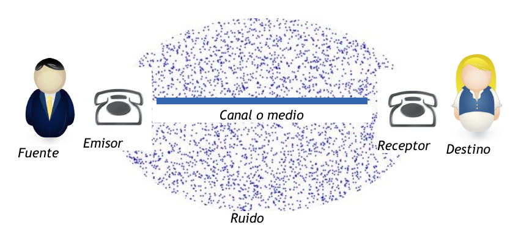
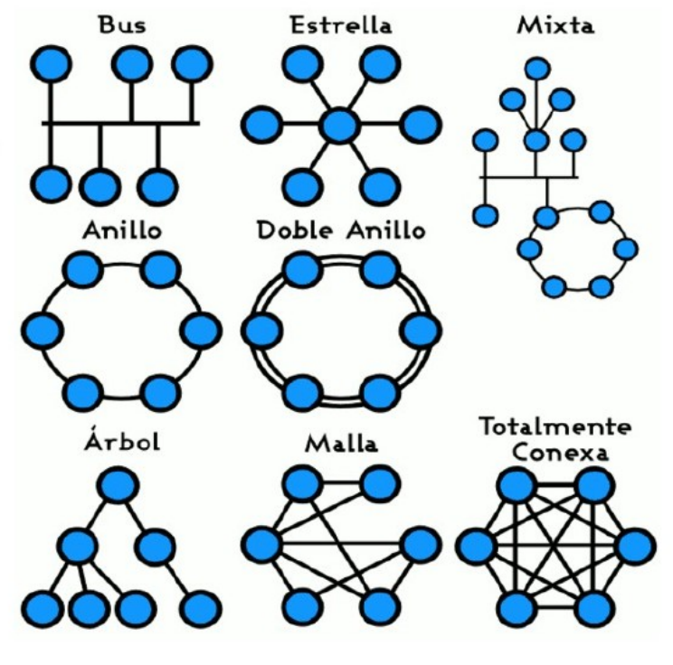

Un modelo para las comunicaciones
======================================

En cualquier comunicación se pueden distinguir los 6 componentes que se indican a continuación:

El **fuente** es el origen del cual procede la información. Normalmente es una persona.

El **emisor** es el elemento que se encarga de transformar la información proporcionada por la fuente para adaptarla al canal o medio por el cual se transmitirá.

El **canal o medio** es el elemento por el cual se transmite la información. Este puede ser algún tipo de cable o, en el caso de comunicaciones inalámbricas, el aire.

El **ruido** es cualquier perturbación sobre el medio que afecte a la información. Esto hace que la información llegue con modificaciones.

El **receptor** es el elemento que se encarga de extraer la información del canal y transformarla para que pueda ser interpretada correctamente por el destino.

El **destino** es el lugar o entidad que consume la información. Normalmente es una persona.

Componentes de una red
======================

Una red de computadoras, también llamada red de ordenadores, red de comunicaciones de datos o red informática, es un conjunto de nodos o hosts (equipos informáticos) y software conectados entre sí por medio de dispositivos físicos que envían y reciben impulsos eléctricos, ondas electromagnéticas o cualquier otro medio para el transporte de datos, con la finalidad de compartir información, recursos y ofrecer servicios.

En una red de computadoras podemos distinguir los siguientes elementos:

**Equipos finales**

  Son los ordenadores de los usuarios fuente o destino de la información. Y los ETCS

**Equipos intermedios**

  Son los dispositivos que se hallan en el camino de la comunicación entre dos equipos finales. En Internet el más importante es el router o encaminador'. En redes locales es el switch o conmutador y hub

**Elementos de interconexión**

  Son los medios físicos utilizados para transportar los datos. Son el cableado y las ondas electromágneticas.

Tipos de redes
==============

Según quién puede usarlas
-------------------------

Públicas
+++++++++

Una red pública se define como una red que puede usar cualquier persona. Es una red de computadoras interconectados, capaz de compartir información y que permite comunicar a usuarios sin importar su ubicación geográfica. Un ejemplo de red pública es Internet.

Privadas
+++++++++

Una red privada es aquella que sólo está disponible para ciertas personas. La mayoría de las redes privadas son LAN usadas en exclusiva por la organización propietaria. También se suelen llamar intranets.

Según el medio de transmisión
-----------------------------

Cableadas
+++++++++

El medio de transmisión es un cable. Los principales son el cable coaxial, la fibra óptica y los pares trenzados.

Inálambricas
+++++++++++++

El medio es el aire. A través de éste se envían ondas electromagnéticas que pueden ser de diversas frecuencias: radio, microondas, infrarrojos.

Según su extensión
-------------------

LAN (Local Area Network, Red de Área Local)
++++++++++++++++++++++++++++++++++++++++++++

Su extensión abarca a lo sumo a un edificio, de modo que cualquier aula de informática u oficina normalmente tiene una red de este tipo. Utiliza para la conexión de ordenadores un cableado privado (o unos elementos repetidores de radiofrecuencias privados).

MAN (Metropolitan Area Network, Red de Área Metropolitana)
++++++++++++++++++++++++++++++++++++++++++++++++++++++++++

Su extensión abarca a varios edificios de la misma ciudad. Por ejemplo, una red para todos los centros educativos de una localidad, o para todos los edificios de un campus. Los medios que usa pueden ser privados o públicos pero alquilados en exclusiva.

WAN (Wide Area Network, Red de Área Amplia)
+++++++++++++++++++++++++++++++++++++++++++

Su extensión abarca localidades, provincias e incluso países distintos, usando normalmente medios públicos. El 
ejemplo más importante es la red Internet, que utiliza, entre otras, la red telefónica mundial.

Según su topología
-------------------

La topología define la estructura de una red. La definición de topología puede dividirse en dos partes. la topología física, que es la disposición real de los cables (los medios) y la topología lógica, que define la forma en que los hosts (equipos) acceden a los medios.

Topología física
+++++++++++++++++

Las topologías físicas que se utilizan comúnmente son de bus, de anillo, en estrella, en estrella extendida, jerárquica y en malla.

La **topología de bus** utiliza un único segmento backbone (cable) al que todos los hosts se conectan de forma directa.

La **topología de anillo** conecta un host con el siguiente y al último host con el primero. Esto crea un anillo físico de cable.

La **topología en estrella** conecta todos los cables con un punto central de concentración. Por lo general, este punto es un hub o un switch.

La **topología en estrella extendida** se desarrolla a partir de la topología en estrella. Esta topología conecta estrellas individuales conectando los hubs/switches. Esto permite extender la longitud y el tamaño de la red.

La **topología jerárquica** se desarrolla de forma similar a la topología en estrella extendida pero, en lugar de conectar los hubs/switches entre sí, el sistema se conecta con un computador que controla el tráfico de la topología.

La **topología en malla** se utiliza cuando no puede existir absolutamente ninguna interrupción en las comunicaciones, por ejemplo, en los sistemas de control de una central nuclear. De modo que, como puede observar en el gráfico, cada host tiene sus propias conexiones con los demás hosts. Esto también se refleja en el diseño de la Internet, que tiene múltiples rutas hacia cualquier ubicación.

Topología lógica
++++++++++++++++

La topología lógica de una red es la forma en que los hosts se comunican a través del medio.

En redes locales, los dos tipos más comunes son:

**Topología lógica de bus**: existe un medio compartido entre varios hosts y éstos compiten por el uso del medio (Acceso al medio por contienda). Cada host envía sus datos hacia todos los demás hosts de la red. Las estaciones no siguen ningún orden para utilizar la red, el orden es el primero que entra, el primero que se sirve. Esta es la forma en que funciona Ethernet.

**Topología lógica de anillo**: existe un medio compartido entre varios hosts y éstos deben recibir un testigo (token) para poder transmitir. Esta transmisión controla el acceso al medio mediante la transmisión de un token electrónico a cada host de forma secuencial. Cuando un host recibe el token, eso significa que el host puede enviar datos a través de la red. Si el host no tiene ningún dato para enviar, pasa el token (testigo) al siguiente host y el proceso se vuelve a repetir.

Según uso del medio o canal
----------------------------
Red punto a punto (Point-To-Point)
++++++++++++++++++++++++++++++++++

Es aquella en la que existe multitud de conexiones entre parejas individuales de máquinas. Este tipo de red requiere, en algunos casos, máquinas intermedias que establezcan rutas para que puedan transmitirse paquetes de datos. Internet funciona de esta forma mediante una serie de nodos conectados en forma de malla denomidados routers o encaminadores.

Red de difusión
+++++++++++++++

Se caracteriza por transmitir datos por un sólo canal de comunicación que comparten todas las máquinas de la red. En este caso, el paquete enviado es recibido por todas las máquinas de la red pero únicamente la destinataria puede procesarlo. Las equipos unidos por un concentrador, o hub, forman redes de este tipo. Muchas redes locales funcionan de esta forma.

Según relación funcional
-------------------------

Arquitectura Cliente-servidor
+++++++++++++++++++++++++++++

Consiste básicamente en computadores cliente que realizan peticiones a computadores servidor que dan respuesta (proporcionan un servicio).

Arquitectura Peer-to-peer
+++++++++++++++++++++++++

También denominada red entre iguales, es aquella red en la que los computadores se comportan como cliente y servidor a la vez.
