Estándares y organismos de normalización
========================================

Un estándar puede definir, por ejemplo, el tipo de conector a emplear, las tensiones e intensidades empleadas, el formato de los datos a enviar, etc. En resumen, **un estándar es un conjunto de normas, acuerdos y recomendaciones técnicas que regulan la transmisión de los sistemas de comunicación**. El empleo de estos estándares presenta las siguientes ventajas:

- Los productos de diferentes fabricantes que cumplen los estándares son totalmente compatibles y, por tanto, pueden comunicarse entre ellos sin necesidad de utilizar adaptadores.
- El mercado se amplía, ya que al existir compatibilidad entre los productos de diferentes fabricantes, la oferta de productos será mayor, pudiendo derivar en precios más competitivos. Esto se traduce en una mayor flexibilidad a la hora de elegir y utilizar dispositivos.
- Se asegura la compatibilidad con productos futuros empleando la misma tecnología.
- Se reducen los costes de los productos.
- De esta forma, la estandarización evita que las empresas posean arquitecturas cerradas que derivan en monopolios, favoreciendo la interoperabilidad entre dispositivos de varios fabricantes y la flexibilidad del mercado.

Existen dos tipos de estándares:

- **De facto**: son estándares con gran aceptación en el mercado, establecidos normalmente por grupos de empresas y organizaciones, pero que aún no son oficiales.

- **De iure**: son estándares definidos por organizaciones o grupos oficiales.

Puede ocurrir que una empresa o corporación posea una normativa establecida para el desarrollo de sus productos y servicios, siendo ésta propiedad absoluta de la empresa o corporación. Esta manera de actuar es seguida por muchas empresas con la intención de atar a los clientes a sus productos. A esta normativa con frecuencia se le denomina «estándar propietario», y si alcanza una penetración en el mercado considerable, puede llegar a convertirse en estándar de facto e incluso de iure.

En este sentido, los estándares pueden clasificarse, atendiendo a la propiedad, en dos tipos, **abiertos y cerrados**. Al primer tipo pertenecen los estándares de facto y iure, ya que pueden ser consultados por cualquiera. No obstante, existen organismos que cobran una cuota por acceder a sus estándares prohibiendo su distribución, aunque en la mayoría de los casos la utilización de este estándar no requiere el pago de un canon. A este tipo de estándares se les denomina estándares de distribución restringida. En el otro extremo se sitúan los estándares cerrados, también denominados propietarios, que representan normas únicamente accesibles para los miembros de la empresa propietaria.

Centrándonos en los estándares abiertos, existen dos tipos de organizaciones que pueden definirlos, los consorcios de fabricantes y los organismos oficiales.

Los **consorcios de fabricantes** están formados por grupos de empresas que cooperan para establecer acuerdos y reglas que permitan obtener la interoperabilidad de sus productos empleando una tecnología determinada. Como ya se mencionó anteriormente, asegurando dicha interoperabilidad, se consigue un aumento del mercado que se traduce en un mayor número de clientes potenciales para sus productos. En este caso, las empresas o personas interesadas pueden unirse al consorcio y participar en los grupos de trabajo que definen los documentos técnicos de la norma. ADSL Forum, ATM Forum, Zigbee Alliance, y PLC forum son ejemplos de consorcios de este tipo.

Por otra parte, los **organismos oficiales** están formados por consultores independientes, miembros de los departamentos o secretarías de estado de diferentes países y otros miembros. ISO, IEEE, y ANSI son ejemplos de organismos oficiales. A continuación describiremos algunos de ellos.

Organismos reguladores en el ámbito internacional
-------------------------------------------------

ITU (International Telecommunication Union)
++++++++++++++++++++++++++++++++++++++++++++

La organización ITU (UIT en castellano, Unión Internacional de Telecomunicaciones) es la organización más importante de las Naciones Unidas en lo que concierne a las tecnologías de la información. Esta organización representa un foco global para los gobiernos y el sector privado en el desarrollo de redes y servicios. ITU coordina el uso del espectro radioeléctrico, promoviendo la cooperación internacional para la asignación de órbitas de satélites, trabajando para mejorar las infraestructuras de comunicación mundiales, estableciendo estándares mundiales para la interconexión de un enorme rango de sistemas de comunicación, y haciendo frente a problemas actuales, como el cambio climático y la seguridad en el ciberespacio. Su sede está en Ginebra (Suiza) y está formada por 191 Estados miembros y más de 700 miembros del Sector y Asociados.

Esta organización está compuesta por tres sectores o comités: 

- **ITU-R** (anteriormente conocida como CCIR, Comité Consultivo Internacional de Radiocomunicaciones), que se encarga de promulgar estándares de comunicaciones que emplean el espectro electromagnético.

- **ITU-D** que se encarga de la organización, coordinación técnica y actividades de asistencia.

- **ITU-T** (anteriormente conocida como CCITT, Comité Consultivo Internacional de Telegrafía y Telefonía), que se encarga de desarrollar estándares para la telefonía, la telegrafía, interfaces, redes y otros aspectos de las telecomunicaciones.

ISO (International Organization for Standardization)
++++++++++++++++++++++++++++++++++++++++++++++++++++

La organización internacional para la normalización es una agencia internacional sin ánimo de lucro con sede en Ginebra (Suiza), cuyo objetivo es el desarrollo de normalizaciones que abarcan un amplio abanico de materias. Esta organización ha definido multitud de estándares de diferentes temáticas, que van desde el paso de los tornillos hasta arquitecturas de comunicaciones para la interconexión de sistemas abiertos (**OSI - Open Systems Interconnection**).

ISO está formada por organismos de estandarización de diversos países (**ANSI** en EEUU, **DIN** en Alemania, **AENOR** en España, ...) y por un grupo de organizaciones observadoras, que no poseen capacidad de voto. A pesar de ser una organización no gubernamental, la mayoría de sus miembros son instituciones gubernamentales. Se fundó en 1946 y actualmente reúne a más de 100 países.

IEEE (Institute of Electrical and Electronic Engineers)
+++++++++++++++++++++++++++++++++++++++++++++++++++++++

IEEE (leído IE cubo) es la mayor asociación profesional para el avance de la innovación y la excelencia tecnológica en busca del beneficio de la humanidad. IEEE y sus miembros inspiran una comunidad global que innove hacia un mejor mañana a través de sus publicaciones enormemente citadas, conferencias, estándares tecnológicos, y actividades profesionales y educativas. Fue fundada en 1884 y desde entonces desarrolla estándares para las industrias eléctricas y electrónicas. Desde el punto de vista de las redes de datos son muy interesantes los **trabajos del comité 802, que desarrolla estándares de protocolos de comunicaciones para la interfaz física de las conexiones de las redes locales de datos**.

IETF (Internet Engineering Task Force)
+++++++++++++++++++++++++++++++++++++++

Este **Grupo de Trabajo de Ingeniería de Internet**, es una organización internacional abierta de normalización, que tiene como objetivos el contribuir a la ingeniería de Internet, actuando en diversas áreas, como transporte, encaminamiento, seguridad. Fue creada en EE.UU. en 1986. El IETF es mundialmente conocido por ser la entidad que **regula las propuestas y los estándares de Internet, conocidos como RFC (Request For Comments)**.

Es una institución sin fines de lucro y abierta a la participación de cualquier persona, cuyo objetivo es velar para que la arquitectura de Internet y los protocolos que la conforman funcionen correctamente. Se la considera como la organización con más autoridad para establecer modificaciones de los parámetros técnicos bajo los que funciona la red. El IETF se compone de técnicos y profesionales en el área de redes, tales como investigadores, integradores, diseñadores de red, administradores, vendedores, entre otros.

Dado que la organización abarca varias áreas, se utiliza una metodología de división en grupos de trabajo, cada uno de los cuales trabaja sobre un tema concreto con el objetivo de concentrar los esfuerzos.

Organismos reguladores en Estados Unidos
-----------------------------------------

ANSI (American National Standards Instituto)
++++++++++++++++++++++++++++++++++++++++++++

**El Instituto Americano de Normas Nacionales**. Organización sin ánimo de lucro encargada de supervisar el desarrollo de estándares que se aplica en los Estados Unidos de América.

TIA (Telecommunications Industry Association)
+++++++++++++++++++++++++++++++++++++++++++++

**La Asociación de la Industria de las Telecomunicaciones** Organización formada por representantes de las industrias más importantes del sector de las telecomunicaciones y que ha desarrollado también numerosos estándares a nivel internacional relacionados con el mundo de las redes en colaboración con ANSI y la antigua EIA

Organismos reguladores en Europa
---------------------------------

ETSI (European Telecommunications Standardas Institute)
+++++++++++++++++++++++++++++++++++++++++++++++++++++++

Las siglas ETSI hacen referencia al instituto europeo de estándares de las telecomunicaciones.

ETSI es una organización independiente sin ánimo de lucro que produce estándares aplicables globalmente para las tecnologías de la información y comunicación. Este instituto es reconocido por la Unión Europea como una organización de estándares europeos. Posee 766 organizaciones miembro procedente de 63 países de los cinco continentes.

El ETSI ha tenido gran éxito al estandarizar el sistema de **telefonía móvil GSM**.

Cuerpos de estandarización significativos dependientes del ETSI son 3GPP (para redes UMTS) o TISPAN (para redes fijas y convergencia con Internet).

El ETSI fue creado en 1988.

CEN (Comité Europeo de Normalización)
+++++++++++++++++++++++++++++++++++++

En francés Comité Européen de Normalisation, es una organización no lucrativa privada cuya misión es fomentar la economía europea en el negocio global, el bienestar de ciudadanos europeos y el medio ambiente proporcionando una infraestructura eficiente a las partes interesadas para el desarrollo, el mantenimiento y la distribución de sistemas estándares coherentes y de especificaciones.

El CEN fue fundado en 1961. Sus veintinueve miembros nacionales trabajan juntos para desarrollar los **estándares europeos (EN)** en varios sectores.

Organismos reguladores en España
---------------------------------

AENOR (Asociación Española de Normalización)
+++++++++++++++++++++++++++++++++++++++++++++

Es el organismo nacional de normalización que a través de sus Comités Técnicos de Normalización se encarga de la publicación de las **normas UNE** (**UNE acrónimo de Una Norma Española**) y la adopción de las normas europeas. Está relacionado con organismos europeos como CEN (Comité Europeo de Normalización), CENELEC (Comité Europeo de Normalización Electrotécnica) y ETSI.

Arquitecturas de comunicaciones
===============================

Cuando se diseña una red de ordenadores, es necesario resolver una gran cantidad de problemas que aparecen: ¿hay que compartir un único medio de transmisión?; ¿cómo distinguimos unos ordenadores de otros?; ¿qué tipo de información se va a transmitir?; ¿se manejará información confidencial? Es evidente que una persona no debe enfrentarse directamente a todas estas cuestiones, sino que siempre es preferible tratarlas una a una y de forma aislada.

La arquitectura de una red viene definida por tres características fundamentales, que dependen de la tecnología que se utilice en su construcción:

- **Topología**: la topología de una red es la organización de su cableado, ya que define la configuración básica de la interconexión de estaciones y, en algunos casos, el camino de una transmisión de datos sobre el cable.
- **Método de acceso a la red**: todas las redes que poseen un medio compartido para transmitir la información, necesitan ponerse de acuerdo a la hora de enviar información, ya que no pueden hacerlo a la vez. En este caso, si dos estaciones transmiten a la vez en la misma frecuencia, la señal recogida en los receptores será una mezcla de las dos. Para las redes que no posean un medio compartido, el método de acceso al cable es trivial y no es necesario llevar a cabo ningún control para transmitir.
- **Protocolos de comunicaciones**: son las **reglas y procedimientos utilizados en una red para realizar la comunicación**. Esas reglas tienen en cuenta el método utilizado para corregir errores, establecer una comunicación, etc.

Aunque a primera vista parezca que el diseño de un sistema de comunicación parece simple, cuando se aborda resulta mucho más complejo, ya que es necesario resolver una serie de problemas. Algunos de los problemas más importantes a los que se enfrentan los diseñadores de redes de comunicaciones son:

- **Encaminamiento**: cuando existen diferentes rutas posibles entre el origen y el destino (si la red tiene una topología de malla o irregular), se debe elegir una de ellas (normalmente, la más corta o la que tenga un tráfico menor).
- **Direccionamiento**: puesto que una red normalmente tiene muchos ordenadores conectados, se requiere un mecanismo para que un proceso (programa en ejecución) en una máquina especifique con quién quiere comunicarse. Como consecuencia de tener varios destinos, se necesita alguna forma de direccionamiento que permita determinar un destino específico.
- **Acceso al medio**: en las redes donde existe un medio de comunicación de difusión, debe existir algún mecanismo que controle el orden de transmisión de los interlocutores. De no ser así, todas las transmisiones se interfieren y no es posible llevar a cabo una comunicación en óptimas condiciones. El control de acceso al medio en una red es muy similar a una comunicación mediante walkie-talkie, donde los dos interlocutores deben evitar hablar a la vez o se producirá una colisión. Esta situación es indeseable en las redes que usan un medio compartido, ya que los mensajes se mezclan y resulta imposible interpretarlos.
- **Saturación del receptor**: esta cuestión suele plantearse en todos los niveles de la arquitectura y consiste en que un emisor rápido pueda saturar a un receptor lento. En determinadas condiciones, el proceso en el otro extremo necesita un tiempo para procesar la información que le llega. Si ese tiempo es demasiado grande en comparación con la velocidad con la que le llega la información, será posible que se pierdan datos. Una posible solución a este problema consiste en que el receptor envíe un mensaje al emisor indicándole que está listo para recibir más datos.
- **Mantenimiento del orden**: algunas redes de transmisión de datos desordenan los mensajes que envían, de forma que, si los mensajes se envían en una secuencia determinada, no se asegura que lleguen en esa misma secuencia. Para solucionar esto, el protocolo debe incorporar un mecanismo que le permita volver a ordenar los mensajes en el destino. Este mecanismo puede ser la numeración de los fragmentos, por ejemplo.
- **Control de errores**: todas las redes de comunicación de datos transmiten la información con una pequeña tasa de error, que en ningún caso es nula. Esto se debe a que los medios de transmisión son imperfectos. Tanto emisor como receptor deben ponerse de acuerdo a la hora de establecer qué mecanismos se van a utilizar para detectar y corregir errores, y si se va a notificar al emisor que los mensajes llegan correctamente.
- **Multiplexación**: en determinadas condiciones, la red puede tener tramos en los que existe un único medio de transmisión que, por cuestiones económicas, debe ser compartido por diferentes comunicaciones que no tienen relación entre sí. Así, el protocolo deberá asegurar que todas las comunicaciones que comparten el mismo medio no se interfieran entre sí.

Los primeros ingenieros de comunicaciones se dieron cuenta de que el proceso de comunicación entre computadoras se podía dividir en capas, y de que abordar cada una de estas capas por separado facilitaba enormemente la tarea de diseño de protocolos y estándares para redes.

Al ocuparse cada una de las capas de ciertos aspectos concretos del proceso de comunicación, se libera de tales aspectos al resto de las capas, simplificando así el diseño de la red.

Modelo de referencia OSI y arquitectura TCP/IP
----------------------------------------------

Niveles y equivalencia
+++++++++++++++++++++++

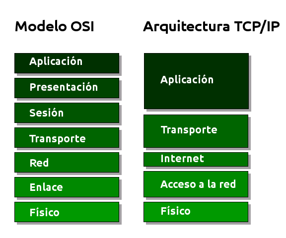

A mediados de los años setenta empezaron a aparecer los primeros estándares para redes. La **ISO** comenzó a elaborar un modelo arquitectónico de referencia al que llamaron modelo de interconexión de sistemas abiertos (OSI: Open Systems Interconnection). Surgió como un intento de unificar esfuerzos, conocimientos y técnicas para elaborar un modelo de arquitectura basado en capas que sirviera como referencia a los distintos fabricantes de la época para construir redes compatibles entre sí. La publicación final del modelo OSI no llegó hasta 1984 y el modelo obtenido resultó ser demasiado complejo y de difícil implementación.

También durante la década de los setenta, **DARPA** evolucionó su red ARPANET y dio origen a la pila de protocolos TCP/IP, que, por su sencillez y su visión más práctica, empezó a ganar popularidad. TCP/IP acabó convirtiéndose en el estándar de facto de arquitectura en las redes de ordenadores, desbancando así al modelo OSI.

El modelo OSI, sin embargo, continúa siendo de gran importancia, ya que nos permite describir y comprender fácilmente la base conceptual del resto de arquitecturas de red.

Niveles OSI
------------

Físico
+++++++

La capa física abarca el interfaz físico entre los dispositivos y las reglas por las cuales se pasan los bits de uno en uno. Se encarga de proporcionar el **soporte material para la transmisión de la información**. La capa física tiene cuatro características importantes:

- **Mecánicas**: normalmente, incluye la especificación de un conector que une una o más señales del conductor, llamadas circuitos.
- **Eléctricas**: relaciona la representación de los bits y la tasa de transmisión de datos
- **Funcional**: especifica las funciones realizadas por los circuitos individuales de la interfaz física entre un sistema y el medio de transmisión.
- **De procedimiento**: especifica la secuencia de eventos por los que se intercambia un flujo de bits a través del medio físico.

Enlace de datos
++++++++++++++++

Esta capa intenta hacer el enlace físico seguro y proporciona medios para activar, mantener y desactivar el enlace. El principal servicio proporcionado por la capa de enlace de datos a las capas superiores es el de **detección de errores y control**.

Red
++++

Esta capa proporciona los medios para la **transferencia de información** entre sistemas finales a través de algún tipo de red de comunicación. Libera a las capas superiores de la necesidad de tener conocimiento sobre la transmisión de datos subyacente y las tecnologías de conmutación utilizadas para conectar los sistemas.

Transporte
+++++++++++

Esta capa proporciona un mecanismo para intercambiar datos entre sistemas finales. El servicio de transporte orientado a conexión asegura que **los datos se entregan libres de errores, en secuencia y sin pérdidas o duplicados**.

Sesión
+++++++

Esta capa proporciona los mecanismos para **controlar el diálogo** entre aplicaciones en sistemas finales. En muchos casos, habrá poca o ninguna necesidad de los servicios de la capa de sesión, pero para algunas aplicaciones, estos servicios se utilizan. Por ejemplo, definir la disciplina del diálogo: full-duplex o semi-duplex.

Presentación
+++++++++++++

Esta capa **define el formato de los datos** que se van a intercambiar entre las aplicaciones y ofrece a los programas de aplicación un conjunto de servicios de transformación de datos. Algunos ejemplos de los servicios específicos que se podrían realizar en esta capa son los de compresión y cifrado de datos.

Aplicación
+++++++++++

Esta capa proporciona un medio a los programas de aplicación para que accedan al entorno OSI. Se considera que residen en esta capa las aplicaciones de uso general como transferencia de ficheros, correo electrónico y acceso terminal a computadores remotos. **Proporciona un servicio al usuario final**.

Arquitectura TCP/IP
--------------------

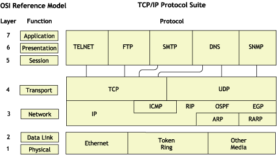

Algunos de los protocolos de TCP/IP
+++++++++++++++++++++++++++++++++++

.. image:: images/tema02-002.png

Unidades de Datos de Protocolo (PDU)
-------------------------------------

PDU es la abreviatura de **Protocol Data Unit** (unidad de datos del protocolo). Su función principal es establecer una comunicación de datos entre capas homologas. Esta forma de establecer conexiones recibe el nombre de comunicación par-a-par.

La primera PDU corresponde a los datos que llegan a la capa de aplicación. Aquí se les añade una cabecera y la PDU pasa al nivel siguiente, el de presentación en el modelo OSI, el de transporte en la arquitectura TCP/IP.

A partir de aquí, y en cada uno de los niveles subsiguientes, a la PDU recibida se le añadirá una cabecera y será enviada al nivel inferior, y así sucesivamente hasta llegar al nivel físico, donde los datos serán enviados como bits.

PDUs de OSI
++++++++++++

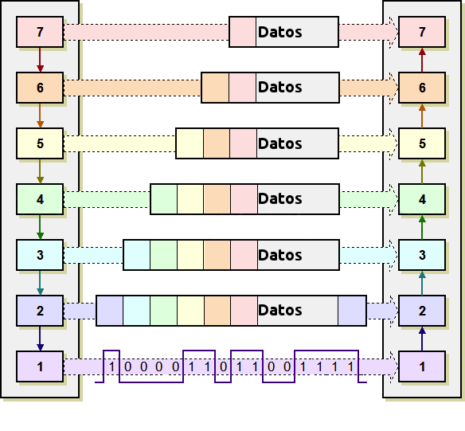

PDUs de TCP/IP
+++++++++++++++

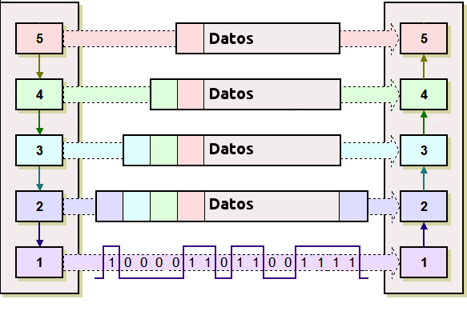

En la arquitectura TCP/IP cada PDU recibe un nombre específico:

- Capa de aplicación: **Datos**
- Capa de transporte: **Segmentos** 
- Capa de red: **Datagramas**
- Capa de acceso a la red: **Tramas**
- Capa física: Flujo de bits

Encapsulación
++++++++++++++

Como se observa en las PDUs, éstas están formadas por una cabecera propia de cada nivel y datos. La PDU (Cabecera y Datos) de una capa superior se trata como datos por la capa inmediatamente inferior. Esta capa inferior le añade su propia cabecera y pasa toda la información a la capa inferior.

El resultado de todo esto es que los datos originales cada vez poseen más cabeceras (una por cada capa) a medida que descienden por la pila.

En el equipo destino se irán quitando las cabeceras en orden inverso a como se añadieron. Cada capa leerá la cabecera que contiene los datos de control destinados a ella.

Componentes de una red
=======================

Ahora que tenemos una noción básica sobre el modelo OSI y sobre lo que sucede con los paquetes de datos a medida que recorren las capas del modelo, es hora de que comencemos a echar un vistazo a los dispositivos básicos de redes. A medida que vayamos repasando las capas del modelo de referencia OSI, veremos cuáles son los dispositivos que operan en cada capa según los paquetes de datos vayan viajando a través de ellas desde el origen hacia el destino. Las LAN son redes de datos de alta velocidad y bajo nivel de errores que abarcan un área geográfica relativamente pequeña. Las LAN conectan estaciones de trabajo, dispositivos, terminales y otros dispositivos que se encuentran en un mismo edificio u otras áreas geográficas limitadas.

Nubes
-----

.. image:: images/tema02-007.png
   :align: left

El símbolo de nube indica que existe otra red, por ejemplo Internet. Nos recuerda que existe una manera de conectarse a esa otra red (Internet), pero no suministra todos los detalles de la conexión, ni de la red. Simplemente es útil para realizar los esquemas, si vemos que se conecta a una nube sabemos que esa conexión va a otra red que no es nuestra y que desconocemos, por ejemplo Internet

El propósito de la nube es representar un gran grupo de detalles que no son pertinentes para una situación, o descripción, en un momento determinado. Es importante recordar que solo nos interesa la forma en que las LAN se conectan a las WAN de mayor tamaño, y a Internet (la mayor WAN del mundo), para que cualquier ordenador pueda comunicarse con cualquier otro ordenador, en cualquier lugar y en cualquier momento. Como la nube en realidad no es un dispositivo único, sino un conjunto de dispositivos que operan en todos los niveles del modelo OSI, se clasifica como un dispositivo de las Capas 1-7.

Dispositivos terminales (Capas 1 a 7)
--------------------------------------

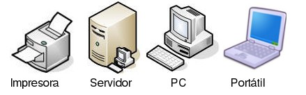

Los dispositivos que se conectan de forma directa a un segmento de red se denominan hosts. Estos hosts incluyen ordenadores, tanto clientes y servidores, impresoras, escáneres y otros dispositivos de usuario. Estos dispositivos suministran a los usuarios conexión a la red, por medio de la cual los usuarios comparten, crean y obtienen información.

Los dispositivos host no forman parte de ninguna capa. Tienen una conexión física con los medios de red ya que tienen una tarjeta de red (NIC) y las demás capas OSI se ejecutan en el software ubicado dentro del host. Esto significa que operan en todas las 7 capas del modelo OSI. Ejecutan todo el proceso de encapsulamiento y desencapsulamiento para realizar la tarea de enviar mensajes de correo electrónico, imprimir informes, escanear figuras o acceder a las bases de datos.

No existen símbolos estandarizados para los hosts, pero por lo general es bastante fácil detectarlos. Nosotros dibujaremos éstos como si fueran ordenadores:

Dispositivos intermedios (Capas 1, 2 y 3)
------------------------------------------

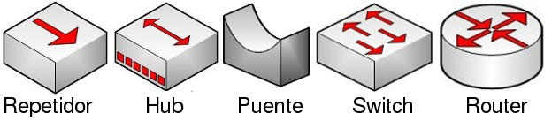

Medios (cableado o inalámbrico). Nivel 1
+++++++++++++++++++++++++++++++++++++++++

Los símbolos correspondientes a los medios o cableado son distintos según el que realice los esquemas o documentación. Por ejemplo: el símbolo de Ethernet es normalmente una línea recta con líneas perpendiculares que se proyectan desde ella, el símbolo de la red token ring es un círculo con los equipos conectados a él y el símbolo correspondiente a una FDDI (fibra óptica) son dos círculos concéntricos con dispositivos conectados).

Las funciones básicas del cableado, ya sabes, llamado "medios" por ser el medio de conexión, consisten en transportar un flujo de información, en forma de bits y bytes, a través de una LAN. Salvo en el caso de las LAN inalámbricas los medios de red limitan las señales de red a un cable o fibra. Los medios de red se consideran componentes de Capa 1 de las LAN.

Se pueden desarrollar redes informáticas con varios tipos de medios distintos. Cada medio tiene sus ventajas y desventajas. Lo que constituye una ventaja para uno de los medios (costo de la categoría 5) puede ser una desventaja para otro de los medios (costo de la fibra óptica). Algunas de las ventajas y las desventajas son las siguientes:

- Longitud del cable
- Costo
- Facilidad de instalación

El cable coaxial, la fibra óptica o incluso el espacio abierto pueden transportar señales de red, sin embargo, el medio principal que se estudia en esta clase se denomina cable de par trenzado no blindado de categoría 5 (UTP CAT 5) o el categoría 6 (UTP CAT 6).

Repetidores. Nivel 1
++++++++++++++++++++

Sabemos pues que según el cableado que utilicemos existen ventajas y desventajas. Por ejemplo una de las desventajas del tipo de cable que utilizamos principalmente (UTP CAT 5) es la longitud del cable. La longitud máxima para el cableado UTP de una red es de 100 metros. Si necesitamos ampliar la red más allá de este límite, debemos añadir un dispositivo a la red llamado repetidor.

El término repetidor se ha utilizado desde la primera época de la comunicación visual, cuando una persona situada en una colina repetía la señal que acababa de recibir de la persona ubicada en la colina de la izquierda, para poder comunicar la señal a la persona que estaba ubicada en la colina de la derecha. También proviene de las comunicaciones telegráficas, telefónicas, por microondas y ópticas, cada una de las cuales usan repetidores para reforzar las señales a través de grandes distancias, ya que de otro modo en su debido tiempo las señales se desvanecerían gradualmente o se extinguirían.

El propósito de un repetidor es regenerar y retemporizar las señales de red a nivel de los bits para permitir que los bits viajen a mayor distancia a través de los medios. Ten en cuenta la Norma de cuatro repetidores para Ethernet de 10Mbps, también denominada Norma 5-4-3, al extender los segmentos LAN. Esta norma establece que se pueden conectar cinco segmentos de red de extremo a extremo utilizando cuatro repetidores pero sólo tres segmentos pueden tener ordenadores en ellos, curioso ¿no?.

El término repetidor se refiere tradicionalmente a un dispositivo con un solo puerto de "entrada" y un solo puerto de "salida". Sin embargo, en la terminología que se utiliza en la actualidad, el término repetidor multipuerto se utiliza también con frecuencia. En el modelo OSI, los repetidores se clasifican como dispositivos de Capa 1, dado que actúan sólo a nivel de los bits y no tienen en cuenta ningún otro tipo de información. El símbolo para los repetidores no está estandarizado, así que nosotros utilizaremos este:

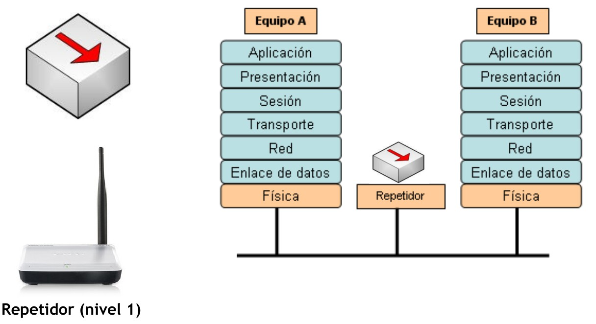

Concentradores o hubs. Nivel 1
+++++++++++++++++++++++++++++++

El propósito de un hub es regenerar y retemporizar las señales de red. Esto se realiza a nivel de los bits para un gran número de equipos (por ej., 4, 8 o incluso 24) utilizando un proceso denominado concentración. Como ves es prácticamente la misma definición que la del repetidor, pues si, a los hub también se les llama **repetidor multipuerto**. La diferencia es la cantidad de cables que se conectan al dispositivo, que en este caso admiten varios ordenadores conectados en este hub.

Los hubs se utilizan por dos razones: para crear un punto de conexión central para los ordenadores y para aumentar la fiabilidad de la red. La fiabilidad de la red se ve aumentada al permitir que cualquier cable falle sin provocar una interrupción en toda la red. Esta es la diferencia con la topología de bus, en la que, si un cable fallaba, se interrumpía el funcionamiento de toda la red. Los hubs se consideran dispositivos de Capa 1 dado que sólo regeneran la señal y la envían por medio de un broadcast (ya lo veremos pero consiste en que mandan la información a todos los demás equipos) a todos los puertos.

Hay una pequeña clasificación de los hubs que son los inteligentes y no inteligentes. Los hubs inteligentes tienen puertos de consola, lo que significa que se pueden programar para administrar el tráfico de red. Los hubs no inteligentes simplemente toman una señal de red de entrada entrante y la repiten hacia cada uno de los puertos sin la capacidad de realizar ninguna administración.

El símbolo correspondiente al hub no está estandarizado pero utilizaremos este.

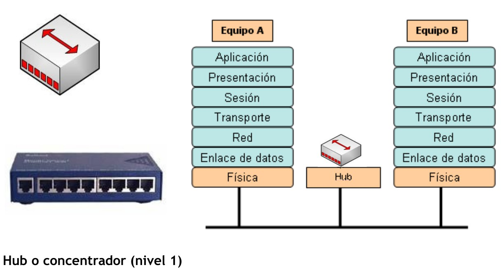

Tarjeta de red o NIC. Nivel 2
++++++++++++++++++++++++++++++

Hasta este momento, en este capítulo nos hemos referido a dispositivos y conceptos de la capa uno. A partir de la tarjeta de interfaz de red, nos trasladamos a la capa dos: la capa de enlace de datos del modelo OSI. En términos de aspecto, una tarjeta de interfaz de red (tarjeta NIC o NIC) es un pequeño circuito impreso que se coloca en un slot de expansión de un bus de la (placa madre) del ordenador, aunque ahora ya casi todos los ordenadores la incorporan de fábrica y no hay que añadirla. También se denomina adaptador de red.

**Las NIC se consideran dispositivos de Capa 2**, cada tarjeta de red (NIC) lleva un nombre codificado único, denominado dirección de Control de acceso al medio (MAC o MAC Address) y es único en el mundo. Si, como lo lees, cada fabricante tiene asignada una numeración y a cada tarjeta de red le pone esa dirección física única, es como su DNI y nunca pueden existir dos tarjetas de red con ese mismo número interno. Esta dirección es muy importante ya que identifica perfectamente y de forma única al ordenador origen y al destino.

Las tarjetas de red no tienen ningún símbolo estandarizado. Se da a entender que siempre que haya dispositivos de red conectado a la de red, existe alguna clase de NIC o un dispositivo similar aunque por lo general no aparezcan. Siempre que haya un punto en una topología, significa que hay una NIC o una interfaz (puerto), que actúa por lo menos como parte de una NIC.

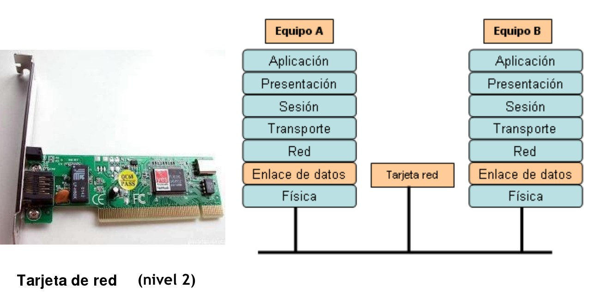

Puentes. Nivel 2
+++++++++++++++++

Un puente es un dispositivo de capa 2 diseñado para conectar dos segmentos LAN. El propósito de un puente es filtrar el tráfico de una LAN, para que el tráfico local siga siendo local, pero permitiendo la conectividad a otras partes (segmentos) de la LAN para enviar el tráfico dirigido a esas otras partes.

¿Pero que es un segmento? Es una definición muy variable, nosotros vamos a considerarlo como dos partes distintas de la red. Por ejemplo la red del piso 1 y la red del piso 2 que están conectadas. También podemos ampliarlo, por ejemplo una pequeña empresa que tiene dos oficinas en dos edificios y están conectadas entre si, podemos llamar también a cada una de esas partes segmento.

Vale pero ¿cómo puede detectar el puente cuál es el tráfico de un segmento y cuál no lo es? La respuesta es la misma que podría dar el servicio de correos cuando se le pregunta cómo sabe cuál es el correo local: verifica la dirección local. Cada dispositivo de networking tiene una dirección MAC exclusiva en la tarjeta de red, el puente rastrea cuáles son las direcciones MAC que están ubicadas a cada lado del puente y toma sus decisiones basándose en esta lista de direcciones MAC.

Si el tráfico está entre dos ordenadores del piso 1 el puente decide que no debe mandar ese tráfico al piso 2 porque sabe por las direcciones MAC que el destino está en el mismo piso. Lo mismo para el caso de los dos edificios: el puente conecta los dos segmentos, cuando un ordenador pide información a otro el puente sabe que equipo están conectados en cada lado y sabe si debe mandar el tráfico al otro lado. Tradicionalmente, el término puente se refiere a un dispositivo con dos puertos.

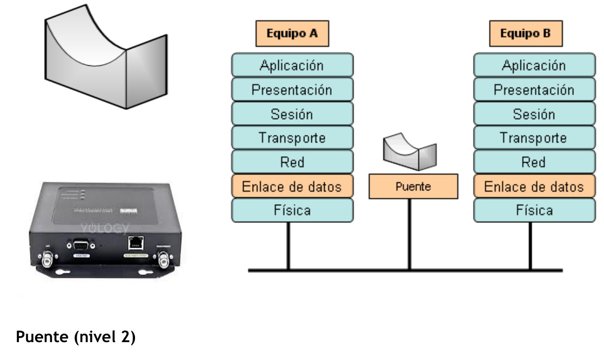

Conmutadores o switches. Nivel 2
++++++++++++++++++++++++++++++++

Un switch, al igual que un puente, es un dispositivo de capa 2. De hecho, el switch se denomina **puente multipuerto**, igual que antes cuando llamábamos al hub "repetidor multipuerto". La diferencia entre el hub y el switch es que los switches toman decisiones basándose en las direcciones MAC y los hubs no toman ninguna decisión. Como los switches son capaces de tomar decisiones, hacen que la LAN sea mucho más eficiente. Los switches hacen esto enviando los datos sólo hacia el puerto al que está conectado el host destino apropiado. Por el contrario, el hub envía datos desde todos los puertos, de modo que todos los hosts deban ver y procesar (aceptar o rechazar) todos los datos.

Como son mucho mejores y eficiente ten en cuenta siempre poner switches en tu red y no hubs, primera recomendación importante. Segunda recomendación: seguramente te parecerá una tontería y obviedad que te diga que si un coche es de buena marca es mejor que uno de marca mala: evidente. Pues aquí pasa lo mismo: hay marcas buenas y marcas malas y la diferencia va a estar evidentemente en las prestaciones y en las posibilidades de configuración. Así que segunda recomendación: invierte un poco de dinero en comprarlo de marca buena: son equipos para toda la vida y considéralo una inversión y no un gasto.

En el gráfico se indica el símbolo que corresponde al switch. Las flechas de la parte superior representan las rutas individuales que pueden tomar los datos en un switch, a diferencia del hub, donde los datos fluyen por todas las rutas

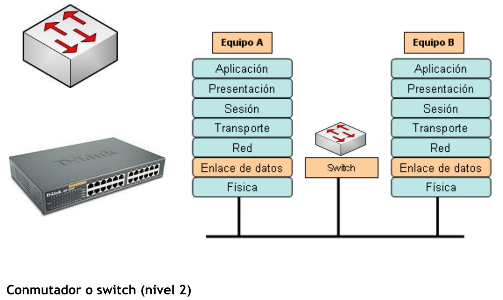

Encaminadores o routers. Nivel 3
+++++++++++++++++++++++++++++++++

El router es el primer dispositivo con que trabajaremos que pertenece a la capa de red del modelo OSI, o sea la Capa 3. Al trabajar en la Capa 3 el router puede tomar decisiones basadas en grupos de direcciones de red (la famosas direcciones IP) en contraposición con las direcciones MAC de Capa 2 individuales. Los routers también pueden conectar distintas tecnologías de Capa 2, como por ejemplo Ethernet, Token-ring y FDDI (fibra óptica). Sin embargo, dada su aptitud para enrutar paquetes basándose en la información de Capa 3, los routers se han transformado en el núcleo de Internet, ejecutando el protocolo IP.

El propósito de un router es examinar los paquetes entrantes (datos de capa 3), elegir cuál es la mejor ruta para ellos a través de la red y luego enviarlos hacia el puerto de salida adecuado. Los routers son los dispositivos de regulación de tráfico más importantes en las redes grandes. Permiten que prácticamente cualquier tipo de ordenador se pueda comunicar con otro en cualquier parte del mundo.

El símbolo correspondiente al router (observa las flechas que apuntan hacia adentro y hacia fuera) sugiere cuáles son sus dos propósitos principales: la selección de ruta y la transmisión de paquetes hacia la mejor ruta.

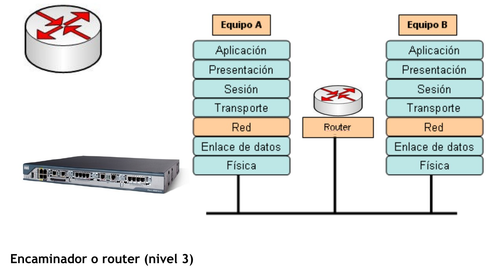

Uso del medio en redes
======================

La interconexión de los distintos nodos que forman una red puede realizarse de dos formas: **por conmutación o por difusión**.

Conmutación
------------

Consisten en un conjunto de nodos interconectados entre sí, a través de medios de transmisión (cables), formando la mayoría de las veces una topología mallada o estrella, donde la información se transfiere encaminándola del nodo de origen al nodo destino mediante conmutación entre nodos intermedios.

Es típica de las WAN. Existe una línea dedicada para cada dos nodos. La conmutación a su vez puede ser de circuitos o de paquetes.

Conmutación de circuitos
+++++++++++++++++++++++++

Se establece un único camino entre el origen y el destino para toda la comunicación.

Cuando un emisor quiere enviar un mensaje a un receptor a través de una red de conmutación de circuitos, lo primero que debe hacerse es el **establecimiento** del canal, es decir la conexión entre emisor y receptor, que se hace eligiendo un camino concreto de entre todos los posibles que existen. La ruta que sigue la información se establece al inicio de la comunicación y **se mantiene durante todo el proceso que dure la comunicación**, aunque existan algunos tramos de esa ruta que se comparten con otras rutas diferentes. Al finalizar la transmisión se produce la **liberación** del canal. La **red telefónica clásica** es un ejemplo de conmutación de circuitos.

Conmutación de paquetes
+++++++++++++++++++++++

Se trata del procedimiento mediante el cual, cuando un nodo quiere enviar un mensaje a otro, lo divide en paquetes. Cada paquete es enviado por el medio con información de cabecera. En cada nodo intermedio por el que pasa el paquete se detiene el tiempo necesario para procesarlo y decidir el siguiente nodo al cual enviarlo. Así sucesivamente hasta el destino. Los paquetes pueden perderse o llegar en distinto orden.

Los distintos paquetes de un mismo mensaje pueden seguir caminos distintos hasta su destino. **Internet** es un ejemplo de conmutación de paquetes. 

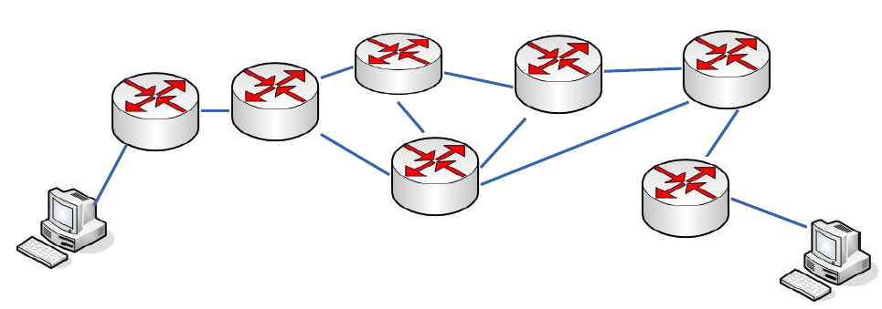

Ejemplo de red conmutada, cuyos equipos finales son ordenadores personales y los equipos intermedios son routers.

Difusión
---------

En medio compartido el emisor envía a todos los nodos la información. El nodo receptor sabe que es para él y la recoge. Los otros nodos la dejan pasar. Las topologías que utilizan este tipo de redes son: bus, anillo y las basadas en ondas de radio.

En este tipo de redes no existen nodos intermedios de conmutación. Todos los nodos comparten un medio de transmisión común, por el que la información transmitida por un nodo es conocida por todos los demás. En definitiva, es el destinatario el encargado de seleccionar y captar la información. Este uso del medio es propio de algunas **intranets** y de comunicaciones inalámbricas omnidireccionales.

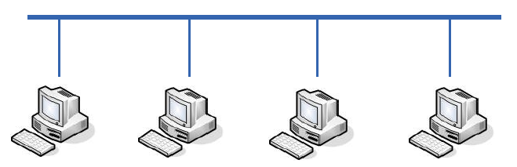

Ejemplo de red de difusión, cuyos equipos finales son ordenadores personales, el medio es un bus compartido y no existen nodos de conmutación.

Esquemas LAN
=============

Red local simple
----------------

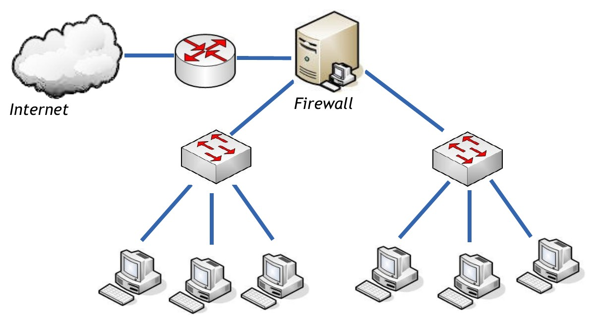

Red local organizada en 2 zonas
-------------------------------

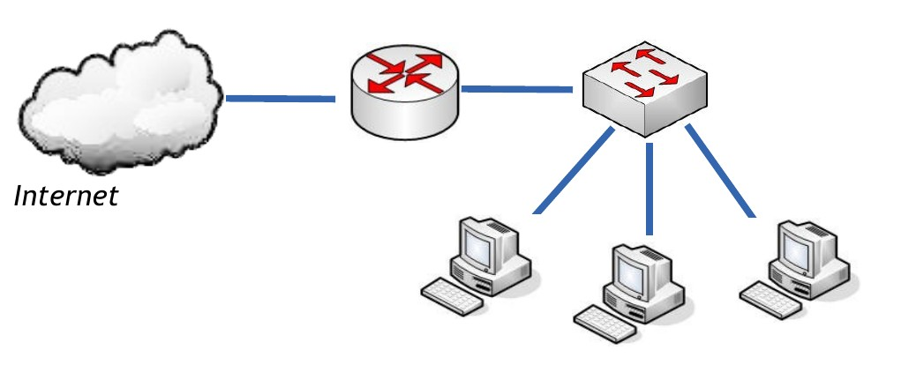

Red local con zona de usuarios y Zona DesMilitarizada
------------------------------------------------------

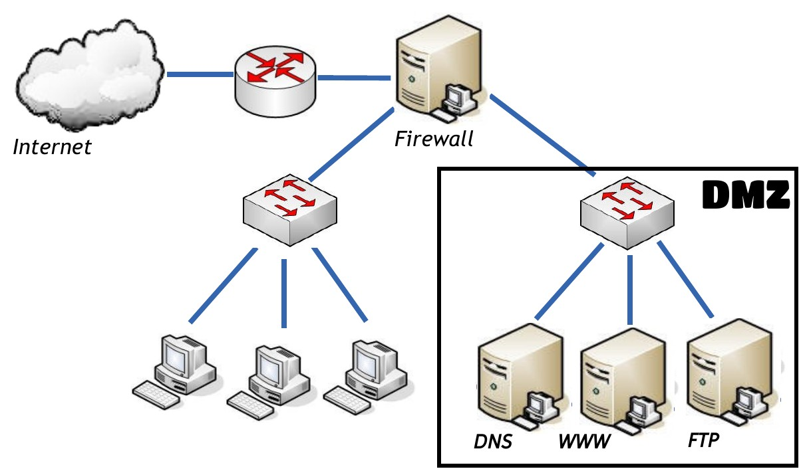

Una **DMZ** (del inglés Demilitarized zone) o **Zona DesMilitarizada**. En seguridad informática, una zona desmilitarizada (DMZ) o **red perimetral** es una red local (una subred) que se ubica entre la red interna de una organización y una red externa, generalmente Internet. El objetivo de una DMZ es que las conexiones desde la red interna y la externa a la DMZ estén permitidas, mientras que las conexiones desde la DMZ sólo se permitan a la red externa -- los equipos (hosts) en la DMZ no pueden conectar con la red interna. Esto permite que los equipos (hosts) de la DMZ puedan dar servicios a la red externa a la vez que protegen la red interna en el caso de que intrusos comprometan la seguridad de los equipos situados en la zona desmilitarizada. Para cualquiera de la red externa que quiera conectarse ilegalmente a la red interna, la zona desmilitarizada se convierte en un callejón sin salida.

La DMZ se usa habitualmente para ubicar servidores que es necesario que sean accedidos desde fuera, como servidores de e-mail, Web y DNS.

Las conexiones que se realizan desde la red externa hacia la DMZ se controlan generalmente utilizando port address translation (PAT).

