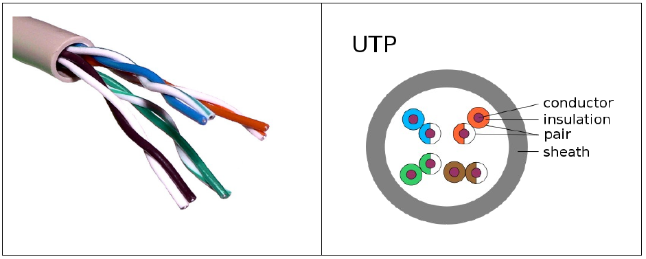
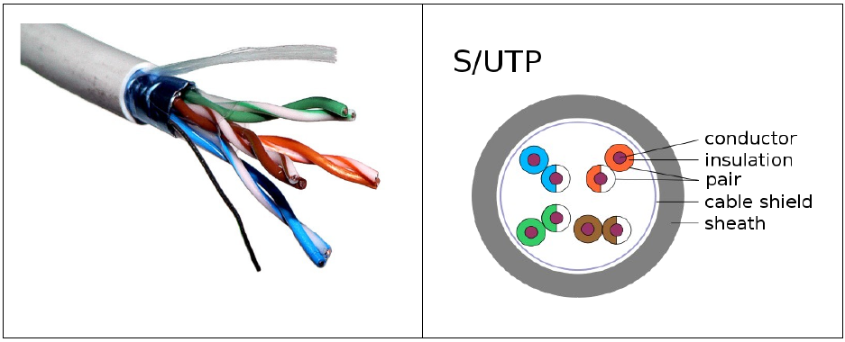
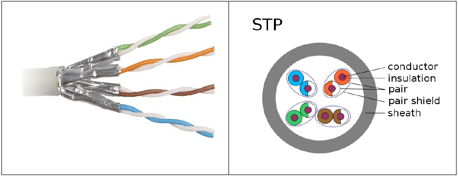
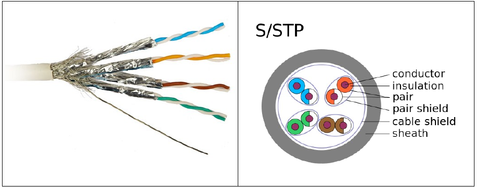
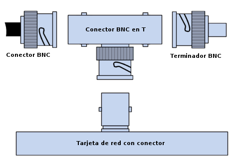
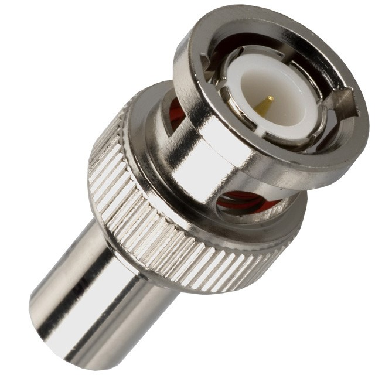
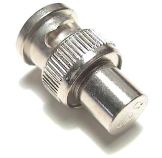
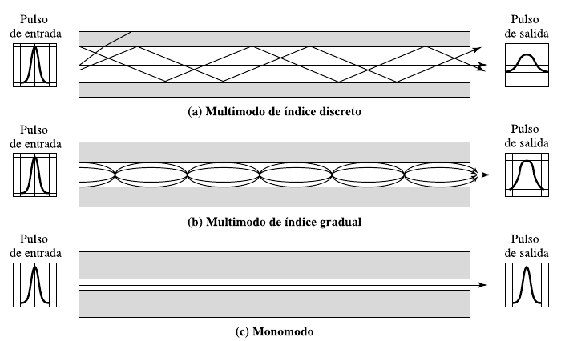
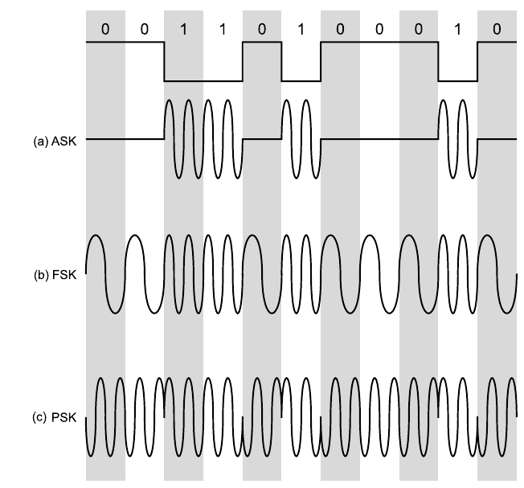

Concepto de capa física
========================

La capa física se encarga de definir todos los aspectos relacionados con los elementos físicos de conexión de los dispositivos a la red, así como de establecer los procedimientos para transmitir la información sobre la serial física empleada. En este sentido, puede decirse que la capa física es la encargada de definir cuatro tipos de características de los elementos de interconexión:

- **Mecánicas**: se refiere a las características físicas del elemento de conexión con la red, es decir, a las propiedades de la interfaz física con el medio de comunicación. Por ejemplo, las dimensiones y forma del conector, el número de cables usados en la conexión, el número de pines del conector. el tamaño del cable, el tipo de antena, etc.
- **Eléctricas**: especifica las características eléctricas empleadas, por ejemplo, la tensión usada, velocidad de transmisión, intensidad en los pines. etc.
- **Funcionales**: define las funciones de cada uno de los circuitos del elemento de interconexión a la red, por ejemplo, pin X para transmitir, pin Y para recibir, etc.
- **De procedimiento**: establece los pasos a realizar para transmitir información a través del medio físico.

Esta capa ofrece a los niveles superiores un servicio de transmisión de datos, es decir, proporciona un mecanismo para enviar y recibir bits empleando el canal de comunicación. Es la capa de más bajo nivel.

Algunos protocolos y estándares que regulan aspectos de la capa física

- ANSI/TIA/EIA 568 A y B.
- ISO/IEC 11801.
- Parte de Ethernet y del estándar IEEE 802.3.

La transmisión de datos entre un emisor y un receptor siempre se realiza a través de un medio de transmisión. Los medios de transmisión se pueden clasificar como **guiados y no guiados**. En ambos casos, la comunicación se realiza **usando ondas electromagnéticas**. En los medios guiados, por ejemplo en pares trenzados, en cables coaxiales y en fibras ópticas, las ondas se transmiten confinándolas a lo largo de un camino físico. Por el contrario, los medios no guiados, también denominados inalámbricos, proporcionan un medio para transmitir las ondas electromagnéticas sin confinarlas, como por ejemplo en la propagación a través del aire, el mar o el vacío.

El término **enlace directo** se usa para designar un camino de transmisión entre dos dispositivos en el que la señal se propague directamente del emisor al receptor sin ningún otro dispositivo intermedio que no sea un **amplificador o repetidor**. Estos últimos se usan para incrementar la energía de la señal. Obsérvese que este término se puede aplicar tanto a medios guiados como no guiados.

Un medio de transmisión guiado es **punto a punto** si proporciona un enlace directo entre dos dispositivos que comparten el medio, no existiendo ningún otro dispositivo conectado. En una configuración guiada **multipunto**, el mismo medio es compartido por más de dos dispositivos.

Un medio de transmisión puede ser **simplex, half-duplex o full-duplex**. En la transmisión simplex, las señales se transmiten sólo en una única dirección; siendo una estación la emisora y otra la receptora. En half-duplex, ambas estaciones pueden transmitir, pero no simultáneamente. En fullduplex, ambas estaciones pueden igualmente transmitir y recibir, pero ahora simultáneamente. En este último caso, el medio transporta señales en ambos sentidos al mismo tiempo.

.. figure:: images/tema03-000.png	
   
   Tipos de transmisión

Toda señal electromagnética, considerada como función del tiempo, puede ser tanto analógica como digital. 

- Una **señal analógica** es aquella en la que la intensidad de la señal varía suavemente en el tiempo. Es decir, no presenta saltos o discontinuidades.
- Una **señal digital** es aquella en la que la intensidad se mantiene constante durante un determinado intervalo de tiempo, tras el cual la señal cambia a otro valor constante. La señal continua puede corresponder a voz y la señal discreta puede representar valores binarios (0 y 1).

.. figure:: images/tema03-001.png	

   Señales analógicas y digitales

Cuando un medio o canal es compartido por varios emisores que desean transmitir a la vez, este debe multiplexarse. La **multiplexación** significa que se reserva parte del canal a cada emisor.

- En medios con transmisión analógica suele multiplexarse **por división de frecuencias** (Frequency-division multiplexing – FDM), asignandose a cada emisor una frencuencia distinta.
- En medios con transmisión digital suele multiplexarse **por división de tiempo** (Time division multiplexing -TDM), asignando a cada emisor una pequeña ranura de tiempo.

Para multiplexar un medio es necesario disponer de un dispositivo multiplexor en el origen y un dispositivo demultiplexor en el destino.

Perturbaciones en la transmisión
=================================

En cualquier sistema de comunicaciones se debe aceptar que la señal que se recibe diferirá de la señal transmitida debido a varias adversidades y dificultades sufridas en la transmisión. En las señales analógicas, estas dificultades pueden degradar la calidad de la señal. En las señales digitales, se generarán bits erróneos: un 1 binario se transformará en un 0 y viceversa.

Las dificultades más significativas son:

- La atenuación y la distorsión de atenuación.
- La distorsión de retardo.
- El ruido.

Atenuación
-----------

En cualquier medio de transmisión la energía de la señal decae con la distancia. En medios guiados, esta reducción de la energía es por lo general exponencial y, por tanto, se expresa generalmente como un número constante en decibelios por unidad de longitud. En medios no guiados, la atenuación es una función más compleja de la distancia y es dependiente, a su vez, de las condiciones atmosféricas.

La señal recibida debe tener suficiente energía para que la circuitería electrónica en el receptor pueda detectar la señal adecuadamente. En un enlace punto a punto, la energía de la señal en el transmisor debe ser lo suficientemente elevada como para que se reciba con inteligibilidad, pero no tan elevada que sature la circuitería del transmisor o del receptor, lo que generaría una señal distorsionada.

Para controlar la energía de la señal se usan amplificadores o repetidores. Hablamos de amplificadores cuando la señal es analógica y repetidores cuando la señal es digital.

Distorsión de retardo
----------------------

La distorsión de retardo es un fenómeno debido a que la velocidad de propagación de una señal a través de un medio guiado varía con la frecuencia. Para una señal limitada en banda, la velocidad tiende a ser mayor cerca de la frecuencia central y disminuye al acercarse a los extremos de la banda. Por tanto, las distintas componentes en frecuencia de la señal llegarán al receptor en instantes diferentes de tiempo, dando lugar a desplazamientos de fase entre las diferentes frecuencias.

Ruido
------

Para cualquier dato transmitido, la señal recibida consistirá en la señal transmitida modificada por las distorsiones introducidas en la transmisión, además de señales no deseadas que se insertarán en algún punto entre el emisor y el receptor. A estas últimas **señales no deseadas se les denomina ruido. El ruido es el factor de mayor importancia de entre los que limitan las prestaciones de un sistema de comunicación**.

La señal de ruido se puede clasificar en cuatro categorías:

- Ruido térmico.
- Ruido de intermodulación.
- Diafonía.
- Ruido impulsivo.

Ruido térmico
++++++++++++++

El ruido térmico se debe a la agitación térmica de los electrones. Está presente en todos los dispositivos electrónicos y medios de transmisión; como su nombre indica, es función de la temperatura.

El ruido térmico está uniformemente distribuido en el espectro de frecuencias usado en los sistemas de comunicación, es por esto por lo que a veces se denomina ruido blanco. **El ruido térmico no se puede eliminar** y, por tanto, impone un límite superior en las prestaciones de los sistemas de comunicación.

Ruido de intermodulación
+++++++++++++++++++++++++

Cuando señales de distintas frecuencias comparten el mismo medio de transmisión puede producirse ruido de intermodulación. El efecto del ruido de intermodulación es la aparición de señales a frecuencias que sean suma o diferencia de las dos frecuencias originales o múltiplos de éstas.

Diafonía
++++++++++

La diafonía la ha podido experimentar todo aquel que al usar un teléfono haya oído otra conversación; se trata, en realidad, de un **acoplamiento no deseado entre las líneas** que transportan las señales. Esto puede ocurrir por el acoplamiento eléctrico entre cables de pares cercanos o, en raras ocasiones, en líneas de cable coaxial que transporten varias señales.

Ruido impulsivo
++++++++++++++++

Los ruidos antes descritos son de magnitud constante y razonablemente predecibles. Así pues, es posible idear un sistema de transmisión que les haga frente. Por el contrario, el ruido impulsivo es no continuo y **está constituido por pulsos o picos irregulares de corta duración y de amplitud relativamente grande**. Se generan por una gran diversidad de causas, por ejemplo, por perturbaciones electromagnéticas exteriores producidas por tormentas atmosféricas o por fallos y defectos en los sistemas de comunicación.

Generalmente, el ruido impulsivo no tiene mucha transcendencia para los datos analógicos. Por ejemplo, la transmisión de voz se puede perturbar mediante chasquidos o crujidos cortos, sin que ello implique pérdida significativa de inteligibilidad. Sin embargo, el ruido impulsivo **es una de las fuentes principales de error en la comunicación digital de datos**. Por ejemplo, un pico de energía con duración de 0,01 s no inutilizaría datos de voz, pero podría corromper aproximadamente 560 bits si se transmitieran a 56 kbps.

.. figure:: images/tema03-002.png

   Efecto del ruido en una transmisión digital

Medios cableados
=================

Los medios guiados son aquellos compuestos por un material físico sólido que se encarga de transportar la señal de información sin que ésta sobrepase las fronteras físicas del medio. Medios de este tipo pueden transportar señales formadas por ondas electromagnéticas como el par trenzado, el cable coaxial; o bien por señales ópticas, como la fibra óptica.

A continuación se detallan los medios cableados más importantes en el ámbito de las redes:

- Pares trenzados
- Cable coaxiales
- Fibra óptica

Pares trenzados
----------------

.. figure:: images/tema03-003.png

El cable de par trenzado consiste en dos alambres de cobre aislados que se trenzan de forma helicoidal, igual que una molécula de ADN. De esta forma el par trenzado constituye un circuito que puede transmitir datos. Esto se hace porque dos alambres paralelos constituyen una antena simple. Cuando se trenzan los alambres, las ondas de diferentes vueltas se cancelan, por lo que la radiación del cable es menos efectiva. Así la forma trenzada permite reducir la interferencia eléctrica tanto exterior como de pares cercanos. Un cable de par trenzado está formado por un grupo de pares trenzados, normalmente cuatro, recubiertos por un material aislante. Cada uno de estos pares se identifica mediante un color.

Según las protecciones frente a interferencias y a ruidos de la que dispongan, los cables de pares trenzados se clasifican en 4 tipos, de menor a mayor calidad y precio:

- **UTP**: No tiene protección.
- **FTP**: Tiene protección global.
- **STP**: Tiene protección por cada par.
- **S/FTP**: Tiene protección global y por cada par

Tipos de cables
+++++++++++++++

**UTP: Unshielded Twisted Pair**

   Pares trenzados sin apantallar

**S/UTP o FTP : Screened Unshielded Twisted Pair o Foiled Twisted Pair**

   Pares trenzados con blindado global

**STP: Shielded Twisted Pair**

   Pares trenzados apantallados

**S/STP o S/FTP: Screened Shielded Twisted Pair o Screened Foiled Twisted Pair**

   Pares trenzados apantallados con blindado global

Categorías y clases
++++++++++++++++++++

Según la norma **ISO/IEC 11801** los pares trenzados se pueden clasificar como:

==== ===== =========== ==================================================================
Cat. Clase Ancho banda Aplicaciones      
==== ===== =========== ==================================================================
1    A     0.4 MHz     Líneas telefónicas y módem.	No descrito en las recomendaciones del EIA/TIA. No es adecuado para sistemas modernos.
2    B     4 MHz       Cable para conexión de antiguos terminales como el IBM 3270.	No descrito en las recomendaciones del EIA/TIA. No es adecuado para sistemas modernos.
3    C     16 MHz      10BASE-T and 100BASE-T4 Ethernet. Descrito en la norma EIA/TIA-568. No es adecuado para transmisión de datos mayor a 16 Mbit/s.
4    -     20 MHz      16 Mbit/s Token Ring. No usado comúnmente.
5    -     100 MHz     100BASE-TX y 1000BASE-T Ethernet. Común en la mayoría de las LAN.
5e   D     100 MHz     100BASE-TX y 1000BASE-T Ethernet. Mejora del cable de Categoría 5. En la práctica es como la categoría anterior pero con mejores normas de prueba. Es adecuado para Gigabit Ethernet
6    E     250 MHz     10GBASE-T Ethernet.	Cable más comúnmente instalado en Finlandia según la norma SFS-EN 50173-1.
6a   EA    500 MHz     10GBASE-T Ethernet.	ISO/IEC 11801:2002 Enmienda 2.
7    F     600 MHz     Para servicios de telefonía, Videovigilancia por cable y Ethernet 1000BASE-T en el mismo cable. 10GBASE-T Ethernet. Cable S/FTP (pares blindados, cable blindado trenzado de 4 pares). Norma ISO/IEC 11801 2ª Ed.
7a   FA    1000 MHz    Para servicios de telefonía, Televisión por cable y Ethernet 1000BASE-T en el mismo cable. 10GBASE-T Ethernet. Cable S/FTP (pares blindados, cable blindado trenzado de 4 pares). Norma ISO/IEC 11801 2ª Ed.
==== ===== =========== ==================================================================

.. note::

   - Los circuitos de videovigilancia se conocen como **CCTV** - Closed Circuit TeleVision
   - La televisión por cable se conoce como **CATV** - Community Antenna TeleVision

Conector RJ45
++++++++++++++

.. figure:: images/tema03-016.png

.. figure:: images/tema03-017.png

   Normas de crimpado TIA 568A y 568B

.. note:: 
   
   RJ son las siglas de Registered Jack.

Cable coaxial
-------------

.. image:: images/tema03-018.png

El cable coaxial fue creado en la década de los 30, y es un cable utilizado para transportar señales eléctricas de alta frecuencia que posee dos conductores concéntricos, uno central, llamado vivo, encargado de llevar la información, y uno exterior, de aspecto tubular, llamado malla, blindaje o trenza, que sirve como referencia de tierra y retorno de las corrientes. Entre ambos se encuentra una capa aislante llamada dieléctrico, de cuyas características dependerá principalmente la calidad del cable. Todo el conjunto suele estar protegido por una cubierta aislante (también denominada chaqueta exterior).

Debido a la necesidad de manejar frecuencias cada vez más altas y a la digitalización de las transmisiones, en años recientes se ha sustituido paulatinamente el uso del cable coaxial por el de fibra óptica, en particular para distancias superiores a varios kilómetros, porque el ancho de banda de esta última es muy superior.

El cable coaxial es quizá el medio de transmisión más versátil, por lo que se está utilizando cada vez más en una gran variedad de aplicaciones. Las más importantes son:

- La distribución de televisión.
- La telefonía a larga distancia.
- Los enlaces en computadores a corta distancia.
- Las redes de área local.

Tipos de cables
+++++++++++++++++

Existen dos tipos de cable coaxial:

- Cable coaxial de **banda base**
  Normalmente empleado en redes de computadoras, con resistencia de 50 Ω, por el que fluyen **señales digitales**. El tipo de conector es el RG58. Es el cable que **se utilizó inicialmente para las primeras redes locales, como Ethernet**, IBM PC-NET y ARCNET.
  
  - Grueso (Coaxial amarillo de 50 Ω ). Su capacidad en términos de velocidad y distancia es grande, pero el coste del cableado es alto y su grosor no permite su utilización en canalizaciones con demasiados cables. Utilizado en la norma Ethernet 10Base-5.
  - Fino (Coaxial RG58 de 50 Ω ) con terminaciones BNC. Es más barato y fino y, por tanto, solventa algunas de las desventajas del cable grueso; aunque obtiene peores rendimientos que el cable amarillo. Utilizado en la norma Ethernet 10Base-2.

- Cable coaxial de **banda ancha**
  Normalmente mueve **señales analógicas**, con resistencia de 75 Ω, posibilitando la transmisión de gran cantidad de información por varias frecuencias, y su uso más común es la **televisión por cable**. Esto ha permitido que muchos usuarios de Internet tengan un nuevo tipo de acceso a la red, para lo cual existe en el mercado una gran cantidad de dispositivos, incluyendo también módem para CATV.

Se puede encontrar un cable coaxial:

- entre la antena y el televisor;
- en las redes urbanas de televisión por cable (CATV) e Internet;
- entre un emisor y su antena de emisión (equipos de radioaficionados);
- en las líneas de distribución de señal de vídeo (se suele usar el RG-59);
- en las redes de transmisión de datos como Ethernet en sus antiguas versiones 10BASE2 y 10BASE5;
- en las redes telefónicas interurbanas y en los cables submarinos.

Antes de la utilización masiva de la fibra óptica en las redes de telecomunicaciones, tanto terrestres como submarinas, el cable coaxial era ampliamente utilizado en sistemas de transmisión de telefonía analógica basados en la multiplexación por división de frecuencia (FDM), donde se alcanzaban capacidades de transmisión de más de 10.000 circuitos de voz.

Asimismo, en sistemas de transmisión digital, basados en la multiplexación por división de tiempo (TDM), se conseguía la transmisión de más de 7.000 canales de 64 kbps.

Conectores
+++++++++++

.. image:: images/tema03-019.png

La conexión de cable coaxial requiere la utilización de unos conectores especiales. Los más utilizados son los denominados conectores **BNC** (Bayonet, Neill-Concelman).

**Conector BNC**

   Este conector tiene un centro circular conectado al conductor del cable central y un tubo metálico conectado en el parte exterior del cable. Un anillo que rota en la parte exterior del conector asegura el cable mediante un mecanismo de bayoneta y permite la conexión.

**Conector BNC en T**

.. figure:: images/tema03-022.png
   :width: 200px

   Consiste en dos conectores hembras y uno macho que le dan una forma similar a la letra “T”. Los conectores hembra se conectan a cables coaxiales en la red y el macho va directamente conectado al adaptador de red del ordenador.

**Extensor BNC o barrilete**

.. figure:: images/tema03-023.png
   :width: 200px

   Este tipo de conector permite conectar un cable coaxial al extremo de otro, y así aumentar la longitud total de alcance.

**Terminador BNC**

   Es un conector BNC que se utiliza para cerrar el extremo del bus del cable y evitar que las señales perdidas ocasionen interferencias. Una red montada con coaxial no podría funcionar sin ellos.

Fibra óptica
-------------

.. image:: images/tema03-025.png

La fibra óptica es un medio flexible y delgado (de 2 a 125 μm) capaz de confinar un haz de naturaleza óptica. Para construir la fibra se pueden usar diversos tipos de cristales y plásticos. Las pérdidas menores se han conseguido con la utilización de fibras de silicio ultrapuro fundido.

Las fibras ultrapuras son muy difíciles de fabricar; las fibras de cristal multicomponente son más económicas y, aunque sufren mayores pérdidas, proporcionan unas prestaciones suficientes. La fibra de plástico tiene todavía un coste menor, pudiendo ser utilizada en enlaces de distancias más cortas, en los que sean aceptables pérdidas moderadamente altas.

Un cable de fibra óptica tiene forma cilíndrica y está formado por tres secciones concéntricas: el núcleo, el revestimiento y la cubierta. El núcleo es la sección más interna; está constituido por una o varias fibras de cristal o plástico, con un diámetro entre 8 y 100 μm.

.. image:: images/tema03-026.png

Cada fibra está rodeada por su propio revestimiento, que no es sino otro cristal o plástico con propiedades ópticas distintas a las del núcleo. La separación entre el núcleo y el revestimiento actúa como un reflector, confinando así el haz de luz, ya que de otra manera escaparía del núcleo. La capa más exterior que envuelve a uno o varios revestimientos es la cubierta. La cubierta está hecha de plástico y otros materiales dispuestos en capas para proporcionar protección contra la humedad, la abrasión, posibles aplastamientos y otros peligros.

Uno de los avances tecnológicos más significativos y rompedores en la transmisión de datos ha sido el desarrollo de los sistemas de comunicación de fibra óptica. No en vano, la fibra disfruta de una gran aceptación para las telecomunicaciones a larga distancia y, cada vez, está siendo más utilizada en aplicaciones militares. Las mejoras constantes en las prestaciones a precios cada vez inferiores, junto con sus ventajas inherentes, han contribuido decisivamente para que la fibra sea un medio atractivo en los entornos de red de área local.

.. image:: images/tema03-027.png

Las características diferenciales de la fibra óptica frente al cable coaxial y al par trenzado son:

- **Mayor capacidad**: el ancho de banda potencial y, por tanto, la velocidad de transmisión, en las fibras es enorme. Experimentalmente se ha demostrado que se pueden conseguir velocidades de transmisión de cientos de Gbps para decenas de kilómetros de distancia. Compárese con el máximo que se puede conseguir en el cable coaxial de cientos de Mbps sobre aproximadamente 1 km, o con los escasos Mbps que se pueden obtener para la misma distancia, o compárese con los 100 Mbps o incluso 1 Gbps para pocas decenas de metros que se consiguen en los pares trenzados.
- **Menor tamaño y peso**: las fibras ópticas son apreciablemente más finas que el cable coaxial o que los pares trenzados embutidos, por lo menos en un orden de magnitud para capacidades de transmisión comparables. En las conducciones o tubos de vacío previstos para el Comunicaciones y redes de computadores cableado en las edificaciones, así como en las conducciones públicas subterráneas, la utilización de tamaños pequeños tiene unas ventajas evidentes. La reducción en tamaño lleva a su vez aparejada una reducción en peso que disminuye, a su vez, la infraestructura necesaria.
- **Atenuación menor**: la atenuación es significativamente menor en las fibras ópticas que en los cables coaxiales y pares trenzados, además, es constante a lo largo de un gran intervalo.
- **Aislamiento electromagnético**: los sistemas de fibra óptica no se ven afectados por los efectos de campos electromagnéticos exteriores. Estos sistemas no son vulnerables a interferencias, ruido impulsivo o diafonía. Por la misma razón, las fibras no radian energía, produciendo interferencias despreciables con otros equipos que proporcionan, a la vez, un alto grado de privacidad; además, relacionado con esto, la fibra es por construcción difícil de «pinchar».
- **Mayor separación entre repetidores**: cuantos menos repetidores haya el coste será menor, además de haber menos fuentes de error. Desde este punto de vista, las prestaciones de los sistemas de fibra óptica han sido mejoradas de manera constante y progresiva. Para la fibra es práctica habitual necesitar repetidores separados entre sí del orden de decenas de kilómetros e, incluso, se han demostrado experimentalmente sistemas con separación de cientos de kilómetros. Por el contrario, los sistemas basados en coaxial y en pares trenzados requieren repetidores cada pocos kilómetros.

Las cinco aplicaciones básicas en las que la fibra óptica es importante son:

- Transmisiones a larga distancia.
- Transmisiones metropolitanas.
- Acceso a áreas rurales.
- Bucles de abonado.
- Redes de área local.

Tipos de fibras
++++++++++++++++

Un sistema de transmisión óptico tiene tres componentes: la fuente de luz, el medio de transmisión y el detector. Convencionalmente, un pulso de luz indica un bit 1 y la ausencia de luz indica un bit 0. El medio de transmisión es una fibra de vidrio ultradelgada. El detector genera un pulso eléctrico cuando la luz incide en él. Al agregar una fuente de luz en un extremo de una fibra óptica y un detector en el otro, se tiene un sistema de transmisión de datos unidireccional que acepta una señal eléctrica, la convierte y transmite mediante pulsos de luz y, luego, reconvierte la salida a una señal eléctrica en el extremo receptor.

Puesto que cualquier rayo de luz que incida en la frontera con un ángulo mayor que el crítico se reflejará internamente, muchos rayos estarán rebotando con ángulos diferentes. Se dice que cada rayo tiene un modo diferente, por lo que una fibra que tiene esta propiedad se denomina **fibra multimodo**. Este tipo de fibra es más adecuada para la transmisión a distancias cortas.

Por otro lado, si el diámetro de la fibra se reduce a unas cuantas longitudes de onda de luz, la fibra actúa como una guía de ondas y la luz se puede propagar sólo en línea recta, sin rebotar, lo cual da como resultado una **fibra monomodo**. Las fibras monomodo son más caras, pero se pueden utilizar en distancias más grandes. Las fibras monomodo disponibles en la actualidad pueden transmitir datos a 50 Gbps a una distancia de 100 km sin amplificación. En el laboratorio se han logrado tasas de datos todavía mayores a distancias más cortas.

Existe un tercer modo de transmisión variando gradualmente el índice de refracción del núcleo, este modo se denomina **multimodo de índice gradual**. Las características de este último modo están entre las de los otros dos modos comentados. En lugar de describir un zig-zag, la luz en el núcleo describe curvas helicoidales debido a la variación gradual del índice de refracción, reduciendo así la longitud recorrida. El efecto de tener una mayor velocidad de propagación y una longitud inferior posibilita que la luz periférica llegue al receptor al mismo tiempo que los rayos axiales del núcleo. Las fibras de índice gradual se utilizan frecuentemente en las redes de área local.

¿LED o láser?
+++++++++++++

Tanto el LED como el láser tienen ciertas características que los hacen apropiados para determinados propósitos. A continuación se muestra una tabla con dichas características.

=============================== =========== ===================
Elemento                        LED	        Láser semiconductor
=============================== =========== ===================
Tasa de datos                   Baja	    Alta
Tipo de fibra                   Multimodo   Multimodo o monomodo
Distancia                       Corta       Larga
Tiempo de vida                  Largo       Corto
Sensibilidad a la temperatura   Menor       Considerable
Costo                           Bajo        Elevado
=============================== =========== ===================

.. image:: images/tema03-029.png

Para las comunicaciones se utilizan **tres bandas** de longitud de onda, las cuales se centran en **850, 1300 y 1550 nm**, respectivamente, es decir se hallan en el **infrarrojo**. Las últimas dos tienen buenas propiedades de atenuación (una pérdida de menos de 5% por kilómetro). La banda de 850 nm tiene una atenuación más alta, pero a esa longitud de onda, los láseres y los componentes electrónicos se pueden fabricar con el mismo material (arseniuro de galio).

Conectores
+++++++++++

.. image:: images/tema03-030.png

Estos elementos se encargan de conectar las líneas de fibra a un elemento, ya puede ser un transmisor o un receptor. Los tipos de conectores disponibles son muy variados, entre los que podemos encontrar se hallan los siguientes:

.. image:: images/tema03-031.png

Medios inalámbricos
====================

Los medios inalámbricos son medios no guiados que basan su funcionamiento en la radiación de energía electromagnética. Esa energía es transmitida por un emisor y recibida por un receptor.

Existen dos configuraciones para la emisión y recepción de la energía:

- **Direccional**: en este tipo de transmisión, toda la energía se concentra en un haz que es emitido en una cierta dirección, por lo que se exige que el emisor y el receptor se encuentren alineados.
- **Omnidireccional**: en este caso la energía es dispersada en todas las direcciones, por lo que varias antenas pueden captarlas.

**Tipos**

Se podría hacer una clasificación de las comunicaciones que utilizan el medio inalámbrico atendiendo a la frecuencia que se utiliza. Aunque no existe una separación frecuencia clara, se pueden considerar cuatro tecnologías:

- Ondas de radio
- Microondas
- Infrarrojos
- Luz visible

Espectro electromagnético
--------------------------

.. image:: images/tema03-033.png

========================== ========================== ========================== 
-                          Longitud de onda (m)       Frecuencia (Hz) 
========================== ========================== ==========================
**Radio**                  1000 km – 1 mm             300 Hz - 300Gz
**Luz**                    1 mm – 10 nm               300 GHz – 30 PHz
**Rayos X**                10 nm – 10 pm              30 PHz – 30 EHz
**Rayos gamma**            10 pm -                    30 Ehz -
========================== ========================== ==========================

Frecuencias y medios empleados
++++++++++++++++++++++++++++++

.. image:: images/tema03-034.png

.. note::
   
   Las ondas en las frecuencias del **ultravioleta, rayos x y rayos gamma** son ionizantes, es decir tienen repercusiones perjudiciales sobre los tejidos de los seres vivos, por lo que **NO se utilizan para la transmisión**.

.. csv-table:: 
   :header: Rango de frecuencia, Longitud de onda, Banda (frecuencia), Tipo de propagación, Aplicaciones

   300 Hz – 3 KHz,	1000-100 km,ELF (extrem. baja),	Superficie,	"Comunicaciones submarinas"
   3 KHz – 30 KHz,	100-10 km,	VLF (muy baja),	Superficie,	"Comunicaciones maritimas"
   30 KHz – 300 KHz,10-1 km,	LF (baja) LW = (Onda larga), Superficie, "Difusión AM"
   300 KHz – 3 MHz,	1000-100 m,	MF (media) = MW (Onda media), Troposférica,	"Difusión AM"
   3 MHz – 30 MHz,	100-10 m,	HF (alta) = SW (Onda corta), Ionosférica,	"Difusión AM, radioaficionados"
   30 MHz – 300 MHz,10-1 m,		VHF (muy alta),	Visión directa,	"Difusión FM, TV VHF"
   300 MHz – 3 GHz,	1000-100 mm,UHF (ultra alta),	Visión directa,	"TV UHF, teléfonos móviles"
   3 GHz – 30 GHz,	100-10 mm,	SHF (super alta),	Visión directa y espacio,	"Microondas terrestres, satélites"
   30 GHz – 300 GHz,10-1 mm,	EHF (extrema. alta),	Espacio, "Satélites, radar y comunicaciones experimentales"
   300 GHz – 6 THz,	"1 mm – 50 µm",	Infrarrojo Lejano,,	
   6 THz – 120 THz,	"50 µm – 2,5 µm",	Infrarrojo Medio,,	
   120 THz - 384 THz,"2,5 µm – 780 nm",	Infrarrojo Cercano,,	
   384 THz – 789 THz,"780 nm – 380 nm",	Luz Visible,,	
   789 THz – 1.5 PHz,"380 nm – 200 nm",	Ultravioleta Cercano,,
   1.5 PHz – 30 PHz, "200 nm -10 nm",	Ultravioleta Extremo,,	

Microondas
-----------

Se denomina microondas a las ondas electromagnéticas definidas en un rango de frecuencias determinado generalmente de **entre 300 MHz y 300 GHz**, que supone una longitud de onda en el **rango de 1 m a 1 mm**. 

.. important:: 

   Otras definiciones, por ejemplo las de los estándares IEC 60050 y IEEE 100 sitúan su rango de frecuencias entre 1 GHz y 300 GHz, es decir, longitudes de onda de entre 30 centímetros a 1 milímetro.

El rango de las microondas está incluido en las bandas de radiofrecuencia, concretamente en las de **UHF** (ultra-high frequency - frecuencia ultra alta) 0,3–3 GHz, **SHF** (super-high frequency - frecuencia super alta) 3–30 GHz y **EHF** (extremely-high frequency - frecuencia extremadamente alta) 30–300 GHz. Otras bandas de radiofrecuencia incluyen ondas de menor frecuencia y mayor longitud de onda que las microondas. Las microondas de mayor frecuencia y menor longitud de onda —en el orden de milímetros— se denominan ondas milimétricas.

Bandas ISM
+++++++++++

**ISM (Industrial, Scientific and Medical)** son bandas reservadas internacionalmente para uso no comercial de radiofrecuencia electromagnética en áreas industrial, científica y médica. En la actualidad estas bandas han sido popularizadas por su uso en comunicaciones WLAN (e.g. Wi-Fi) o WPAN (e.g. Bluetooth).

Conviene destacar que el Reglamento de Radiocomunicaciones de UIT ha destinado a nivel mundial (y en algún caso, regional) bandas para uso primario para las aplicaciones Industriales, Científicas y Médicas (ICM). La Nota de Pie 5.150 dice:

	“Las bandas:

	- 13.553-13.567 kHz (frecuencia central 13.560 kHz),
	- 26.957-27.283 kHz (frecuencia central 27.120 kHz),
	- 40,66-40,70 MHz (frecuencia central 40,68 MHz),
	- 902-928 MHz en la Región 2 (frecuencia central 915 MHz),
	- **2.400-2.500 MHz (frecuencia central 2.450 MHz)**,
	- 5.725-5.875 MHz (frecuencia central 5.800 MHz) y
	- 24-24,25 GHz (frecuencia central 24,125 GHz),
	
	están designadas para aplicaciones industriales, científicas y médicas (ICM). Los servicios de radiocomunicación que funcionan en estas bandas deben aceptar la interferencia perjudicial resultante de estas aplicaciones. “

El uso de estas bandas de frecuencia está abierto a todo el mundo sin necesidad de licencia, respetando las regulaciones que limitan los niveles de potencia transmitida. Este hecho fuerza a que este tipo de comunicaciones tengan cierta tolerancia frente a errores y que utilicen mecanismos de protección contra interferencias, como técnicas de ensanchado de espectro.

Algunos aparatos que usan la frecuencia de 2,4 GHz son los microondas, teléfonos inalámbricos, monitores de bebés, IEEE 802.15.1 (WPAN - Bluetooth) e IEEE 802.11 (WLAN)...

Transmisiones por satélite
++++++++++++++++++++++++++

Las comunicaciones por satélite han sido una revolución tecnológica de igual magnitud que la desencadenada por la fibra óptica. Entre las aplicaciones más importantes de los satélites cabe destacar:

- La difusión de televisión.
- La transmisión telefónica a larga distancia.
- Las redes privadas.

El rango de frecuencias óptimo para la transmisión vía satélite está en el intervalo comprendido entre 1 y 10 GHz. Por debajo de 1 GHZ, el ruido producido por causas naturales es apreciable, incluyendo el ruido galáctico, el solar, el atmosférico y el producido por interferencias con otros dispositivos electrónicos. Por encima de los 10 GHz, la señal se ve severamente afectada por la absorción atmosférica y por las precipitaciones.

Según la altura a la que se sitúen los satélites, existen 3 tipos:

.. image:: images/tema03-035.png

- En 1945, el escritor de ciencia-ficción Arthur C. Clarke calculó que un satélite a una altitud de 35.800 km en una órbita ecuatorial circular aparentaría permanecer inmóvil en el cielo, por lo que no sería necesario rastrearlo (Clarke, 1945). Con la tecnología disponible en esa época no era factible el envío y mantenimiento de dichos satélites. La invención del transistor cambió las cosas, y el primer satélite de comunicaciones artificial, Telstar, fue lanzado en julio de 1962. Desde entonces, los satélites de comunicaciones se han convertido en un negocio multimillonario y en el único aspecto del espacio exterior altamente rentable. Con frecuencia, a estos satélites que vuelan a grandes alturas se les llama **satélites GEO (Órbita Terrestre Geoestacionaria)**.
- Los **satélites MEO (Órbita Terrestre Media)** se encuentran a altitudes mucho más bajas, entre los dos cinturones de Van Allen. Vistos desde la Tierra, estos satélites se desplazan lentamente y tardan alrededor de seis horas para dar la vuelta a la Tierra. Por consiguiente, es necesario rastrearlos conforme se desplazan. Puesto que son menores que los GEO, tienen una huella más pequeña y se requieren transmisores menos potentes para alcanzarlos. Hoy en día no se utilizan para telecomunicaciones, por lo cual no los examinaremos aquí. Los 24 satélites **GPS (Sistema de Posicionamiento Global)** que orbitan a cerca de 18,000 km son ejemplos de satélites MEO.
- En una altitud más baja encontramos a los **satélites LEO (Órbita Terrestre Baja)**. Debido a la rapidez de su movimiento, se requieren grandes cantidades de ellos para conformar un sistema completo. Por otro lado, como los satélites se encuentran tan cercanos a la Tierra, las estaciones terrestres no necesitan mucha potencia, y el retardo del viaje de ida y vuelta es de tan sólo algunos milisegundos. En esta sección examinaremos tres ejemplos, dos sobre las comunicaciones de voz y uno sobre el servicio de Internet.

Existen 2 configuraciones para la transmisión por satélite:

- enlace punto a punto
- enlace de difusión

.. image:: images/tema03-036.png

Datos y codificaciones
=======================

Tanto la información analógica como la digital pueden ser codificadas mediante señales analógicas o digitales. La elección de un tipo particular de codificación dependerá de los requisitos exigidos, del medio de transmisión, así como de los recursos disponibles para la comunicación.

Existen 4 combinaciones posibles:

- **Datos digitales, señales digitales**: la forma más sencilla de codificar digitalmente datos digitales es asignar un nivel de tensión al uno binario y otro nivel distinto para el cero. Para mejorar las prestaciones hay que utilizar códigos distintos al anterior, alterando el espectro de la señal y proporcionando capacidad de sincronización.
- **Datos digitales, señales analógicas**: los módem convierten los datos digitales en señales analógicas de tal manera que se puedan transmitir a través de líneas analógicas. Las técnicas básicas son la modulación por desplazamiento de amplitud (ASK), modulación por desplazamiento de frecuencia (FSK) y modulación por desplazamiento de fase (PSK). En todas ellas, para representar los datos digitales, se modifican uno o más parámetros característicos de la señal portadora.
- **Datos analógicos, señales digitales**: los datos analógicos, como por ejemplo la voz y el vídeo, frecuentemente, se digitalizan para ser transmitidos en sistemas digitales. La técnica más sencilla es la modulación por impulsos codificados (PCM) la cual implica un muestreo periódico de los datos analógicos y una cuantización de las muestras.
- **Datos analógicos, señales analógicas**: los datos analógicos se modulan mediante una portadora para generar una señal analógica en una banda de frecuencias diferente, la cual se puede utilizar en un sistema de transmisión analógico. Las técnicas básicas son la modulación de amplitud (AM), la modulación de frecuencia (FM) y la modulación de fase (PM).

Datos digitales, señales digitales
-----------------------------------

.. figure:: images/tema03-037.png

   Datos digitales -> Señales digitales

La forma más frecuente y fácil de transmitir señales digitales es mediante la utilización de un nivel diferente de tensión para cada uno de los dos dígitos binarios. Los códigos que siguen esta estrategia comparten la propiedad de que el nivel de tensión se mantiene constante durante la duración del bit; es decir, no hay transiciones (no hay retorno al nivel cero de tensión). Por ejemplo, la ausencia de tensión se puede usar para representar un 0 binario, mientras que un nivel constante y positivo de tensión puede representar al 1. Este código se denomina no retorno a cero (NRZ, Non-return to Zero). Sin embargo, es más habitual usar un nivel negativo para representar un valor binario y una tensión positiva para representar al otro. Este último código se denomina **código no retorno a nivel cero** (NRZ-L, Nonreturn to Zero-Level). **NRZ-L** se usa generalmente para generar o interpretar los datos binarios en terminales y otros dispositivos.

Una variante del NRZ se denomina **NRZI (Noreturn to Zero, invert on ones)**. Al igual que NRZ-L, NRZI mantiene constante el nivel de tensión durante la duración de un bit. Los datos se codifican mediante la presencia o ausencia de una transición de la señal al principio del intervalo de duración del bit. Un 1 se codifica mediante la transición (bajo a alto o alto a bajo) al principio del intervalo de señalización, mientras que un cero se representa por la ausencia de transición.

Sus limitaciones (tanto NRZ-L como NRZI) hacen que estos códigos no sean atractivos para aplicaciones de transmisión de señales.

En el caso del esquema **bipolar-AMI**, un 0 binario se representa por ausencia de señal y 1 binario se representa como un pulso positivo o negativo. Los pulsos correspondientes a los deben tener una polaridad alternante. Este tipo de esquema tiene las siguientes ventajas. En primer lugar, no habrá problemas de sincronización en el caso de que haya una cadena larga de unos. Cada 1 fuerza una transición, por lo que el receptor se puede sincronizar en dicha transición. Una cadena larga de ceros sigue siendo un problema.

Los comentarios del párrafo anterior son también trasladables al código **pseudoternario**. En este caso, el bit 1 se representa por la ausencia de señal y el 0 mediante pulsos de polaridad alternante. No hay ninguna ventaja particular de esta codificación respecto de la anterior, siendo base de muchas aplicaciones.

La **codificación Manchester** es un método de codificación eléctrica de una señal binaria en el que en cada tiempo de bit hay una transición entre dos niveles de señal. Siempre hay una transición en mitad del intervalo de duración del bit. Esta transición en la mitad del bit sirve como procedimiento de sincronización, a la vez que sirve para transmitir los datos: una transición de bajo a alto representa un 1 y una transición de alto a bajo representa un 0.

En **Manchester diferencial**, la transición a mitad del intervalo se utiliza tan sólo para proporcionar sincronización. La codificación de un 0 se representa por la presencia de una transición al principio del intervalo del bit, y un 1 se representa mediante la ausencia de una transición al principio del intervalo. El código Manchester diferencial tiene como ventajas adicionales las derivadas de la utilización de una aproximación diferencial.

Estos dos códigos se usan con frecuencia en los esquemas de transmisión de datos. Uno de los más conocidos es el código Manchester, elegido como parte de la especificación de la norma **IEEE 802.3 (Ethernet)** para la transmisión en redes LAN de cable coaxial en banda base o par trenzado con bus CSMA/CD. El Manchester diferencial se ha elegido en la norma **IEEE 802.5** para redes **LAN en anillo con paso de testigo**, en las que se usan pares trenzados apantallados.

Datos digitales, señales analógicas
-----------------------------------

   Datos digitales -> señales analógicas

La **modulación por desplazamiento de amplitud**, en inglés **Amplitude-Shift Keying (ASK)**, es una forma de modulación en la cual se representan los datos digitales como variaciones de amplitud de la onda portadora en función de los datos a enviar.

Tanto los procesos de modulación ASK como los procesos de demodulación son relativamente baratos. La técnica ASK es **usada comúnmente para transmitir datos digitales sobre la fibra óptica**. Para los transmisores LED, el valor binario 1 es representado por un pulso corto de luz y el valor binario 0 por la ausencia de luz. Los transmisores de láser normalmente tienen una corriente "de tendencia" fija que hace que el dispositivo emita un nivel bajo de luz. Este nivel bajo representa el valor 0, mientras una onda luminosa de amplitud más alta representa el valor binario 1.

La **modulación por desplazamiento de frecuencia o FSK (Frequency Shift Keying)** es una técnica de transmisión digital de información binaria (ceros y unos) utilizando dos frecuencias diferentes. La señal moduladora solo varía entre dos valores de tensión discretos formando un tren de pulsos donde un cero representa un "1" o "marca" y el otro representa el "0" o "espacio"

La **modulación por desplazamiento de fase o PSK (Phase Shift Keying)** es una forma de modulación angular que consiste en hacer variar la fase de la portadora entre un número de valores discretos.

Datos analógicos, señales digitales
------------------------------------

A menudo tenemos datos analógicos (por ejemplo, la voz o cualquier tipo de audio) que es necesario digitalizar. Una de las primeras técnicas y de las más conocidas es la PCM.

La **modulación por impulsos codificados** (**PCM** por sus siglas inglesas de Pulse Code Modulation) es un procedimiento de modulación utilizado para transformar una señal analógica en una secuencia de bits (señal digital), este método fue inventado por Alec Reeves en 1937. Una trama o stream PCM es una representación digital de una señal analógica en donde la magnitud de la onda analógica es tomada en intervalos uniformes (muestras), cada muestra puede tomar un conjunto finito de valores, los cuales se encuentran codificados

.. figure:: images/tema03-040.png

   Conversor Analógico a Digital

El proceso de convertir una señal analógica en digital se lleva en 3 pasos:

- **Muestreo**: tomamos muestras de la señal cada cierto tiempo de forma periódica. Cuantas más muestras tomemos por segundo mayor calidad en sonido digital obtendremos. Por ejemplo, la musica almacenada en un CD de audio ha sido muestreada a 44,1 kHz, es decir se tomaron 44100 muestras en un segundo.
- **Cuantización**: cada muestra debe evaluarse dentro de una escala. Cuanto más valores tenga dicha escala, más calidad tendrán las muestras digitalizadas. En un CD las muestras se cuantifican en una escala de 65536 valores (16 bits)
- **Codificación**: El último paso es representar cada muestra en un bloque de bits. En el caso del CD, cada muestra está representada con 16 bits.

.. figure:: images/tema03-041.png

   Proceso de digitalización de una onda analógica

En el gráfico superior, el muestreo esta indicado por las líneas verticales. Cada línea vertical indica el momento en el que tomamos la muestra. Si tuviesemos más líneas verticales más juntas, el número de muestras por cantidad de tiempo sería superior y la digitalización tendría mayor calidad.

La escala vertical indica los valores que pueden tomar las muestras. Si alguna muestra no coincide exactamente con un valor de la escala, entonces se aproxima al valor más cercano de la escala. Por ejemplo la primera muestra se ha redondeado a valor 10.

Por último, se codifica en binario dicho valor.

Suponiendo que el gráfico se refiera a una escala temporal de 1 segundo, en dicha digitalización hemos realizado un muestreo de 15Hz (15 muestras en un segundo) y una cuantización de 14 valores (aprox. 4 bits). Estos son valores tremendamente bajos para ser utilizados en casos reales pero el modelo está simplificado por motivos didácticos.

Datos analógicos, señales analógicas
--------------------------------------

.. figure:: images/tema03-042.png

   Datos analógicos -> Señales analógicas

La **modulación de amplitud (AM)** es una técnica utilizada en la comunicación electrónica, más comúnmente para la transmisión de información a través de una onda portadora de radio. La modulación en amplitud (AM) funciona mediante la variación de la amplitud de la señal transmitida en relación con la información que se envía.

Una gran ventaja de AM es que su demodulación es muy simple y, por consiguiente, los receptores son sencillos y baratos.

La AM es usada en la radiofonía, en las ondas medias, ondas cortas, e incluso en la VHF: es utilizada en las comunicaciones radiales entre los aviones y las torres de control de los aeropuertos.

La **frecuencia modulada (FM)** o modulación de frecuencia es una modulación angular que transmite información a través de una onda portadora variando su frecuencia. En aplicaciones analógicas, la frecuencia instantánea de la señal modulada es proporcional al valor instantáneo de la señal moduladora.

La frecuencia modulada es usada comúnmente en las radiofrecuencias de muy alta frecuencia por la alta fidelidad de la radiodifusión de la música y el habla (p. ej. Radio FM). El sonido de la televisión analógica también es difundido por medio de FM.

La **modulación de fase (PM)** que se caracteriza porque la fase de la onda portadora varía en forma directamente proporcional de acuerdo con la señal modulante. La modulación de fase no suele ser muy utilizada porque se requieren equipos de recepción más complejos que los de frecuencia modulada. El aspecto de las señales FM y PM es muy parecido. De hecho, es imposible diferenciarlas sin tener un conocimiento previo de la función de modulación.

