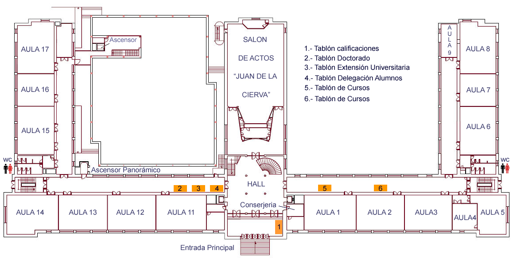
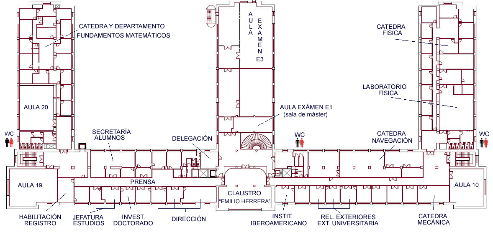
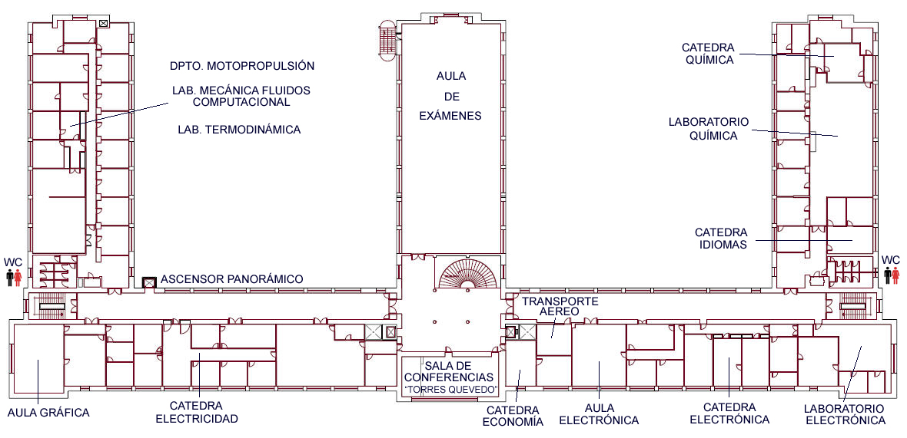
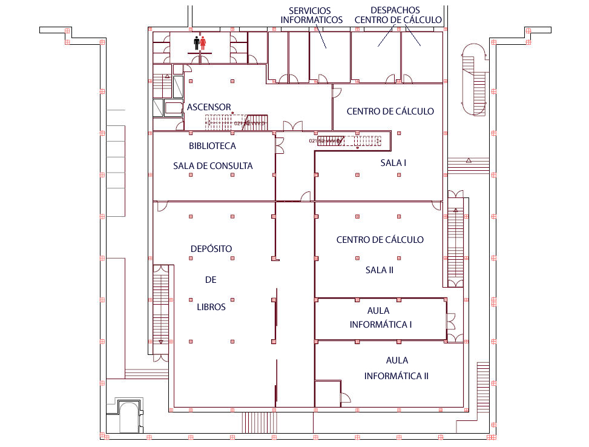
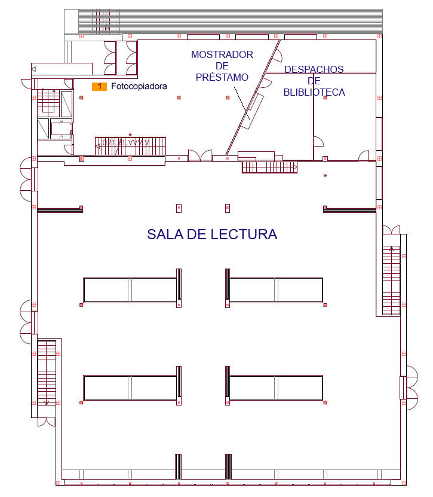

Actividades
===========

Enunciado
----------

Tenemos una empresa de servicios informáticos y nos han contratado para desplegar el cableado estructurado de una universidad. El campus está compuesto por 2 edificios separados 700 metros entre si. La acometida telefónica se sitúa en la planta baja del primer edificio (Junto al aula 4). Tenemos libertad para elegir los espacios donde se pondrán los cuartos de comunicaciones o equipos. Y no tenemos limitación en el presupuesto.

Los planos son los siguientes:

Primer edificio
++++++++++++++++

- Fachada: 120 metros
- Profundidad: 60 metros

**Planta baja**

**Planta primera**

**Planta segunda**

Segundo edificio
+++++++++++++++++

- Fachada: 50 metros.
- Profundidad: 60 metros.

**Planta baja**

**Planta primera**

Ejercicios
-----------

1. Indica qué dependencias serán los cuartos de comunicaciones.

2. Indica qué áreas de trabajo dispondrán de cableado de datos y para cuantos equipos.

3. Indica cuánto material necesitarás.

- Armarios
- Cables trenzados y fibra óptica
- Conectores
- Routers
- Switches
- Puntos de acceso inalámbricos
- Rosetas
- Canaletas
- Paneles de parcheo
- Cualquier otro material que necesites.

4. Haz un presupuesto (sólo para material, sin incluir mano de obra ni herramientas necesarias). Para ello consulta precios en las siguientes webs:

- http://www.cablematic.es
- http://www.cablecom.es
- http://www.senetic.es
- http://esp.hyperlinesystems.com
- http://www.universalnetworks.co.uk

