Introducción
============

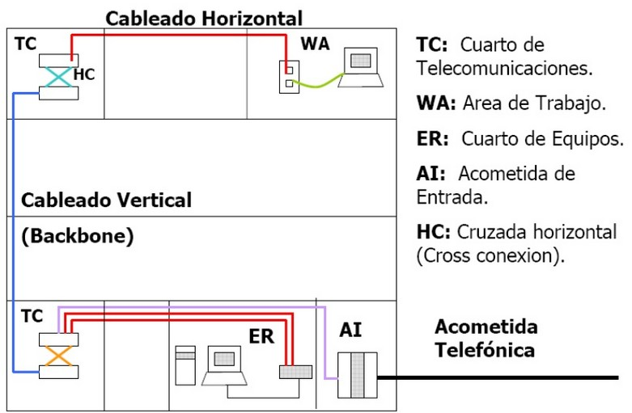

Un **Sistema de Cableado estructurado** (**SCE**. En inglés, Structured Cabling System - SCS) es un conjunto de productos de cableado, conectores, y equipos de comunicación que integran los servicios de voz, datos y video en conjunto con sistema de administración dentro de una edificación tales como los sistemas de alarmas, seguridad de acceso y sistemas de energía, etc). En resumen **es un cableado para todos los servicios que implican información y control en una edificación**.

SCE es una metodología, basada en estándares, de diseñar e instalar un sistema de cableado que integra la transmisión de voz, datos y vídeo. Un SCE propiamente diseñado e instalado proporciona una infraestructura de cableado que suministra un desempeño predefinido y la flexibilidad de acomodar futuros crecimientos por un período extendido de tiempo.

En definitiva, Cableado Estructurado es el cableado de un edificio o una serie de edificios que permite interconectar equipos activos, de diferentes o igual tecnología permitiendo la integración de los diferentes servicios que dependen del tendido de cables como datos, telefonía , control, etc.

El objetivo fundamental es cubrir las necesidades de los usuarios durante la vida útil del edificio sin necesidad de realizar más tendido de cables.

Problemas que resuelve:

- Cambios en los edificios, en la distribución de puestos de trabajo, etc.
- No solamente servicios de datos y telefonía, sino video, alarmas, climatización, control de acceso, etc.
- Unificar tendido de cables.
- Cambios en la tecnología de los equipos de Telecomunicaciones

Espacios
---------

- Acometida de red
- Cuartos de telecomunicaciones o cuartos de equipamiento
- Áreas de trabajo

Elementos pasivos
-----------------

- Cableado
- Rosetas (TO – Telecommunications Outlets)
- Paneles de parcheo (Patch panels)
- Armarios (Racks)

Elementos activos
------------------

- Puntos de acceso inalámbricos
- Conmutadores (switches)
- Enrutadores (routers)
- Cortafuegos (firewalls)
- Servidores (servers)

Distribuidores
--------------

- Distribuidor de Campus (CD – Campus Distributor)
- Distribuidor de Edificio (BD – Building Distributor)
- Distribuidor de Planta (FD – Floor Distributor)

Subsistemas de cableado
-----------------------

.. figure:: images/tema04-001.png

- Subsistema de cableado troncal de campus
- Subsistema de cableado troncal vertical
- Subsistema de cableado horizontal

Otro cableado es:

- Cables de usuario
- Cables de interconexión
- Cables o latiguillos de parcheo (patch cords)

.. figure:: images/tema04-002.png

.. figure:: images/tema04-003.png

Normativa
----------

Para edificios de oficinas existen unas normas que establecen la forma de hacer el cableado. El cableado realizado según esas normas se denomina cableado estructurado, y permite integrar distintas tecnologías y servicios de red (voz, audio, vídeo, datos). Las ventajas de seguir estas normas están en la sencillez de gestión y mantenimiento, robustez y flexibilidad ya que la mayoría de las tecnologías de red local funcionan sobre cableado estructurado. Esas normas son la **TIA/EIA-568, la ISO/IEC 11801, la EN 50173 y la UNE EN 50173**

La norma **TIA/EIA-568B** es de ámbito estadounidense y clasifica componentes en **categorías** (cables, conectores, repartidores, módulos, tendidos, interfaces, etc.). La norma **ISO/IEC 11801** es de ámbito internacional y clasifica enlaces permanentes en **clases**, para los componentes individuales se basa en la norma TIA/EIA. En el año 2002 se publicaron las últimas versiones de ambas normas. Las dos normativas (TIA/EIA-568B e ISO/IEC 11801) coinciden bastante en la clasificación de las diversas categorías de cableado.

La norma europea **EN 50173 1** (la versión española es la UNE-EN 50173) se basa en la norma ISO 11801.

Cuando se diseña un cableado es conveniente cumplir todas las normativas simultáneamente, instalando componentes según su categoría y certificando los enlaces realizados según su clase, ya que de esta forma se asegura una máxima compatibilidad con todos los fabricantes y sistemas. Hay que tener en cuenta que por un lado una mala instalación realizada con buenos componentes quizá no pueda certificarse, y por otro lado es más fácil asegurar la calidad de una instalación utilizando componentes certificados.

EPHOS 2 (European Procurement Handbook for Open Systems - Phase 2) recuerda que desde 1986 se “obliga a todos los responsables de contrataciones públicas (...) a hacer referencia a estándares o preestándares europeos o internacionales”. Es decir se obliga a cumplir las normas EN 50173 1, ISO 11801, ISO 802.x... y cumplir una serie de requisitos de Compatibilidad Electromagnética (CEM), protección de incendios, número de zócalos...

.. note:: 

   ISO 11801 está orientada a distancias de hasta 3.000 m., espacios de hasta 1.000.000 m² y entre 50 y 50.000 usuarios.

Una instalación de cableado estructurado debe servir a largo plazo, por diez años o más.

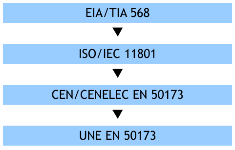

   Evolución de la normativa de los SCE

Normativa estadounidense
+++++++++++++++++++++++++

Los estadounidenses fueron los primeros en publicar un estándar para la estructuración y diseño de los SCE. Las organizaciones encargadas de llevar a cabo esta tarea fueron la TIA y la EIA. El estándar se publicó en 1991 bajo el nombre de **EIA/TIA 568** (Commercial building wiring standard) y su propósito era definir y especificar los tipos de cables y conectores, las arquitecturas técnicas básicas y los métodos de verificación de cables, conectores e instalaciones para los SCE de los edificios comerciales**.

Con el tiempo el estándar fue mejorado, actualizado y ratificado por la ANSI, dando lugar, en 1995, al **ANSI/TIA/EIA 568-A**. Este a su vez, fue reemplazado en 2001 por el **ANSI/TIA/EIA 568-B**, vigente en la actualidad aunque ya está empezando a ser reemplazado en parte por el nuevo estándar en desarrollo **ANSI/TIA 568-C**.

La normativa aplicable a SCE es:

- ANSI/TIA/EIA 568-B

  Cableado de Telecomunicaciones en Edificios Comerciales. (Cómo instalar el Cableado)

  - TIA/EIA 568-B1 Requerimientos generales
  - TIA/EIA 568-B2 Componentes de cableado mediante par trenzado balanceado
  - TIA/EIA 568-B3 Componentes de cableado, Fibra óptica

- ANSI/TIA/EIA 569-A y B

  Normas de Recorridos y Espacios de Telecomunicaciones en Edificios Comerciales (Cómo disponer el cableado)

- ANSI/TIA/EIA 570-A y B

  Normas de Infraestructura Residencial de Telecomunicaciones

- ANSI/TIA/EIA 598-A
  
  Define los códigos de colores para la fibra óptica.

- ANSI/TIA/EIA 606-A

  Normas de Administración de Infraestructura de Telecomunicaciones en Edificios Comerciales

- ANSI/TIA/EIA 607

  Requerimientos para instalaciones de sistemas de puesta a tierra de Telecomunicaciones en Edificios Comerciales.

- ANSI/TIA/EIA 758

  Norma Cliente-Propietario de cableado de Planta Externa de Telecomunicaciones.

Normativa internacional
+++++++++++++++++++++++

El principal organismo internacional encargado de desarrollar estándares para el cableado estructurado es la organización ISO/IEC, que en 1994 publicó su estándar ISO/IEC 11801 (Information technology. Generic cabling for customer premises), basado en el EIA/TIA 568 pero con algunas diferencias, como la clasificación y definición de los tipos de cables y de los elementos funcionales de los SCE. Este estándar se revisa constantemente para introducir actualizaciones y mejoras; actualmente se encuentra en la versión 2.2.

Aunque el ISO/IEC 11801 es el estándar internacional más importante relacionado con los SCE, existen muchos más que regulan diferentes aspectos relacionados con los SCE que no aparecen en el ISO/IEC 11801. Es de destacar, por su relación con este módulo, el **ISO/IEC 14763** (Information technology. Implementation and operation of customer premises cabling), que se divide en 3 partes:

- 14763-1: administración de redes locales.
- 14763-2: planificación e instalación
- 14763-3: pruebas a realizar en el cableado de fibra óptica.

Normativa europea
+++++++++++++++++

La normativa europea para el cableado estructurado la desarrolla, principalmente, la organización CEN/CENELEC y está basada en los estandares internacionales.

La adaptación del estándar ISO/IEC 11801 a la normativa europea es el estándar **EN 50173** (Information technology. Perfomance requirements of generic cabling schemes), actualmente dividido en 5 partes:

- 50173-1: requisitos generales de las instalaciones locales.
- 50173-2: requisitos generales de las instalaciones de oficinas.
- 50173-3: requisitos generales de las instalaciones industriales.
- 50173-4: requisitos generales de las viviendas.
- 50173-5: requisitos generales de los centros de datos.

Otros estándares europeos importantes sobre el cableado estructurado son:

- EN 50174

  Procedimientos de especificación y aseguramiento de la calidad (50174-1)
  Planificación y prácticas de instalación en el interior (50174-2)
  Planificación y prácticas de instalación en el exterior (50174-3)

- EN 50346

  Prueba del cableado instalado

- EN 50310

  Aplicación de la unión equipotencial y de la puesta a tierra.

La normativa europea sobre los SCE es de obligado cumplimiento en todos los países de la Unión Europea.

Normativa española
+++++++++++++++++++

La normativa española se basa en los estándares europeos EN publicados por la CEN/CENELEC. La adaptación de los estándares EN a la normativa española la lleva a cabo AENOR y su resultado son los estándares UNE EN.

Normativa aplicable:

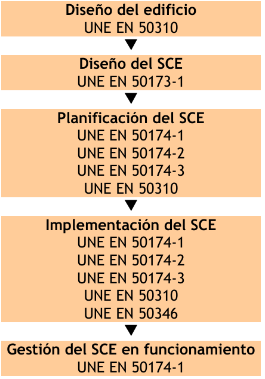

Cableado
---------

Las principales diferencias de rendimiento entre los distintos tipos de cables radican en la anchura de banda permitida (y consecuentemente en el rendimiento máximo de transmisión), su grado de inmunidad frente a interferencias electromagnéticas y la relación entre la pérdida de la señal y la distancia recorrida (atenuación).

En la actualidad existen básicamente tres tipos de cables factibles de ser utilizados para el cableado en el interior de edificios o entre edificios:

- Par Trenzado
- Coaxial (No se recomienda para instalaciones nuevas, excepto redes de TV y CATV)
- Fibra Óptica

Par trenzado
++++++++++++++

Es actualmente el tipo de cable más común en redes de área local.

La clasificación en categorías, además de aplicarse a un cable aislado se aplica a instalaciones ya hechas. Algunos errores comunes son por ejemplo destrenzar una longitud excesiva en los conectores, apretar demasiado las bridas o doblar excesivamente el cable.

Este tipo de cable soporta: Redes de Área Local ISO 8802.3 (Ethernet) e ISO 8802.5 (Token Ring); Telefonía analógica y digital; Líneas de control y alarmas; Alimentación eléctrica (PoE: Power over Ethernet)...

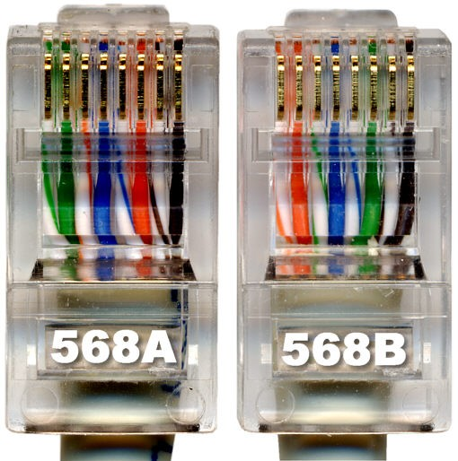

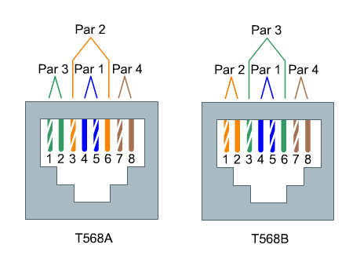

En telefonía se usa el par 1; Ethernet (10/100) pares 2 y 3; Gigabit Ethernet todos; Token Ring pares 1 y 3; FDDI, ATM y TP-PMD pares 2 y 4.Ethernet es compatible con el uso para alimentar eléctricamente aparatos (PoE: Power over Ethernet).

- Cable paralelo Ethernet: usar la misma normativa en los dos extremos.
- Cable cruzado Ethernet (10/100): usar una normativa en cada extremo.
- Cable cruzado Gigabit Ethernet (10/100/1000): usar una normativa en un extremo y en el otro extremo usar la otra normativa pero cruzando además los pares 1 y 4.

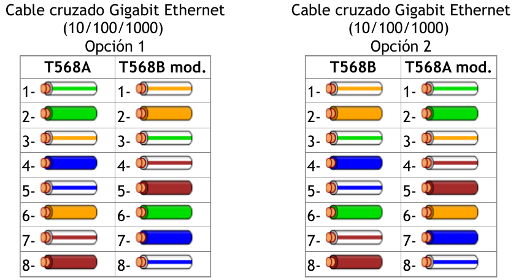

El estándar ISO/IEC 11801, en su edición del año 2002, define varias clases de interconexiones de par trenzado de cobre, que difieren en la frecuencia máxima para la que se requiere un cierto rendimiento de canal :

- **Clase A** : hasta 100 kHz utilizando elementos de la categoría 1
- **Clase B** : hasta 1 MHz utilizando elementos de la categoría 2
- **Clase C** : hasta 16 MHz usando elementos de la categoría 3
- **Clase D** : hasta 100 MHz utilizando elementos de categoría 5e
- **Clase E** : hasta 250 MHz utilizando elementos de la categoría 6
- **Clase E :sub:A** : hasta 500 MHz utilizando elementos categoría 6A ( enmienda 1 y 2 de la norma ISO / IEC 11801, 2 ª ed . )
- **Clase F** : hasta 600 MHz con categoría de elementos 7
- **Clase F :sub:A** : hasta 1000 MHz utilizando elementos categoría 7A (enmienda 1 y 2 de la norma ISO / IEC 11801 , 2 ª Ed. )

La impedancia de enlace estándar es de 100 Ω .

**Conectores**

- **8P8C: RJ-45 (UTP), RJ-49 (FTP, STP, SSTP)**
- GG45
- TERA

.. figure:: images/tema04-009.png

   8P8C: RJ-45 y RJ-49

La clase F se puede terminar ya sea con conectores eléctricos GG45 compatibles con 8P8C que incorporan el estándar 8P8C o con conectores TERA. En noviembre de 2010, todos los fabricantes de equipos activos han optado por apoyar el 8P8C para sus productos 10 Gigabit Ethernet sobre cobre y no el GG45 o TERA.

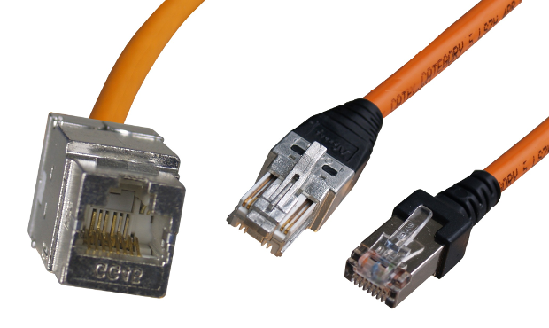

   GG45

Los conectores GG45, estandarizados en 2001 como IEC 60603-7-7, proporcionan compatibilidad con versiones anteriores para conectores con el estándar 8P8C en una interfaz de cable de categoría 6 (modo 1), donde se utilizan ocho conductores para la operación en categoría 6 (100/ 250 MHz ).

Además, el GG45 tiene cuatro conductores adicionales en las esquinas extremas que soportan la interfaz de alta velocidad de categoría 7 (600 MHz) y Cat 7a (1000MHz) . Los 4 conductores adicionales están conectados a 2 pares mientras que los otros 2 pares trenzados permanecen conectados a los pines más distantes del conector original de 8P8C : 1 y 2 , y 7 y 8. Un conector de categoría 6 o 6A utiliza las posiciones de contacto originales , pero un conector de categoría 7 o 7A en su lugar utiliza los contactos situados en las cuatro esquinas y tiene un saliente que activa un interruptor dentro de la toma de las posiciones de contacto alternativas. Esto reduce la diafonía dentro del conector a la que el aumento de la velocidad de datos es sensible.

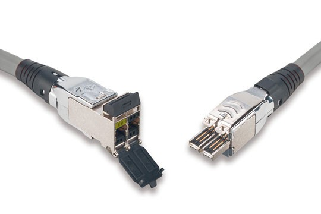

   TERA

TERA es un conector para su uso con cables de datos de par trenzado blindado de categoría 7, desarrollado por la compañia Siemen y estandarizado en 2003 por la Comisión Electrotécnica Internacional (IEC) 61076-3-104. La revisión de la norma de 2006 amplió el desempeño caracterizado hasta 1000 MHz. El conector tiene un tamaño diferente del conector 8P8C más común.

TERA es también una interfaz útil para la tecnología de las comunicaciones broadcast. Este conector permite el uso compartido de cable, lo que permite a los usuarios integrar servicios de video, voz y datos a través de un único enlace de cableado.

**Recomendaciones con el par trenzado**

.. figure:: images/tema04-012.png

Cable coaxial
+++++++++++++

Originalmente fue el cable más utilizado en las redes locales debido a su alta capacidad y resistencia a las interferencias, pero en la actualidad su uso está en declive.

Fibra óptica
+++++++++++++

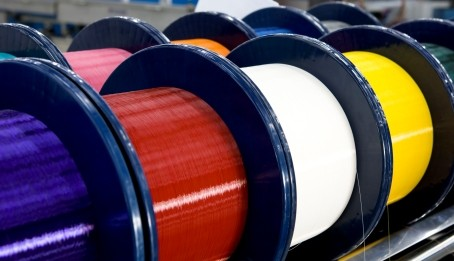

La fibra óptica es un medio excelente para la transmisión de información por sus **características**: gran ancho de banda, baja atenuación de la señal que permite cubrir grandes distancias sin repetidores, integridad -proporción de errores baja (BER: Bit Error Rate)-, inmunidad a interferencias electromagnéticas, alta seguridad y larga duración -resistente a la corrosión y altas temperaturas-.

Sus mayores **desventajas** son su coste de producción -superior al resto de los tipos de cable- y su fragilidad durante el manejo en producción.

La terminación de los cables de fibra óptica requiere un tratamiento especial para convertir la señal óptica en eléctrica que ocasiona un aumento de los costes de instalación (“**optoelectrónica**”).

.. figure:: images/tema04-077.png
   :align: left

La luz normalmente es emitida por un diodo de inyección láser (ILD: Injection Laser Diode) o un diodo de emisión de luz (LED: Light-Emitting Diode). Los ILDs emiten luz coherente, es decir un único rayo de luz, por tanto cada pulso de luz se propaga a través de la fibra en un solo modo, sin dispersión, y se utilizan con fibras monomodo.

Los **LEDs** generan luz normal no coherente, es decir cada pulso de luz genera múltiples rayos de luz que se propagan en diferentes modos con dispersión -por lo que **no se puede usar en grandes distancias**- y se utilizan con fibras multimodo.

El equipamiento basado en fibra monomodo e **ILDs** proporciona un gran ancho de banda y una baja atenuación con la distancia, por lo que se utiliza para transmitir a grandes velocidades y/o **a grandes distancias**. En cambio el equipamiento basado en fibra multimodo y LEDs resulta más económico y sencillo de implantar.

El vidrio no absorbe igual todas las longitudes de onda, es decir no es igual de 'transparente' a todos los colores. En particular las longitudes de onda de menor atenuación se encuentran situadas alrededor de los 850 (multimodo), 1310 (multimodo y monomodo) y 1550 (monomodo) nm y se conocen como **primera, segunda y tercera ventana**, respectivamente. Todas las ventanas se encuentran en la zona infrarroja del espectro (la parte visible se encuentra entre 400 y 760 nm). Las ventanas que se encuentran a mayores longitudes de onda tienen menor atenuación; sin embargo la menor atenuación va acompañada de un mayor costo de la optoelectrónica necesaria.

La transmisión por una fibra óptica normalmente es simplex; **para conseguir comunicación full-duplex es necesario instalar dos fibras, una para cada sentido**.

**En redes locales se utilizan principalmente fibras multimodo con emisores LED** de primera o segunda ventana. Estos equipos son más baratos que los láser, tienen una vida más larga, son menos sensibles a los cambios de temperatura y más seguros. A muy altas velocidades es necesario utilizar emisores láser ya que los emisores de luz normal no pueden reaccionar con la rapidez suficiente, por eso en algunas redes locales (Gigabit Ethernet, Fibre Channel y ATM) se utilizan emisores láser de primera ventana cuando se quiere gran velocidad pero no se requiere gran alcance.

Dado que los cableados de red local no disponen normalmente de fibra monomodo se ha extendido en los últimos años el uso de emisores láser en fibra multimodo, principalmente para Fibre Channel y Gigabit Ethernet.

**En redes de área extensa siempre se utiliza fibra monomodo y emisores láser**. Actualmente en segunda ventana se puede llegar a distancias de 40 Km y en tercera hasta 160 Km sin amplificadores intermedios. El mayor costo de los emisores se ve en este caso sobradamente compensado por la reducción en equipos intermedios (amplificadores y regeneradores de la señal).

**En las fibras se especifican indicando el diámetro del núcleo y el de la cubierta**; las fibras multimodo típicas son de 50/125 µm y 62,5/125 µm; las fibras monomodo suelen ser de 9/125 µm, es decir el núcleo es mucho más estrecho puesto que el haz no se dispersa.

El estándar ISO/IEC 11801, en su edición del año 2002, define varias clases de interconexión de fibra óptica :

- **OM1** : multimodo con núcleo de 62.5 µm; ancho de banda modal mínimo de 200 MHz * km a 850 nm
- **OM2** : multimodo con núcleo de 50 µm; ancho de banda modal mínimo de 500 MHz * km a 850 nm
- **OM3** : multimodo con núcleo de 50 µm; el ancho de banda modal mínimo de 2000 MHz * km a 850 nm
- **OM4** : multimodo con núcleo de 50 µm; ancho de banda modal mínimo de 4700 MHz * km a 850 nm

- **OS1** : monomodo con atenuación de 1db/km
- **OS2** : monomodo con atenuación de 0.4db/km

**Distancias soportadas**

.. figure:: images/tema04-078.png

**Código de colores de los cables de fibra local**

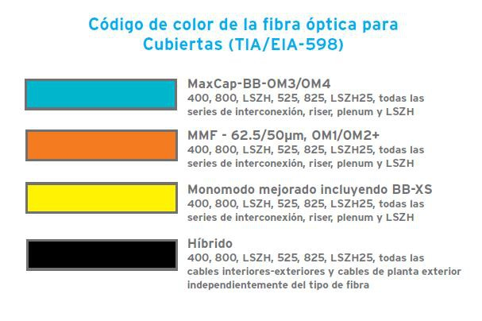

.. figure:: images/tema04-080.png

**Código de colores para cables multi-fibra**

Las fibras individuales en un cable de múltiples fibras a menudo se distinguen una de otra por cubiertas con código de color o tampones en cada fibra. EIA/TIA-598 define esquemas de identificación de fibras, fibras tamponadas, unidades de fibra, y los grupos de unidades de fibra dentro de la planta exterior y cables de fibras ópticas locales. Esta norma permite a las unidades de fibra que se identifiquen por medio de una leyenda impresa. Este método se puede utilizar para la identificación de cintas de fibra y subunidades de fibra. La leyenda contendrá un número correspondiente impreso numérica posición y / o el color para su uso en la identificación.

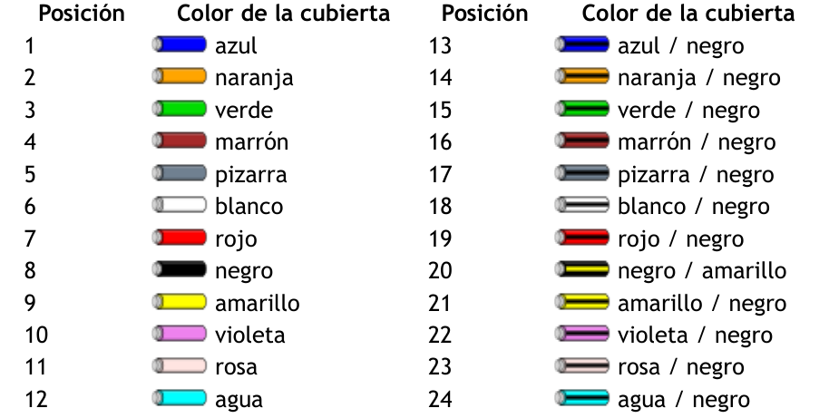

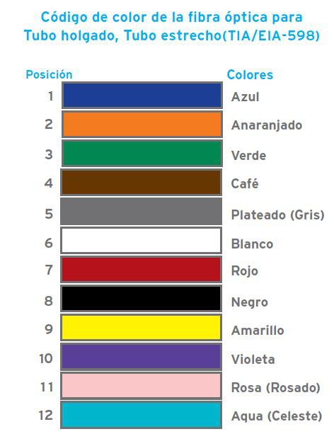

**Interconexión de fibra óptica**

Para la interconexión de fibras ópticas se utilizan conectores, adaptadores y soldaduras. Los conectores y adaptadores ofrecen máxima versatilidad pero introducen una pérdida de la señal de 0,5 a 0,75 dB aproximadamente (un 10%). La soldadura o fusión tiene una pérdida de señal muy pequeña, pero ha de llevarla a cabo un técnico especializado con equipo altamente sofisticado.

**Adaptadores**

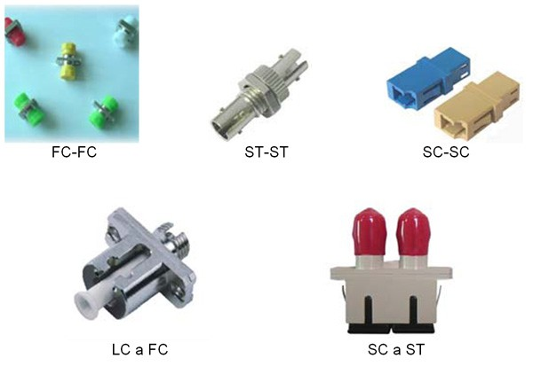

Un adaptador es básicamente un puente, es decir una transición mecánica necesaria para dar continuidad al paso de luz del extremo de un cable de fibra óptica a otro. Existen adaptadores “híbridos”', que permiten acoplar dos diseños distintos de conector.

**Conectores**

En el pasado el conector ST se ha utilizado habitualmente en redes de datos con fibras multimodo. Actualmente el estándar ISO 11801 impone para las nuevas instalaciones el uso de SC Duplex (SC-D) -usado habitualmente en telefonía- pues mantiene la polaridad. Otro conector que se ha utilizado bastante en telefonía es el FC.

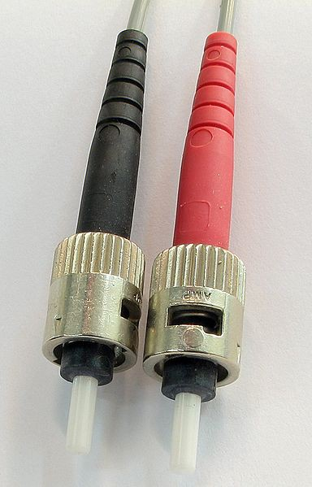

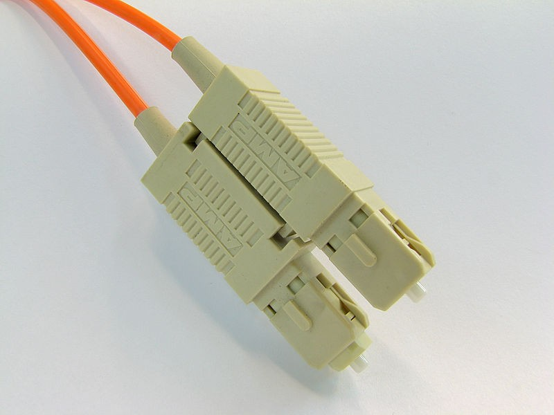

.. figure:: images/tema04-132.png

**Conector FC**

.. figure:: images/tema04-133.png
  
   Conector FC

El conector FC se utiliza ampliamente en el mercado de las telecomunicaciones, donde los **cables de fibra óptica monomodo largos** pueden funcionarmás de 50 kilómetros. En estas situaciones extremas, el conector necesita tener pérdidas muy bajas y la geometría precisa.

**Conector ST**

.. figure:: images/tema04-134.png

   Conector ST

Estructura:

1. **Ferrule**, debe albergar la fibra y alienarla. La calidad del ferrule es determinante para lograr que la fibra esté correctamente centrada y se logre la mejor conexión posible. El ferrule en conectores ST tiene un diámetro exterior de 2,5 mm, siendo el orificio interior de 127 um para las FMM. Los ferrule pueden ser de metal, cerámica o plástico.
2. **Cuerpo metálico**, con una marca que sólo permite su inserción en una posición, una vez introducido se gira un cuarto de vuelta y queda fijado por un resorte con mecanismo de bayoneta.
3. **Anillo de crimpado**
4. **Manguito**, imprescindible para dar rigidez mecánica al conjunto y evitar la rotura de la fibra.
5. **Resorte** que permite cerrar o liberar el mecanismo de bayoneta.

Este veterano conector ha sido durante mucho tiempo el más empleado para finalizar **fibras ópticas multimodo** (FMM), hoy en día está en desuso, no obstante sigue muy presente en multitud de instalaciones. Su diseño se inspira en los conectores para cables coaxiales, tiene un sistema de anclaje por bayoneta que hace de este conector un modelo muy resistente a las vibraciones por lo que es especialmente indicado para entornos exigentes.

ST se considera como un conector óptico de **segunda generación**.

Principales características:

- Pérdidas típicas de inserción FMM < 0,3 dB, FSM < 0,2 dB 
- Pérdidas típicas de retorno FMM > 25 dB, FSM > 55 dB

**Conector SC (suscriber connector)**

.. figure:: images/tema04-136.png
   
   Conector SC

Estructura:

1. **Ferrule**, generalmente de cerámica con un diámetro exterior de 2,5 mm, siendo el orificio interior de 127 um para las FMM y 125,5 para las FSM.
2. **Cuerpo**, de plástico con un sistema de acople “Push Pull” que impide la desconexión si se tira del cable, también bloque posibles rotaciones indeseadas del conector.
3. **Anillo de crimpado**
4. **Manguito**, imprescindible para dar rigidez mecánica al conjunto y evitar la rotura de la fibra.

Para este conector se emplea una regla nemotécnica según la cual SC significa square connector (conector cuadrado) . Esta diferencia de forma es lo primero que a simple vista se observa respecto al conector ST. Los conectores SC han ido sustituyendo al los ST sobre todo en cableados estructurados, fundamentalmente por ser más fáciles de conectorizar, lograr mayor densidad de integración y por permitir su variedad-duplex en la que los dos canales de transmisión/recepción Tx/Rx se pueden tener en el mismo modular.

SC se considera un conector óptico de **tercera generación**, mejorando en tamaño, resistencia y facilidad de uso con respecto a la anterior.

Principales características:

- Pérdidas típicas de inserción FMM < 0,1 dB, FSM < 0,1 dB
- Pérdidas típicas de retorno FMM > 30 dB, FSM > 55 dB

**Conector LC (Lucent technologies connector)**

.. figure:: images/tema04-138.png

   Conector LC

Estructura:

1. **Ferrule**, de cerámica con un diámetro exterior de 1,25 mm, la mitad que sus precedentes SC o ST.
2. **Cuerpo**, de plástico con un sistema de acople RJ “Push Pull” que impide la desconexión si se tira del cable, también bloquea posibles rotaciones indeseadas del conector.
3. **Anillo de crimpado**
4. **Manguito**, imprescindible para dar rigidez mecánica al conjunto y evitar la rotura de la fibra.

Aquí tenemos un conector óptico que reduce a la mitad el tamaño de un conector SC, esto hace que su escala de integración sea muy alta, por ello cada vez es más frecuente ver en los switch que tienen puertos de fibra para conectores LC duplex integrados en módulos mini GBIC o SFP. El sistema de anclaje es muy parecido al de los conectores RJ hay que presionar sobre la pestaña superior para introducirlos o liberarlos, esta pestaña es tan pequeña que esto se hace con un destornillador plano de punta fina.

LC se considera un conector óptico de **cuarta generación**, mejora en tamaño, resistencia y facilidad de uso con respecto a las generaciones anteriores.

Principales características:

- Pérdidas típicas de inserción FMM < 0,1 dB, FSM < 0,1 dB
- Pérdidas típicas de retorno FMM > 30 dB, FSM > 55 dB

Comparativa de cables
++++++++++++++++++++++

En el siguiente cuadro se presenta una comparativa de los distintos tipos de cables descritos.

============================ ================ ======================== =================== ================================
-                            Par Trenzado     Par Trenzado Blindado    Coaxial             Fibra Óptica
============================ ================ ======================== =================== ================================
Tecnología probada           Sí               Sí                       Sí                  Sí
Ancho de banda               Medio            Medio                    Alto                Muy Alto
Full Duplex                  Sí               Sí                       Sí                  Sí por pares
Distancias medias            100 m - 65 Mhz   100 m - 67 Mhz           500 m - (Ethernet)  2 km (Multi.) 100 km (Mono.)
Inmunidad Electromagnética   Limitada         Media                    Media               Alta
Seguridad                    Baja             Baja                     Media               Alta
Coste                        Bajo             Medio                    Medio               Alto
============================ ================ ======================== =================== ================================

Selección del tipo de cableado
++++++++++++++++++++++++++++++

Cuando se instalen cables de cobre o de fibra óptica en canalizaciones subterráneas, éstos deben tener protección adicional contra roedores, humedad y agua, radiación ultravioleta, campos magnéticos y tensión de instalación.

Si la distancia o el ancho de banda demandado lo exige será necesario utilizar fibra óptica. Además se recomienda utilizar fibra cuando se da alguna de las siguientes circunstancias:

- El cableado une edificios diferentes; en este caso el uso de cable de cobre podría causar problemas debido a posibles diferencias de potencial entre las tierras de los edificios que podrían provocar corrientes inducidas en el cable. Además se podría ver muy afectado por fenómenos atmosféricos.
- Se desea máxima seguridad en la red (el cobre es más fácil de interceptar que la fibra).
- Se atraviesan atmósferas que pueden resultar corrosivas para los metales.
- Se sospecha que puede haber problemas de interferencia eléctrica por proximidad de motores, luces fluorescentes, equipos de alta tensión, etc.

Cuando no se dé alguna de las razones que aconsejan utilizar fibra es recomendable utilizar cobre, ya que es más barato el material, la instalación y las interfaces de conexión de los equipos; además es más fácil realizar modificaciones en los paneles de conexión, empalmes, etc.

**En general en una instalación grande se utiliza fibra para los tendidos principales (uniones entre edificios y cableado vertical para distribución por plantas dentro del edificio) y cobre para el cableado horizontal y quizá también para el cableado vertical (junto con la fibra) si las distancias entre los armarios así lo aconsejan**.

Es recomendable que los cables de cobre y fibra óptica dentro de un edificio sean **resistentes al fuego, generen poco humo y cero halógenos** y sean retardantes de la llama, de acuerdo al estándar IEC 332-1, o equivalente.

La gran mayoría de los cables UTP tienen una cubierta construida con **PVC (Policloruro de vinilo)**, que se presenta normalmente en color gris. El PVC resiste relativamente bien las altas temperaturas, es un buen aislante eléctrico, es flexible y sobre todo es barato, por todo ello es un material muy empleado en las construcción de cubiertas de cables.

Pero las cubiertas de PVC de los cables tienen un punto importante en contra, el PVC contiene en su composición halógenos y además al quemarse emite dioxinas, estas dioxinas suspendidas en el humo pueden desplazarse a grandes distancias, depositarse en la tierra y terminar en las plantas llegando a contaminar la cadena alimenticia. De ahí que el PVC este considerado por muchos como una material potencialmente contaminante y tóxico.

En el interior de edificios y por motivos de seguridad se tiende a que los cables tengan cubiertas que en caso de incendio emitan poco humo al quemarse (Low Smoke) y por lo dicho antes se busca que estas cubiertas no contengan halógenos (Zero Halogen) esto se puede conseguir gracias al polipropileno (PP) un plástico con bastante mejor fama que el PVC.

Hay que recordar que cuando se produce fuego en un edificio la mayoría de las víctimas sucumben intoxicadas por el humo no por quemaduras. Los edificios están plagados de cables, en un hotel o en un hospital se habla normalmente de kilómetros de cableados tendidos. No es de extrañar por tanto que en muchos pliegos de condiciones de proyectos de cableado estructurado se exija además de la categoría del cable el que la cubierta del mismo sea **LSZH (Low Smoke Zero Halogen)**.

Un cable UTP de CAT-6 con cubierta LSZH es bastante más caro que otro de la misma categoría con cubierta en PVC. Los cables UTP con cubierta LSZH suelen ser de colores muy llamativos como el naranja o el amarillo, y tienen inscrito en la cubierta el acrónimo LSZH.

Canalizaciones
--------------

Las canalizaciones son utilizadas para distribuir y soportar el cable y conectar equipamiento entre la salida del área de trabajo y el cuarto de telecomunicaciones. Los cables deben ir fijados en capas mediante abrazaderas colocadas a intervalos de 4 metros.

Para evitar interferencias electromagnéticas la canalización de las corrientes débiles (cables de datos) debe mantenerse separada de corrientes fuertes (cables eléctricos y dispositivos electromagnéticos). Además en caso de cruzarse deben hacerlo perpendicularmente.

=============================================================== ============= ============= =============
Fuente de campo (se supone una tensión inferior a 480 voltios)  Separación mínima según la potencia (KVA)
--------------------------------------------------------------- ----------------------------------------- 
-                                                                < 2           [2, 5]        > 5
=============================================================== ============= ============= =============
Líneas de corriente o equipos eléctricos no apantallados        13 cm         30 cm         60 cm
Líneas o equipos no apantallados próximos a cables de tierra    6 cm          15 cm         30 cm
Líneas apantalladas                                             0 cm          15 cm         30 cm
Transformadores, motores eléctricos, aires acondicionados...    100 - 120 cm  100 - 120 cm  100 - 120 cm
Tubos fluorescentes y balastros                                 12 - 30 cm    12 - 30 cm    12 - 30 cm
=============================================================== ============= ============= =============

Canaletas
++++++++++

Se pueden usar canaletas de telecomunicaciones que podrán ir a la altura del suelo, por el rodapié, o por las paredes.

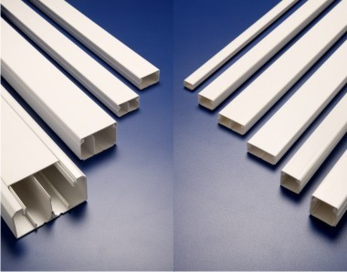

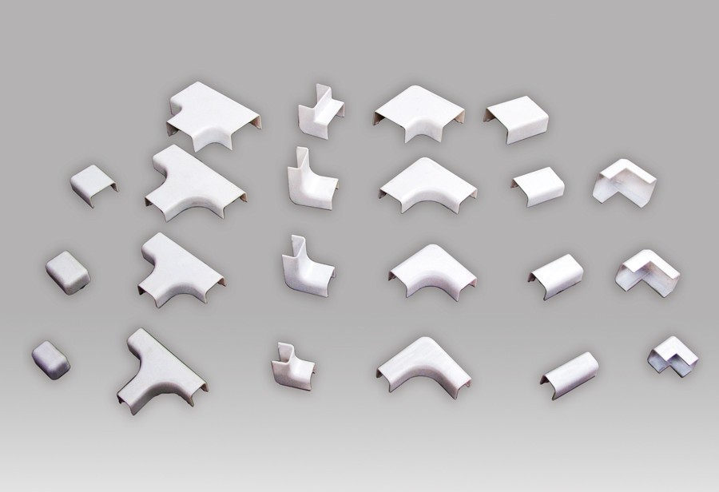

Falso suelo
++++++++++++

Consiste en hacer una tarima levantando unos centímetros el suelo de la habitación, y pasar el cableado por debajo de ésta.

.. figure:: images/tema04-142.png

.. figure:: images/tema04-143.png

Falso techo
+++++++++++

Para instalaciones de este tipo no es necesario instalar prácticamente ningún elemento adicional, salvo en algunos casos que no tengamos las suficientes verticales dentro de la sala para acceder a algunos lugares, pudiéndose instalar columnas metálicas para descender hasta el puesto de trabajo.

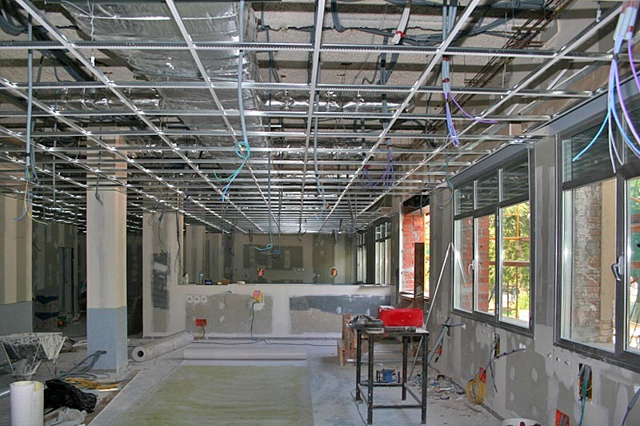

.. figure:: images/tema04-145.png

Bandejas colgantes
+++++++++++++++++++

.. figure:: images/tema04-146.png

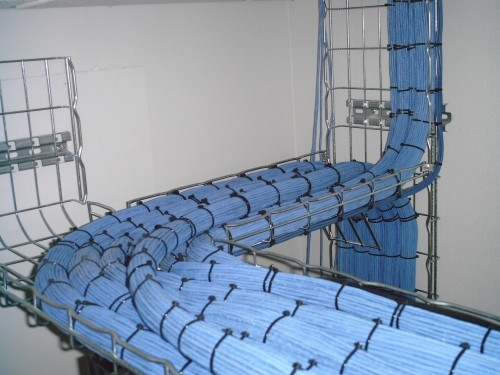

Instalación de cableado estructurado
====================================

Estructura
----------

.. figure:: images/tema04-148.png

El cableado genérico es una estructura jerárquica en forma de estrella. Este sistema permite generar otras distribuciones, como anillo o bus, utilizando interconectores en los terminadores. Conexiones directas entre FDs o BDs son deseables y permitidas, pero no pueden sustituir a las conexiones jerárquicas. El número y tipo de subsistemas que incluye una implementación depende de diversos factores. Por ejemplo un campus con un solo edificio puede no necesitar de subsistema de cableado de campus. Además se pueden agrupar múltiples distribuidores, por ejemplo es habitual combinar en un solo distribuidor el CD con uno de los BD, o un BD con uno de los FD.

**Para comunicar cualquier FD y el CD solo debe ser necesario atravesar un BD -como máximo-**.

Acometidas de red
++++++++++++++++++

Las acometidas de redes son necesarias tanto para los cables que constituyen el subsistema troncal o espinazo de campus, como para los cables de redes públicas y privadas (por ejemplo, líneas de comunicación de datos como X.25, Frame-Relay, RDSI, etc.) que entran en el edificio y con los que se realiza una transición para distribuirlos luego a través del sistema interno de cableado.

Comprende desde el punto de entrada en la pared del edificio hasta el tendido del cable que le hace llegar al armario distribuidor de planta o de campus.

En España se utiliza el reglamento de Infraestructuras Comunes de Telecomunicación en edificios.

Cuartos de telecomunicaciones / Cuartos de equipamiento
+++++++++++++++++++++++++++++++++++++++++++++++++++++++

Un **cuarto o sala de telecomunicaciones** (**TC**: Telecommunications Closet) es un espacio cerrado de un edificio utilizado para el uso exclusivo de cableado de telecomunicaciones y sistemas auxiliares: bastidores (racks), concentradores, aire acondicionado propio...

Un **cuarto o sala de equipamiento** es un tipo más complejo de sala de comunicaciones donde se ubican, además de telecomunicaciones otros equipos de red. Cada cuarto debe tener acceso directo al cable espinazo. Un cuarto de equipamiento (**ER**: Equipment Room) es un espacio cerrado de uso específico para equipamiento de datos y telecomunicaciones que puede contener o no distribuidores (haciendo la función de TC). Todo espacio que contenga más de un distribuidor se considera un ER.

.. figure:: images/tema04-149.png
   :align: left

Los cuartos de telecomunicaciones deben considerar, además de voz y datos, la incorporación de otros sistemas de información del edificio tales como televisión por cable (CATV), alarmas, seguridad o audio. No debe contener otras instalaciones eléctricas que no sean del equipamiento propio del cuarto.

Un cuarto de equipamiento puede incluir espacio de trabajo para el personal correspondiente.

Los **armarios** (bastidores o **racks**) deben de contar con al menos 82 cm de espacio libre por delante y detrás, medidos a partir de la superficie más sobresaliente del armario.

Deben disponer de acometida eléctrica diferenciada, apantallamiento frente a interferencias electromagnéticas, sistemas de alimentación interrumpida, sistema de luz de emergencia y ventilación adecuada.

Todo edificio debe contener al menos un cuarto de telecomunicaciones o un cuarto de equipo; no hay un límite máximo.

En los TC la temperatura debe mantenerse permanentemente entre 10 y 35 grados centígrados y la humedad relativa debe mantenerse por debajo del 85%, realizándose un cambio completo de aire por hora.

En los ER la temperatura debe mantenerse permanentemente entre 18 y 24 grados centígrados y la humedad relativa debe mantenerse entre el 30% y el 55%, realizándose un cambio completo de aire por hora.

Por esto a veces los **TC y ER** son también llamados “**salas frías**”.

Área de trabajo
+++++++++++++++

Se define como la **zona donde están los distintos puestos de trabajo** de la red. En cada uno de ellos habrá una roseta de conexión que permita conectar el equipo o equipos que se quieran integrar en la red.

El área de trabajo comprende todo lo que se conecta a partir de la roseta de conexión hasta los propios dispositivos a conectar (ordenadores e impresoras fundamentalmente). Están también incluidos cualquier filtro, adaptador, etc., que se necesite. Estos irán siempre conectados en el exterior de la roseta. La instalación se utiliza para transmitir voz, datos u otros servicios, cada uno de ellos deberá tener un conector diferente de la propia roseta de conexión.

Al cable que va desde la roseta hasta el dispositivo a conectar se le llama latiguillo y no puede superar los 3 metros de longitud.

Subsistema de Cableado de Campus (Cableado troncal)
+++++++++++++++++++++++++++++++++++++++++++++++++++

Este subsistema, en inglés “Campus Backbone Cabling Subsystem”, incluye [longitud máxima]:

1. Distribuidor de Campus (CD: Campus Distributor)
2. Latiguillos del CD [20 m, mayores distancias deben descontarse del Cable Espinazo]
3. Latiguillos entre los paneles y el equipamiento de CD -incluyendo PBX- [30 m [1] ]
4. **Cable Espinazo de Campus -Cable Troncal-** (Campus Backbone Cable) [Sumado al cable espinazo de edificio no debe superar los **2.000 m**. Con fibra monomodo puede aumentarse, pero distancias mayores que 3.000 m quedan fuera del propósito de la norma]. Incluye terminadores.

Subsistema de Cableado de Edificio (Cableado vertical)
+++++++++++++++++++++++++++++++++++++++++++++++++++++++

Este subsistema, en inglés “Building Backbone Cabling Subsystem”, incluye:

1. Distribuidor de Edificio (BD: Building Distributor)
2. Latiguillos del BD [20 m, mayores distancias deben descontarse del Cable Espinazo]
3. Latiguillos entre los paneles y el equipamiento de BD -incluyendo PBX- [30 m [1] ]
4. **Cable Espinazo de Edificio -Cable Vertical-** (Building Backbone Cable) [**500 m**]. Incluye terminadores.

Subsistema de Cableado Horizontal
++++++++++++++++++++++++++++++++++

Este subsistema, en inglés “Horizontal Cabling Subsystem”, incluye:

1. Distribuidor de Planta (FD: Floor Distributor)
2. Latiguillos del FD [6 m]
3. Latiguillos entre los paneles y el equipamiento de FD
4. **Cable Horizontal** [**90 m**, independientemente del medio] (Horizontal Cable). Incluye terminadores.
5. Punto de Transición (Opcional) [No incrementa la longitud del cable horizontal] (TP: Transition Point)
6. Salida de Telecomunicaciones -Roseta- (TO: Telecommunications Outlet)

La roseta (TO) forma parte del área de trabajo.

.. note::

   No es obligatorio, pero se recomienda fuertemente que la suma de longitudes de los latiguillos sea menor o igual que 10 m: 
   (2) + (3) + (cable del área de trabajo <=3 m) <= 10 m

.. [1] No son obligatorios pero si fuertemente recomendados.

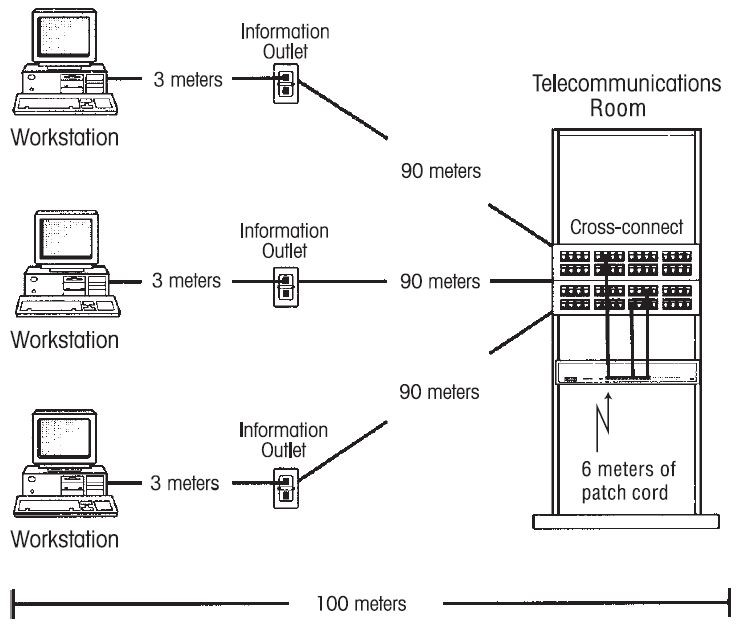

.. figure:: images/tema04-151.png

Distribuidores
+++++++++++++++

.. figure:: images/tema04-152.png

La distribución se organiza en **racks**. Un rack es un soporte metálico destinado a alojar equipamiento electrónico, informático y de comunicaciones. Las medidas para la anchura están normalizadas para que sean compatibles con equipamiento de cualquier fabricante. **También son llamados bastidores, cabinas, cabinets o armarios**.

Externamente, los racks para montaje de servidores tienen una **anchura estándar de 600 mm** y un **fondo de 600, 800, 900, 1000** y ahora incluso 1200mm. La anchura de 600 mm para racks de servidores coincide con el tamaño estándar de las losetas en los centros de datos. De esta manera es muy sencillo hacer distribuciones de espacios en centros de datos (CPD). Para el cableado de datos se utilizan también racks de 800 mm de ancho, cuando es necesario disponer de suficiente espacio lateral para el guiado de cables.

**Conjunto de racks**

Los racks son útiles en un centro de proceso de datos, donde el espacio es escaso y se necesita alojar un gran número de dispositivos. Estos dispositivos suelen ser:

- Servidores cuya carcasa ha sido diseñada para adaptarse al bastidor. Existen servidores de 1, 2 y 4 unidades rack; y servidores blade que permiten compactar más compartiendo fuentes de alimentación y cableado.
- Conmutadores y enrutadores de comunicaciones.
- Paneles de parcheo, que centralizan todo el cableado de la planta.
- Cortafuegos.

El equipamiento simplemente se desliza sobre un raíl horizontal y se fija con tornillos. También existen bandejas que permiten apoyar equipamiento no normalizado. Por ejemplo, un monitor o un teclado.

**Estándar de rack**

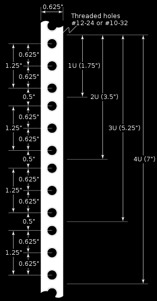

Las especificaciones de un rack estándar se encuentran bajo las normas equivalentes DIN 41494 parte 1 y 7, UNE-20539 parte 1 y parte 2 e IEC 297 parte 1 y 2, EIA 310-D y tienen que cumplir la normativa medioambiental RoHS.

**La anchura del bastidor está estandarizada y es de 19 pulgadas**. Las columnas verticales a ambos lados miden 15,875 milímetros de ancho cada una formando un total de 31,75 milímetros (5/4 pulgadas).* Están separadas por 450,85 milímetros (17 3/4 pulgadas) haciendo un total de 482,6 milímetros (**exactamente 19”**). Cada columna tiene agujeros a intervalos regulares, que se agrupan de 3 en 3 para formar lo que se conoce como unidad rack (U). Verticalmente, los racks se dividen en regiones de **1,75 pulgadas de altura (= 1U)**.

La altura de los racks está normalizada y sus dimensiones externas de 200 mm en 200 mm. Siendo lo normal que existan **desde 4U de altura hasta 46U de altura**.

Las alturas disponibles normalmente según normativa sería 1000, 1200, 1400, 1600, 1800, 2000 y 2200 mm.

La profundidad del bastidor no está normalizada, ya que así se otorga cierta flexibilidad al equipamiento. No obstante, suele ser de 600, 800, 900, 1000 incluso 1200 milímetros.

Existen también racks de pared que cumplen el formato 19” y cuenta con fondos de 300, 400, 450, 500, 500 y 600 mm totales, siendo muy útiles para pequeñas instalaciones.

Debería haber un mínimo de un armario distribuidor de planta (FD) por cada 1.000m² de espacio reservado para oficinas, con un mínimo de un FD por planta. Si una planta se utiliza poco para oficinas (como un vestíbulo) puede atenderse desde un FD de una planta adyacente.

Todo distribuidor (CD, BD, FD) debe estar en un cuarto de telecomunicaciones o en un cuarto de equipamiento.

**Paneles de parcheo**

Un panel de parcheo es un elemento pasivo que se atornilla en el rack y a donde van a parar los cables de las distintas rosetas.

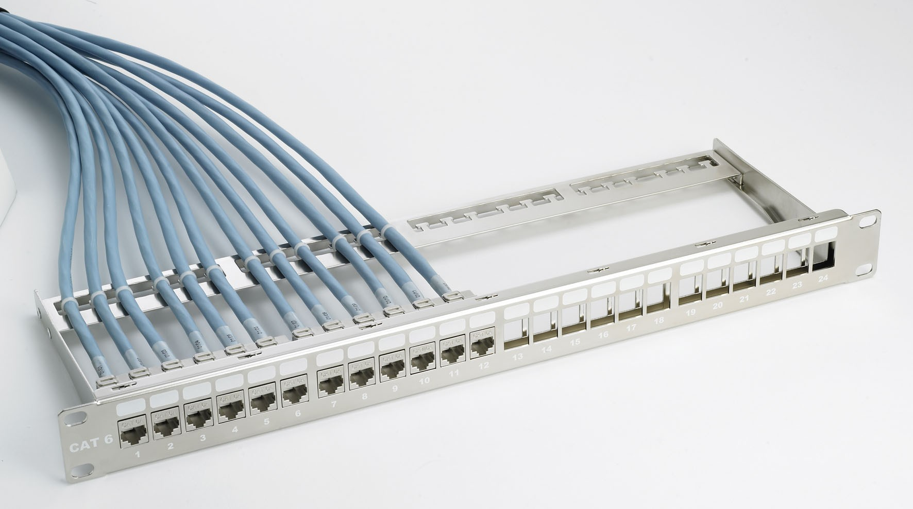

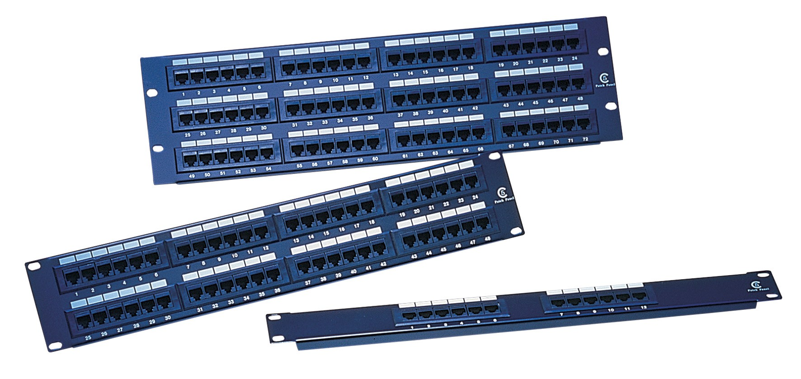

Existen 3 tipos de conexiones que podemos realizar:

- **Conexión directa**
- **Interconexión**
- **Conexión cruzada**

En la **conexión directa no hacemos uso de paneles de parcheo**. En el centro de datos, la conexión directa no es una opción acertada porque cuando se producen cambios, los operadores están obligados a localizar cables y moverlos con cuidado hacia una nueva ubicación: un esfuerzo impertinente, costoso, poco confiable y que requiere tiempo. Los centros de datos que cumplen con la norma TIA-942 no conectan los equipos en forma directa.

.. figure:: images/tema04-157.png

En la **interconexión hacemos uso de un panel de parcheo intermedio**. Cuando se produce algún cambio en una interconexión, los operadores vuelven a tender los cables del sistema final para volver a tender el circuito. Este método es mucho más eficaz que la conexión directa, pero no es tan sencillo o fiable como el método de conexión cruzada.

.. figure:: images/tema04-158.png

En la **conexión cruzada hacemos uso de dos paneles de parcheo intermedios**. Con un sistema de parcheo de conexión cruzada centralizada, se pueden alcanzar los requisitos de bajo costo y un servicio muy confiable. En esta estructura simplificada, todos los elementos de la red tienen conexiones de cables de equipos permanentes que se terminan una vez y no se vuelven a manejar nunca más. Los técnicos aíslan elementos, conectan nuevos elementos, rastrean problemas y realizan el mantenimiento y otras funciones usando conexiones de cable de parcheo semipermanentes en el frente de un sistema de conexión cruzada. 

.. figure:: images/tema04-159.png

A continuación se enumeran algunas ventajas clave que brinda un sistema de conexión cruzada bien diseñado:

- Costos de operación más bajos: Comparada con otras propuestas, la conexión cruzada reduce enormemente el tiempo que lleva agregar tarjetas, trasladar circuitos, modernizar software y realizar mantenimiento.
- Confiabilidad y disponibilidad mejoradas: Las conexiones permanentes protegen los cables de los equipos de la actividad cotidiana que puede deteriorarlos. Como los movimientos, adiciones y cambios se realizan en campos de parcheo, en lugar de en los paneles de conexión de equipos sensibles de ruteo y conmutación, los cambios en la red se pueden realizar sin afectar el servicio. Con la capacidad para aislar los segmentos de red para reparar averías y volver a tender circuitos mediante un simple parcheo, el personal del centro de datos gana tiempo para realizar las reparaciones adecuadas durante horas normales en lugar de hacerlas durante la noche o en turnos de fin de semana.
- Ventaja Competitiva: Un sistema de conexión cruzada permite hacer cambios rápidos a la red. El activar nuevos servicios se logra al conectar un cordón de parcheo y no requiere de una intensa mano de obra. Como resultado, las tarjetas se añaden a la red en minutos, en lugar de horas reduciendo el tiempo, lo que permite obtener mayores ingresos y ofrecer una ventaja competitiva – disponibilidad del servicio en forma más rápida.

Resumiendo, cuando los equipos activos (enrutadores, conmutadores...) se cablean directamente a paneles de algún subsistema de cableado, se denomina **interconexión (interconnect)**, y cuando lo hacen a paneles independientes se denomina **conexión cruzada (cross connect)**.

Cableado y equipamiento de área de trabajo
++++++++++++++++++++++++++++++++++++++++++

El cableado y equipamiento del área de trabajo no es parte del sistema de cableado genérico y la norma no impone requisitos al respecto, salvo las indicadas respecto a longitud y tipo de cable. Incluye:

1. Cable del área de trabajo o de usuario
2. Equipamiento terminal

TO, MUTO y PT - Salidas de telecomunicaciones y Puntos de transición
++++++++++++++++++++++++++++++++++++++++++++++++++++++++++++++++++++

Una alta densidad de TOs aporta flexibilidad al cableado para permitir cambios. En muchos países se utilizan dos TOs para un máximo de 10m². Pueden presentarse individualmente, por parejas o en grupo, pero cada área de trabajo debe cubrirse con al menos dos.

Cada TO debe estar identificado con una etiqueta permanente y visible. Si uno de ellos está conectado con cable de par trenzado y utiliza menos de 4 pares debe ser claramente marcado.

La configuración mínima consiste en:

1. Un TO con cable balanceado de 100, preferentemente cable de 4 pares, categoría 3 o superior.
2. Otro(s) TO con dos hilos de fibra óptica multimodo (50/125 o 62,5/125) o cable balanceado (categoría 3 o superior).

Se conocen como MUTO (Muti-User TO) las rosetas multiusuario, que pueden dar servicio a 12 áreas de trabajo como máximo (24 TOs). Deben ser fácilmente accesibles y su instalación debe ser permanente, es decir, no pueden estar localizadas en un techo o piso falso, en un armario... El cable desde el FD hasta un PT o un MUTO debe tener mínimo 15 m.

Un TP sirve para cambiar entre distintas formas del mismo tipo de cable (p.e. de cable plano a cable redondo) o como punto de consolidación. No puede ser utilizado como distribuidor ni se pueden conectar a él equipos activos. Las características de los cables deben ser mantenidas en la entrada y la salida.

Los puntos de consolidación son una interconexión en el cableado horizontal que permite reconfiguraciones más sencillas en oficinas cambiantes y se permiten para un máximo de 12 áreas de trabajo (24 TOs).

La diferencia más visible entre un TP y una MUTO es que el TP requiere una conexión adicional (una TO) para cada cable horizontal. Las TP se utilizan en oficinas cambiantes donde las TO se irán moviendo de un sitio a otro y las MUTO en oficinas que necesitan concentrar sus TO.

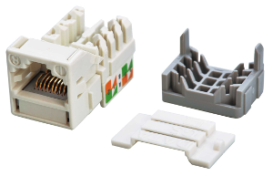

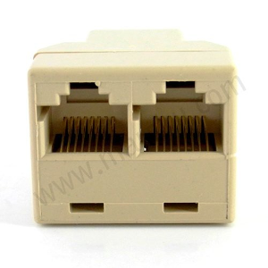

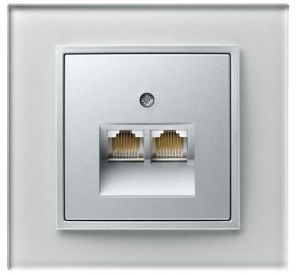

Tipo de cableado
----------------

Los tipos de cable permitidos por la norma vigente son:

- **Cable de pares trenzados con o sin blindaje**.
- **Cable de fibra óptica multimodo de 62.5/125 µm**.
- **Cable de fibra óptica multimodo de 50/125 µm**.
- Cable de fibra óptica monomodo 8-10/125 µm (para largas distancias).

Se usarán preferentemente los tres primeros tipos de cable.

Administración
---------------

La administración es un aspecto esencial del cableado genérico. La administración incluye la identificación exacta y el registro de todos los componentes del sistema, así como las canalizaciones y los espacios (TC y ER). Un buen registro puede incluir diagramas de cableado, mapas de conectividad, localización de TOs...

**Deben registrarse todos los cambios que se realicen** y cuando se han realizado, preferentemente por ordenador, y preparar procedimientos adecuados de actualización.

Si se realizan test de aceptación deberían registrarse también sus resultados.

**Cada elemento, canalización y espacio debe tener su identificación** claramente visible. A cada elemento, canalización y espacio se le asignará una identificación (mediante colores, números o cadenas alfanuméricas) unívoca.

Cada TO debe etiquetarse de modo que referencie la impedancia del cable, su categoría y número de pares o bien el diseño de fibra óptica utilizado.

**Los cables deben marcarse en ambos extremos**.

La norma 606 es vital para el buen funcionamiento de su cableado estructurado ya que habla sobre la identificación de cada uno de los subsistemas basado en etiquetas, códigos y colores, con la finalidad de que se puedan identificar cada uno de los servicios que en algún momento se tengan que habilitar o deshabilitar. Esto es muy importante, ya que en la documentación que se debe entregar al usuario final, la norma dice que se tendrá que especificar la forma en que está distribuida la red, por dónde viaja, qué puntos conecta y los medios que utiliza (tipos de cables y derivaciones).

La norma **TIA/EIA 606** proporciona una guía que puede ser utilizada para la ejecución de la administración de los sistemas de cableado.

Resulta fundamental para lograr una cotización adecuada suministrar a los oferentes la mayor cantidad de información posible. En particular, es muy importante proveerlos de planos de todos los pisos, en los que se detallen:

1. Ubicación de los gabinetes de telecomunicaciones
2. Ubicación de ductos a utilizar para cableado vertical
3. Disposición detallada de los puestos de trabajo
4. Ubicación de los tableros eléctricos en caso de ser requeridos
5. Ubicación de pisoductos si existen y pueden ser utilizados

Para proveer un **esquema de información** sobre la administración del camino para el cableado de telecomunicación, espacios y medios independientes. Marcando con un código de color y grabando en estos los datos para la administración de los cables de telecomunicaciones para su debida identificación. La siguiente tabla muestra el código de color en los cables.

  NARANJA   Terminación central de oficina
  VERDE     Conexión de red / circuito auxiliar
  PURPURA   Conexión mayor / equipo de dato
  BLANCO    Terminación de cable MC a IC
  GRIS      Terminación de cable IC a MC
  AZUL      Terminación de cable horizontal
  CAFÉ      Terminación del cable del campus
  AMARILLO  Mantenimiento auxiliar, alarmas y seguridad
  ROJO      Sistema de teléfono

.. figure:: images/tema04-163.png

Para el etiquetado del cableado, rosetas y otros elementos se sigue la norma 606-A o 606-B (siendo esta última la más moderna).

A continuación se muestra un ejemplo de etiquetado:

Esta imagen se corresponde con la etiqueta que identifica uno de los troncales en cobre de la red de cableado estructurado de un centro educativo.

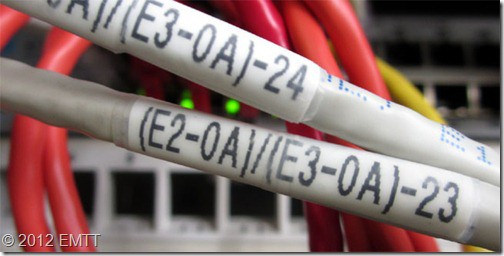

El código que ves se ajusta a las especificaciones descritas por la norma americana TIA/EIA 606-A que aunque no es de obligado cumplimiento aquí, es de lejos la que mejor explica la gestión de un cableado estructurado. ¿Pero qué información contiene este código?

[E2-0A]/[E3-0A]-23

  Nuestra red se extiende por cuatro edificios que identificamos individualmente con dos dígitos (Ex). De tal manera que E1 significa Edificio 1 y E2, por ejemplo, Edificio 2. La norma 606-A se aplica en este caso dentro de la clase o categoría tres.

[E2-0A]  
  
  Es uno de lo extremos del troncal que empieza en el armario A de la planta baja (0) del Edificio 2. Esta filosofía es típica de la norma americana, se referencian los recintos, armarios y envolventes no los nombres de las salas, despachos o aulas. ¿La razón? pues es bien simple, lo primero cambia más difícilmente de nombre que lo segundo.

[E3-0A]  
  
  Es el otro extremo del troncal ubicado en el armario A de la planta baja del Edificio 3. La barra inclinada nos informa de que se trata de un troncal.

23   
  
  Identifica el número del troncal establecido entre ambos edificios.

La norma permite añadir más códigos, para diferenciar por ejemplo fibra de cobre aunque las etiquetas resultantes pueden llegar a ser bastante largas así que nosotros hemos optado por simplificar al máximo y basarnos en el complemento que aportan los planos de la instalación.

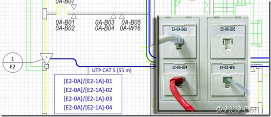

Vemos en esta otra imagen como quedan cuatro tomas de un puesto de trabajo en la distribución horizontal. Al trabajar en clase 3 se debe indicar siempre el edificio. En las tomas lo hacemos pues este modelo de Cima Box ofrece un buen espacio para poner bellas etiquetas, en el plano nos hemos tomado la licencia de no incluir el código de los edificios por ser obvio y con el fin de ganar en claridad.

E2-0A-B03  

  Nos informa de que esta toma viene del Edificio 2, planta baja, rack A. Dentro del armario se ubica en el panel de patcheo B, boca 03.

E2-0A-W16
  
  Viene del mismo sitio pero de otro panel de patcheo diferente. En concreto se trata de telefonía así que la letra W pretende diferenciar esta cuestión directamente. Esta práctica no es obligada pero si aconsejada por la propia norma.

El nivel de detalle en el proyecto y la instalación al que se puede llegar aplicando esta norma es muy alto. Abarca tomas de tierra, recintos, canalizaciones, simbología, códigos de colores, planos y mucho más. Si te dedicas a esto y te gusta cuidar los detalles merece la pena leerse todo el documento. Un buen proyecto en manos de un buen instalador es algo que no puede terminar mal.

.. figure:: images/tema04-166.png

Cada elemento de la infraestructura se codifica y organiza en una base de datos donde pasa a denominarse registro. La imagen superior muestra parte de la información de uno de estos registros que incluimos al certificar.

Verificación y comprobación
===========================

Se puede hacer comprobaciones sobre el enlace permanente (lo más habitual, sirve para certificar una instalación) o sobre el canal completo.

.. figure:: images/tema04-168.png

Los procedimientos de verificación y comprobación se dividen en tres partes: rendimiento de enlace (sobre el cableado), transmisión (sobre los componentes del cableado) y medidas de los componentes.

Pruebas de rendimiento de los enlaces
-------------------------------------

En la norma se describe qué debe ser medido no cómo debe ser medido. Estas medidas suelen necesitar ser realizadas por expertos con maquinaria especializada.

Las pruebas de cables apantallados deben realizarse conectando la medida de toma de tierra.

Se comprueba las terminaciones, la calibración, la perdida de conversión longitudinal, la pérdida por retorno y el retardo de propagación.

Para fibra óptica se mide la atenuación, retardo de la propagación y pérdida óptica por retorno.

Las pruebas pueden usarse para:

- conformidad
- localización de errores
- aceptación (sobre cableado conforme)

Equipos de medida
+++++++++++++++++++

Son equipos portátiles que se encargan de medir los parámetros para certificar los enlaces. Consta de 2 equipos. Uno principal donde se manejan y presentan los datos y otro remoto en el otro extremo con el que se comunica éste. Disponen de latiguillos especiales certificados para que el latiguillo no sea fuente de posibles problemas. Normalmente tienen una conexión RS-232 o USB para pasar los datos a un PC.

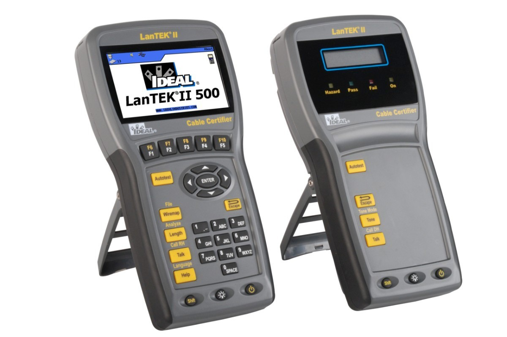

Deben cumplir la normativa TSB67 y ser calibrados periódicamente.

Se les indica la clase de cableado que se pretende certificar y el tipo de cable que se utiliza y se realiza un “autotest”.

Los equipos indican si se pasa la certificación o no y qué parámetro queda fuera de los márgenes del estándar.

También comprueba el mapa de cableado por si se hubiera cruzado o conectado mal algún hilo.

Los principales parámetros que afectan la longitud máxima del enlace/canal son:

- atenuación,
- diafonía (crosstalk) -se mide su atenuación- (en cables de pares balanceados),
- ancho de banda (para fibra óptica),
- pérdida de retorno,
- retardo de propagación.

Cableado de par trenzado
-------------------------

Cartografía de las conexiones
++++++++++++++++++++++++++++++

Permite verificar las conexiones del cableado:

- Continuidad de los 8 hilos desde la pantalla o blindaje en su caso
- Ausencia de cortocircuitos entre los hilos
- Correcto emparejado de RJ45

Atenuación
+++++++++++

La atenuación mide la disminución de la intensidad de la señal a lo largo de un cable (expresada en dB) debido a la impedancia y a la pérdida por radiación al ambiente. Es medida en cada par a diferentes frecuencias según la clase considerada. Es una medida crítica de la calidad del cable. Se mide en dB.

Algunos factores que la incrementan son la frecuencia, la distancia, la temperatura o la humedad. La reduce el apantallamiento.

No debe superar un máximo (deberá ser lo más bajo posible).

Atenuación diafónica
+++++++++++++++++++++

La diafonía es un tipo de interferencia (crosstalk) -acoplamiento electromagnético- entre pares de un mismo cable. La señal de un par induce una señal en los otros pares que se propaga en ambos sentidos. Se mide en dB.

La atenuación diafónica es la capacidad de un par para resistir una perturbación provocada por otro par (diafonía) medida para cada par del mismo lado del cable (6 mediciones para un cable de 4 pares), a diferentes frecuencias según la clase considerada. Permite medir la calidad del tendido del cable y de las conexiones.

Se mide en los dos extremos del cable:

- **NEXT** (Near-End Crosstalk) o paradiafónica en el extremo emisor.
- **FEXT** (Far-End Crosstalk) o telediafónica en el receptor.

El NEXT suele ser mayor que el FEXT y añade ruido a los datos de vuelta.

Como lo que se mide es la “pérdida” de la señal inducida, el valor de la atenuación paradiafónica deberá ser lo más alto posible -debe superar un mínimo-.

Es necesario limitar el destrenzado de los conductores a 13 mm como máximo para evitar el fenómeno de la paradiafonía. Es interesante anotar que la tecnología de procesamiento de señales digitales (DSP) puede realizar una cancelación de la paradiafonía.

Relación atenuación-diafonía (ACR: Attenuation/Crosstalk Ratio)
+++++++++++++++++++++++++++++++++++++++++++++++++++++++++++++++

Determina la calidad de la transmisión en el cableado y es la relación entre la atenuación y NEXT (la atenuación de la diafonía del extremo cercano o paradiafonía):

**ACR** (dB) = NEXT (dB) - Atenuación (dB)

El valor de ACR ha de ser lo mayor posible -debe superar un mínimo-, ya que eso implica una NEXT elevada y una baja atenuación.

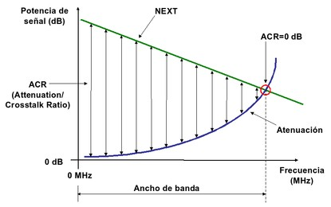

El ACR ayuda a definir el ancho de banda de una señal al establecer la máxima frecuencia útil donde la relación señal/ruido es suficiente para soportar ciertas aplicaciones (aquella en que ACR=0).

Se alcanza (aproximadamente) para Cat.3 con 16 MHz, para Cat. 5e con 100 MHz, para Cat. 6 con 250 MHz y para Cat.7 con 600 MHz.

Pérdida de retorno (Return loss)
+++++++++++++++++++++++++++++++++

Es la relación entre lo que se emite por un par y lo que vuelve por el mismo par, debido a rebotes en los empalmes. Esta pérdida debe ser lo más alta posible -debe superar un mínimo-. Se mide en dB.

Algunas aplicaciones como Gigabit Ethernet utilizan un esquema de codificación de transmisión full-duplex en que las señales de transmisión y recepción están superpuestas en el mismo par conductor. Este tipo de aplicaciones son más sensibles a errores resultantes por el retorno de la señal.

Otras pruebas y medidas
++++++++++++++++++++++++

- Retardo de propagación: El tiempo que tarda la señal en llegar al otro extremo. Se espera que no supere un máximo.
- Variación del retardo (Delay Skew): Es la diferencia de retardo de propagación de la señal que hay de un par a otro. Comienza a medirse a partir de Cat. 5e para redes Gigabit. Se espera que no supere un máximo.
- Resistencia en continua: Resistencia ante el paso de corriente continua. Se espera que no supere un máximo.
- Paradiafonía en modo suma de potencias (PSNEXT: Power Sum NEXT): Es el acoplamiento provocado por la suma de las señales de 3 de los pares en el cuarto y medido en el extremo emisor. Como mide pérdidas, se espera que supere un mínimo.
- Relación Paradiafonía/Atenuación en modo suma de potencia (PSACR: Power Sum ACR): Es la diferencia PSNEXT - Atenuación (en decibelios). Se espera que supere un mínimo.
- Relación Telediafonía/Atenuación (ELFEXT): Es la diferencia FEXT - Atenuación (en decibelios). Se espera que supere un mínimo.
- Relación Telediafonía/Atenuación en modo suma de potencias (PSELFEXT: Power Sum ELFEXT): En este caso el acoplo que mide el FEXT será producto de la señal de los tres cables en el cuarto. Se espera que supere un mínimo.

Valores esperables
++++++++++++++++++

Los datos se calculan en base a fórmulas cuyos resultados dependen de la frecuencia. A continuación se muestra una tabla con valores límites a las máximas frecuencias de las principales clases de cable, calculados para 90 m de cable rígido y 10 m de cable flexible con 4 conectores.

========== ========== ======= ====== =========== ========== ========== ========= ======== ========= ===========
-          Atenuac dB NEXT dB ACR dB Pérd.Ret dB Ret.Pro µs Var.Ret µs PSNEXT dB PSACR dB ELFEXT dB PSELFEXT dB
========== ========== ======= ====== =========== ========== ========== ========= ======== ========= ===========
D 100 MHz  24,0       30,1    6,1    10,0        0,55       0,05       27,1      3,1      17,4      14,4
E 250 MHz  35,9       33,1    -2,8   8,0         0,55       0,05       30,2      -5,8     15,3      12,3
F 600 MHz  54,6       51,2    -3,4   8,0         0,55       0,05       48,2      -6,4     21,1      18,1
========== ========== ======= ====== =========== ========== ========== ========= ======== ========= ===========

Cableado de fibra óptica
-------------------------
Los parámetros dependen de la ventana de transmisión que se mida: 850 (multimodo), 1310 (multimodo y monomodo) y 1550 (monomodo) nm.

Atenuación óptica
+++++++++++++++++

Pérdida de señal en el otro extremo debido al comportamiento del medio físico. Se mide en dB/Km.

Aumenta con la distancia, los empalmes y soldaduras, las curvas, la suciedad, la temperatura y el envejecimiento de la instalación.

Se espera que no supere un máximo. La atenuación máxima es del orden de 0,3 dB por cada 100 m de fibra y de 0,75 dB por conexión (par de conectores).

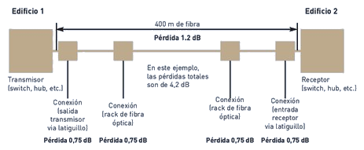

Ancho de banda modal
++++++++++++++++++++

Es una medida de la capacidad de frecuencia de transmisión -ensanchamiento del pulso- en fibras multimodo. Es importante en conexiones de alta velocidad (Gigabit). Se mide en MHz*Km y debe superar un mínimo.

Pérdida de retorno (Return Loss)
++++++++++++++++++++++++++++++++

Es la relación entre lo que se emite por una fibra y lo que vuelve por ella, debido a rebotes en los empalmes. Esta pérdida debe ser lo más alta posible -debe superar un mínimo-. Se mide en dB.

Se considera un fenómeno de eco. Indica la compatibilidad entre unos componentes de la instalación.

Retardo de propagación
+++++++++++++++++++++++

Es el tiempo que tarda la señal en llegar al otro extremo. Se espera que no supere un máximo.

Valores esperables
++++++++++++++++++

Los datos se calculan en base a fórmulas cuyos resultados dependen de la ventana de transmisión y la distancia. A continuación se muestra una tabla con valores límites de las principales clases de cable, calculados para 300 m de fibra.

======================== ============== =============== =============== ================
-                        Multi 850 nm	Multi 1300 nm	Mono 1310 nm	Mono 1550 nm
======================== ============== =============== =============== ================
Atenuación dB / Km       3,5            1,50            1,00            1,00
Ancho de banda Mhz - Km  200            500             N/A             N/A
======================== ============== =============== =============== ================
