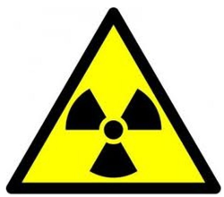
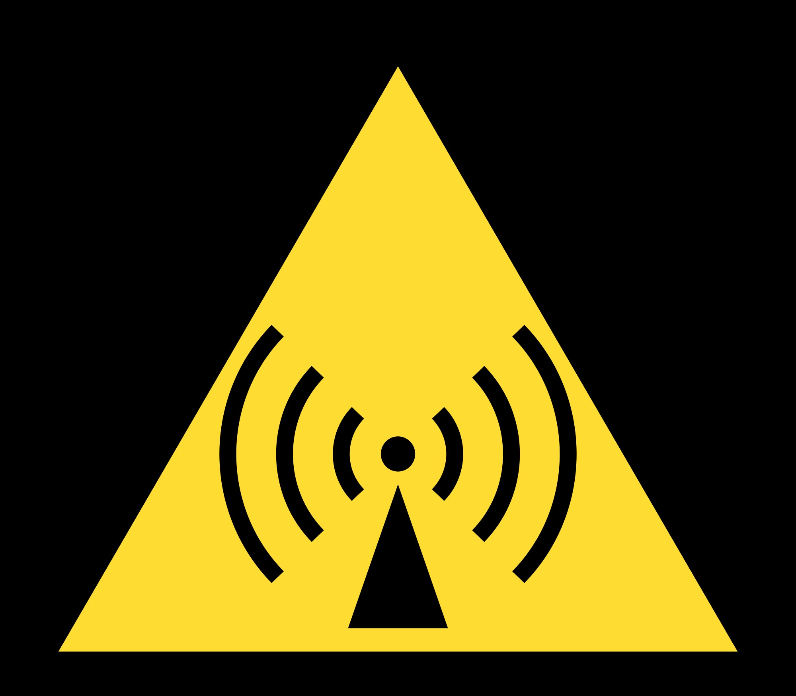
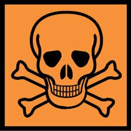
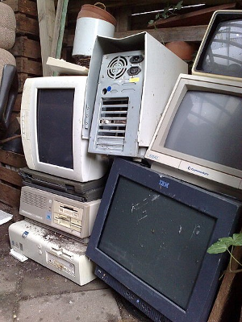
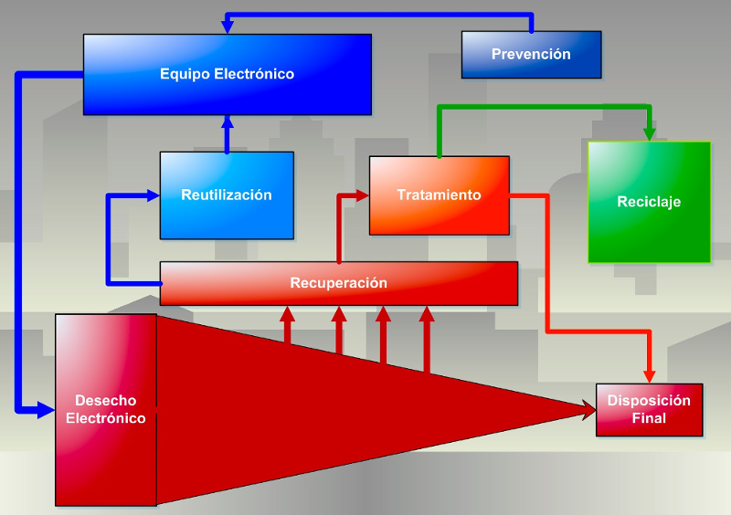

Seguridad y salud laboral
=========================

La **seguridad y salud laboral** (denominada anteriormente como "seguridad e higiene en el trabajo") tiene por objeto la aplicación de medidas y el desarrollo de las actividades necesarias para la prevención de riesgos derivados del trabajo.

El concepto de **salud** es definido por la Constitución de 1946 de la Organización Mundial de la Salud como el caso de **completo bienestar físico, mental y social**, y no solamente la ausencia de afecciones o enfermedades. También puede definirse como el nivel de eficacia funcional o metabólica de un organismo tanto a nivel micro (celular) como en el macro (social).

Para prevenir los daños a la salud ocasionados por el trabajo está constituida la **Organización Internacional del Trabajo (OIT)**; es un organismo especializado de las Naciones Unidas de composición tripartita que reúne a gobiernos, empleadores y trabajadores de sus estados miembros con el fin de emprender acciones conjuntas destinadas a promover el trabajo decente en el mundo.

Marco internacional
--------------------

- La **convención de 1981 de la OIT sobre la Seguridad y Salud nº 155** y sus recomendaciones nº 164, dispone que se adopten medidas políticas nacionales de seguridad y salud en el trabajo y estipula las actuaciones necesarias tanto a nivel nacional como a nivel empresarial para impulsar la seguridad y salud en el trabajo y la mejora del medioambiente.
- **La convención de 1985 de la OIT sobre Seguridad y Salud, nº 161** y sus recomendaciones nº 171, dispone la creación de servicios de salud laboral que contribuyan a la implantación de las medidas políticas de seguridad y salud en el trabajo.
- 1998, instrucciones técnicas y éticas para la vigilancia de la salud de los trabajadores.

Unión Europea
++++++++++++++

A nivel de la Unión Europea existen los siguientes organismos relacionados con la Seguridad y la Salud en el Trabajo.

- El Comité Consultivo para la Seguridad, la Higiene y la Protección de la Salud en el Centro de Trabajo.
- Agencia Europea para la Seguridad y Salud en el Trabajo, con sede en Bilbao (España).
- Fundación Europea para la Mejora de las Condiciones de Vida y de Trabajo, con sede en Dublín (Irlanda).
- La Comisión Internacional de Salud Laboral (ICOH)
- La Asociación Internacional de la Seguridad Social (ISSA)

Riesgo laboral
---------------

Se denomina "riesgo laboral" a **todo aquel aspecto del trabajo que tiene la potencialidad de causar un daño**. La prevención de riesgos laborales es la disciplina que busca promover la seguridad y salud de los trabajadores mediante la identificación, evaluación y control de los peligros y riesgos asociados a un proceso productivo, además de fomentar el desarrollo de actividades y medidas necesarias para prevenir los riesgos derivados del trabajo.

Planificación y acción preventiva
----------------------------------

En España, por ejemplo la **Ley 31/1995, de 8 de noviembre de Prevención de Riesgos Laborales** (que desarrolla el artículo 40.2 de la Constitución Española), en la exposición de motivos, expone entre otros argumentos los siguientes:

      La protección del trabajador frente a los riesgos laborales exige una actuación en la empresa que desborda el mero cumplimiento formal de un conjunto predeterminado, más o menos amplio, de deberes y obligaciones empresariales y, más aún, la simple corrección a posteriores situaciones de riesgo ya manifestadas. La planificación de la prevención desde el momento mismo del diseño del proyecto empresarial, la inicial evaluación de los riesgos laborales y su actualización periódica a medida que se alteren las circunstancias, la ordenación de un conjunto coherente y globalizador de medidas de acción preventiva adecuadas a la naturaleza de los riesgos detectados y el control de la efectividad de dichas medidas constituyen los elementos básicos del nuevo enfoque en la prevención de riesgos laborales. Y, junto a ello, se completa con la información y la formación de los trabajadores dirigidas a un mejor conocimiento tanto del alcance real de los riesgos derivados del trabajo como de la forma de prevenirlos y evitarlos, de manera adaptada a las peculiaridades de cada centro de trabajo, a las características de las personas que en él desarrollan su prestación laboral y a la actividad concreta que realizan.

                                                             Ley de prevención de riesgos laborales España

Maquinaria, equipos, productos y útiles de trabajo
++++++++++++++++++++++++++++++++++++++++++++++++++

No sólo el empresario que tiene un trabajador queda obligado por la normativa de prevención de riesgos laborales, sino que **se suelen establecer también obligaciones que afectan a los fabricantes, importadores y suministradores de maquinaria, equipos, productos y útiles de trabajo**. Un logotipo para este fin es el CE mark.

.. figure:: images/tema05-000.png

.. note::

  Aunque se parece al anterior, **el símbolo CE de “China Export” no conlleva el cumplimiento de ningún tipo de normativa específica**. Únicamente es utilizado para indicar que el producto proviene de China.

Evaluación de riesgos laborales
-------------------------------

La evaluación de los riesgos laborales es el **proceso dirigido a estimar la magnitud de aquellos riesgos que no hayan podido evitarse**, obteniendo la información necesaria para que el empresario esté en condiciones de tomar una decisión apropiada sobre la necesidad de adoptar medidas preventivas y, en tal caso, sobre el tipo de medidas que deben adoptarse. Pueden ser necesarias medidas tales como:

- **Eliminar o reducir el riesgo, mediante medidas de prevención** en el origen, organizativas, de protección colectiva, de protección individual, o de formación e información a los trabajadores.
- **Controlar periódicamente las condiciones**, la organización y los métodos de trabajo y el estado de salud de los trabajadores.

El 28 de abril se celebra el Día Mundial de la Seguridad y Salud en el Trabajo. Para la evaluación de la magnitud de los riesgos existe un método que basa la estimación de riesgos para cada peligro, en la determinación de la potencial severidad del daño (consecuencias) y la probabilidad de que ocurra el hecho. De esta forma, en el ámbito de la **severidad del daño**, se clasifican en:

- **ligeramente dañino**, como los daños superficiales y las molestias e irritación;
- **dañino**, cuando se trata de quemaduras, conmociones, fracturas menores, sordera, dermatitis, asma, etc.; y
- **extremadamente dañino**, en casos de amputaciones, fracturas mayores, envenenamientos, cáncer o enfermedades agudas y que acorten severamente la vida.

En cuanto a la **probabilidad** de que el daño ocurra, se manejan tres categorías:

- **baja**, cuando el daño ocurrirá raras veces;
- **media**, si ocurrirá algunas veces, y
- **alta**, cuando ocurrirá siempre o casi siempre.

Grupos y especialidades
------------------------

A efectos de determinación de las capacidades y aptitudes necesarias para la evaluación de los riesgos y el desarrollo de la actividad preventiva, las funciones a realizar se clasifican en los siguientes grupos :

1. Funciones de nivel básico.
2. Funciones de nivel intermedio.
3. Funciones de nivel superior, correspondientes a las **especialidades y disciplinas preventivas de**:

   - **medicina del trabajo**
   - **seguridad en el trabajo**
   - **higiene industrial**
   - **ergonomía y psicosociología aplicada**.

Higiene Industrial
++++++++++++++++++

La higiene industrial conforma un conjunto de conocimientos y técnicas dedicados a reconocer, evaluar y controlar aquellos factores del ambiente, psicológicos o tensionales, que provienen, del trabajo y pueden causar enfermedades o deteriorar la salud.

La Higiene industrial está conformada por un conjunto de normas y procedimientos tendientes a la protección de la integridad física y mental del trabajador, preservándolo de los riesgos de salud inherentes a las tareas del cargo y al ambiente físico donde se ejecutan.

Está relacionada con el **diagnóstico y la prevención de enfermedades ocupacionales** a partir del estudio y control de dos variables: el hombre y su ambiente de trabajo.

Posee un **carácter eminentemente preventivo**, ya que se dirige a la salud y a la comodidad del empleado, evitando que éste enferme o se ausente de manera provisional o definitiva del trabajo.

**Objetivos de la Higiene Industrial**

- Reconocer los agentes del medio ambiente laboral que pueden causar enfermedad en los trabajadores.
- Evaluar los agentes del medio ambiente laboral para determinar el grado de riesgo a la salud.
- Eliminar las causas de las enfermedades profesionales.
- Reducir los efectos perjudiciales provocados por el trabajo en personas enfermas o portadoras de defectos físicos.
- Prevenir el empeoramiento de enfermedades y lesiones.
- Mantener la salud de los trabajadores.
- Aumentar la productividad por medio del control del ambiente de trabajo.
- Proponer medidas de control que permitan reducir el grado de riesgo a la salud de los trabajadores.
- Capacitar a los trabajadores sobre los riesgos presentes en el medio ambiente laboral y la manera de prevenir o minimizar los efectos indeseables.

Ergonomía en el trabajo
+++++++++++++++++++++++

El diseño ergonómico del puesto de trabajo **intenta obtener un ajuste adecuado entre las aptitudes o habilidades del trabajador y los requerimientos o demandas del trabajo**. El objetivo final, es optimizar la productividad del trabajador y del sistema de producción, al mismo tiempo que garantizar la satisfacción, la seguridad y salud de los trabajadores.

El diseño ergonómico del puesto de trabajo debe tener en cuenta las características antropométricas de la población, la adaptación del espacio, las posturas de trabajo, el espacio libre, la interferencia de las partes del cuerpo, el campo visual, la fuerza del trabajador y el estrés biomecánico, entre otros aspectos. Los aspectos organizativos de la tarea también son tenidos en cuenta.

Para diseñar correctamente las condiciones que debe reunir un puesto de trabajo se tiene que tener en cuenta, entre otros, los siguientes factores:

- Los riesgos de carácter mecánico que puedan existir.
- Los riesgos causados por una postura de trabajo incorrecta fruto de un diseño incorrecto de asientos, taburetes, etc.
- Riesgos relacionados con la actividad del trabajador (por ejemplo, por las posturas de trabajo mantenidas, sobreesfuerzos o movimientos efectuados durante el trabajo de forma incorrecta o la sobrecarga sufrida de las capacidades de percepción y atención del trabajador).
- Riesgos relativos a la energía (la electricidad, el aire comprimido, los gases, la temperatura, los agentes químicos, etc.)

El diseño adecuado del puesto de trabajo debe servir para:

- Garantizar una correcta disposición del espacio de trabajo.
- Evitar los esfuerzos innecesarios. Los esfuerzos nunca deben sobrepasar la capacidad física del trabajador.
- Evitar movimientos que fuercen los sistemas articulares.
- Evitar los trabajos excesivamente repetitivos.

Prevención de riesgos laborales
--------------------------------

**Los siniestros laborales pueden deberse a condiciones medioambientales del centro de trabajo, condiciones físicas del trabajo, condiciones del puesto de trabajo y condiciones derivadas del sistema organizativo del trabajo**. Cada riesgo laboral lleva conexo un plan preventivo para evitarlo o paliar su gravedad. Un siniestro puede ocasionarse:

- por **ignorancia de los riesgos** que se corren
- por una **actuación negligente**, es decir, no tomar las precauciones necesarias para ejecutar una tarea o
- por una **actitud temeraria** de rechazar los riesgos que están presentes en el área de trabajo.

Consejos básicos
+++++++++++++++++

- Proteger la vista de la radiación ultravioleta.
- Protegerse del aire acondicionado.
- Protección de las manos cuando se hace uso de productos químicos.
- Utilización de ropa adecuada contra el frío.
- Protección del riesgo solar.
- Correcto tratamiento de las posibles quemaduras.
- Plan de actuación en situaciones de emergencia.

Normas básicas de seguridad y salud
+++++++++++++++++++++++++++++++++++

Las normas básicas de seguridad y salud en los centros de trabajo condicionan de forma significativa las condiciones generales de trabajo y son un conjunto de medidas destinadas a proteger la salud de los trabajadores, prevenir accidentes laborales y promover el cuidado de la maquinaria, herramientas y materiales con los que se trabaja. Las normas se concretan en un conjunto de prácticas de sentido común donde **el elemento clave es la actitud responsable y la concienciación de todas las personas a las que afecta**.

La eficacia de la norma se concreta en el siguiente principio:
 
    **Respételas y hágalas respetar**.

El cumplimiento de estos aspectos aumentará el sentido de seguridad y salud de los trabajadores y disminuirán los riesgos profesionales de accidentes y enfermedades en el trabajo. Las empresas deben llevar un registro en un libro adecuado y visado de todos los siniestros laborales que se producen indicando la fecha, hora, partes y personas afectadas y tipo de **gravedad del accidente: leve, grave, o mortal**. Con el registro de los accidentes de trabajo se establecen las **estadísticas de siniestralidad laboral** a nivel de empresa y de otros ámbitos superiores territorialmente o sectorialmente. De acuerdo con las estadísticas de siniestralidad se establecen los planes, campañas o proyectos de prevención de accidentes laborales.

Riesgos laborales
------------------

Los riesgos laborales pueden clasificarse en 3 grandes grupos:

- De **carácter medioambiental**
- Relacionados con el **lugar de trabajo y los equipos o máquinas** que se manipulan
- Relacionados con la **ergonomía y la psicosociología aplicada**.

De carácter medioambiental
+++++++++++++++++++++++++++

- Aspecto general del centro de trabajo
- Climatización
- Ventilación industrial
- Contaminantes biológicos
- Contaminantes químicos
- Iluminación
- Radiaciones
- Ruidos

Las condiciones ambientales pueden resultar nocivas tanto para la salud física como para la salud psíquica en función de una serie de perturbaciones; estas condiciones son las que se conocen como **riesgo higiénico**.

Aspecto general del centro de trabajo
**************************************

El aspecto general de un centro de trabajo viene definido por la seguridad estructural que ofrezcan sus edificios, es decir, ausencia de riesgos de desprendimientos o hundimientos por ser excesivamente antiguos o estar sobrecargados; no estar afectado por el síndrome del edificio enfermo; ausencia de riesgos medioambientales tanto con emisión de contaminantes a la atmósfera como contaminación de aguas o tierras por residuos o emisiones en los desagües; control de los riesgos físicos que puedan sufrir los trabajadores en sus puestos de trabajo donde estén dotados de sus equipos de protección individual (EPI); señalización adecuada de los accesos al centro de trabajo; luminosidad y cuidado del entorno y tener señalizados y organizados planes de evacuación rápidos y seguros.

Climatización
*************
Las condiciones de trabajo climáticas son la temperatura y la humedad en las que se desarrolla un trabajo. El trabajo físico genera calor en el cuerpo. Para regularlo, el organismo humano posee un sistema que permite mantener una temperatura corporal constante en torno a los 37 °C. La regulación térmica y sensación de confort térmico depende del calor producido por el cuerpo y de los intercambios con el medio ambiente. Todo ello está en función de:

- Temperatura del ambiente.
- Humedad del ambiente.
- Actividad física que se desarrolle.
- Clase de vestimenta.

Unas malas condiciones termohigrométricas pueden ocasionar efectos negativos en la salud que variarán en función de las características de cada persona y su capacidad de aclimatación, así **podemos encontrar resfriados, congelación, deshidratación, golpes de calor y aumento de la fatiga, lo que puede incidir en la aparición de accidentes**.

Se puede producir **riesgo de estrés térmico** por calor en ambientes con temperatura del aire alta (zonas de clima caluroso, verano), radiación térmica elevada (fundiciones, acerías, fábricas de ladrillos y de cerámica, plantas de cemento, hornos, panaderías, etc.), altos niveles de humedad (minas, lavanderías, fábricas de conservas, etc.), en lugares donde se realiza una actividad intensa o donde es necesario llevar prendas de protección que impiden la evaporación del sudor. En caso de la realización de tareas en el exterior hay que contemplar también otros factores climáticos como la exposición al sol, capaz de causar cáncer de piel.

Ventilación industrial
**********************

La ventilación industrial se refiere al conjunto de tecnologías que se utilizan para neutralizar y eliminar la presencia de calor, polvo, humo, gases, condensaciones, olores, etc. en los lugares de trabajo, que puedan resultar nocivos para la salud de los trabajadores. Muchas de estas partículas disueltas en la atmósfera no pueden ser evacuadas al exterior porque pueden dañar el medio ambiente.

En esos casos surge la necesidad, de reciclar estas partículas para disminuir las emisiones nocivas al exterior, o en su caso, proceder a su recuperación para reincorporarlas al proceso productivo. Ello se consigue mediante un equipo adecuado de captación y filtración. Según sean las partículas, sus componentes y las cantidades generadas exigen soluciones técnicas específicas.

**Para evitar que los vapores y humos se disipen por todo el recinto de las naves industriales se realiza la instalación de campanas** adaptadas al mismo foco de producción de residuos para su total captación. El caudal procedente de la zona de captación se conduce hacia el filtro correspondiente según el producto e instalación, donde se separan las partículas del aire limpio.

Los sistemas de ventilación industrial pueden ser:

- **Ventilación estática o natural**: mediante la colocación de extractores estáticos situados en las cubiertas de las plantas industriales aprovechan el aire exterior para ventilar el interior de las naves industriales y funcionan por el efecto Venturi (Principio de Bernoulli)
- **Ventilación dinámica o forzada**: se produce mediante ventiladores extractores colocados en lugares estratégicos de las cubiertas de las plantas industriales.

Cuando la concentración de un agente nocivo en el ambiente del puesto de trabajo supere el valor límite ambiental los trabajadores tienen que utilizar los equipos de protección individual adecuados para proteger las vías respiratorias.

Contaminantes biológicos
************************

   
   Símbolo de riesgo biológico

El concepto de agente biológico incluye, pero no está limitado, a bacterias, hongos, virus, protozoos, rickettsias, clamidias, endoparásitos humanos, productos de recombinación, cultivos celulares humanos o de animales y los agentes biológicos potencialmente infecciosos que estas células puedan contener, priones y otros agentes infecciosos.

Las principales vías de penetración en el cuerpo humano son:

- **Vía respiratoria**: a través de la inhalación.
- **Vía dérmica**: por contacto con la piel, en muchas ocasiones sin causar erupciones ni alteraciones notables.
- **Vía digestiva**: a través de la boca, esófago, estómago y los intestinos, generalmente cuando existe el hábito de ingerir alimentos, bebidas o fumar en el puesto de trabajo.
- **Vía parenteral**: por contacto con heridas que no han sido protegidas debidamente.

Cuando las condiciones de trabajo puedan ocasionar que se introduzcan en el cuerpo humano, los contaminantes biológicos pueden provocar en el mismo **un daño de forma inmediata** (intoxicación aguda) **o a largo plazo** (enfermedad profesional al cabo de los años).

Contaminantes químicos
**********************

   Símbolo de sustancia nociva o irritante

Se denomina contaminante químico al elemento o compuesto químico cuyas características de estado le permiten entrar en el organismo humano, pudiendo originar un efecto adverso para su salud.

Las principales vías de penetración en el cuerpo humano son:

- **Vía respiratoria**: a través de la inhalación.
- **Vía dérmica**: por absorción cutánea.
- **Vía digestiva**: por ingestión.

Los contaminantes químicos pueden provocar en el mismo **un daño de forma inmediata** (intoxicación aguda) **o a largo plazo** (enfermedad profesional al cabo de los años).

La **toxicidad** es uno de los factores que determinan el riesgo, pero éste responde además a otros varios factores, como la intensidad y la duración de la exposición, la volatilidad del compuesto y el tamaño de las partículas. El concepto de toxicidad se refiere a los efectos biológicos adversos que pueden aparecer tras la interacción de la sustancia con el cuerpo, mientras que el concepto del riesgo incluye además la probabilidad de que se produzca una interacción efectiva.

Iluminación
***********

La fatiga visual se ocasiona si los lugares de trabajo y las vías de circulación no disponen de suficiente iluminación, ya sea natural o artificial, adecuada y suficiente durante la noche y cuando no sea suficiente la luz natural.

Las instalaciones de iluminación de los locales, de los puestos de trabajo y de las vías de circulación deberían estar colocadas de tal manera que el tipo de iluminación previsto no suponga riesgo de accidente para los trabajadores.

Los locales, los lugares de trabajo y las vías de circulación en los que los trabajadores estén particularmente expuestos a riesgos en caso de avería de la iluminación artificial deben poseer una iluminación de seguridad de intensidad suficiente.

**La iluminación deficiente ocasiona fatiga visual en los ojos, perjudica el sistema nervioso, ayuda a la deficiente calidad de trabajo y es responsable de una buena parte de los accidentes de trabajo**. Un sistema de iluminación debe cumplir los siguientes requisitos:

- La iluminación tiene que ser suficiente y la necesaria para cada tipo de trabajo.
- La iluminación tiene que ser constante y uniformemente distribuida para evitar la fatiga de los ojos, que deben acomodarse a la intensidad variable de la luz. Deben evitarse contrastes violentos de luz y sombra, y las oposiciones de claro y oscuro.
- Los focos luminosos tienen que estar colocados de manera que no deslumbren ni produzcan fatiga a la vista debido a las constantes acomodaciones.

Radiaciones
***********

Las radiaciones **son ondas electromagnéticas** de energía o partículas cargadas que, al incidir sobre el organismo humano, pueden llegar a producir efectos dañinos para la salud de los trabajadores.

**Los efectos para la salud dependen de la dosis absorbida** por el organismo pudiendo afectar a distintos tejidos y órganos (médula ósea, órganos genitales ...) **provocando desde náuseas, vómitos o cefaleas hasta alteraciones cutáneas y cáncer**.

Para protegerse de las radiaciones se utilizan diversos medios, siendo los más eficaces: reducir al máximo la exposición a la radiación, añadir blindajes interpuestos entre las radiaciones y el trabajador y aumentar la distancia al foco de la radiación, ya que la intensidad de la radiación decrece con el cuadrado de la distancia.

**Existen 2 tipos de radiaciones**:

- **Ionizantes**
- **No ionizantes**

   Símbolo de radiación ionizante

La **radiación ionizante** consiste en partículas, incluidos los fotones, que **causan la separación de electrones de átomos y moléculas**. Pero algunos tipos de radiación de energía relativamente baja, como la luz ultravioleta, sólo puede originar ionización en determinadas circunstancias. Para distinguir estos tipos de radiación de la radiación que siempre causa ionización, se establece un límite energético inferior arbitrario para la radiación ionizante, que se suele situar en torno a 10 kiloelectronvoltios (keV).

   Símbolo de radiación no ionizante

Se entiende por **radiación no ionizante** aquella onda o partícula que **no es capaz de arrancar electrones de la materia** que ilumina produciendo, como mucho, excitaciones electrónicas.

El término radiación no ionizante hace referencia a la interacción de ésta con la materia; al tratarse de frecuencias consideradas 'bajas' y por lo tanto también energías bajas por fotón, en general, su efecto es potencialmente menos peligroso que las radiaciones ionizantes.

Las principales radiaciones no ionizantes son:

- Microondas
- Luz láser
- Rayos infrarrojos
- Luz visible

La frecuencia de la radiación no ionizante determinará en gran medida el efecto sobre la materia o tejido irradiado; por ejemplo, las microondas portan frecuencias próximas a los estados vibracionales de las moléculas del agua, grasa o azúcar, al 'acoplarse' con las microondas se calientan. La región infrarroja también excita modos vibracionales; esta parte del espectro corresponde a la llamada radiación térmica. Por último la región visible del espectro por su frecuencia es capaz de excitar electrones, sin llegar a arrancarlos.

Ruidos
*******

**Los trabajadores** sometidos a altos niveles de ruido en su puesto de trabajo, **aparte de sufrir pérdidas de su capacidad auditiva pueden llegar a la sordera, acusan una fatiga nerviosa que es origen de una disminución de la eficiencia** humana tanto en el trabajo intelectual como en el manual.

Se puede definir al ruido como un sonido no deseado e intempestivo y por lo tanto molesto, desagradable y perturbador. **El nivel de ruido se mide en decibelios (dB)**. Hay un nivel de ruido a partir del cual se considera peligrosa y se hace necesario protegerse del mismo con los elementos de seguridad adecuados.

**Disposiciones relativas a la exposición al ruido**

Los riesgos derivados de la exposición al ruido deberán eliminarse en su origen o reducirse al nivel más bajo posible, teniendo en cuenta los avances técnicos y la disponibilidad de medidas de control del riesgo en su origen.

- Utilizar elementos de protección de ruido adecuados que amortigüen la mayor cantidad de ruido posible.
- Limitar la exposición al ruido.
- Adecuar la concepción y disposición de los lugares y puestos de trabajo.
- Ofrecer información y formación adecuadas para enseñar a los trabajadores a utilizar correctamente el equipo de trabajo con vistas a reducir al mínimo su exposición al ruido.

Para la reducción técnica del ruido deberá procederse a:

- Reducir el ruido aéreo, por ejemplo, por medio de pantallas, cerramientos, recubrimientos con material acústicamente absorbente.
- Reducir el ruido transmitido por cuerpos sólidos, por ejemplo mediante amortiguamiento o aislamiento.
- Establecer programas apropiados de mantenimiento de los equipos de trabajo, del lugar de trabajo y de los puestos de trabajo.
- Reducir del ruido mediante una nueva organización del trabajo.

Relacionados con el lugar de trabajo y los equipos o máquinas que se manipulan
+++++++++++++++++++++++++++++++++++++++++++++++++++++++++++++++++++++++++++++++

- Sobreesfuerzo
- Manipulación de máquinas y herramientas peligrosas
- Espacios de trabajo y zonas peligrosas
- Puertas y portones
- Suelos, aberturas, desniveles y escaleras
- Prevención con vehículos de transporte y manipuleo de cargas
- Vibraciones mecánicas
- Riesgo eléctrico
- Riesgos de explosión por atmósfera explosiva
- Riesgos derivados de la inhalación de gases, vapores,líquidos y polvo
- Manipulación de sustancias tóxicas y/o corrosivas

Sobreesfuerzos
**************

Los sobreesfuerzos son los trabajos físicos que se realizan por encima del esfuerzo normal que una persona pueda desarrollar en una tarea determinada.

Las patologías derivadas de los sobreesfuerzos son la primera causa de enfermedad en los profesionales. Los sobreesfuerzos suponen casi el 30 por ciento de la siniestralidad laboral de tipo leve y se eleva al 85% en las enfermedades que padecen los profesionales.

Para evitar los trastornos musculoesqueléticos en los que deriva el sobreesfuerzo, es necesario analizar los riesgos laborales de las condiciones de trabajo, la evaluación de estos riesgos laborales, la formación, la vigilancia de la salud y la prevención de la fatiga.

Las condiciones de trabajo se ven seriamente alteradas cuando se requieren realizar esfuerzos físicos superiores a los límites de actividad normales. Además del esfuerzo físico debe considerarse también como elementos perturbadores el esfuerzo, mental, visual, auditivo y emocional.

Para evaluar el esfuerzo físico hay que tener en cuenta la naturaleza del esfuerzo, y las posturas que se adoptan en el puesto de trabajo, estar sentado o de pie, y la frecuencia de posiciones incómoda.

La mayoría de accidentes laborales ocasionados por sobreesfuerzos son lesiones musculares pueden ser por causadas por golpes, o por causas internas producidas por alteraciones propias del músculo. Estas lesiones se pueden dividir en distensiones, calambres, contracturas y las más graves, desgarros.

Los factores desencadenantes de lesiones por sobreesfuerzo son:

- Manipular cargas pesadas.
- Trabajar con posturas forzadas.
- Realizar movimientos repetitivos.
- Padecer con anterioridad alguna lesión muscular u ósea en la zona afectada.
- Reincorporación prematura al puesto de trabajo después de una lesión mal curada.

Para evitar las lesiones por sobreesfuerzo es necesario tomar las medidas preventivas adecuadas y utilizar los equipos de protección individual necesarios.

Manipulación de máquinas y herramientas peligrosas
***************************************************

Todas las personas que manipulen cualquier máquina, aparato, instrumento o instalación en el trabajo están obligadas a cumplir las normas de seguridad que concierna a las máquinas que manipulan. Antes de ordenar la manipulación de una máquina o herramienta peligrosa a un trabajador, se debe proceder a instruirlo bien previamente en el manejo de la máquina.

Los riesgos más frecuentes que se derivan de la manipulación de las máquinas-herramientas básicamente son:

- Contacto accidental con la herramienta o la pieza en movimiento
- Atrapamiento con los órganos de movimiento de la máquina.
- Proyección de la pieza o de la herramienta.
- Dermatitis por contacto con los fluidos de corte utilizados como refrigerantes.

Por este motivo los empresarios tendrán que adoptar las medidas necesarias para que las máquinas y equipos de trabajo que se pongan a disposición de los trabajadores sean adecuados al trabajo que deba realizarse, de forma que garanticen la seguridad y la salud de los trabajadores. Cuando no sea posible garantizar de este modo totalmente la seguridad y la salud de los trabajadores durante la utilización de los equipos de trabajo, el empresario tomará las medidas adecuadas para reducir tales riesgos al mínimo.

Espacios de trabajo y zonas peligrosas
**************************************

Las condiciones de trabajo pueden verse seriamente perturbadas si las dimensiones de los locales de trabajo no permiten que los trabajadores tengan la superficie y el volumen adecuado para que realicen su trabajo sin riesgos para su seguridad y salud y en condiciones ergonómicas aceptables.

Deben preverse separaciones entre los elementos materiales existentes en el puesto de trabajo. Cuando, por razones inherentes al puesto de trabajo, el espacio libre disponible no permita que el trabajador tenga la libertad de movimientos necesaria para desarrollar su actividad, deberá disponer de espacio adicional suficiente en las proximidades del puesto de trabajo.

Sólo podrán acceder los trabajadores autorizados a las zonas donde la seguridad de los trabajadores pueda verse afectada por riesgos de caída, caída de objetos y contacto o exposición a elementos agresivos. Asimismo, deberá disponerse, en la medida de lo posible, de un sistema que impida que los trabajadores no autorizados puedan acceder a dichas zonas.

Las zonas de los lugares de trabajo en las que exista riesgo de caída, de caída de objetos o de contacto o exposición a elementos agresivos, deberán estar claramente señalizadas.

Puertas y portones
*******************
La necesidad de regular el uso y la señalización de puertas y portones en los lugares de trabajo es la de prevenir que no puedan ocurrir accidentes laborales cuando los trabajadores pasan mercancías o transitan dentro de las naves industriales. Las puertas deben ser diseñadas y fabricadas de acuerdo a su función y en torno a otros aspectos como lo son:

- **La frecuencia de uso**: considerando la cantidad de personas que comúnmente usaren la puerta cotidianamente
- **Anchura adecuada**: (por ejemplo para dar paso a una silla de ruedas o vehículos motorizados),
- **Sentido de apertura**: si la puerta debe de abrir hacia un lado solamente (y hacia que lado ha de abrir) o si es de vaivén. Si es de apertura eléctrica o manual.
- **Sistemas de aviso**: si la puerta debe tener una ventanilla de aviso.
- **Materiales constitutivos de la puerta**: las puertas pueden ser categorizadas de acuerdo con sus propiedades en relación con el tiempo o duración estimada en un incendio ya que unas puertas pueden resistir el paso del fuego menos o más tiempo que otras.

Suelos, aberturas, desniveles y escaleras
*****************************************

Con el fin de evitar accidentes laborales por caídas o resbalamiento, los suelos de los locales de trabajo deberán ser fijos, estables y no resbaladizos, sin irregularidades ni pendientes peligrosas.

Las aberturas o desniveles que supongan un riesgo de caída de personas se protegerán mediante barandillas u otros sistemas de protección de seguridad equivalente, que podrán tener partes móviles cuando sea necesario disponer de acceso a la abertura. Deberán protegerse, en particular:

- Las aberturas en los suelos.
- Las aberturas en paredes o tabiques, siempre que su situación y dimensiones suponga riesgo de caída de personas, y las plataformas, muelles o estructuras similares.

Prevención con vehículos de transporte y manipulación de cargas
****************************************************************

Los aparatos de manipulación de cargas en el interior de los establecimientos industriales están compuestos por **grúas, puentes-grúa, 
polipastos, montacargas, carretillas elevadoras** y las propias cargas que se manipulan.

Los riesgos asociados a la manipulación de cargas son los siguientes:

- Caída de objetos por deficiente sujeción de la carga
- Caída de objetos desprendidos por rotura de los elementos de sujeción, (ganchos, cuerdas cables...)
- Choques contra objetos móviles por oscilación de la carga.
- Caída de personas a distinto nivel
- Atrapamiento por o entre objetos móviles de los aparatos de elevación.

Vibraciones mecánicas
*********************

Se llaman vibraciones a las oscilaciones de partículas alrededor de un punto en un medio físico equilibrado cualquiera y se pueden producir por efecto del propio funcionamiento de una máquina o un equipo.

A efectos de las condiciones de trabajo existen dos tipos de vibraciones nocivas:

1. Las vibraciones transmitidas al sistema mano-brazo que es una vibración mecánica que, cuando se transmite al sistema humano de mano y brazo, supone riesgos para la salud y la seguridad de los trabajadores, en particular, problemas vasculares, de huesos o de articulaciones, nerviosos o musculares.
2. Las vibraciones transmitidas al cuerpo entero: que es un tipo de vibración mecánica que, cuando se transmite a todo el cuerpo, conlleva riesgos para la salud y la seguridad de los trabajadores, en particular, lumbalgias y lesiones de la columna vertebral.

**Medidas preventivas para reducir los efectos nocivos de las vibraciones mecánicas**

- Establecer otros métodos de trabajo que reduzcan la necesidad de exponerse a vibraciones mecánicas.
- Elegir un equipo de trabajo adecuado, bien diseñado desde el punto de vista ergonómico y generador del menor nivel de vibraciones posible, habida cuenta del trabajo al que está destinado.
- Elegir el equipo de protección individual adecuado (EPI) al trabajo que se esté realizando con el fin de reducir los riesgos de lesión por vibraciones, por ejemplo, asientos, amortiguadores u otros sistemas que atenúen eficazmente las vibraciones transmitidas al cuerpo entero y asas, mangos o cubiertas que reduzcan las vibraciones transmitidas al sistema mano-brazo.
- Establecer programas apropiados de mantenimiento de los equipos de trabajo, del lugar de trabajo y de los puestos de trabajo.
- Información y formar adecuadamente a los trabajadores sobre el manejo correcto y en forma segura del equipo de trabajo, para así reducir al mínimo la exposición a vibraciones mecánicas.
- Reducir al máximo la duración e intensidad de la exposición.
- Tomar medidas necesarias para proteger del frío y de la humedad a los trabajadores expuestos, incluyendo el suministro de ropa adecuada.

Riesgo eléctrico
*****************

.. figure:: images/tema05-008.png
   :align: right

   Símbolo de riesgo eléctrico

Se denomina riesgo eléctrico al riesgo originado por la energía eléctrica. Dentro de este tipo de riesgo se incluyen los siguientes:

- **Choque eléctrico** por contacto con elementos en tensión (contacto eléctrico directo), o con masas puestas accidentalmente en tensión (contacto eléctrico indirecto).
- **Quemaduras** por choque eléctrico, o por arco eléctrico.
- **Caídas o golpes** como consecuencia de choque o arco eléctrico.
- **Incendios o explosiones** originados por la electricidad.

La corriente eléctrica puede causar efectos inmediatos como quemaduras, calambres o fibrilación, y efectos tardíos como trastornos mentales. Además puede causar efectos indirectos como caídas, golpes o cortes.

Los principales factores que influyen en el riesgo eléctrico son:

- La intensidad de corriente eléctrica.
- La duración del contacto eléctrico.
- La impedancia del contacto eléctrico, que depende fundamentalmente de la humedad, la superficie de contacto y la tensión y la frecuencia de la tensión aplicada.
- La tensión aplicada. En sí misma no es peligrosa pero, si la resistencia es baja, ocasiona el paso de una intensidad elevada y, por tanto, muy peligrosa. La relación entre la intensidad y la tensión no es lineal debido al hecho de que la impedancia del cuerpo humano varía con la tensión de contacto.
- Frecuencia de la corriente eléctrica. A mayor frecuencia, la impedancia del cuerpo es menor. Este efecto disminuye al aumentar la tensión eléctrica.
- Trayectoria de la corriente a través del cuerpo. Al atravesar órganos vitales, como el corazón pueden provocarse lesiones muy graves.

Los accidentes causados por la electricidad pueden ser leves, graves e incluso mortales. En caso de muerte del accidentado, recibe el nombre de **electrocución**.

Los trabajos en instalaciones eléctricas en emplazamientos con riesgo de incendio o explosión se realizarán siguiendo un procedimiento que reduzca al mínimo estos riesgos; para ello se limitará y controlará, en lo posible, la presencia de sustancias inflamables en la zona de trabajo y se evitará la aparición de focos de ignición, en particular, en caso de que exista, o pueda formarse, una atmósfera explosiva. En tal caso queda prohibida la realización de trabajos u operaciones (cambio de lámparas, fusibles, etc.) en tensión, salvo si se efectúan en instalaciones y con equipos concebidos para operar en esas condiciones, que cumplan la normativa específica aplicable.

Riesgos de explosión por atmósfera explosiva
*********************************************

.. figure:: images/tema05-009.png
   :align: right

   Símbolo de sustancia explosiva

.. figure:: images/tema05-011.png
   :align: right

   Símbolo de sustancia inflamable

Se entiende por **atmósfera explosiva** la mezcla con el aire, en condiciones atmosféricas, de sustancias inflamables en forma de gases, vapores, nieblas o polvos, en la que, tras una ignición, la combustión se propaga a la totalidad de la mezcla no quemada.

Para prevenir las explosiones, en los lugares de trabajo, los empresarios han de proporcionar una protección contra ellas, de tipo técnico u organizativo en función del tipo de actividad, para impedir la formación de atmósferas explosivas o, cuando la naturaleza de la actividad no lo permita, evitar la ignición de atmósferas explosivas y atenuar los efectos perjudiciales de una explosión de forma que se garantice la salud y la seguridad de los trabajadores.

**Medidas de protección contra las explosiones**

- Los escapes o liberación, intencionada o no, de vapores, gases, nieblas inflamables o de polvos combustibles que pueda dar lugar a riesgos de explosión deberá ser desviado o evacuado a un lugar seguro.
- En caso de escapes de sustancias explosivas, los trabajadores deberán ser alertados mediante la emisión de señales ópticas o acústicas de alarma y desalojados en condiciones de seguridad antes de que se alcancen las condiciones de explosión.
- En caso de que un corte de energía pueda comportar nuevos peligros, hay que disponer de un sistema independiente para mantener el equipo y los sistemas de protección en situación de funcionamiento seguro independientemente del resto de la instalación si efectivamente se produjera un corte de energía.
- Deberá poder efectuarse la desconexión manual de los aparatos y sistemas de protección incluidos en procesos automáticos que se aparten de las condiciones de funcionamiento previstas, siempre que ello no comprometa la seguridad.

Prevención de emisiones de gases, vapores, líquidos y polvo
************************************************************

Entrar en contacto con emisión de gases, vapores, líquidos o polvo es un proceso bastante generalizado en máquinas y aparatos fijos y portátiles que manipulan los trabajadores.

En general, la emisión de la sustancia supone su posterior dispersión o difusión en el aire y, finalmente, su inhalación por el trabajador. La emisión puede provenir de diferentes operaciones o fuentes. La naturaleza de la sustancia condiciona su peligrosidad. Sus efectos sobre el organismo pueden ser muy diversos, pudiéndose distinguir, entre otros:

- Los irritantes del aparato respiratorio, por ejemplo: dióxido de azufre, cloro, etc.;
- Los sensibilizantes, por ejemplo: isocianatos;
- Los polvos fibrogénicos, por ejemplo: sílice cristalina;
- Los asfixiantes (químicos o “simples”), tales como el monóxido de carbono, el dióxido de carbono o los gases inertes;
- Los tóxicos que afectan a sistemas u órganos concretos, por ejemplo: mercurio (sistema nervioso, riñones) o plomo (sistema nervioso, sangre);
- Los carcinógenos (por ejemplo: amianto, benceno, cloruro de vinilo monómero), los mutágenos y los tóxicos para la reproducción;
- Los agentes infecciosos, etc.

Para evaluar los riesgos será necesario: Disponer de la información sobre las propiedades peligrosas de las sustancias y cualquier otra información necesaria para realizar dicha evaluación que, en su caso, deba facilitar el proveedor, o que pueda recabarse de éste o de cualquier otra fuente de información de fácil acceso. Hay que determinar la magnitud de la exposición del trabajador afectado.

Manipulación de sustancias tóxicas y/o corrosivas
*************************************************

   Símbolo de sustancia tóxica

El peligro de trabajar manipulando sustancias tóxicas **se deriva principalmente del desconocimiento** que puedan tener los trabajadores de los riesgos para la salud que tienen muchas sustancias químicas.

La **toxicidad** es la capacidad de cualquier sustancia química de producir efectos perjudiciales sobre un ser vivo, al entrar en contacto con él. Tóxico es cualquier sustancia, artificial o natural, que posea toxicidad (es decir, cualquier sustancia que produzca un efecto dañino sobre los seres vivos al entrar en contacto con ellos). El estudio de los tóxicos se conoce como toxicología. Ninguna sustancia química puede ser considerada no tóxica, puesto que cualquier sustancia (agua, oxígeno) es capaz de producir un efecto tóxico si se administra la dosis suficiente. Esto queda representado en la famosa frase de Paracelso "sólo la dosis hace al veneno". Todas las sustancias poseen toxicidad; sin embargo unas tienen mayor toxicidad que otras. La intoxicación es el estado de un ser vivo en el que se encuentra bajo los efectos perjudiciales de un tóxico.

.. figure:: images/tema05-015.png
   :align: right

   Símbolo de sustancia corrosiva

Una **sustancia corrosiva** es una sustancia que puede destruir o dañar irreversiblemente otra superficie o sustancia con la cual entra en contacto. Los principales peligros para las personas incluyen daño a los ojos, la piel y el tejido debajo de la piel; la inhalación o ingestión de una sustancia corrosiva **puede dañar las vías respiratorias y conductos gastrointestinales**. La quemadura a menudo puede conducir a vómitos y fuertes dolores de estómago. La exposición a la misma es denominada quemadura química.

Además de actuar directamente de manera destructiva si entran en contacto con la piel o las mucosas, algunas de las sustancia de esta clase son tóxicas o perjudiciales. Su ingestión o inhalación de sus vapores pueden dar por resultado un envenenamiento y algunas de ellas pueden incluso atravesar la piel.

El Parlamento Europeo aprobó en 2006 un reglamento que establece un sistema de registro, evaluación, autorización y restricción de sustancias químicas (REACH). Este reglamento obliga a los fabricantes de productos químicos peligrosos a demostrar que las sustancias que están comercializando son seguras para la salud pública y el medio ambiente.

Los objetivos generales del reglamento REACH son entre otros los siguientes:

- Acabar con la falta de conocimiento sobre la peligrosidad de las sustancias químicas.
- Proteger a las personas y al medio ambiente de los compuestos peligrosos.
- Detectar, limitar y, si fuera necesario, hacer desaparecer de la circulación a las sustancias de riesgo.
- Transferir la responsabilidad sobre las sustancias de las autoridades a los productores químicos.
- Permitir la entrada de sustancias en el mercado sólo si existe información específica disponible.
- Asegurar que existe información adecuada sobre todas las sustancias químicas y que esa información es transferida a todos los trabajadores que van a estar en contacto con ella.
- Fomentar la innovación para conseguir nuevas sustancias más seguras.
- Simplificar la reglamentación sobre productos químicos.

Ergonomía y Psicosociología Aplicada
++++++++++++++++++++++++++++++++++++

En el entorno de exigencia elevada y competitividad así como las condiciones precarias en las que se desenvuelven muchos trabajadores está ocasionando una aparición creciente de trastornos psicológicos derivados de esas circunstancias. Los elementos potenciales que ocasionan estos trastornos son los siguientes:

- Precariedad laboral
- Trabajo estresante
- Trabajo monótono y rutinario
- Trabajo con esfuerzo mental
- Acoso laboral
- Síndrome de trabajador quemado (burn-out)

Precariedad laboral
********************

Se denomina **precariedad laboral** a la situación que viven las personas trabajadoras que, por unas razones u otras sufren unas condiciones de trabajo por debajo del límite considerado como normal. La precariedad laboral tiene especial incidencia cuando los ingresos económicos que se perciben por el trabajo no cubren las necesidades básicas de una persona, ya que es la economía el factor con el que se cuenta para cubrir las necesidades de la gente.

**Relaciones laborales precarias**

- La temporalidad de los contratos de trabajo es uno de los factores que más contribuyen a la precariedad laboral. Otra percepción de precariedad es la retribución salarial que se obtenga por el trabajo realizado y que muchas veces resulta insuficiente para cubrir las necesidades mínimas vitales que permitan a una persona poder vivir de forma autónoma. La jornada de trabajo que se tenga y el calendario anual laboral también puede ser percibido como síntoma de precariedad cuando muchas personas tienen que trabajar a tiempo parcial diario lo que les impide lograr la retribución necesaria o tener en cambio que trabajar jornadas de trabajo muy superior a la legal para poder conseguir el salario necesario como consecuencia de tener un sueldo muy bajo. También se considera precariedad la que sufren aquellos trabajadores que no son dados de alta en la Seguridad Social y por tanto carecen de las prestaciones que les da derecho a quienes están protegidos por la Seguridad Social.

**Trastornos en la salud generados por la precariedad en el trabajo**

La precariedad laboral puede producir un aumento del sufrimiento psicológico y un empeoramiento de la salud y calidad de vida de las personas que dependen del trabajo o de la carencia del mismo. La incertidumbre sobre el futuro, que presenta el trabajo precario altera el comportamiento social del individuo, porque aumenta las dificultades para conformar y afianzar identidades individuales y colectivas en torno al trabajo. Las estadísticas de siniestralidad laboral indican que la incidencia de accidentes de trabajo es más alta entre la población con trabajo precario que las que tienen empleo estable, por desconocimiento y aplicación de las normas de seguridad de los trabajadores precarios y la realización a cargo de éstos de las actividades más nocivas y peligrosas.

**Grupos sociales afectados por precariedad laboral**

La precariedad laboral es un conjunto de inactividad, desempleo, eventualidad, empleo forzoso a tiempo parcial, economía sumergida que afectan más a las mujeres que a los varones, a los jóvenes en mayor medida que a los mayores, e inciden más en unas regiones que en otras. Asimismo, hay que destacar la grave situación de algunos colectivos como los parados de larga duración mayores de 40 años, las minorías étnicas o de inmigrantes y las personas con discapacidad.

Trabajo estresante
******************

Una definición del estrés que tiene gran aceptación es la de Mc Grath (1970): "El estrés es un desequilibrio sustancial (percibido) entre la demanda y la capacidad de respuesta (del individuo) bajo condiciones en la que el fracaso ante esta demanda posee importantes consecuencias (percibidas)".

Se define como **estrés** a la respuesta del cuerpo a condiciones externas que perturban el equilibrio emocional de la persona. En el ámbito laboral, se denomina estrés laboral a un **conjunto de reacciones nocivas tanto físicas como emocionales que concurren cuando las exigencias del trabajo superan a las capacidades, los recursos o las necesidades del trabajador**.

La existencia de gran número de dolencias psicosomáticas, producto de los constreñimientos y exigencias de la sociedad actual, y muy en especial en lo referido al ámbito laboral, sujeto a incesantes transformaciones en la organización y en las demandas del trabajo, ha facilitado la difusión y la popularización de un término con el que, de un modo genérico, se define esta situación: el estrés.

La exposición prolongada al estrés en el trabajo afecta el sistema nervioso disminuyendo la resistencia biológica y perturbando el balance fisiológico natural del organismo (homeostasis). Por todo ello el estrés puede ocasionar varios problemas somáticos y psíquicos.

Algunas de las consecuencias negativas que ocasiona el estrés en el ámbito laboral, son las siguientes:

- Se puede desarrollar como trastorno psicológico agudo.
- Puede originar un incremento de accidentes laborales.
- Aumenta la tasa de absentismo laboral o bajo rendimiento de los trabajadores que lo padecen.
- Puede conducir a la incapacidad laboral por alteraciones somáticas o psicológicas.
- Se puede crear un clima psicosocial enrarecido en los centros de trabajo.

Trabajo con esfuerzo mental
***************************

Las tareas que requieren gran exigencia intelectual provocan fatiga mental o nerviosa como consecuencia de una **exigencia excesiva de la capacidad de atención, análisis y control del trabajador**, por la cantidad de información que recibe y a la que, tras analizarla e interpretarla, debe dar respuesta.

El esfuerzo mental se define como la cantidad de esfuerzo intelectual que se debe realizar para conseguir un resultado concreto. Los sistemas modernos de producción y gestión aumentan de forma considerable las demandas de la persona porque a menudo se introducen nuevas tecnologías para aliviar unas exigencias muy elevadas o para dar respuesta a una elevada demanda de producción. Un exceso de automatización puede comportar la exclusión del ser humano del conjunto operativo, pero no reducir la carga de trabajo, sino que puede dar lugar a niveles de exigencia que van más allá de las capacidades humanas, en concreto, de las capacidades cognitivas y de toma de decisiones.

Los síntomas de fatiga mental son: dolores de cabeza, sensación de cansancio, alteraciones en la capacidad de atención, somnolencia, fallos de precisión en los movimientos, y se traduce en disminución del rendimiento, de la actividad, aumento de errores, etc.

**Tareas usuales que requieren esfuerzo mental**

- Operar con maquinaria más sofisticada.
- Vigilar permanentemente el buen funcionamiento del equipo.
- Manejar más información para ejecutar tareas.
- Necesidad de programación de los equipos.
- Manejar información sobre los resultados de la tarea.
- Memorización para tareas rutinarias.
- Tener que tomar decisiones rápidas en el proceso.
- Realizar respuestas rápidas a errores típicos.
- Tener que elegir entre opciones.
- Respuesta a errores no típicos.
- Tener que realizar cálculos numéricos de cierta complejidad.

Trabajo monótono y rutinario
****************************

La monotonía en el trabajo surge de realizar **tareas repetitivas sin apenas esfuerzo y de forma continuada en el tiempo**, así como la ausencia de iniciativa personal en la organización de la tarea que se realiza. El trabajo monótono y rutinario efectuado en un ambiente poco estimulante es propio de la producción en masa y determinadas tareas de oficina. También aparece la monotonía cuando se realizan tareas en lugares aislados faltos de contactos humanos.

La monotonía y el trabajo repetitivo dependen de:

- Número de operaciones encadenadas de que conste la tarea
- Número repetitivo de veces que la tarea se realiza durante la jornada de trabajo

Las actividades monótonas influyen negativamente en las facultades de la persona de forma unilateral, de lo que resulta una fatiga más rápida e incluso la aparición de depresiones psíquicas así como dolores musculares causados por posturas estáticas.

La realización de trabajos monótonos y repetitivos puede desencadenar trastornos músculo-esqueléticos si ellos se realizan con malas posturas o movimientos incómodos. Entre los factores físicos de riesgo cabe citar la manipulación manual, la aplicación de fuerza con las manos, la presión mecánica directa sobre tejidos del cuerpo, las vibraciones y los entornos de trabajos fríos.

En el trabajo monótono o rutinario la persona actúa mecánicamente, no presta atención a lo que hace y pierde concentración, se distrae y se despista. Para evitarlo, el trabajo puede ser repetitivo en cierto modo, pero no rutinario, es bueno que el trabajador conozca bien su secuencia de trabajo, pero sin llegar a aburrirse.

Acoso laboral
*************

**Acoso laboral**, también conocido como **acoso psicológico** en el trabajo, hostigamiento laboral o **mobbing**, es un continuado y deliberado maltrato verbal o modal que recibe un trabajador por otro u otros que se comportan con él de manera cruel y que atenta contra el derecho fundamental de todo ser humano a la dignidad y a la integridad física y psicológica. Por tanto se produce de forma sistemática y recurrente, durante un período que puede llegar a durar meses e incluso años. Puede ser:

- por sus jefes (acoso descendente)
- compañeros (acoso horizontal)
- subordinados (acoso ascendente)

El acoso psicológico tiene como objetivo intimidar, reducir, aplanar, apocar, amedrentar y consumir emocional e intelectualmente a la víctima, con vistas a eliminarla de la organización o satisfacer la necesidad insaciable de agredir, controlar y destruir que suele presentar el hostigador, que aprovecha la situación que le brinda la situación organizativa particular para canalizar una serie de impulsos y tendencias psicopáticas.

El acoso laboral está considerado no tanto como una nueva enfermedad sino como un **riesgo laboral de tipo psicosocial**. El cuadro de daño psicológico más habitual en los casos de mobbing suele ser el síndrome de estrés postraumático en su forma cronificada. Un cuadro que muy frecuentemente se confunde con depresión y problemas de ansiedad y que suele ser muy mal identificado.

Síndrome de trabajador quemado (Burn-out)
******************************************

Burn-out es traducido literalmente como "quemarse", se trata de un estado de vacío interior, de desgaste espiritual, de “infarto al alma”, en el que la persona afectada no sólo ha gastado sus energías recargables, sino su sustancia ha sido atacada y dañada. El síndrome burn-out se debe a distintas causas múltiples, no necesariamente una sola, y se origina siempre en largos períodos. Se ha encontrado en múltiples investigaciones que el síndrome ataca especialmente cuando el trabajo supera las ocho horas, no se ha cambiado de ambiente laboral en largos períodos y en la paga mal remunerada, sin embargo en personas que trabajan en amplias jornadas pero bien remuneradas es poco común la presencia del síndrome.

Incluye:

- **Agotamiento emocional**, que se refiere a la disminución y pérdida de recursos emocionales.
- **Despersonalización o deshumanización**, consistente en el desarrollo de actitudes negativas, de insensibilidad y de cinismo hacia los receptores de servicio prestado.
- **Falta de realización personal**, con tendencias a evaluar el propio trabajo de forma negativa, con vivencias de insuficiencia profesional y baja autoestima personal.
- **Síntomas físicos de estrés**, como cansancio y malestar general.

Dispositivos legales para disminuir la gravedad de los siniestros laborales
----------------------------------------------------------------------------

- Dotaciones y local para primeros auxilios
- **Equipo de protección individual (EPI)**: cascos, gafas, …
- **Equipo de protección colectiva**: barandillas, redes, ...
- Señalización de seguridad
- Servicios higiénicos y locales de descanso
- Protección contra incendios
- Vías y salidas de evacuación
- Alumbrado de emergencia
- Limpieza, orden y mantenimiento de los centros de trabajo

Servicios de Prevención de Riesgos Laborales
---------------------------------------------

Según el Real Decreto 39/1997, de 17 de enero, por el que se aprueba el Reglamento de los Servicios de Prevención de Riesgos Laborales, se entenderá por servicio de prevención propio el conjunto de medios humanos y materiales de la empresa necesarios para la realización de las actividades de prevención, y por servicio de prevención ajeno el prestado por una entidad especializada que concierte con la empresa la realización de actividades de prevención, el asesoramiento y apoyo que precise en función de los tipos de riesgos o ambas actuaciones conjuntamente. **Los servicios de prevención tendrán carácter interdisciplinario**, entendiendo como tal la conjunción coordinada de dos o más disciplinas técnicas o científicas en materia de prevención de riesgos laborales (Medicina del Trabajo, Seguridad en el trabajo, Higiene Industrial, y Ergonomía y Psicosociología)

Equipamiento sanitario
++++++++++++++++++++++

De acuerdo con el Real Decreto 843/2011, de 17 de junio, por el que se establecen los criterios básicos sobre la organización de recursos para desarrollar la actividad sanitaria de los servicios de prevención, el equipamiento sanitario básico del servicio sanitario en las instalaciones fijas del servicio de prevención será el siguiente:

1. Audiómetro y cabina audiométrica homologados en todos los servicios de prevención ajenos. En el caso de los servicios de prevención propios únicamente en el caso de que en las empresas a las que dan servicio haya exposición a ruido.
#. Camilla de exploración.
#. Contenedores de residuos sanitarios
#. Electrocardiógrafo.
#. Equipo de radiodiagnóstico: propio o concertado.
#. Equipo para control visión homologado.
#. Esfigmomanómetro.
#. Espirómetro o neumotacógrafo homologados.
#. Fonendoscopio.
#. Laboratorio: propio o concertado.
#. Linterna o fuente de luz externa.
#. Martillo de reflejos.
#. Botiquín de medicación, material y equipo suficiente para atender urgencias y primeros auxilios.
#. Negatoscopio.
#. Nevera con termómetro de máximas y mínimas.
#. Oftalmoscopio
#. Otoscopio
#. Rinoscopio
#. Peso clínico.
#. Talla.

Protección medioambiental
=========================

Conservación medioambiental
----------------------------

Conservación ambiental, conservación de las especies, conservación de la naturaleza o protección de la naturaleza son algunos de los nombres que se conocen las distintas formas de proteger y preservar el futuro de la naturaleza, el medio ambiente, o específicamente algunas de **sus partes: la flora y la fauna, las distintas especies, los distintos ecosistemas, los valores paisajísticos, etc**. Con el nombre de **conservacionismo** se designa al movimiento social que propugna esa conservación. Una de sus vertientes es el **movimiento ecologista**.

La conservación de la naturaleza y de los recursos naturales se basa esencialmente en tres aspectos:

- Ordenar el espacio y permitir diversas opciones de uso de los recursos.
- Conservar el patrimonio natural, cultural e histórico de cada país.
- Conservar los recursos naturales, base de la producción.

Reciclaje de residuos
----------------------

El reciclaje es un proceso cuyo objetivo es convertir materiales (desechos) en nuevos productos para prevenir el desuso de materiales potencialmente útiles, reducir el consumo de nueva materia prima, reducir el uso de energía, reducir la contaminación del aire (a través de la incineración) y contaminación del agua (a través de los vertederos) por medio de la reducción de la necesidad de los sistemas de desechos convencionales, como también disminuir las emisiones de gases de efecto invernadero en comparación con la producción de plásticos. El reciclaje es un componente clave en la reducción de desechos contemporáneos y es el tercer componente de las **3R (Reducir, Reutilizar, Reciclar)**.

Los materiales reciclables incluyen varios tipos de vidrio, papel, metal, plástico, telas y componentes electrónicos. En muchos casos no es posible llevar a cabo un reciclaje en el sentido estricto debido a la dificultad o precio del proceso, de modo que suele reutilizarse el material o los productos para producir otros materiales. También es posible realizar un salvamento de componentes de ciertos productos complejos, ya sea por su valor intrínseco o por su naturaleza peligrosa.

Cadena de reciclado
+++++++++++++++++++++

La cadena de reciclado consta de varias etapas:

- **Origen**: que puede ser doméstico o industrial.
- **Recuperación**: que puede ser realizada por empresas públicas o privadas. Consiste únicamente en la recolección y transporte de los residuos hacia el siguiente eslabón de la cadena.
- **Plantas de transferencia**: se trata de un eslabón voluntario que no siempre se usa. Aquí se mezclan los residuos para realizar transportes mayores a menor costo (usando contenedores más grandes o compactadores más potentes).
- **Plantas de clasificación (o separación)**: donde se clasifican los residuos y se separan los valorizables.
- **Reciclador final (o planta de valoración)**: donde finalmente los residuos se reciclan (papeleras, plastiqueros, etc.), se almacenan (vertederos) o se usan para producción de energía (cementeras, biogás, etc.)

Para la separación en origen doméstico se usan **contenedores de distintos colores** ubicados en entornos urbanos o rurales:

.. figure:: images/tema05-017.png

- **Contenedor amarillo (envases)**: En este se deben depositar todo tipo de envases ligeros como los envases de plásticos (botellas, tarrinas, bolsas, bandejas, etc.), de latas (bebidas, conservas, etc.)
- **Contenedor azul (papel y cartón)**: En este contenedor se deben depositar los envases de cartón (cajas, bandejas, etc.), así como los periódicos, revistas, papeles de envolver, propaganda, etc. Es aconsejable plegar las cajas de manera que ocupen el mínimo espacio dentro del contenedor.
- **Contenedor verde (vidrio)**: En este contenedor se depositan envases de vidrio.
- **Color naranja (orgánico)**: Aunque es difícil encontrar un contenedor de color naranja, estos se utilizan exclusivamente para material orgánico. En caso de no disponer de este tipo de contenedor, como hemos comentado, utilizaríamos el gris.
- **Contenedor gris (orgánico)**: En él se depositan el resto de residuos que no tienen cabida en los grupos anteriores, fundamentalmente desechos orgánicos catalogados como materia biodegradable.
- **Contenedor rojo (desechos peligrosos)**: Como teléfonos móviles, insecticidas, pilas o baterías, aceite comestible o de vehículos, jeringas, latas de aerosol,etc.

Regla de las tres erres.
++++++++++++++++++++++++

El reciclaje se inscribe en la estrategia de tratamiento de residuos de las tres erres:

- **Reducir**, acciones para reducir la producción de objetos susceptibles de convertirse en residuos.
- **Reutilizar**, acciones que permiten el volver a usar un determinado producto para darle una segunda vida, con el mismo uso u otro diferente.
- **Reciclar**, el conjunto de operaciones de recogida y tratamiento de residuos que permiten reintroducirlos en un ciclo de vida.

Formas de reciclaje
+++++++++++++++++++

- Reciclaje de hierro
- Reciclaje de aluminio
- Reciclaje del vidrio
- Reciclaje de pilas y baterías
- Reciclaje de cemento
- Reciclaje de papel y cartón
- Reciclaje de plástico
- Reciclaje de bolsas
- Reciclaje de tetra pak
- Reciclaje de computadoras y otros componentes electrónicos
- Reciclado mecánico
- Conversión en papel
- Conversión en composta para abono
- Derretimiento
- Fundición
- Revulcanizado
- Fermentación
- Recuperación

Desechos electrónicos
----------------------

   Equipos electrónicos obsoletos.

El tratamiento inadecuado de la chatarra electrónica, desechos electrónicos o basura tecnológica (en inglés: e-waste o WEEE) puede ocasionar graves impactos al medio ambiente y poner en riesgo la salud humana.

De acuerdo a la Organización para la Cooperación y el Desarrollo Económico (OCDE) un desecho electrónico es todo dispositivo alimentado por la energía eléctrica cuya vida útil haya culminado.

La convención de Basilea por su parte define la chatarra electrónica como todo equipo o componente electrónico incapaz de cumplir la tarea para la que originariamente fueron inventados y producidos.

Problemas ambientales asociados
++++++++++++++++++++++++++++++++

Existen diversos daños para la salud y el medio ambiente generado por varios de los elementos contaminantes presentes en los desechos electrónicos, en especial

- el **mercurio**, que produce daños al cerebro y el sistema nervioso.
- el **plomo**, que potencia el deterioro intelectual, ya que tiene efectos perjudiciales en el cerebro y todo el sistema circulatorio.
- el **cadmio**, que produce fallas en la reproducción y posibilidad incluso de infertilidad, entre otras cosas.
- el **cromo**, que produce problemas en los riñones y los huesos.

Un celular móvil, por ejemplo, contiene entre 500 a 1000 compuestos diferentes. Estas sustancias peligrosas generan contaminación y exponen a los trabajadores en la fabricación de estos productos.

Mientras el celular, el monitor y el televisor estén en su casa no generan riesgos de contaminación. Pero cuando se mezclan con el resto de la basura y se rompen, esos metales tóxicos se desprenden y pueden resultar mortales. Adquirir un nuevo equipo informático es tan barato que abandonamos o almacenamos un ordenador cuando todavía no ha llegado al final de su vida útil, para comprar otro nuevo, desconociendo el enorme coste ecológico que comporta tanto la producción como el vertido de ordenadores.

Vertederos tecnológicos
+++++++++++++++++++++++

Al día de hoy se sabe de la existencia de grandes vertederos donde los países occidentales vierten su basura electrónica. El mayor vertedero del mundo de ese tipo se encuentra en China, concretamente en la ciudad de Guiyu, información que el propio gobierno chino ha confirmado. Se calcula que en esa ciudad trabajan 150.000 personas para tratar la basura que llega, principalmente, de EE. UU., Canadá, Japón y Corea del Sur. Estas fuentes generadoras de toneladas de basura tecnológica eligen los países tercermundistas para depositar toda su chatarra.

Hoy en día se habla cada vez más de otro gigantesco punto para verter desechos localizado en Ghana, África.

Posibles soluciones
++++++++++++++++++++

Algunas posibles soluciones consisten en:

- Reducir la generación de desechos electrónicos.
- Donar o vender los equipos electrónicos que todavía funcionen.
- Donar equipos rotos o viejos a organizaciones que los reparan y reutilizan con fines sociales.
- Reciclar los componentes que no puedan repararse. Hay empresas que acopian y reciclan estos aparatos sin costo para los dueños de los equipos en desuso.
- Promover la reducción de sustancias peligrosas que se usan en ciertos productos electrónicos que se venden en cada país.
- La responsabilidad extendida del productor en la cual luego de su uso por los consumidores el propio productor se lleva el producto, esto los impulsa a mejorar los diseños para que sean más sencillos de reciclar y reutilizar.
- En algunos países se piensa en todo el ciclo de vida de un producto. Se multa a la gente que no se comporta responsablemente luego de consumir. Incluso algunos productos tienen una tasa destinada a resolver la exposición final de esos materiales.

   Esquema de como debería desarrollarse un manejo responsable de los desechos electrónicos.
