Conceptos generales
===================

La capa de enlace de datos se sitúa en el **nivel 2** del modelo OSI. La misión de la capa de enlace es establecer una línea de comunicación libre de errores que pueda ser utilizada por la capa inmediatamente superior: la capa de red.

Como el nivel físico opera con bits, la capa de enlace tiene que montar bloques de información (llamados **tramas** en esta capa), dotarles de una dirección de capa de enlace (**Dirección MAC**), gestionar la detección o corrección de errores, y ocuparse del control de flujo entre equipos (para evitar que un equipo más rápido desborde a uno más lento).

**En redes Ethernet** esta capa se subdivide en dos subcapas:

- **Subcapa de enlace lógico** (**LLC** – Logical Link Control)
- **Subcapa de acceso al medio** (**MAC** - Medium Access Control)

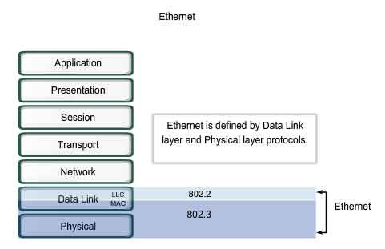

La **subcapa de enlace lógico** se recoge en la norma IEEE 802.2 y es común para todos los demás tipos de redes (Ethernet o IEEE 802.3, IEEE 802.11 o Wi-Fi, IEEE 802.16 o WiMAX, etc.); todas ellas especifican un subcapa de acceso al medio así como una capa física distinta.

La **subcapa de control de acceso al medio** es la encargada de **arbitrar el uso del medio** de comunicación cuando este está compartido entre más de dos equipos como suele ser habitual en muchas LAN.

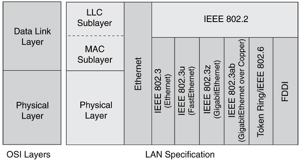

En la práctica la subcapa de acceso al medio suele formar parte de la propia tarjeta de comunicaciones, mientras que la subcapa de enlace lógico estaría en el programa adaptador de la tarjeta (*driver* en inglés).

Además de la **formación de tramas**, el nivel de enlace se ocupará del **tratamiento de los errores** que se produzcan en la recepción de las tramas, de eliminar tramas erróneas, solicitar retransmisiones, descartar tramas duplicadas, **adecuar el flujo de datos** entre emisores rápidos y receptores lentos, etc

Algunos protocolos y estándares que regulan aspectos de la capa de enlace

- Parte de la especificación de los protocolos **Ethernet y del estándar IEEE 802.3**.
- Parte de la especificación de la familia de estándares IEEE 802.11, para redes sin hilos.
- Point to point protocol (PPP).
- Parte de la especificación de tecnologías de enlace para WAN como HDLC, X.25, ATM, Frame Relay o xDSL.

============ ======================================== ============
Protocolo    Denominación                             Usado en
============ ======================================== ============
HDLC         High--level Data Link Control            ISO
SDLC         Synchronous Data Link Control            IBM SNA
LAPB         Link Access Procedure – Balanced         X.25
LAPD         Link Access Procedure – D-channel        RDSI
LAPF         Link Access Procedure for Frame-mode     Frame Relay
LLC          Logical Link Control                     IEEE 802
SLIP         Serial Line Internet Protocol	
PPP          Point-to-Point Protocol	
ATM          Asynchronous Transfer Mode	
============ ======================================== ============

La capa de enlace se encarga de los siguientes aspectos:

- Delimitación de trama
- Segmentación y bloque
- Uso del medio compartido
- Control de flujo
- Control de errores

Delimitación de trama
----------------------

Trama de 802.3 Ethernet
++++++++++++++++++++++++

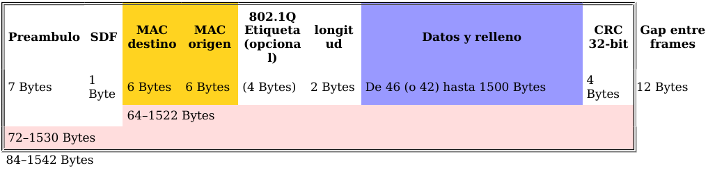

.. note::
  
   Al final de la trama hay un intervalo llamado IFG de 12 bytes que no se utiliza, se explica más adelante.

**Campos de la trama:**

- **Preámbulo**: Sincronización bit "10101010" (x7).
- **SDF**: Delimitador de comienzo de trama "10101011".
- **Direcciones MAC origen y destino**:

  - Notación (por ejemplo): F2:3E:C1:8A:B1:01
  - OUI: Identificador organización.(3 bytes primeros)
  - NIC: Id. Tarjeta interfaz de Red. (3 bytes últimos)
  - Dirección de difusión (broadcast) FF:FF:FF:FF:FF:FF. Este tipo de dirección se utiliza para que todos los equipos conectados en el mismo dominio de difusión recojan la trama.

- **Etiqueta**: es un campo opcional que indica la pertenencia a una VLAN o prioridad en IEEE P802.1p.
- **Longitud** (Valores < 1536).
- **Datos + Relleno**:

  - Trama mínima de 64 bytes (512 bits -> 51,2 μs).
  - Como Tx ≥ 2Tp: Datos+Relleno ≥ 46 bytes.

- **FCS** (Frame Check Sequence) -> CRC (CRC, Cyclic Redundancy Check):
  
  Secuencia de chequeo de trama. Es un CRC de un polinomio generador de orden 33:

  x32+x26+x23+x22+x16+x12+x11+x10+x8+x7+x5+x4+x2+x+1

**Espacio mínimo entre tramas:**

- **IFG**: "Inter-frame Gap" -> 12 bytes (96 bits) es un intervalo de espera que se realiza siempre antes de empezar a transmitir aún si el medio está libre.

CRC
++++

La **comprobación de redundancia cíclica** (CRC) es un código de detección de errores usado frecuentemente en redes digitales y en dispositivos de almacenamiento para detectar cambios accidentales en los datos. Los bloques de datos ingresados en estos sistemas contiene un valor de verificación adjunto, basado en el residuo de una división de polinomios; el cálculo es repetido en el destino, y la acción de corrección puede tomarse en caso de que el valor de verificación no concuerde; por lo tanto se puede afirmar que este código es un tipo de función que recibe un flujo de datos de cualquier longitud como entrada y devuelve un valor de longitud fija como salida. El término suele ser usado para designar tanto a la función como a su resultado. Pueden ser usadas como suma de verificación para detectar la alteración de datos durante su transmisión o almacenamiento. Las CRC son populares porque su implementación en hardware binario es simple, son fáciles de analizar matemáticamente y son particularmente efectivas para detectar errores ocasionados por ruido en los canales de transmisión.

Ejemplo: 

- Información a transmitir: 10110101101
- Polinomio generador: 10011

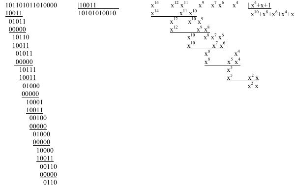

- Trama transmitida: ``10110101101 0110``
- Resto (CRC-4): ``0110``

Segmentación y bloque
---------------------

La segmentación surge por la longitud de las tramas ya que si es muy extensa, se debe de realizar tramas más pequeñas con la información de esa trama excesivamente larga.

Si estas tramas son excesivamente cortas, se ha de implementar unas técnicas de bloque que mejoran la eficiencia y que consiste en concatenar varios mensajes cortos de nivel superior en una única trama de la capa de enlace más larga.

Uso del medio compartido
-------------------------

- División estática del canal

  - Técnicas de multiplexación (TDM, FDM o WDM, SDM, CDM)

- División dinámica del canal

  - Técnicas de contención (CSMA/CD)
  - Protocolos libres de colisión (Paso de testigo, reserva)

División estática: Multiplexación
+++++++++++++++++++++++++++++++++

La multiplexación es la combinación de dos o más canales de información en un solo medio de transmisión usando un dispositivo llamado multiplexor. El proceso inverso se conoce como demultiplexación. Un concepto muy similar es el de control de acceso al medio.

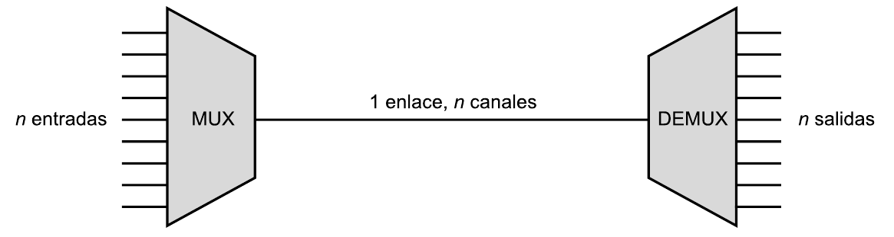

Una aplicación usual de la multiplexación son las comunicaciones de larga distancia. Los enlaces de las redes de larga distancia son líneas de alta capacidad de fibra, de cable coaxial o de microondas, de modo que pueden transportar simultáneamente varias transmisiones de voz y de datos haciendo uso de las técnicas de multiplexación.

Una analogía posible para el problema del acceso múltiple sería una habitación (que representaría el canal) en la que varias personas desean hablar al mismo tiempo. Si varias personas hablan a la vez, se producirán interferencias y se hará difícil la comprensión. Para evitar o reducir el problema, podrían hablar por turnos (estrategia de división por tiempo - TDMA), hablar unos en tonos más agudos y otros más graves de forma que sus voces se distinguieran (división por frecuencia - FDMA), dirigir sus voces en distintas direcciones de la habitación (división espacial - SDMA) o hablar en idiomas distintos (división por código – CDMA), sólo las personas que conocen el código (es decir, el "idioma") pueden entenderlo.

TDMA (Acceso Múltiple por División de Tiempo)
**********************************************

Hace uso de multiplexación por división de tiempo o TDM (Time Division Multiplexing). En ella, el ancho de banda total del medio de transmisión es asignado a cada canal durante una fracción del tiempo total (intervalo de tiempo). Es decir se divide un único canal de frecuencia de radio en varias ranuras de tiempo. A cada persona que hace una llamada se le asigna una ranura de tiempo específica para la transmisión, lo que hace posible que varios usuarios utilicen un mismo canal simultáneamente sin interferir entre sí.

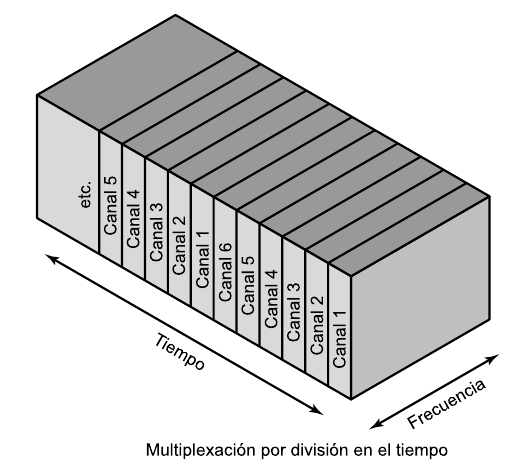

Existen varios estándares digitales basados en TDMA, tal como TDMA D-**AMPS** (Digital-Advanced Mobile Phone System), TDMA D-AMPS-1900, PCS-1900 (Personal Communication Services), **GSM** (Global System for Mobile Communication, en el que se emplea junto con saltos en frecuencia o frequency hopping ), DCS-1800 (Digital Communications System) y PDC (Personal Digital Cellular).

FDMA (Acceso Múltiple por División de Frecuencia)
*************************************************

Hace uso de multiplexación por división de frecuencia o FDM (Frequency Division Multiplexing) y su equivalente para medios ópticos, por división de longitud de onda o WDM (Wavelength Division Multiplexing).

.. figure:: images/tema06-007.png

FDM es un tipo de multiplexación utilizada generalmente en sistemas de transmisión analógicos. La forma de funcionamiento es la siguiente: se convierte cada fuente de varias que originalmente ocupaban el mismo espectro de frecuencias, a una banda distinta de frecuencias, y se transmite en forma simultánea por un solo medio de transmisión. Así se pueden transmitir muchos canales de banda relativamente angosta por un solo sistema de transmisión de banda ancha.

.. figure:: images/tema06-008.png

Hay muchas aplicaciones de FDM, por ejemplo, la **radio FM** comercial y las emisoras de **televisión analógica**, así como los sistemas de telecomunicaciones de alto volumen.

Una variante de FDM es la utilizada en fibra óptica, donde se multiplexan señales, que pueden ser analógicas o digitales, y se transmiten mediante portadoras ópticas de diferente longitud de onda, dando lugar a la denominada multiplexación por división de longitud de onda, o **WDM** del inglés Wavelength Division Multiplexing.

SDMA (Acceso Múltiple por División de Espacio)
**********************************************

Hace uso de multiplexación por división de espacio o SDM (Space Division Multiplexing).

El Acceso múltiple por división de espacio es una tecnología que segmenta el espacio en sectores utilizando antenas unidireccionales. Se utiliza generalmente en **comunicaciones por satélite**, pero también en redes celulares para reducir el número de estaciones base.

CDMA (Acceso Múltiple por División de Código)
*********************************************

Hace uso de multiplexación por división en código o CDM (Code Division Multiplexing).

La división por código se emplea en múltiples sistemas de comunicación por radiofrecuencia, tanto de **telefonía móvil** (como IS-95, CDMA2000, FOMA o UMTS), transmisión de datos (**WiFi**) o navegación por satélite (**GPS**).

División dinámica: diversas técnicas
+++++++++++++++++++++++++++++++++++++

CSMA/CD (Acceso Múltiple con Escucha de Portadora y Detección de Colisiones)
****************************************************************************

**CSMA/CD (del inglés Carrier Sense Multiple Access with Collision Detection)** o, en español, acceso múltiple con escucha de portadora y detección de colisiones, es un protocolo de acceso al medio compartido. Su uso está especialmente extendido en **redes Ethernet** donde es empleado para mejorar sus prestaciones. En CSMA/CD, los dispositivos de red escuchan el medio antes de transmitir, es decir, es necesario determinar si el canal y sus recursos se encuentran disponibles para realizar una transmisión. Además, mejora el rendimiento de CSMA finalizando el envío cuando se ha detectado una **colisión**.

En CSMA/CD, cada estación que desea transmitir debe realizar una escucha del medio – escucha de portadora- para comprobar si éste se encuentra libre, es decir, para comprobar que ninguna otra estación está en ese instante transmitiendo un mensaje. Si el medio se encuentra libre entonces tiene lugar dicha transmisión. Aun así, puede ocurrir que varias estaciones tengan mensajes para enviar y que comiencen a transmitir una trama en el mismo instante. Cuando esto se sucede, se dice que ha ocurrido una colisión en la red. La estación que ha detectado la colisión procederá a enviar un mensaje de jam de 32 bits al resto de estaciones para notificar dicho evento. Una vez que todas las estaciones han sido notificadas, automáticamente se paran todas las transmisiones y se ejecuta un algoritmo de backoff (o de postergación) que consiste en esperar un tiempo aleatorio (backoff) antes de volver a intentar la transmisión.

Token Ring (Paso de testigo)
****************************

Esta técnica se basa en una pequeña **trama o testigo** que circula a lo largo del **anillo**. Un bit indica el estado del anillo (libre u ocupado) y cuando ninguna estación está transmitiendo, el testigo simplemente circula por el anillo pasando de una estación a la siguiente. Cuando una estación desea transmitir, espera a recibir el testigo modificando el bit de estado del anillo de libre a ocupado e inserta a continuación la información a enviar junto con su propia dirección y la de la estación destino. El paquete de datos circula por el anillo hasta llegar a la estación receptora que copia su contenido y lo vuelve a poner en circulación incluyendo una marca de recepción, de tal forma que, cuando vuelve a llegar a la estación emisora, ésta lo retira de la red y genera un nuevo testigo libre.

Este sistema es poco eficiente para cargas bajas, pero para cargas altas el sistema se comporta de manera muy eficiente y equitativo. Una desventaja seria es que se pierda el testigo, en cuyo caso toda la red se bloquearía. Los bits que se modifican en el anillo indican si la trama que acompaña al anillo ha llegado a su destino, si no ha llegado o si ha llegado pero no se ha copiado. Esta información de control es muy importante para el funcionamiento del sistema.

Token Ring fue desarrollada por IBM en los años 1970 con topología física en anillo y técnica de acceso de paso de testigo, usando un frame de 3 bytes llamado token que viaja alrededor del anillo. Token Ring se recoge en el estándar IEEE 802.5. En desuso por la popularización de Ethernet.

Las características más destacadas de esta arquitectura son:

- Utiliza una topología lógica en anillo, aunque por medio de una unidad de acceso de estación múltiple (MSAU o **MAU** - Multistation access unit), la red puede verse como si fuera una estrella. Tiene **topología física estrella y topología lógica en anillo**.
- Cada equipo conectado a la red dispone de una interfaz de unidad adjunta (**AUI** - Attachment Unit Interface) que permite la conexión a la MAU.
- Utiliza cable especial apantallado, aunque el cableado también puede ser par trenzado.
- La longitud total de la red no puede superar los 366 metros.
- La distancia entre una computadora y el MAU no puede ser mayor que 100 metros (por la degradación de la señal después de esta distancia en un cable de par trenzado).
- A cada MAU se pueden conectar ocho computadoras.
- Estas redes alcanzan una velocidad máxima de transmisión que oscila entre los 4 y los 16 Mbps.
- Posteriormente el High Speed Token Ring (HSTR) elevó la velocidad a 110 Mbps pero la mayoría de redes no la soportan.

Control de flujo
----------------

.. figure:: images/tema06-009.png

El control de flujo es necesario para no saturar al receptor de uno a más emisores. Se realiza normalmente en la capa de transporte, y también a veces en la capa de enlace. Utiliza mecanismos de retroalimentación. El control de flujo conlleva dos acciones importantísimas que son la detección de errores y la corrección de errores.

Existen 2 técnicas:

- Control de flujo mediante parada y espera
- Control de flujo mediante ventana deslizante

Control de flujo mediante parada y espera
++++++++++++++++++++++++++++++++++++++++++

.. note::

   La numeración de tramas es 0 y 1. 

Después se reinicia la numeración, lo que no significa que se vuelvan a enviar las tramas, sino que la numeración vuelve a iniciarse. 

El procedimiento más sencillo para controlar el flujo, denominado control de flujo mediante parada y espera, funciona de la siguiente manera. Una entidad origen transmite una trama. Tras la recepción, la entidad destino indica su deseo de aceptar otra trama mediante el envío de una confirmación de la trama que acaba de recibir. **El origen debe esperar a recibir la confirmación antes de proceder a la transmisión de la trama siguiente**. De este modo, el destino puede parar el flujo de los datos sin más que retener las confirmaciones. Este procedimiento funciona adecuadamente y, de hecho, es difícil mejorar sus prestaciones cuando el mensaje se envía usando un número reducido de tramas de gran tamaño.

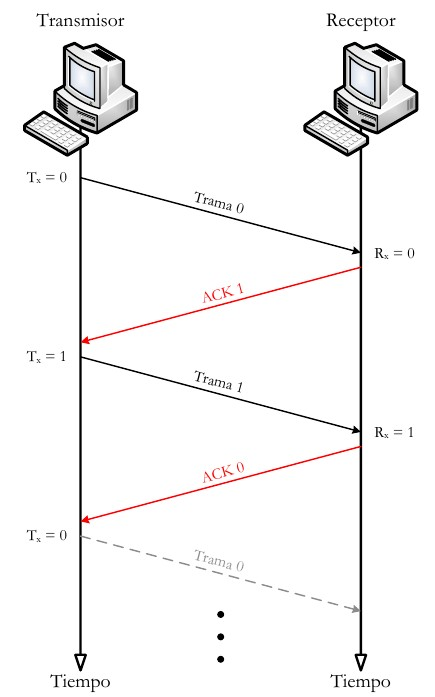

Sin embargo, en la práctica las tramas tienden a ser pequeñas puesto que así:

- el receptor necesita menor memoria temporal.
- se reduce el riesgo de errores.
- se evita la ocupación excesiva del medio por parte de una única estación transmisora.

Control de flujo mediante ventana deslizante
+++++++++++++++++++++++++++++++++++++++++++++

Con el procedimiento anterior solo puede haber en tránsito una trama a la vez. Si se permite que transiten **varias tramas al mismo tiempo sobre el enlace**, la eficiencia mejorará significativamente.

Veamos cómo funcionaría este procedimiento para dos estaciones, A y B, conectadas mediante un enlace full-duplex. La estación B reserva memoria temporal suficiente para almacenar 3 tramas. Por tanto, B puede aceptar 3 tramas, permitiéndosele a A enviar este mismo número de tramas sin tener que esperar ninguna confirmación. Para saber qué tramas se han confirmado, cada una de ellas se etiqueta con un número de secuencia. B confirma una trama mediante el envío de una confirmación que incluye el número de secuencia de la siguiente trama que se espera recibir. Esta confirmación informa también, implícitamente, acerca de que B está preparado para recibir las 3 tramas siguientes, comenzando por la de número especificado.

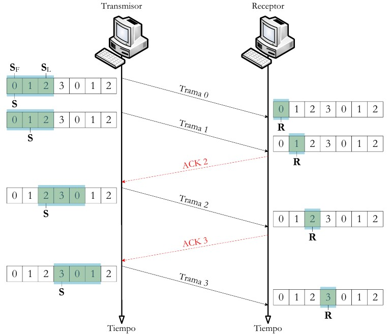

Control de errores
------------------

El control de errores hace referencia a los mecanismos necesarios para la detección y la corrección de errores que aparecen en una transmisión de tramas. Como se ha considerado hasta ahora, los datos se envían en base a una secuencia de tramas, las cuales se reciben en el mismo orden en que fueron enviadas y cada una de ellas, con carácter previo a su recepción, sufre un retardo arbitrario y posiblemente variable. Se contemplan dos tipos de errores potenciales:

- **Tramas perdidas**: se produce cuando una trama enviada no llega al otro extremo. Así, por ejemplo, una ráfaga de ruido puede dañar una trama de manera que el receptor no se percate siquiera de su transmisión.
- **Tramas dañadas**: ocurre cuando una trama se recibe con algunos bits erróneos (modificados durante la transmisión).

Las técnicas más usuales para el control de errores se basan en algunas o todas las siguientes aproximaciones:

- **Detección de errores**: haciendo uso de códigos de comprobación de redundancia cíclica (CRC, Cyclic Redundancy Check).
- **Confirmaciones positivas**: el destino devuelve una confirmación positiva por cada trama recibida con éxito, libre de errores.
- **Retransmisión tras la expiración de un temporizador**: la fuente retransmite las tramas que no se han confirmado tras un periodo de tiempo predeterminado.
- **Confirmación negativa y retransmisión**: el destino devuelve una confirmación negativa para aquellas tramas en las que se detecta la ocurrencia de errores. El origen retransmitirá de nuevo dichas tramas.

Estos mecanismos se denominan genéricamente solicitud de repetición automática (**ARQ, Automatic Repeat reQuest**); el objetivo de un esquema ARQ es convertir un enlace de datos no fiable en fiable. Hay tres variantes ARQ estandarizadas:

- ARQ con parada y espera.
- ARQ con vuelta atrás N.
- ARQ con rechazo selectivo.

ARQ con parada y espera
+++++++++++++++++++++++

Si existe un error en el envío de la trama (por que llegue dañada -CRC no coincidente- o se pierda -expire el temporizador-), se vuelve a transmitir.

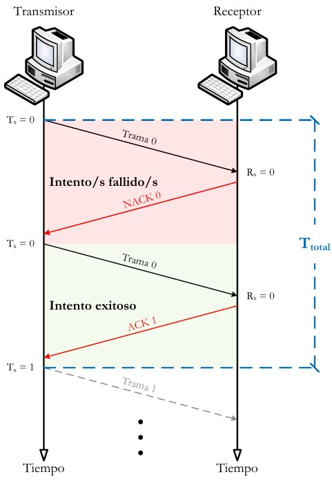

ARQ con vuelta atrás N
+++++++++++++++++++++++

El emisor va enviando las tramas que tiene en su ventana deslizante. Si existe un error en el envío de la trama (por que llegue dañada -CRC no coincidente- o se pierda -expire el temporizador-) se vuelve a transmitir esa trama y todas las siguientes aunque ya hayan sido enviadas previamente.

.. figure:: images/tema06-013.png

ARQ con rechazo selectivo
+++++++++++++++++++++++++

El emisor va enviando las tramas que tiene en su ventana deslizante. Si existe un error en el envío de una trama (por que llegue dañada o su temporizador expire), se vuelve a transmitir sólo esa trama.

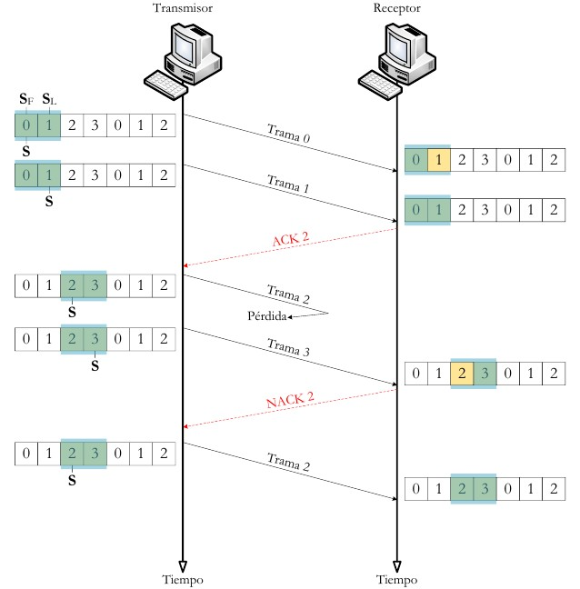

Estándares
==========

Ethernet (IEEE 802.3)
---------------------

IEEE 802.3 fue el primer intento para estandarizar ethernet. Aunque hubo un campo de la cabecera que se definió de forma diferente, posteriormente ha habido ampliaciones sucesivas al estándar que cubrieron las ampliaciones de velocidad (Fast Ethernet, Gigabit Ethernet y los de 10, 40 y 100 Gigabits Ethernet), redes virtuales, hubs, conmutadores y distintos tipos de medios, tanto de fibra óptica como de cables de cobre (tanto par trenzado como coaxial).

Los estándares de este grupo no reflejan necesariamente lo que se usa en la práctica, aunque a diferencia de otros grupos este suele estar cerca de la realidad.

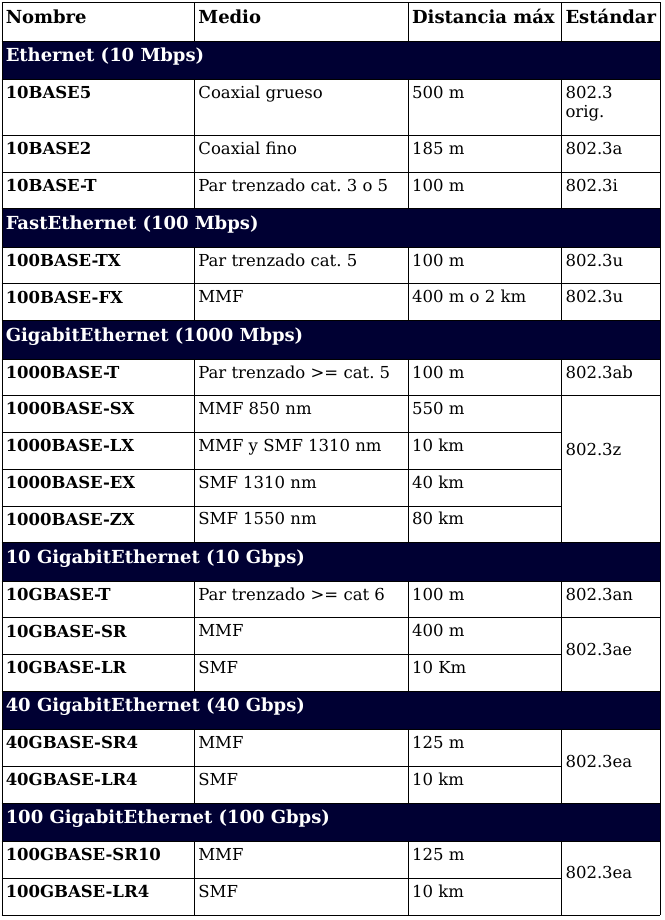

.. admonition:: Siglas

   - **MMF**: Fibra multimodo (Multi Mode Fiber)
   - **SMF**: Fibra monomodo (Single Mode Fiber)
   - **SR**: Corto alcance (Short Range)
   - **LR**: Largo alcance (Long Range)

PoE (Power over Ethernet)
-------------------------

La **alimentación a través de Ethernet (Power over Ethernet, PoE)** es una tecnología que incorpora alimentación eléctrica a una infraestructura LAN estándar. Permite que la alimentación eléctrica se suministre a un dispositivo de red (switch, punto de acceso, router, teléfono o cámara IP, etc) usando el mismo cable que se utiliza para la conexión de red. Elimina la necesidad de utilizar tomas de corriente en las ubicaciones del dispositivo alimentado y permite una aplicación más sencilla de los sistemas de alimentación ininterrumpida (SAI) para garantizar un funcionamiento las 24 horas del día, 7 días a la semana.

Power over Ethernet se regula en la norma **IEEE 802.3af**, y está diseñado de manera que no haga disminuir el rendimiento de comunicación de los datos en la red o reducir el alcance de la red. La corriente suministrada a través de la infraestructura LAN se activa de forma automática cuando se identifica un terminal compatible y se bloquea ante dispositivos preexistentes que no sean compatibles. Esta característica permite a los usuarios mezclar en la red con total libertad y seguridad dispositivos preexistentes con dispositivos compatibles con PoE.

Actualmente existen en el mercado varios dispositivos de red como switches o hubs que soportan esta tecnología. Para implementar PoE en una red que no se dispone de dispositivos que la soporten directamente se usa una unidad base (con conectores RJ45 de entrada y de salida) con un adaptador de alimentación para recoger la electricidad y una unidad terminal (también con conectores RJ45) con un cable de alimentación para que el dispositivo final obtenga la energía necesaria para su funcionamiento.

**Ventajas**

- PoE es una fuente de alimentación inteligente: Los dispositivos se pueden apagar o reiniciar desde un lugar remoto usando los protocolos existentes, como el Protocolo simple de administración de redes (SNMP, Simple Network Management Protocol).
- PoE simplifica y abarata la creación de un suministro eléctrico altamente robusto para los sistemas: La centralización de la alimentación a través de concentradores (hubs) PoE significa que los sistemas basados en PoE se pueden enchufar al Sistema de alimentación ininterrumpida (SAI) central, que ya se emplea en la mayor parte de las redes informáticas formadas por más de uno o dos PC, y en caso de corte de electricidad, podrá seguir funcionando sin problemas.
- Los dispositivos se instalan fácilmente allí donde pueda colocarse un cable LAN, y no existen las limitaciones debidas a la proximidad de una base de alimentación (dependiendo la longitud del cable se deberá utilizar una fuente de alimentación de mayor voltaje debido a la caída del mismo, a mayor longitud mayor perdida de voltaje, superando los 25 metros de cableado aproximadamente).
- Un único juego de cables para conectar el dispositivo Ethernet y suministrarle alimentación, lo que simplifica la instalación y ahorra espacio.
- La instalación no supone gasto de tiempo ni de dinero ya que no es necesario realizar un nuevo cableado.
- PoE dificulta enormemente cortar o destrozar el cableado: Generalmente el cableado se encuentra unido a bandejas en los huecos del techo o detrás de conductos de plástico de muy difícil acceso. Cualquier corte de estos cables resultará obvio al momento para quien pase por el lugar y, por supuesto, para los usuarios de los ordenadores que serán incapaces de proseguir con su trabajo.

**Desventajas**

- Ausencia de estándares tecnológicos para la interoperabilidad de equipos.
- Para poder usar **PoE**, todos los dispositivos de Red (Hub/Switch, Cámaras IP, Puntos de Acceso,…) deben ser compatibles con esta norma.

El estándar original IEEE 802.3af-2003 de PoE proporciona hasta **15,4 W** de potencia de CC (mínimo 44 V DC y 350 mA) para cada dispositivo. Sólo se aseguran 12,95 W en el dispositivo puesto que cierta energía se disipa en el cable.

El estandar actualizado IEEE 802.3af-2009 de PoE también conocido como **PoE+** o PoE plus, proporciona hasta **25,5 W** de potencia. Algunos vendedores han anunciado productos que dicen ser compatibles con el estándar 802.3af y ofrecen hasta 51 W de potencia en un solo cable utilizando los cuatro pares del cable de categoría 5.

**Comparativa PoE y PoE+**

=================================== ============================ ==============================
Propiedad                           802.3af (802.3at Tipo1)      802.3at Tipo 2
=================================== ============================ ==============================
Potencia en el origen               15.40 W                      34.20 W
Potencia para dispositivo final     12.95 W                      25.50 W
Voltaje en el origen                44.0–57.0 V                  50.0–57.0 V
Voltaje para el dispositivo final   37.0–57.0 V                  42.5–57.0 V
Intensidad máxima                   350 mA                       600 mA
Resistencia máxima del cable        20 Ω (Categoría 3)           12.5 Ω (Categoría 5)
=================================== ============================ ==============================

Punto a punto
--------------

**Ubicación de PPP dentro de la arquitectura TCP/IP**

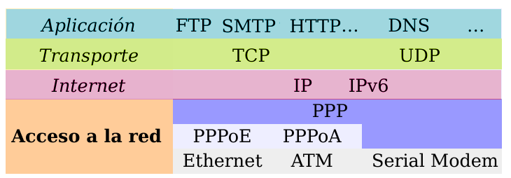

**Point-to-point Protocol** (en español Protocolo punto a punto), también conocido por su acrónimo **PPP**, es un protocolo de nivel de enlace estandarizado en el documento **RFC 1661**. Comúnmente usado para establecer una conexión directa entre dos nodos de red. Puede proveer autentificación de conexión, cifrado de transmisión (usando ECP, RFC 1968), y compresión. PPP es usado en varios tipos de redes físicas incluyendo, cable serial, línea telefónica, line troncal, telefonía celular, especializado en enlace de radio y enlace de fibra óptica como SONET. PPP también es usado en las conexiones de acceso a internet (mercadeado como “broadband”). Los Proveedores de Servicio de Internet (ISPs) han usado PPP para que accedan a internet los usuarios de dial-up, desde que los paquetes de IP no pueden ser transmitidos via modem, sin tener un protocolo de enlace de datos. Dos derivados del PPP son:

- Point to Point Protocolo over Ethernet (PPPoE)
- Point to Point Protocol over ATM (PPPoA)

Son usados comúnmente por Provedores de Servivicio de Internet (ISPs) para establecer una Linea Suscriptora Digital (DSL) de servicios de internet para clientes. Por tanto, se trata de un protocolo asociado a la pila TCP/IP de uso en Internet.

**Estructura de la trama**

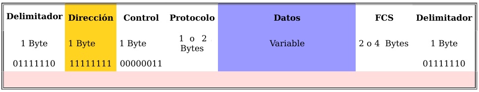

La dirección 11111111 es la dirección de broadcast. Al tratarse de enlaces punto a punto no existe dirección concreta.

La secuencia de control 00000011 indica transmisión de datos sin secuencia. Se provee un servicio de enlace no orientado a conexión

PPPoE
+++++

**PPPoE (Point-to-Point Protocol over Ethernet o Protocolo Punto a Punto sobre Ethernet)** es un protocolo de red para la encapsulación PPP sobre una capa de Ethernet. Es utilizada mayoritariamente para proveer conexión de banda ancha mediante servicios de cablemódem y DSL. Este ofrece las ventajas del protocolo PPP como son la autenticación, cifrado, mantención y compresión. En esencia, es un protocolo, que permite implementar una capa IP sobre una conexión entre dos puertos Ethernet, pero con las características de software del protocolo PPP, por lo que es utilizado para virtualmente "marcar" a otra máquina dentro de la red Ethernet, logrando una conexión "serial" con ella, con la que se pueden transferir paquetes IP, basado en las características del protocolo PPP.

Esto permite utilizar software tradicional basado en PPP para manejar una conexión que no puede usarse en líneas seriales pero con paquetes orientados a redes locales como Ethernet para proveer una conexión clásica con autenticación para cuentas de acceso a Internet. Además, las direcciones IP en el otro lado de la conexión sólo se asignan cuando la conexión PPPoE es abierta, por lo que admite la reutilización de direcciones IP (direccionamiento dinámico).

El objetivo y funcionamiento de PPPoE es análogo al protocolo PPP sobre RTC con el que a finales de los 90 y bajo un stack tcp, se establecía un enlace ip punto a punto a través de la red telefonica conmutada (RTC), permitiendo utilizar por encima una serie de protocolos de nivel de aplicación tipo http, ftp, telnet, etc.

PPPoE fue desarrollado por UUNET, Redback y RouterWare. El protocolo está publicado en la RFC 2516.

PPPoA
++++++

**PPPoA (Point-to-Point Protocol over ATM o Protocolo Punto a Punto sobre ATM)**, es un protocolo de red para la encapsulación PPP en capas ATM AAL5.

El protocolo PPPoA se utiliza principalmente en conexiones de banda ancha, como cable y DSL. Este ofrece las principales funciones PPP como autenticación, cifrado y compresión de datos. Actualmente tiene alguna ventaja sobre PPPoE debido a que reduce la pérdida de calidad en las transmisiones. Al igual que PPPoE, PPPoA puede usarse en los modos VC-MUX y LLC.

Este protocolo se define en la RFC 2364

Dispositivos
============

Dominios
--------

Dominios de colisión
++++++++++++++++++++

En Ethernet el medio de transmisión es compartido, entonces a medida que se aumentan nodos a un segmento será más complicado acceder al medio, dado que solo un nodo puede transmitir información a la vez. Cuando intentan acceder dos o más nodos al medio al mismo tiempo se presentan colisiones y estas a su vez generan retransmisiones.

La solución para este problema es dividir un segmento en varios dominios de colisión. Para lograr este objetivo se usan dispositivos de capa 2 como puentes y switches.

En un principio el dispositivo más popular para esta tarea era el puente. Este solo tiene dos puertos y es capaz de dividir un dominio de colisión en dos, gracias a decisiones que toma basado netamente en las direcciones MAC de los nodos de la red.

Un switch es básicamente un puente rápido multipuerto, que puede contener docenas de puertos. En vez de crear dos dominios de colisión, cada puerto crea su propio dominio de colisión. Este dispositivo crea y mantiene de forma dinámica una tabla de memoria de contenido direccionable, que contiene toda la información MAC necesaria para cada puerto.

Un dominio de colisión es una parte de la red o segmento en el cual puede haber colisiones, cada vez que ocurre una colisión todas las transmisiones en la red son detenidas por un tiempo aleatorio.

.. figure:: images/tema06-115.png

Los dispositivos que pueden segmentar la red en dominios de colisión son los de capa 2 y de capa 3, como los puentes, switches y routers.

Cuando se usan dispositivos de capa 1, lo que se esta haciendo es aumentar la cobertura de la red al permitirle extenderse. El problema es que todos los dispositivos que se anexen a ese segmento compartirán el mismo dominio de colisión, se aumentara el tráfico en la red, las colisiones y el rendimiento de la red será muy deficiente.

Segmentos
+++++++++

La capacidad para reconocer dominios de colisión es muy importante. Los dispositivos de capa 1 usados en una red generan un solo dominio de colisión. Los dispositivos de capa 2 (puentes y switches) son capaces de hacer un seguimiento de la dirección MAC de cada nodo y reconocer en que segmento de la red se encuentra, es decir que son capaces de controlar el flujo de tráfico al nivel de capa 2.

Al usar puentes y switches el dominio de colisión se divide en partes más pequeñas y a su vez cada parte se convierte en un domino de colisión independiente. Al encontrar menos host en un dominio de colisión es más probable que el medio este disponible para poder transmitir.

En el mundo de las redes de datos el término segmento se emplea en numerosas ocasiones. En el ámbito de las topologías físicas de una red se entiende segmento como la **sección de una red limitada por puentes, routers o switches**.

.. figure:: images/tema06-116.png

Difusión (Broadcast) de capa 2
++++++++++++++++++++++++++++++

En ocasiones los hosts de la red se ven en situaciones en las cuales necesitan la dirección MAC de otro nodo para acceder a alguna información requerida, pero en la tabla ARP del host no se encuentra dicha dirección. Entonces se envía una petición ARP que es en forma de broadcast.

El broadcast se usa para lograr llegar a todos los dominios de colisión. El broadcast de capa 2 se envía con una dirección MAC de la siguiente forma: 0xFFFFFFFFFFFF y todas las tarjetas de red deben responder a este llamado.

Dominios de difusión (Broadcast)
++++++++++++++++++++++++++++++++

Un dominio de broadcast es un conjunto de dominios de colisión que se encuentran integrados por uno o más dispositivos de capa 2.

Cuando aumentan los dominios de colisión cada host puede acceder al medio de mejor manera, pero estos se pueden ver sobrepasados por la difusión de broadcast, estos deben ser controlados mediante la adición a la red de dispositivos de capa 3, dado que no envían broadcasts.

El envío de información en la capa 3 se basa en la dirección IP destino.

.. figure:: images/tema06-117.png

Adaptadores de red
------------------

Una **tarjeta de red** o **adaptador de red** es un periférico que permite la comunicación con aparatos conectados entre sí y también permite compartir recursos entre dos o más computadoras. A las tarjetas de red también se les llama **NIC** (por network interface card; en español "tarjeta de interfaz de red"). Hay diversos tipos de adaptadores en función del tipo de cableado o arquitectura que se utilice en la red (coaxial fino, coaxial grueso, Token Ring, etc.), pero actualmente el más común es del tipo Ethernet utilizando una interfaz o conector RJ-45.

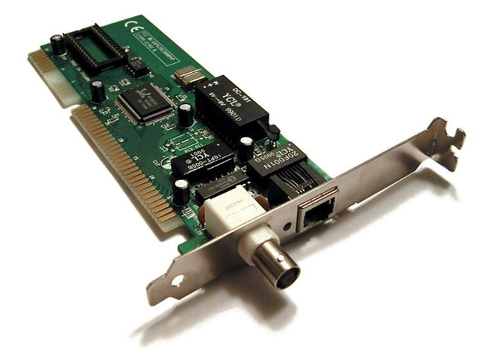

Puentes
-------

Un **puente de red** o **bridge** es un dispositivo de interconexión de redes de ordenadores que opera en la capa 2 (nivel de enlace de datos) del modelo OSI. Este interconecta segmentos de red (o divide una red en segmentos) haciendo la transferencia de datos de una red hacia otra con base en la dirección física de destino de cada paquete. En definitiva, un bridge conecta segmentos de red formando una sola subred (permite conexión entre equipos sin necesidad de routers). Funciona a través de una tabla de direcciones MAC detectadas en cada segmento al que está conectado. Cuando detecta que un nodo de uno de los segmentos está intentando transmitir datos a un nodo del otro, el bridge copia la trama para la otra subred, teniendo la capacidad de desechar la trama (filtrado) en caso de no tener dicha subred como destino. Para conocer por dónde enviar cada trama que le llega (encaminamiento) incluye un mecanismo de aprendizaje automático (autoaprendizaje) por lo que no necesitan configuración manual.

.. figure:: images/tema06-119.png

Switches
--------

Un **conmutador** o **switch** es un dispositivo digital lógico de interconexión de redes de computadoras que opera en la capa de enlace de datos del modelo OSI. Su función es interconectar dos o más segmentos de red, de manera similar a los puentes de red, pasando datos de un segmento a otro de acuerdo con la dirección MAC de destino de las tramas en la red.

Un conmutador en el centro de una red en estrella.

Los conmutadores se utilizan cuando se desea conectar múltiples redes, fusionándolas en una sola. Al igual que los puentes, dado que funcionan como un filtro en la red, mejoran el rendimiento y la seguridad de las redes de área local.

Tipos:

- compacto
- de configuración modular
- apilable
- multicapa (multilayer)
- gestionable

Switch compacto
++++++++++++++++

Estos switches de configuración fija son los que más comúnmente estamos acostumbrados a ver en las redes locales y cibercafés, en las cuales los switches sólo soportan una tecnología y cuyas características no podemos cambiar, es decir, si compramos un switch de 24 puertos FastEthernet no podremos agregarle mas puertos.

.. figure:: images/tema06-120.png

Para unir 2 switches en cascada existen dos posibilidades:

- **Uplink**
- MDI/**MDIX** (Auto Cross)

Antiguamente se usaban puertos UPLINK para unir dos hubs o dos switches, usándose cables cruzados para ello. Por ejemplo, en un switch de 6 puertos, el puerto 6 solía ser uplink.

La forma de conexión se muestra a continuación:

.. figure:: images/tema06-121.png

Los switches más avanzados soportan MDIX, lo cual permite utilizar un cable directo para conectar 2 switches entre sí utilizando cualquier puerto. El propio switch detecta el tipo de conexión (Auto Cross), que es equivalente a usar un cable crossover (568A ↔ 568B).

Los puertos estándar para las estaciones terminales se conocen como MDI (Media Dependent Interface ), y los puertos estándar para los concentradores y conmutadores se conoce como MDIX (Media Dependent Interface Crossover) .

En los concentradores (hubs) y conmutadores (switches) las interfaces MDI se usan para conectar a otros hubs o switches sin el cable de red cruzado (que sería lo habitual) y se conocen como puertos MDI o puertos uplink. Estas interfaces son especiales y normalmente pueden ser configuradas manualmente o por software para que se comporten como MDI o MDIX. Existen interfaces que cambian su estado de MDI a MDIX automáticamente.

Switch de configuración modular
+++++++++++++++++++++++++++++++

Estos switches están diseñados con ranuras que permiten insertar tarjetas en linea que le proporcionan nuevas funcionalidades, de tal forma que es posible agregar mas puertos Fast Ethernet, Modems o puertos de conexión Gigabit Ethernet, claro está que el switch en cuestión solo soporta un número y modelos determinados de tarjetas.

.. figure:: images/tema06-122.png

.. figure:: images/tema06-123.png

   Módulos de switch

.. figure:: images/tema06-124.png

   Módulos de switch más actuales

**Transceptores SFP**

Un transceptor es un dispositivo que cuenta con **un transmisor y un receptor** que comparten parte de la circuitería o se encuentran dentro de la misma caja.

El módulo de factor de forma pequeño (SFP: **Small Form-factor Pluggable**) es un transceptor (en inglés transceiver) modular óptico de intercambio dinámico para conectar dos equipos de telecomunicaciones, normalmente switches o routers...

.. figure:: images/tema06-125.png

   Transceptores SFP - Esquema

.. figure:: images/tema06-126.png

   Transceptores SFP - Foto

Los módulos **SFP** fueron desarrollados para velocidades de **1 Gbit/s**. No todos son ópticos (los hay de cobre) y los hay de muchos más tipos que 1000BaseSX ó 1000BaseLX (como por ejemplo, hay SFP de 1000BaseT, 1000BaseZX, SONET/SDH).

El transceptor SFP no ha sido estandarizado por ningún organismo de normalización oficial, sino que se especifica mediante un acuerdo multi-fuente entre fabricantes competidores. SFP fue diseñado después de la interfaz GBIC, y permite una mayor densidad de puertos (número de transceptores por cm a lo largo del borde de una placa) que el GBIC, que es la razón por la SFP también se conoce como mini-GBIC.

La versión mejorada de Small Form Factor Pluggable (**SFP+**) admite velocidades de datos de hasta **10 Gbit/s**. La especificación SFP+ se publicó el 9 de mayo de 2006, y la versión 4.1 fue publicada el 6 de julio de 2009. SFP+ soporta 10 Gigabit Ethernet y 8 Gbit/s en redes Fibre Channel (usadas comúnmente en redes Storage Area Networks (SAN)). Es un formato popular de la industria con el apoyo de muchos fabricantes de componentes de red.

**Transceptores CFP**

.. figure:: images/tema06-127.png

   Transceptores CFP - Foto

El módulo de factor de forma C (**CFP: C Form-factor Pluggable**) es un transceptor para la transmisión de señales digitales de alta velocidad. La C indica la letra latina C para expresar el número 100 (centum), ya que el estándar fue desarrollado principalmente para sistemas Ethernet 100 Gigabit.

El transceptor CFP se especifica mediante un acuerdo multi-fuente entre fabricantes competidores. El CFP fue diseñado posteriormente a la interface SFP, pero es significativamente más rápido para soportar **40 y 100 Gbit/s**.

Switch apilable
+++++++++++++++

A esta configuración de switch se les conoce como en stack o stackwise. Se trata de conectar con cables de alta velocidad varios switches, el objetivo es obtener tolerancia a fallos, ofreciendo una configuración redundante.

.. figure:: images/tema06-128.png

   Cisco Catalyst 3750-X frontal y trasero

Un grupo de switches (stack) puede apilarse (uniéndolos con enlaces de alta velocidad) y comportarse como un único switch con la capacidad de puertos de la suma de todos ellos. Por ejemplo 12 swiches de 48 puertos cada uno, equivalen a un switch de 576 puertos.

Los enlaces que unen los switch del stack pueden alcanzar los 20 Gbps.

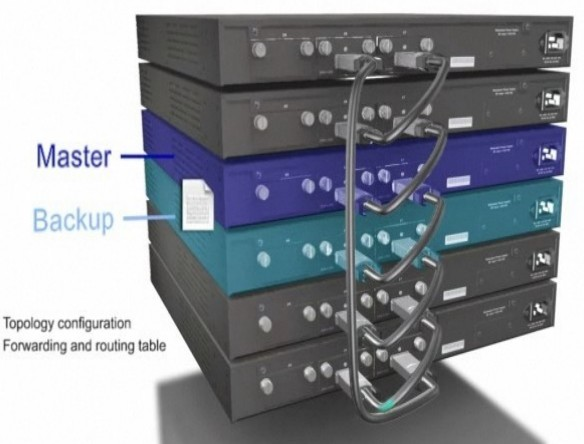

   Switch apilable (Maestro y Backup)

Dentro de la pila (stack) existe un switch maestro y otro de respaldo (backup). El switch Master y el Backup se sincronizan constantemente para tener la misma configuración Si el Master falla, el Backup se convierte en el nuevo Master y otro switch del stack toma el rol de Backup.

Switch multicapa (multilayer)
+++++++++++++++++++++++++++++

Son los conmutadores que, además de las funciones tradicionales de la capa 2, incorporan algunas funciones de enrutamiento o routing, como por ejemplo la determinación del camino basado en informaciones de capa de red (capa 3 del modelo OSI), validación de la integridad del cableado de la capa 3 por checksum y soporte a los protocolos de routing tradicionales (RIP, OSPF, etc)

Los conmutadores de capa 3 (Layer 3) soportan también la definición de redes virtuales (VLAN), y según modelos posibilitan la comunicación entre las diversas VLAN sin la necesidad de utilizar un router externo.

Por permitir la unión de segmentos de diferentes dominios de difusión o broadcast, los switches de capa 3 son particularmente recomendados para la segmentación de redes LAN muy grandes, donde la simple utilización de switches de capa 2 provocaría una pérdida de rendimiento y eficiencia de la LAN, debido a la cantidad excesiva de broadcasts.

Se puede afirmar que la implementación típica de un switch de capa 3 es más escalable que un enrutador, pues éste último utiliza las técnicas de enrutamiento a nivel 3 y enrutamiento a nivel 2 como complementos, mientras que los switches sobreponen la función de enrutamiento encima del encaminamiento, aplicando el primero donde sea necesario.

Asimismo existen en el mercado algunos switches denominados Layer 3+ (Layer 3 Plus). Básicamente, incorporan a las funcionalidades de un conmutador de la capa 3; la habilidad de implementar la políticas y filtros a partir de informaciones de la capa 4 o superiores, como puertos TCP/UDP, SNMP, FTP, etc.

El icono utilizado para un switch multicapa es el siguiente:

.. figure:: images/tema06-130.png

Switch gestionable
++++++++++++++++++

Los switches multicapa (L3 o superiores) soportan la administración a través de red. Se accede a ellos a través de una dirección IP mediante servicios telnet, ssh o incluso web. Permiten la administración de diversos parámetros como pueden ser la creación y gestión de VLANs, el soporte de STP o RSTP, agregación de puertos (trunk), etc.

Distribución
------------

Ciertos fabricantes utilizan un diseño de red jerárquica consistente en dividir la red en capas discretas. Cada capa proporciona funciones específicas que definen su papel dentro de la red global. Mediante la separación de las diversas funciones que existen en una red, el diseño de la red se convierte en modular, lo que facilita la escalabilidad y el rendimiento.

El modelo de diseño jerárquico típico se divide en tres capas:

- núcleo (CORE)
- distribución (DISTRIBUTION)
- acceso (ACCESS)

.. figure:: images/tema06-131.png

Cableado entre dispositivos
---------------------------

.. figure:: images/tema06-132.png

**Cable Recto (Straight Through)**:

Es el cable cuyas puntas están armadas con las misma norma (T568A ↔ T568A ó T568B ↔ T568B). Se utiliza entre dispositivos que funcionan en distintas capas del Modelo de Referencia OSI.

- De PC a Switch/Hub.
- De Switch a Router.

**Cable Cruzado (Crossover)**:

Es el cable cuyas puntas están armadas con distinta norma (T568A ↔ T568B). Se utiliza entre dispositivos que funcionan en la misma capa del Modelo de Referencia OSI.

- De PC a PC.
- De Switch/Hub a Switch/Hub.
- De Router a Router (el cable serial se considera cruzado).

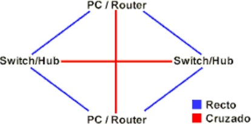

Otras características de los switches
-------------------------------------

Puertos
+++++++

Cada una de las entradas al switch se denomina puerto. Normalmente los puertos son para conectores RJ-45, aunque algunos pueden ser para conectores SC o LC de fibra óptica.

La disposición y función de los puertos varían entre distintos modelos de switch, aunque por los general suelen tener la siguiente:

.. figure:: images/tema06-134.png

1. Console port (No siempre se encuentra disponible)
2. Puertos normales (10/100/1000 Mbps) para conexión de equipos.
3. Otros puertos (para UPLINK, TRUNK o incluso entrada de PoE)

**Ejemplo**

.. figure:: images/tema06-135.png

**El puerto de consola (console port)**

Algunos switches (además de los routers) disponen de un puerto especial, denominado **Console Port**. Este puerto es muy importante pues permite realizar la configuración del dispositivo a través de él de forma directa. **Es necesario un cable rollover**.

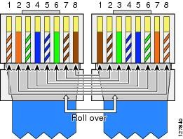

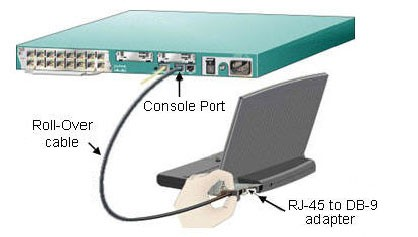

El cable Rollover (también conocido como cable de consola Cisco o cable Yost) es un tipo de cable de módem nulo que se utiliza a menudo para conectar un terminal de ordenador al puerto de consola del switch o router. Este cable es generalmente plano (y tiene un color azul claro) para ayudar a distinguirlo de otros tipos de cableado de red.

Se pone el nombre de rollover debido a las patillas en un extremo se invierten de el otro.

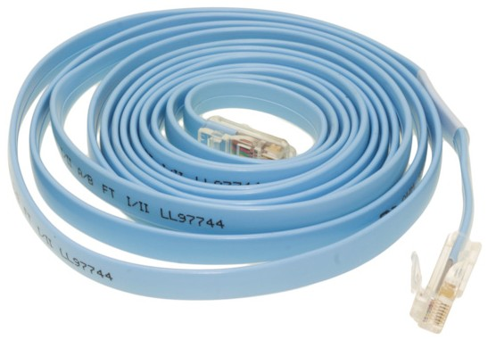

   Cable rollover

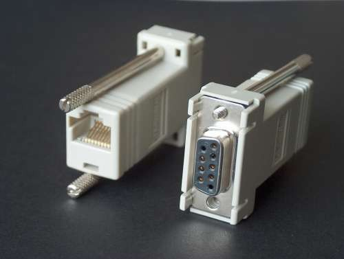

   Adaptador DB-9 a RJ-45

   .. figure:: images/tema06-140.png

   Todo en uno: conector DB-9 más cable rollover

En el caso de que nuestro ordenador no disponga de puerto serie DB-9 y solo disponga de USB necesitaremos además un adaptador USB a DB-9.

   .. figure:: images/tema06-141.png

Para acceder a la configuración del switch o router a través de un puerto de consola haremos uso de los siguientes programas:

- Hyperterminal (en Windows)
- minicom (en Linux)

Modos de conmutación.
+++++++++++++++++++++

Existen básicamente dos formas mediante las cuales es conmutada la información hasta el destino:

- método de corte (`Cut-Through`)
- almacenamiento y envío (`Store-and-Forward`)

El **método de corte** es el de menor latencia pero con mayor cantidad de errores, consiste en comenzar a transmitir la trama tan pronto como se conoce la dirección MAC de destino, para poder usar este modo, tanto el origen como el destino deben operar a la misma velocidad (de forma síncrona), para no dañar la trama. El problema de este tipo de switch es que no detecta tramas corruptas causadas por colisiones (conocidos como `runts`), ni errores de CRC. Cuanto mayor sea el número de colisiones en la red, mayor será el ancho de banda que consume al encaminar tramas corruptas.

Una mejora de este modo es el método conocido como libre de fragmentos, cuando se reciben los primeros 64 bytes que incluyen el encabezado de la trama es cuando inicia la conmutación, este modo verifica la confiabilidad de direccionamiento y la información del protocolo de control de enlace lógico (Logical Link Control, LLC) para asegurar que el destino y manejo de los datos sean correctos.

El último de los métodos es el de **almacenamiento y envío**, el switch recibe toda la trama antes de iniciar a enviarla, esto le da al switch la posibilidad de verificar la secuencia de verificación de trama (FCS), para asegurarse de que la trama ha sido recibida de forma confiable y enviarla al destino. Este método asegura operaciones sin error y aumenta la confianza de la red. Pero el tiempo utilizado para guardar y chequear cada trama añade un tiempo de demora importante al procesamiento de las mismas. La demora o delay total es proporcional al tamaño de las tramas: cuanto mayor es la trama, más tiempo toma este proceso.

Los conmutadores `cut-through` son más utilizados en pequeños grupos de trabajo y pequeños departamentos. En esas aplicaciones es necesario un buen volumen de trabajo o throughput, ya que los errores potenciales de red quedan en el nivel del segmento, sin impactar la red corporativa.

Los conmutadores `store-and-forward` son utilizados en redes corporativas, donde es necesario un control de errores.

Port security
+++++++++++++

Es una característica de los switches Cisco que nos permite retener las direcciones MAC conectadas a un puerto y permitir solamente esas direcciones MAC registradas comunicarse a través de ese puerto del switch.

Nos permite:

- Restringir el acceso a los puertos del switch según la MAC.
- Restringir el número de MACs por puerto en el switch.
- Reaccionar de diferentes maneras a violaciones de las restricciones anteriores.
- Establecer la duración de las **asociaciones MAC-Puerto**.

Si un dispositivo **con otra dirección MAC** intenta comunicarse a través de un puerto de la LAN, **port-security deshabilitará el puerto**.

Port mirroring (Puerto espejo)
+++++++++++++++++++++++++++++++

Es una función que tienen los switches para copiar todo el tráfico de un puerto específico a otro puerto. Esta función generalmente se utiliza para atrapar todo el tráfico de una red y poder analizarlo (con herramientas como **wireshark** por ejemplo).

El puerto espejo en un sistema de switch **Cisco** generalmente se refiere a un Analizador de Puertos del switch (**Switched Port Analyzer: SPAN**) algunas otras marcas usan otros nombres para esto, tal como Roving Analysis Port (RAP) en los switches 3Com.

MACsec
+++++++

Media Access Control de Seguridad (MACsec) es una tecnología de seguridad estándar de la industria que proporciona una comunicación segura para todo el tráfico en enlaces Ethernet. MACsec proporciona seguridad de punto a punto de enlaces Ethernet entre nodos conectados directamente-y es capaz de identificar y prevenir la mayoría de las amenazas a la seguridad, incluida la denegación de servicio, intrusión, man-in-the-middle, enmascaramiento, las escuchas telefónicas pasivo, y los ataques de reproducción. MACsec está estandarizado en IEEE 802.1AE.

Una vez que un enlace punto a punto Ethernet ha habilitado MACsec, todo el tráfico que atraviesa el enlace es asegurado mediante el uso de controles de **integridad de datos y cifrado si se desea**.

Las comprobaciones de integridad de datos verifican la integridad de los datos en ambos lados del enlace asegurado Ethernet. MACsec añade una cabecera de 8 bytes y una cola de 16 bytes a todas las tramas Ethernet que atraviesan el enlace, y la cabecera y la cola son revisados por la interfaz de recepción para asegurar que los datos no se vieron comprometidos al atravesar el enlace. Si la comprobación de integridad de datos detecta algo irregular sobre el tráfico , el tráfico se desecha.

MACsec también se puede utilizar para cifrar todo el tráfico en el enlace Ethernet. El cifrado utilizado por MACsec asegura que los datos de la trama Ethernet no pueden ser vistos por cualquier persona al monitorear el tráfico en el enlace. El cifrado MACsec es opcional y configurable por el usuario.

STP
++++

STP (Spanning Tree Protocol) o protocolo de árbol de extensión es un protocolo basado en estándares que se usa **para evitar bucles** de switcheo. Cuando se comprobó la eficiencia de los switches para realizar la conmutación en grandes redes, se inicio su incorporación de manera copiosa hasta el punto de crear redes con switches anidados, formando una estructura de árbol jerárquico plagado de rutas redundantes que son recomendadas para ofrecer más confiabilidad y tolerancia a las fallos, pero que pueden generar efectos indeseables como los bucles y pueden llegar a convertirse en tormentas de broadcast que rápidamente abrumen la red.

Los bucles ocurren cuando hay rutas alternativas hacia un mismo destino (sea una máquina o segmento de red). Estas rutas alternativas son necesarias para proporcionar redundancia y así ofrecer una mayor fiabilidad a la red, dado que en caso de que un enlace falle, los otros puede seguir soportando el tráfico de ésta. Los problemas aparecen cuando utilizamos dispositivos de interconexión de nivel de enlace, como un puente de red o un conmutador de paquetes.

.. figure:: images/tema06-142.png

Cuando existen bucles en la topología de red, los dispositivos de interconexión de nivel de enlace de datos reenvían indefinidamente las tramas broadcast y multicast, creando así un bucle infinito que consume tanto el ancho de banda de la red como CPU de los dispositivos de enrutamiento. Esto provoca que se degrade el rendimiento de la red en muy poco tiempo, pudiendo incluso llegar a quedar inutilizable. Al no existir un campo TTL (tiempo de vida) en las tramas de capa 2, éstas se quedan atrapadas indefinidamente hasta que un administrador de sistemas rompa el bucle. Un router, por el contrario, sí podría evitar este tipo de reenvíos indefinidos. La solución consiste en permitir la existencia de enlaces físicos redundantes, pero creando una topología lógica libre de bucles. STP calcula una única ruta libre de bucles entre los dispositivos de la red pero manteniendo los enlaces redundantes desactivados como reserva, con el fin de activarlos en caso de fallo.

Si la configuración de STP cambia, o si un segmento en la red redundante llega a ser inalcanzable, el algoritmo reconfigura los enlaces y restablece la conectividad, activando uno de los enlaces de reserva. Si el protocolo falla, es posible que ambas conexiones estén activas simultáneamente, lo que podrían dar lugar a un bucle de tráfico infinito en la LAN.

El árbol de expansión (Spanning tree) permanece vigente hasta que ocurre un cambio en la topología, situación que el protocolo es capaz de detectar de forma automática. El máximo tiempo de duración del árbol de expansión es de cinco minutos. Cuando ocurre uno de estos cambios, el puente raíz actual redefine la topología del árbol de expansión o se elige un nuevo puente raíz.

**El algoritmo transforma una red física con forma de malla, en la que existen bucles, por una red lógica en forma de árbol (libre de bucles)**. Los puentes se comunican mediante mensajes de configuración llamados Bridge Protocol Data Units (BPDU).

.. figure:: images/tema06-143.png

STP actúa contra los bucles, haciendo que cada switch que opera con este protocolo envíe un mensaje denominado BPDU desde cada uno de sus puertos para que los demás sepan de su existencia. Luego con la ayuda del STA (Spanning Tree Algorithm), se detectan cuales son las rutas redundantes y son bloqueadas.

El resultado es la eliminación de los bucles mediante la creación de un árbol jerárquico, pero en caso de ser necesitadas la rutas alternativas pueden ser activadas.

Existen múltiples variantes del STP debido, principalmente, al tiempo que tarda en converger el algoritmo utilizado. Una de estas variantes es el **Rapid Spanning Tree Protocol (RSTP)**, que hoy en día ha reemplazado el uso del STP original.

Como extensión de RSTP, además tenemos **Multiple Spanning Tree Protocol (MSTP)**, que tiene características más novedosas.

CDP
++++

**CDP** (**Cisco Discovery Protocol**, ‘protocolo de descubrimiento de Cisco’, es un **protocolo de red propietario** de nivel 2, desarrollado por Cisco Systems y usado en la mayoría de sus equipos. Es utilizado para compartir información sobre otros equipos Cisco directamente conectados, tal como la versión del sistema operativo y la dirección IP. CDP también puede ser usado para realizar encaminamiento bajo demanda (ODR, On-Demand Routing), que es un método para incluir información de encaminamiento en anuncios CDP, de forma que los protocolos de encaminamiento dinámico no necesiten ser usados en redes simples.

Los dispositivos Cisco envían anuncios a la dirección de destino de multidifusión. Los anuncios CDP (si está soportados y configurados en el IOS) se envían por defecto cada 60 segundos en las interfaces que soportan cabeceras SNAP, incluyendo Ethernet, Frame Relay y ATM. Cada dispositivo Cisco que soporta CDP almacena la información recibida de otros dispositivos en una tabla que puede consultarse usando el comando show cdp neighbor. La información de la tabla CDP se refresca cada vez que se recibe un anuncio y la información de un dispositivo se descarta tras tres anuncios no recibidos por su parte (tras 180 segundos usando el intervalo de anuncio por defecto).

La información contenida en los anuncios CDP varía con el tipo de dispositivo y la versión del sistema operativo que corra. Dicha información incluye la versión del sistema operativo, el nombre de equipo, todas la direcciones de todos los protocolos configurados en el puerto al que se envía la trama CDP (por ejemplo, la dirección IP), el identificador del puerto desde el que se envía el anuncio, el tipo y modelo de dispositivo, la configuración duplex/simplex, el dominio VTP, la VLAN nativa, el consumo energético (para dispositivos PoE) y demás información específica del dispositivo. El protocolo está habilitado por defecto en todos las interfaces de los equipos CISCO. Para deshabilitarlo de forma global se utiliza el comando no cdp run en modo enable y para deshabilitarlo en una interfaz concreta se utiliza el comando no cdp enable en la configuración de dicha interfaz.

Port trunking (link aggregation)
++++++++++++++++++++++++++++++++

Permite combinar varios enlaces físicos en un enlace lógico (trunk), que funciona como un único puerto de mayor ancho de banda

Características:

- Aumenta el ancho de banda entre 2 switches
- Implica redundancia, lo que mejora la fiabilidad
- Es una solución escalable
- Puede usarse para aumentar el ancho de banda entre un switch y un equipo de la red

**Cisco denomina esta técnica como EtherChannel**.

EtherChannel nos permite sumar la velocidad de cada puerto físico y así obtener un único enlace troncal de alta velocidad.

Cuando tenemos muchos servidores que salen por un único enlace troncal, puede que el tráfico colapse el enlace. Una de las soluciones más prácticas es el uso de EtherChannel.

De esta manera sumamos la velocidad de los puertos que agregamos al enlace lógico.

.. figure:: images/tema06-144.png

**Modos de configuración:**

.. figure:: images/tema06-145.png

Podemos configurar un **EtherChannel** de 3 formas diferentes:

- **Mode ON**: no se realiza ningún tipo de negociación, todos los puertos se ponen activos. No utiliza ningún protocolo.

.. figure:: images/tema06-146.png

- **PAgP (Port Aggregation Protocol)**: es un protocolo propietario de **Cisco**. El switch negocia con el otro extremo qué puertos deben ponerse activos.

.. figure:: images/tema06-147.png

- **LACP (Link Aggregation Control Protocol)**: protocolo abierto con estándar IEEE 802.3ad y 802.3ax.

.. figure:: images/tema06-148.png

**Recomendaciones**

Antes de configurar nuestro **EtherChannel** tener en cuenta las siguientes recomendaciones:

- No se debe configurar un puerto en dos grupos diferentes.
- No se debe configurar un puerto en dos modos diferentes, **LACP** y **PAgP**.
- No configurar **Switched Port Analyzer** (SPAN) como parte de un EtherChannel.
- No configurar securización de puertos.
- Asignar todos los puertos del EtherChannel a la **misma VLAN** o configurar todos como troncales.
- Verificar que todos los puertos del grupo están en un **mismo modo de encapsulación**, ISL o 802.1Q

VLAN
++++

Algunos switches L3 (de capa 3) soportan la creación de LAN virtuales o VLAN.

Una **VLAN** (acrónimo de virtual LAN, "**red de área local virtual**") es un método para crear redes lógicas independientes dentro de una misma red física. Varias VLANs pueden coexistir en un único conmutador físico o en una única red física. Son útiles para reducir el tamaño del dominio de difusión y ayudan en la administración de la red, separando segmentos lógicos de una red de área local (como departamentos de una empresa) que no deberían intercambiar datos usando la red local (aunque podrían hacerlo a través de un enrutador o un conmutador de capa 3 y 4).
