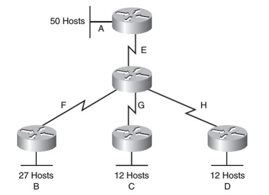
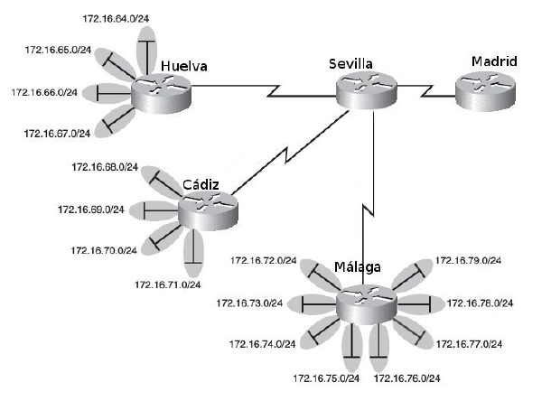
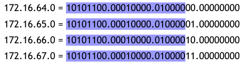
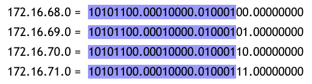
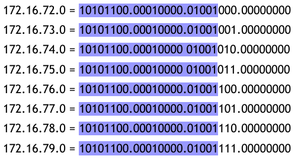
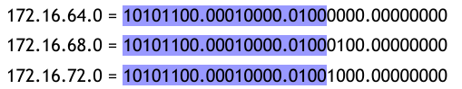
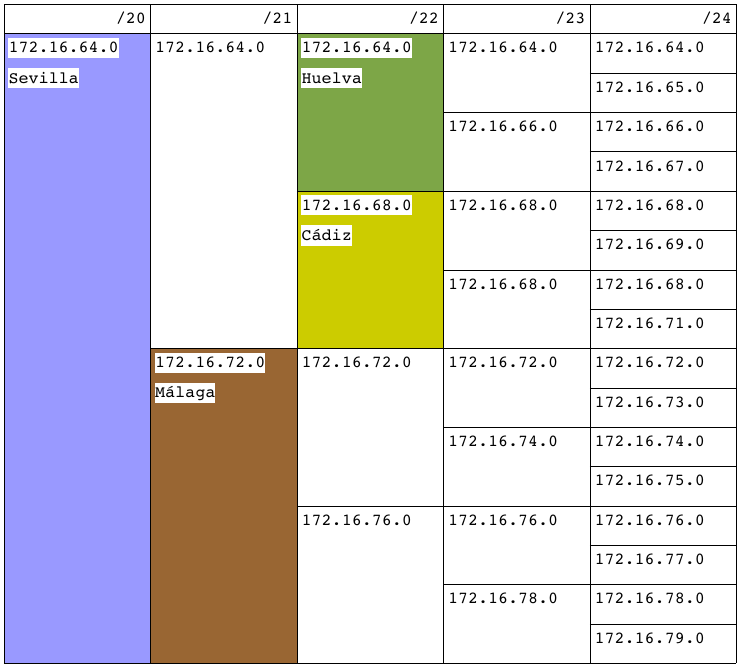
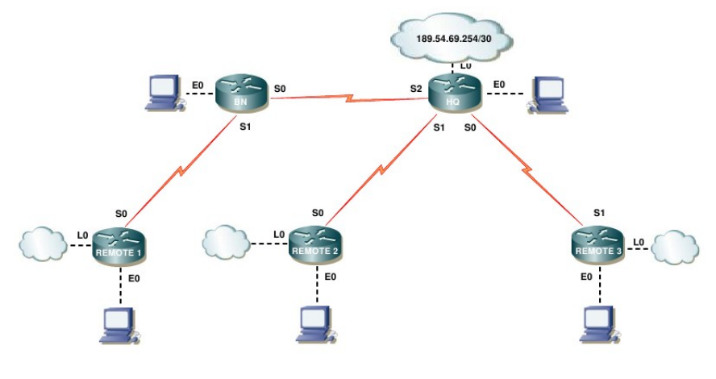
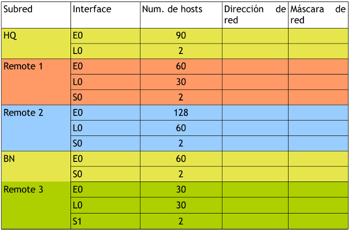
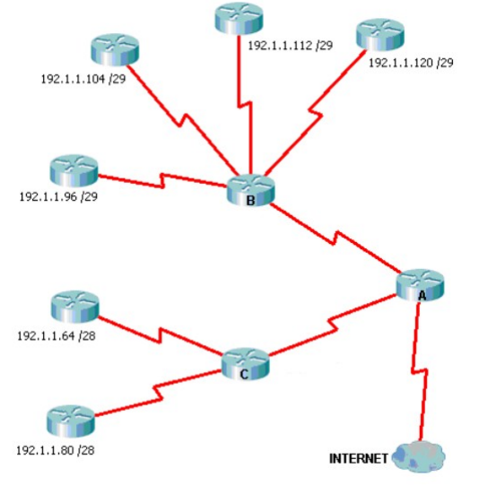

Actividades
============

Actividades de conceptos básicos
---------------------------------

.. role:: azul

An example of using :azul:`interpreted text`

1. Imagina que te dan un router y te piden que lo configures. Indica los pasos que debes seguir para tener acceso a él.

2. Visita la página http://www.tp-link.com/en/support/emulators/ y elige 1 router. Haz un pequeño manual donde se explique las distintas opciones de estado y configuración de las que dispone.

3. Hemos contratado un ADSL con PepePhone. Nos sale más barato que la competencia, además si disponemos de router podemos utilizarlo. Realiza la configuración del router tal como nos indica la empresa:

.. code-block:: none

  Parámetros obligatorios (en la sección WAN)

  ATM PVC VPI: 0
  ATM PVC VCI: 33
  PROTOCOLO DE RED: PPPoE
  MODO DE ENCAPSULACIÓN: LLC
  USER NAME (PPP): pepephone@pepephone
  Password NAME (PPP): < pepephone > o puedes dejarlo vacio. 

4. Direcciones IPv4. Tacha las direcciones IP inválidas.

	a) 1.1.1.1
	b) 2.2.2.200
	c) 200.260.0.3
	d) 4.4.4.4.4
	e) 5.0.0.300
	f) 256.244.244.4
	g) 700.1000.100
	h) 0.0.0.0
	i) 255.255.255.255

5. Direcciones IPv4 especiales. ¿Qué significado tienen las siguientes direcciones?

	a) 127.0.0.1
	b) 127.1.1.0
	c) 127.127.127.127
	d) 127.3.3.4
	e) 0.0.0.0
	f) 255.255.255.255
	g) 10.255.255.255
	h) 192.168.1.255
	i) 172.16.255.255
	j) 10.0.0.0
	k) 172.16.0.0
	l) 192.168.0.0

6. Direcciones IP reservadas. Máscaras. Para las siguientes direcciones indicar máscara y si son o no reservadas para redes privadas.

	a) 127.0.0.1
	b) 8.8.8.8
	c) 10.2.2.2
	d) 169.254.254.254
	e) 169.254.3.2
	f) 192.168.1.254
	g) 172.16.55.55
	h) 10.0.0.1
	i) 2.2.3.0
	j) 2.1.0.0
	k) 172.16.1.0
	l) 192.168.0.1
	m) 198.164.2.3
	n) 1.0.0.1

7. ¿Cuántas redes privadas de clase A tenemos? ¿Cuántos equipos tiene cada una?

8. ¿Cuántas redes privadas de clase B tenemos? ¿Cuántos equipos tiene cada una?

9. ¿Cuántas redes privadas de clase C tenemos? ¿Cuántos equipos tiene cada una?

10. Direcciones IPv6. Tacha las direcciones IP inválidas para Unicast global.

	a) 2001:0db8:85a3:0000:0000:8a2e:0370:7334
	b) 2001:db8:85a3:8d3:1319:8a2e:370:7348
	c) 2001::1
	d) 2001:af:3::1
	e) 2001:0:0:0:0:0:0:1
	f) 2001::12a6::1
	g) 2002::3:abcd:2
	h) 3333:ffff::1
	i) 3777:ada:fea::34

11. Busca información acerca de qué es el EUI-64 y el EUI-64 modificado. Para la siguiente MAC (00:11:22:33:44:55) ¿cómo quedaría su EUI-64 y su EUI-64 modificado?

12. EUI-64 modificado. ¿Cuál es la MAC de tu tarjeta de red? Basándote en la dirección MAC de tu tarjeta calcula la dirección IPv6 automática de enlace local (fe80:1111:2222:3333::/10).

13. EUI-64 modificado. ¿Cuál es la MAC de tu tarjeta de red? Basándote en la dirección MAC de tu tarjeta calcula la dirección IPv6 automática global unicast (2001::/32).

14. En un instituto tenemos 2 líneas ADSL de distintos proveedores cada una con su router. Si realizamos balanceo de carga, ¿cuáles serán los beneficios obtenidos?

Actividades de Packet Tracer
----------------------------

1. Elabora un esquema donde aparezcan 2 PC conectados entre sí con IP estática privada en la red 10.0.0.0.

2. Elabora un esquema donde aparezcan 4 PC conectados a un switch con IP estática privada en la red 172.16.0.0.

3. Elabora un esquema donde aparezcan 4 PC conectados a un switch con IP dinámica privada en la red 192.168.30.0. Debes poner en la red un servidor DHCP que asigne direcciones en dicho rango.

4. Añade al ejercicio anterior un servidor web y comprueba que los clientes pueden acceder a él.

5. Añade al ejercicio anterior un servidor DNS y configura en él el nombre www.mired.es para el servidor web. Comprueba que los PC pueden acceder al servidor web mediante su nombre.

6. Elabora un esquema donde existan 3 redes de 4 equipos cada una conectadas a un router. Cada red debe tener direcciones privadas dinámicas (una red de clase A, otra de clase B y la otra de clase C). Comprueba que hay comunicación entre ellas.

7. Añade al ejercicio anterior un servidor DNS y un servidor web en la red de clase A. Configura todos los PCs para que puedan acceder al servidor web mediante el nombre dado de alta en el servidor DNS.

Actividades resueltas de subnetting
------------------------------------

1. Calcular la dirección de red y dirección de broadcasting (difusión) de las máquinas con las siguientes direcciones IP y máscaras de subred (si no se especifica, se utiliza la máscara por defecto):

 a. **18.120.16.250**:

    .. code-block:: none
    
       máscara 255.0.0.0
       red 18.0.0.0
       broadcasting 18.255.255.255

 b. **18.120.16.255 / 255.255.0.0**:

    .. code-block:: none

       red 18.120.0.0
       broadcasting 18.120.255.255

 c. **155.4.220.39**:

    .. code-block:: none

       máscara 255.255.0.0
       red 155.4.0.0
       broadcasting 155.24.255.255

 d. **194.209.14.33**:

    .. code-block:: none

       máscara 255.255.255.0
       red 194.209.14.0
       broadcasting 194.209.14.255

 e. **190.33.109.133 / 255.255.255.0**:

    .. code-block:: none

       red 190.33.109.0
       broadcasting 190.33.109.255

2. Suponiendo que nuestro ordenador tiene la dirección IP 192.168.5.65 con máscara 255.255.255.0, indicar qué significan las siguientes direcciones especiales:

 a. **0.0.0.0**: nuestro ordenador
 b. **0.0.0.29**: 192.168.5.29
 c. **192.168.67.0**: la red 192.168.67.0
 d. **255.255.255.255**: broadcasting a la red 192.168.5.0 (la nuestra)
 e. **192.130.10.255**: broadcasting a la red 192.130.10.0
 f. **127.0.0.1**: 192.168.5.65 (loopback)

3. Calcular la dirección de red y dirección de broadcasting (difusión) de las máquinas con las siguientes direcciones IP y máscaras de subred:

 a. **190.33.109.133 / 255.255.255.128**:

    .. code-block:: none

       red 190.33.109.128
       broadcasting 190.33.109.255
       (133=10000101, 128=10000000, 127=01111111)

 b. **192.168.20.25 / 255.255.255.240**:

    .. code-block:: none

       red 192.168.20.16
       broadcasting 192.168.20.31
       (25=00011001, 240=11110000, 16=00010000, 31=00011111)

 c. **192.168.20.25 / 255.255.255.224**:

    .. code-block:: none

       red 192.168.20.0
       broadcasting 192.168.20.31
       (25=00011001, 224=11100000, 31=00011111)

 d. **192.168.20.25 / 255.255.255.192**:

    .. code-block:: none

       red 192.168.20.0
       broadcasting 192.168.20.63
       (25=00011001, 192=11000000, 63=00111111)

 e. **140.190.20.10 / 255.255.192.0**:

    .. code-block:: none

       red 140.190.0.0
       broadcasting 140.190.63.255
       (020=00010100, 192=11000000, 063=00111111)

 f. **40.190.130.10 / 255.255.192.0**:

    .. code-block:: none

       red 140.190.128.0
       broadcasting 140.190.191.255
       (130=10000010, 192=11000000, 128=10000000, 063=00111111, 191=10111111)

 g. **140.190.220.10 / 255.255.192.0**:

    .. code-block:: none

       red 140.190.192.0
       broadcasting 140.190.255.255
       (220=11011100, 192=11000000, 063=00111111, 255=11111111)

4. Viendo las direcciones IP de los hosts públicos de una empresa observamos que todas están comprendidas entre 194.143.17.145 y 194.143.17.158, ¿Cuál es (probablemente) su dirección de red, broadcasting y máscara?

  Pasamos a binario las dos direcciones. La primera tiene que estar próxima a la dirección de red y la última, a la dirección de broadcasting:
  
  .. code-block:: none

     194.143.017.145   11000010.10001111.00010001.10010001
     194.143.017.158   11000010.10001111.00010001.10011110

  Podemos suponer que la dirección de red es 194.143.17.144 y la de broadcasting, 194.143.17.159:

  .. image:: images/tema08-216.png

  Entonces la máscara será:

  .. image:: images/tema08-217.png

5. Un equipo tiene la IP 194.100.129.120. Si existen 8 subredes, indicar:

 a) clase y máscara por defecto
 b) máscara cuando dividimos la red en 8 subredes
 c) dirección de inicio (dirección de subred) y fin (dirección de difusión) de cada subred
 d) subred a la que pertenece la dirección IP
 e) número de IPs destinadas a equipos en cada subred

 IP 194.100.129.120. Existen 8 subredes

 a) IP de clase C. Máscara por defecto: 255.255.255.0.

 b) Subred

  Para obtener 8 subredes debemos ampliar la máscara anterior en 3 bits (23=8)

  .. image:: images/tema08-218.png

 c) Las direcciones de subred son:

  .. image:: images/tema08-219.png

  Las direcciones de broadcast son:

  .. image:: images/tema08-220.png

 d) Nuestra IP

  .. image:: images/tema08-221.png

  se halla en la subred

  .. image:: images/tema08-222.png

 e) Como existen 5 bits de hosts, el número total de IPs para hosts es 2\ :sup:`5`-2

6. Un equipo tiene la IP 172.10.130.4. Si existen 4 subredes, indicar:

 a) clase y máscara por defecto
 b) máscara cuando dividimos la red en 4 subredes
 c) dirección de inicio (dirección de subred) y fin (dirección de difusión) de cada subred
 d) subred a la que pertenece la dirección IP
 e) número de IPs destinadas a equipos en cada subred

 IP 172.10.130.4. Existen 4 subredes
 
 a) IP de clase B. Máscara por defecto: 255.255.0.0.

 b) Subred
  
  Para obtener 4 subredes debemos ampliar la máscara anterior en 2 bits (22=4)

  .. image:: images/tema08-223.png

 c) Las direcciones de subred son:

  .. image:: images/tema08-224.png

  Las direcciones de broadcast son:

  .. image:: images/tema08-225.png

 d) Nuestra IP

  .. image:: images/tema08-226.png

  se halla en la subred

  .. image:: images/tema08-227.png

 e) Como existen 14 bits de hosts, el número total de IPs para hosts es 214-2

Actividades a resolver de subnetting
------------------------------------

1. ¿Cuál de las siguientes opciones representa la máscara 255.255.240.0?

 a. /26
 #. /18
 #. /192
 #. /20
 #. /224
 #. /22
 #. /240
 #. /16
 #. /24
 #. /27

2. ¿Qué máscaras de las siguientes son inválidas?

 a. 255.128.255.0
 #. 128.255.0.0
 #. 255.0.0.255
 #. 255.255.0.0
 #. 255.254.0.0
 #. 255.252.0.0
 #. 255.248.0.0
 #. 255.240.0.0
 #. 255.224.0.0
 #. 255.192.0.0
 #. 255.128.0.0

3. Para las siguientes máscaras, indicar su formato corto en forma de longitud de prefijo.

 a. 255.255.0.0
 #. 255.0.0.0
 #. 255.255.255.0
 #. 255.128.0.0
 #. 255.255.0.0
 #. 255.254.0.0
 #. 255.252.0.0
 #. 255.248.0.0
 #. 255.240.0.0
 #. 255.224.0.0
 #. 255.192.0.0
 #. 255.128.0.0

4. ¿A qué subredes pertenecen estos hosts?

 a. 192.168.10.104/27
 #. 192.168.10.144/28
 #. 192.176.12.242/26
 #. 122.122.239.12/19

5. Dada la dirección 134.141.7.11 y la máscara 255.255.255.0, ¿Cuál es el número de subred?
6. Dada la dirección 193.193.7.7 y la máscara 255.255.255.0 ¿cuál es el número de subred y cuál es la dirección de broadcast?
7. Dada la dirección 200.1.1.130 y la máscara 255.255.255.224 ¿cuál es el número de subred y cuál es la dirección de broadcast?
8. Dada la IP 220.8.7.100/28, ¿Cuál es la dirección de subred y cuál es la dirección de broadcast?
9. Dada la dirección IP 10.141.7.11/24 ¿Cuál es la dirección de subred y cuál es la dirección de broadcast?
10. Dada la dirección 134.141.7.11/24 ¿Cuáles son las direcciones IP válidas?
11. Dada la dirección 200.2.1.130/27 ¿Cuáles son las direcciones IP válidas?
12. Dada la IP 134.141.7.7/24, ¿cuáles son las números de subred válidos?
13. Dada la IP 220.8.7.100 y la máscara 255.255.255.240, ¿cuáles son las subredes válidas?
14. ¿Cuántas direcciones IP serán asignadas en cada subred de 134.141.0.0/24?
15. ¿Cuántas direcciones IP serán asignadas en cada subred de 220.8.7.0/28?
16. ¿Cuántas direcciones IP serán asignadas en cada subred de 10.0.0.0/14?
17. ¿Cuántas direcciones IP serán asignadas en cada subred de 11.0.0.0 255.192.0.0?
18. Un equipo tiene la IP 10.10.4.4. Si existen 256 subredes, indicar:

 - clase y máscara por defecto
 - máscara cuando dividimos la red en 256 subredes
 - dirección de inicio (dirección de subred) y fin (dirección de difusión) de cada subred (sólo las tres primeras)
 - subred a la que pertenece la dirección IP
 - número de IPs destinadas a equipos en cada subred

19. Diseñas una red para un cliente, y el cliente te pide que utilices la misma máscara de subred para todas las subredes. El cliente utiliza la red 10.0.0.0 y necesita 200 subredes, con 200 hosts como máximo en cada subred. ¿Qué máscara trabajará mejor y permitirá mayor crecimiento en el número de host por subred a futuro?

Actividades resueltas de VLSM
-----------------------------

Subnetting
++++++++++

A partir de la red **192.168.100.0/24** hacer la subredes necesarias para obtener las mostradas en la siguiente figura.

**Paso 0: ¿Cuantas IPs necesitamos?**

.. code-block:: none

	Red A: 52. (50 + 2 -de red y broadcast-)
	Red B: 29. (27 + 2 -de red y broadcast-)
	Red C: 14. (12 + 2 -de red y broadcast-)
	Red D: 14. (12 + 2 -de red y broadcast-)
	Red E:  4. ( 2 + 2 -de red y broadcast-)
	Red F:  4. ( 2 + 2 -de red y broadcast-)
	Red G:  4. ( 2 + 2 -de red y broadcast-)
	Red H:  4. ( 2 + 2 -de red y broadcast-)

Total: 52+29+14+14+4+4+4+4

**Paso 1: ¿Tenemos espacio suficiente?**

Comprobamos que disponemos de suficiente espacio de direcciones. Como una la red 192.168.100.0/24 dispone de 8 bits para hosts, tenemos 2\ :sup:`8` = 256 IPs (muchas más de las que necesitamos).

**Paso 2: ¿Como las distribuimos?**

.. code-block:: none

	Para la red A: Necesitamos un bloque de 64 IPs (2^6) >= 52
	Para la red B: Necesitamos un bloque de 32 IPs (2^5) >= 29
	Para la red C: Necesitamos un bloque de 16 IPs (2^4) >= 14
	Para la red D: Necesitamos un bloque de 16 IPs (2^4) >= 14
	Para la red E: Necesitamos un bloque de  4 IPs (2^2) >=  4
	Para la red F: Necesitamos un bloque de  4 IPs (2^2) >=  4
	Para la red G: Necesitamos un bloque de  4 IPs (2^2) >=  4
	Para la red H: Necesitamos un bloque de  4 IPs (2^2) >=  4

.. note::

   En el párrafo anterior la notación 2^6 es equivalente a 2\ :sup:`6`. Así con el resto de potencias.

.. code-block:: none

	Red A: 6 bits para hosts. Por tanto 2 bits para subred. Máscara: /26.
	Red B: 5 bits para hosts. Por tanto 3 bits para subred. Máscara: /27.
	Red C: 4 bits para hosts. Por tanto 4 bits para subred. Máscara: /28.
	Red D: 4 bits para hosts. Por tanto 4 bits para subred. Máscara: /28.
	Red E: 2 bits para hosts. Por tanto 6 bits para subred. Máscara: /30.
	Red F: 2 bits para hosts. Por tanto 6 bits para subred. Máscara: /30.
	Red G: 2 bits para hosts. Por tanto 6 bits para subred. Máscara: /30.
	Red H: 2 bits para hosts. Por tanto 6 bits para subred. Máscara: /30.

**Paso 3: Realizamos distribución**

A continuación se muestra un cuadro de cómo hemos distribuido las subredes. No es la única solución. Podríamos haber escogido otra forma de distribuirlas, siempre que respetemos la máscara que debemos asignar a cada una y el número de IPs por subred.

x=192.168.100

.. image:: images/tema08-229.png

Las redes quedan de la siguiente forma:

.. code-block:: none

	Red A: 192.168.100.64/26
	Red B: 192.168.100.128/27
	Red C: 192.168.100.160/28
	Red D: 192.168.100.176/28
	Red E: 192.168.100.0/30
	Red F: 192.168.100.4/30
	Red G: 192.168.100.8/30
	Red H: 192.168.100.12/30

Supernetting. Resumen de rutas
+++++++++++++++++++++++++++++++

**Resumen de Huelva**

**22 bits son comunes**.

**Por tanto la ruta resumida es 172.16.64.0/22**

**Resumen de Cádiz**

**22 bits son comunes**.

**Por tanto la ruta resumida es 172.16.68.0/22**

**Resumen de Málaga**

**21 bits son comunes**.

**Por tanto la ruta resumida es 172.16.72.0/21**

**Resumen de Sevilla**

**20 bits son comunes**.

**Por tanto la ruta resumida es 172.16.64.0/20**

.. image:: images/tema08-235.png

**Resultado final**

Actividades a resolver de VLSM
-------------------------------

1. Dada la red 192.168.0.0/24, desarrolle un esquema de direccionamiento que cumpla con los siguientes requerimientos. Use VLSM, es decir, optimice el espacio de direccionamiento tanto como sea posible.

 - Una subred de 50 hosts para ser asignada a los Profesores
 - Una subred de 80 hosts para ser asignada a los Estudiantes
 - Una subred de 20 hosts para ser asignada a los Invitados
 - Tres subredes de 2 hosts para ser asignada a los enlaces entre routers.

.. image:: images/tema08-237.png

2. Usted es el administrador de la red para una escuela primaria local. Su primera tarea es hacer que la correcta distribución de IPs en la red. El ISP le ha dado a usted la dirección de red 177.19.156.0 y máscara 255.255.252.0. Realice el subnetting necesario según el esquema que se muestra más abajo. Comience las asignaciones de direcciones con el 177.19.157.0.

3. Sumarización de rutas. Tenemos esta red VLSM con subnetting y debemos averiguar cuál va a ser la dirección que va a publicar en Internet el router A.

