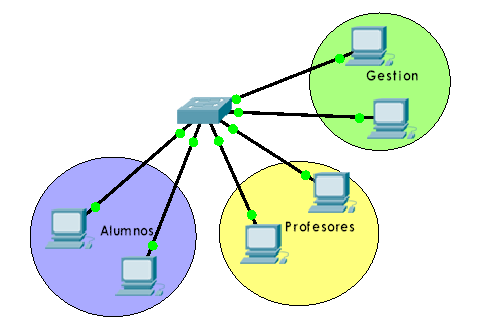
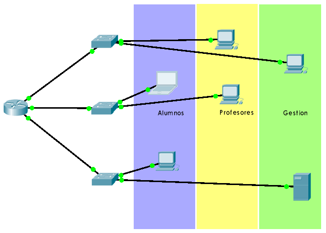
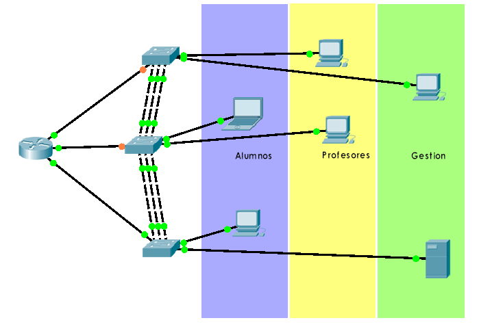
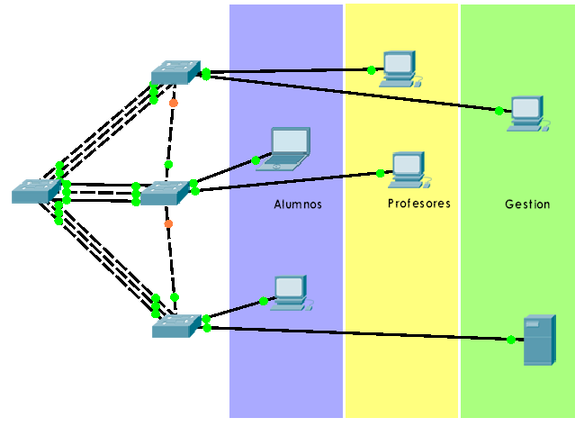

Actividades
===========

Actividades de teoría
----------------------

1. ¿Qué tipos de VLAN existen más frecuentemente? Explicar.

2. En referencia a las VLAN, ¿qué tipos de puertos existen?. Explicar.

3. En los enlaces troncales, ¿es aconsejable utilizar agregación de enlaces? ¿Por qué?

4. ¿Qué tipos de etiquetado se utilizan en las tramas para distinguirlas unas de otras como pertenecientes a alguna VLAN? Explicar.

5. Rellena la siguiente tabla.

	=========== ===================== ============ ==============
	Protocolo   Propietario de CISCO  Nivel OSI    Función
	=========== ===================== ============ ==============
	CDP
	STP 
	DTP
	VTP			
	=========== ===================== ============ ==============

  ¿Qué significan las siglas de cada protocolo?

Actividades de Packet Tracer
----------------------------

1. Configura un switch con 3 VLANs (Alumnos, Profesores, Gestión), según el esquema que se muestra a continuación. Todos los ordenadores deben estar en la misma red IP privada, pero sólo deberán verse entre sí los que se hallen en la misma VLAN.

**Habilitando módulo HWIC-4ESW (4 port switch)**

**Asignar una IP a la VLAN**

.. code-block:: none

	Router# configure terminal
	Router(config)# interface vlan 10
	Router(config-if)# ip address 192.168.5.1 255.255.255.0
	Router(config-if)# exit

**Asignar interfaces dentro de esa VLAN**

.. code-block:: none

	Router(config)# interface range FastEthernet0/1/x-y
	Router(config-if-range)# switchport access vlan 10
	Router(config-if-range)# exit

2. Utilizando la misma red IP privada anterior, con las mismas VLANs, realizar el siguiente esquema. Las conexiones de los switches al router son enlaces troncales. Comprobar que existe comunicación entre los equipos de la misma VLAN.

**Comandos para agregación de enlaces**

.. code-block:: none

	Switch(config)# interface range FastEthernet0/x-y
	Switch(config-if-range)# switchport mode trunk
	Switch(config-if-range)# channel-group z mode on
	Switch(config-if-range)# exit

3. Modifica el esquema anterior para añadir agregación de enlaces de la siguiente forma. Comprueba el correcto funcionamiento. ¿Por qué se han desactivado dos enlaces? ¿Qué protocolo es responsable de ello? ¿Por qué crees que se han desactivado esos y no otros enlaces?

4. Modifica el esquema anterior para que la agregación de enlaces sea como la que se muestra a continuación. Sustituye el router por un switch. Comprueba el correcto funcionamiento. ¿Por qué crees que se han desactivado esos y no otros enlaces?

**Comandos para uso de VTP**

**En el switch principal**

.. code-block:: none

	Switch(config)# vtp mode server
	Switch(config)# vtp domain prueba
	Switch(config)# vlan 10
	Switch(config-vlan)# name alumnos
	Switch(config-vlan)# exit
	Switch(config)# vlan 20
	Switch(config-vlan)# name profesores
	Switch(config-vlan)# exit

**En los switches secundarios**

.. code-block:: none

	Switch(config)# vtp mode client

5. Elimina todas las VLANs que has creado en el esquema anterior y vuelve a crearlas haciendo uso de VTP. Para ello configura el switch principal como VTP mode server y los switches secundarios como VTP mode client. Comprueba el correcto funcionamiento.

