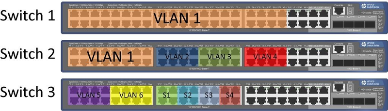
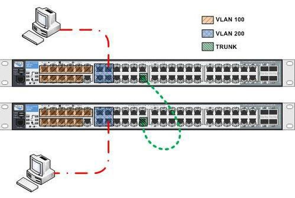

Introducción
=============

.. image:: images/tema09-000.png

Una **VLAN** (acrónimo de virtual LAN, "**red de área local virtual**") es un método para crear **redes lógicas independientes** dentro de una misma red física. Varias VLAN **pueden coexistir en un único conmutador físico** o en una única red física. Son útiles para reducir el tamaño del dominio de difusión y ayudan en la administración de la red, separando segmentos lógicos de una red de área local (los departamentos de una empresa, por ejemplo) que no deberían intercambiar datos usando la red local (aunque podrían hacerlo a través de un enrutador o un conmutador de capa 3).

Tipos de VLAN
--------------

Las dos aproximaciones más habituales para la asignación de miembros de una VLAN son las siguientes:

- VLAN estáticas
- VLAN dinámicas

Las **VLAN estáticas** también se denominan VLAN basadas en el **puerto**. Las asignaciones en una VLAN estática se crean mediante la asignación de los puertos de un switch o conmutador a dicha VLAN. Cuando un dispositivo entra en la red, automáticamente asume su pertenencia a la VLAN a la que ha sido asignado el puerto. Si el usuario cambia de puerto de entrada y necesita acceder a la misma VLAN, el administrador de la red debe cambiar manualmente la asignación a la VLAN del nuevo puerto de conexión en el switch.

En las **VLAN dinámicas**, el administrador de la red puede asignar los puertos que pertenecen a una VLAN de manera automática basándose en información tal como la **dirección MAC** del dispositivo que se conecta al puerto o el nombre de usuario utilizado para acceder al dispositivo. En este procedimiento, el dispositivo que accede a la red, hace una consulta a la base de datos de miembros de la VLAN.

Características
----------------

- Las VLANs permiten dividir la red local en redes virtuales
- Los equipos de la red que pertenecen a la misma VLAN pueden comunicarse entre ellos como si estuvieran conectados al mismo switch
- La comunicación entre estaciones de diferentes VLANs requiere un dispositivo de nivel 3
- A cada VLAN se le asigna un identificador de distinto color:

  - Los puertos de los switches quedan coloreados
  - Los puertos que unen switches se considera que pertenecen a la unión de los colores de los dos switches

- Sólo se envía una trama por un puerto cuando la LAN origen y destino tienen el mismo color (es decir, ambos puertos pertenecen a la misma VLAN)

Ventajas
---------

- Permiten reconfigurar si hay un cambio sin tocar cables ni switches
- Aumenta la seguridad
- Aumenta el rendimiento de la red al separar dominios de difusión
- La organización de la red se basa en las tareas de los usuarios y no en su localización física.

Conceptos generales
===================

Tipos de puertos
-----------------

En un switch, atendiendo a su función dentro de la VLAN, existirán dos tipos de puertos:

- Puertos de **acceso (access)**
- Puertos **troncales (trunk)**

Los **puertos de acceso** son aquellos a los que se conectan directamente los equipos terminales (ordenadores o periféricos). Por ellos **solo viajan tramas pertenecientes a una única VLAN**.

Los **puertos troncales** son aquellos por los que **circulan tramas de una o más VLANs**. Para distinguir el tráfico de las distinta VLANs **es necesario etiquetar las tramas** indicando que VLAN pertenecen.

Enlaces troncales (trunk)
-------------------------

Los enlaces troncales o trunks, son enlaces capaces de transportar el tráfico de más de una VLAN y se suele utilizar para **interconectar dos switches, un switch y un router**, incluso interconectar un switch y un servidor al cual se le ha instalado una NIC especial capaz de soportar trunking. Los enlaces troncales nos permiten transportar de forma lógica las VLANs utilizando un enlace físico.

.. image:: images/tema09-004.png

Un enlace troncal (trunk) puede ser un único enlace físico o estar conformado por varios de ellos usando la técnica de agregación (link agregation) que permite combinar varios enlaces físicos en un enlace lógico que funciona como un único puerto de mayor ancho de banda.

Otras denominaciones para la agregación de enlaces son Trunking o Bonding. Cisco lo denomina EtherChannel (Modos: ON, PAgP o LACP).

.. image:: images/tema09-005.png

Etiquetado
----------

Los puertos de un switch pueden estar etiquetados (**tagged**) o no etiquetados (**untagged**).

En un enlace troncal es necesario diferenciar el tráfico de cada una de las VLANs, de tal forma que se le asigna a cada trama entrante un identificador llamado VLAN-ID. Para poder identificar el tráfico en un enlace troncal existen dos tipos de etiquetado:

- **ISL** (Inter-Switch Link Protocol)
- **IEEE 802.1Q**

ISL (Inter-Switch Link Protocol)
++++++++++++++++++++++++++++++++

ISL es un protocolo propietario de Cisco que está en desuso. Este protocolo no altera la trama original, porque éste encapsula la trama Ethernet con una nueva cabecera de 26 bytes, que contiene al identificador VLAN (VLAN ID), y además añade un campo de secuencia de chequeo de trama (FCS ó CRC) de 4 bytes al final de la trama, como se muestra en la figura. Por lo tanto, como la trama ha sido encapsulada por ISL con nueva información, solamente los dispositivos que conozcan ISL podrán leer estas nuevas tramas.

.. figure:: images/tema09-007.png

   VLAN - Trama ISL

IEEE 802.1Q
+++++++++++

El estándar IEEE 802.1Q (también llamado dot1q) especifica el etiquetado de tramas como un método para implementar VLANs. Insertando un campo de 4 bytes dentro de la trama Ethernet para identificar a que VLAN pertenece la información que se está transportando entre dispositivos de capa 2.

.. figure:: images/tema09-008.png

   VLAN - Trama 802.1Q

El proceso de insertar el campo IEEE 802.1Q dentro de la trama Ethernet provoca que el campo FCS sea inválido, debido a que se ha alterado la trama, por lo tanto es esencial que un nuevo FCS sea recalculado, basado en la nueva trama que contiene al campo IEEE 802.1Q. Este proceso es automáticamente desarrollado por el switch antes de que la trama sea enviada por el enlace troncal.

Este método es el más popular por ser empleado por switches de diferentes fabricantes, ofreciendo compatibilidad entre equipos. Incluso los switches Cisco pueden manejar este estándar.

VLAN nativa
------------

Normalmente un puerto de switch configurado como un puerto troncal envía y recibe tramas Ethernet etiquetadas con IEEE 802.1q. Si un switch recibe **tramas Ethernet sin etiquetar** en su puerto troncal, se remiten a la VLAN que se configura en el switch como VLAN nativa. Ambos lados del enlace troncal deben configurarse para estar en la misma VLAN nativa.

La VLAN nativa **es la vlan a la que pertenecía un puerto en un switch antes de ser configurado como trunk**. Sólo se puede tener una VLAN nativa por puerto. En los equipos de Cisco Systems la VLAN nativa por defecto es la **VLAN 1**. Por la VLAN 1 además de datos, se manda información sobre PAgP, CDP, VTP.

Para establecer un trunking 802.1Q a ambos lados debemos tener la misma VLAN nativa porque la encapsulación todavía no se ha establecido y los dos switches deben hablar sobre un link sin encapsulación (usan la native VLAN) para ponerse de acuerdo en estos parámetros.

Protocolos
==========

DTP
---

DTP (**Dynamic Trunking Protocol**) es un protocolo propietario creado por Cisco Systems que opera entre switches Cisco, el cual **automatiza la configuración de trunking** (etiquetado de tramas de diferentes VLAN's con ISL o 802.1Q) en enlaces Ethernet.

DTP se habilita automáticamente en un puerto del switch cuando se configura un modo de trunking adecuado en dicho puerto. Para ello el administrador debe ejecutar el comando `switchport mode` adecuado al configurar el puerto: **switchport mode {access | trunk | dynamic auto | dynamic desirable}**. Con el comando **switchport nonegotiate** se desactiva DTP.

En switches Catalyst 2960 de Cisco el **modo dynamic auto es el modo por defecto**. El puerto aguardará pasivamente la indicación del otro extremo del enlace para pasar a modo troncal. Para ello envía periódicamente tramas DTP al puerto en el otro lado del enlace indicando que es capaz de establecer un enlace troncal. Esto no quiere decir que lo solicita, sino que sólo lo informa. Si el puerto remoto está configurado en modo on o dynamic desirable se establece el enlace troncal correctamente. Sin embargo, si los dos extremos están en modo dynamic auto no se establecerá el enlace como troncal, sino como acceso.

VTP
---

VTP son las siglas de **VLAN Trunking Protocol**, un protocolo de mensajes de nivel 2 usado para configurar y administrar VLANs en equipos Cisco. Permite **centralizar y simplificar la administración en un domino de VLANs**, pudiendo crear, borrar y renombrar las mismas, reduciendo así la necesidad de configurar la misma VLAN en todos los nodos. El protocolo VTP nace como una herramienta de administración para redes de cierto tamaño, donde la gestión manual se vuelve inabordable.

VTP opera en 3 modos distintos:

- Servidor
- Cliente
- Transparente

**Servidor**

  Es el modo por defecto. Desde él se pueden crear, eliminar o modificar VLANs. **Su cometido es anunciar su configuración al resto de switches del mismo dominio VTP** y sincronizar dicha configuración con la de otros servidores, basándose en los mensajes VTP recibidos a través de sus enlaces **trunk**. Debe haber al menos un servidor. Se recomienda autenticación MD5.

**Cliente**

  En este modo no se pueden crear, eliminar o modificar VLANs, tan sólo sincronizar esta información basándose en los mensajes VTP recibidos de servidores en el propio dominio. Un cliente VTP sólo guarda la información de la VLAN para el dominio completo mientras el switch está activado. Un reinicio del switch borra la información de la VLAN.

**Transparente**

  Desde este modo tampoco se pueden crear, eliminar o modificar VLANs que afecten a los demás switches. La información VLAN en los switches que trabajen en este modo sólo se puede modificar localmente. Su nombre se debe a que no procesa las actualizaciones VTP recibidas, tan sólo las reenvía a los switches del mismo dominio.

Los administradores cambian la configuración de las VLANs en el switch en modo servidor. Después de realizar cambios, estos son distribuidos a todos los demás dispositivos en el dominio VTP a través de los enlaces permitidos en el trunk (VLAN 1, por defecto), lo que minimiza los problemas causados por las configuraciones incorrectas y las inconsistencias. Los dispositivos que operen en modo cliente, automáticamente aplicarán la configuración que reciban del dominio VTP. En este modo no se podrán crear VLANs, sino que sólo se podrá aplicar la información que reciba de las publicaciones VTP.

El modo por defecto de los swicthes es el de servidor VTP. Se recomienda el uso de este modo para redes de pequeña escala en las que la información de las VLANs es pequeña y por tanto de fácil almacenamiento en las NVRAMs de los switches.

En redes de mayor tamaño, el administrador debe elegir qué switches actúan como servidores, basándose en las capacidades de éstos (los mejor equipados serán servidores y los demás, clientes).

El VTP sólo aprende sobre las VLAN de rango normal (ID de VLAN 1 a 1005). Las VLAN de rango extendido (ID mayor a 1005) no son admitidas por el VTP.

Caso práctico
=============

Uso del módulo HWIC-4ESW (4 puertos de switch)
----------------------------------------------

El HWIC-4ESW es el equivalente de un conmutador de capa 2 por lo que no se le puede asignar direcciones IP a los puertos físicos. Lo que se puede hacer es crear un SVI L3 (SVI: Interfaz Virtual del Switch) y asignar el puerto dentro de la VLAN.

**Comandos IOS básicos**

.. code-block:: none

	Router> ?
	Router> enable

**Crear una VLAN**

.. code-block:: none

	Router# vlan database
	Router(vlan)# vlan 10
	Router(vlan)# exit

**Asignar una IP a la VLAN**

.. code-block:: none

	Router# configure terminal
	Router(config)# interface vlan 10
	Router(config-if)# ip address 192.168.5.1 255.255.255.0
	Router(config-if)# exit

**Y asignar las interfaces dentro de esa VLAN**

.. code-block:: none

	Router(config)# interface FastEthernet0/1/x
	Router(config-if)# switchport access vlan 10
	Router(config-if)# exit

