.. role:: strike
   :class: strike

Actividades
===========

Actividades de teoría
----------------------

1. Atendiendo al número de receptores de un paquete, ¿qué tipos de encaminamiento existen? Explicar.
#. ¿En qué se diferencian el encaminamiento estático del encaminamiento dinámico?
#. ¿Qué comando utilizamos para ver la tabla de rutas en un equipo terminal Windows? ¿Y en Linux?
#. En Windows, desde un terminal de texto, elimina la ruta por defecto con el comando route. Prueba a hacer un ping al equipo 8.8.8.8. Vuelve a añadir la ruta. Vuelve a probar el ping. (Realiza dos capturas de pantalla)
#. En Linux, desde un terminal de texto, elimina la ruta por defecto con el comando route. Prueba a hacer un ping al equipo 8.8.8.8. Vuelve a añadir la ruta. Vuelve a probar el ping. (Realiza dos capturas de pantalla)
#. En un equipo terminal, ¿por qué es tan importante la puerta de enlace o ruta por defecto?
#. Haz un esquema de los distintos protocolos de encaminamiento dinámico que existen, atendiendo a externos o internos. Y en estos últimos según se basen en el vector de distancia o en el estado del enlace.
#. ¿Qué protocolos admiten encaminamiento sin clase?
#. ¿Qué es la distancia administrativa y cuándo es necesaria?
#. De los protocolos de encaminamiento, ¿cuáles son propietarios?
#. ¿Cómo está organizada Internet? ¿Qué niveles existen?
#. ¿Qué son y por qué son importantes los Internet eXchange points?

Actividades de Packet Tracer
----------------------------

Inicio (comandos básicos)

.. code-block:: none

	Router>  ping IP
	Router>  show ip route
	Router>  enable
	Router#  configure terminal
	Router(config)#  no ip domain-lookup

	<Aquí ponemos los comandos de enrutamiento>

	Fin
	Router0(config-router)#  exit
	Router0(config)#  exit
	Router0#  copy running-config startup-config

Enrutamiento estático
+++++++++++++++++++++

**Añadimos rutas estáticas**

.. code-block:: none

	Router(config)#  ip route   RED   MASCARA    SIGUIENTE_SALTO
	Router(config)#  ip route ...

1. Conecta 2 routers entre sí y comprueba que tienen comunicación entre ellos (utiliza el comando ping). Router1 (11.0.0.1/30), Router2 (11.0.0.2/30). ¿Es necesario configurar tablas de rutas? ¿Por qué? Muestra la tabla de rutas con el comando show ip route.

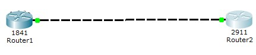

2. Añade al Router1 un módulo HWIC-4ESW (4 ports switch). Configura el módulo HWIC-4ESW como se vio en el tema anterior. Añade 4 PC y configura una red diferente para ellos (192.168.1.0/24). Configura la puerta de enlace de cada uno de los PC. Añade una entrada a la tabla de rutas en el Router2 para alcanzar la red 192.168.1.0. Comprueba que hay comunicación entre los PC y el Router2. Muestra la tabla de rutas del Router2 con el comando show ip route.

.. code-block:: none

	Router2(config)#  ip route 192.168.1.0   255.255.255.0   11.0.0.1

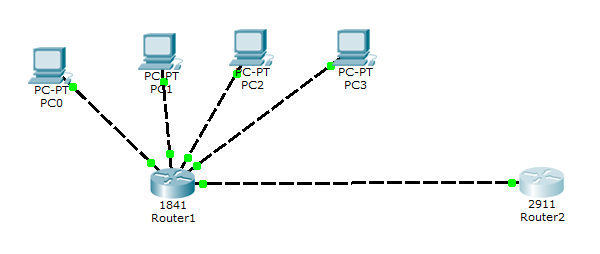

3. Añade un switch y 4 PC más en otra red. Configura Router1 para alcanzar la red2 (192.168.2.0). Configura Router2 para alcanzar la red1 (192.168.1.0). Comprueba que hay comunicación entre los PC del Router1 y los del Router2. Muestra la tabla de rutas del Router1 con el comando show ip route.

.. code-block:: none

	Router1(config)#  ip route 192.168.2.0   255.255.255.0   11.0.0.2
	Router2(config)#  ip route 192.168.1.0   255.255.255.0   11.0.0.1

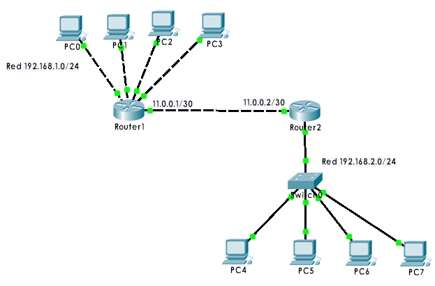

4. Añade el Router3 (12.0.0.0/30 hacia Router1; 13.0.0.0/30 hacia Router2). Configura su tabla de rutas. Modifica la tabla de rutas del Router2 para que los envíos que vayan a la red local del Router1 pasen por el Router3. Configura el Router3. Muestra las tablas de rutas de los Router2 y Router3 con el comando show ip route.

.. code-block:: none

	Router1(config)#  ip route 192.168.2.0   255.255.255.0   12.0.0.2
	Router2(config)#  ip route 192.168.1.0   255.255.255.0   13.0.0.2
	Router3(config)#  ip route 192.168.1.0   255.255.255.0   12.0.0.1
	Router3(config)#  ip route 192.168.2.0   255.255.255.0   13.0.0.1

.. note::

   Las siguientes rutas deben ser eliminadas:

   - ``Router1(config)#  ip route 192.168.2.0   255.255.255.0   11.0.0.2``
   - ``Router2(config)#  ip route 192.168.1.0   255.255.255.0   11.0.0.1``

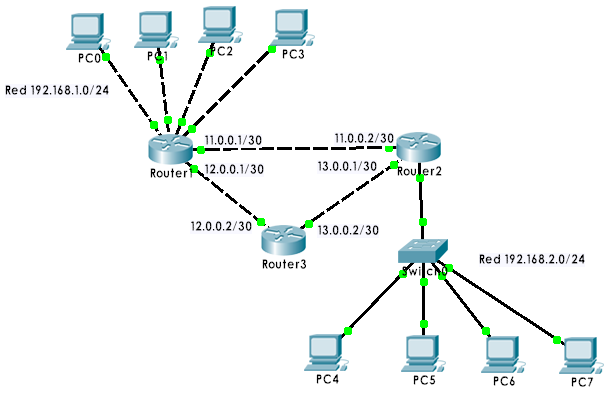

5. Añade un Router4 (con IP 14.0.0.0/30 y 15.0.0.0/30, por ejemplo) con un módulo HWIC-2T para 2 líneas serie. Añade a los Router3 y Router1 otro módulo HWIC-2T. Recuerda Guardar la configuración en ejecución a la NVRAM (Save Running Configuration to NVRAM) antes de apagar los routers si no quieres perderla. Modifica la tabla de rutas de Router3 para que los paquetes que vayan a la red local del Router1 pasen por Router4. Muestra las tablas de rutas de los Router3 y Router4 con el comando show ip route.

.. code-block:: none

	Router3(config)#  ip route 192.168.1.0   255.255.255.0   15.0.0.2
	Router4(config)#  ip route 192.168.1.0   255.255.255.0   14.0.0.1
	Router4(config)#  ip route 192.168.2.0   255.255.255.0   15.0.0.1

.. note::

   Las siguientes rutas deben ser eliminadas:

   - ``Router3(config)#  ip route 192.168.1.0   255.255.255.0   12.0.0.1``

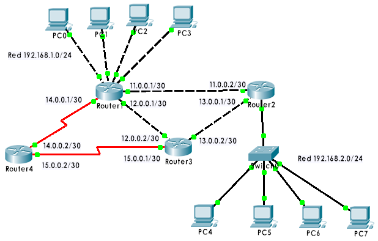

6. Añade un Router5 (16.0.0.0/30). Elimina todas las entradas de las tablas de rutas de los Router1 y Router2. Añade a Router1 una entrada para alcanzar la red2 a través del Router2. Añade a Router2 una entrada para alcanzar la red1 a través del Router1. Añade a ambos routers, una ruta por defecto (para enviar datos a cualquier otra red) a través de Router3. Configura Router3 y Router4 para que sus rutas por defecto se encaminen hacia Router5. Muestra las tablas de rutas de los Router3 y Router4 con el comando show ip route.

.. code-block:: none

	Router1(config)#  ip route 192.168.2.0   255.255.255.0 11.0.0.2
	Router1(config)#  ip route 0.0.0.0       0.0.0.0       12.0.0.2
	Router2(config)#  ip route 192.168.1.0   255.255.255.0 11.0.0.1
	Router2(config)#  ip route 0.0.0.0       0.0.0.0       13.0.0.2
	.
	.
	.
	Router5(config)#  ip route 0.0.0.0       0.0.0.0       16.0.0.1

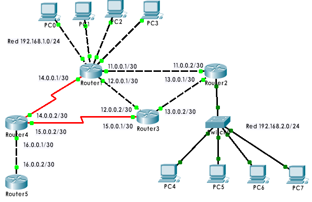

Enrutamiento dinámico (RIP)
+++++++++++++++++++++++++++

Habilitamos RIP 2 y publicamos rutas adyacentes

.. code-block:: none

	Router0(config)#  router rip
	Router0(config-router)#  version 2
	Router0(config-router)#  network  RED
	Router0(config-router)#  network  RED

1. Crea un esquema con 3 routers tal como se muestra. Configura RIP versión 2 en cada uno de ellos. Comprueba que hay comunicación entre PC0 y PC1. ¿Cuáles son las tablas de rutas de Router0 y Router2?

.. code-block:: none

	Router0(config)#  router rip
	Router0(config-router)#  version 2
	Router0(config-router)#  network 10.0.0.0
	Router0(config-router)#  network 11.0.0.0 

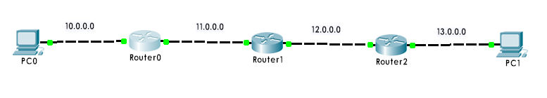

2. Haz que Router1 se publique como ruta por defecto. Cualquier paquete con IP destino que no se halle en las redes mostradas se enviará a Router1, que a su vez lo enviará hacia fuera. Mostrar tabla de rutas de Router0.

.. code-block:: none

	Router1(config-router)#  default-information originate

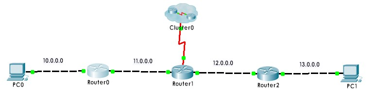

Enrutamiento dinámico (OSPF)
+++++++++++++++++++++++++++++

Habilitamos OSPF y publicamos rutas adyacentes

.. code-block:: none

	Router(config)#  router ospf x
	Router(config-router)#  network  RED   WILDCARD  area 0 
	Router(config-router)#  network  RED   WILDCARD  area 0

.. code-block:: none

	x:        número de proceso (puede tomar un valor entre 1 y 65535)
	WILDCARD: inverso binario de la máscara de red.
	area 0:   núm. área (aconsejable poner 0 para área única en todos los routers de la misma)

1. Crea un esquema con 3 routers tal como se muestra. Configura OSPF en cada uno de ellos. Comprueba que hay comunicación entre PC0 y PC1. ¿Cuáles son las tablas de rutas de Router0 y Router2?

.. code-block:: none

	Router0(config-router)#  network  10.0.0.0   0.255.255.255   area 0
	Router0(config-router)#  network  11.0.0.0   0.255.255.255   area 0

.. image:: images/tema10-109.png

2. Haz que Router1 se publique como ruta por defecto. Cualquier paquete con IP destino que no se halle en las redes mostradas se enviará a Router1, que a su vez lo enviará hacia fuera. Mostrar tabla de rutas de Router0.

.. code-block:: none

	Router1(config-router)#  ip route   0.0.0.0   0.0.0.0   200.0.0.1
	Router1(config-router)#  default-information originate

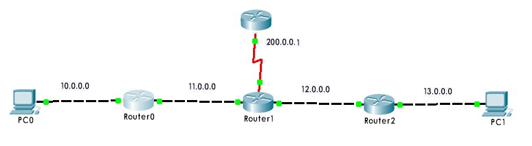

Enrutamiento dinámico (BGP)
++++++++++++++++++++++++++++

Habilitamos BGP 

.. code-block:: none

	Router(config)#  router bgp  x
	Router(config-router)#  neighbor   IP   remote-as  y
   
Redes detrás del router BGP 

.. code-block:: none

	Router(config-router)#  network  RED  mask MASK
	Router(config-router)#  network  RED  mask MASK
	Router(config-router)#  network  RED  mask MASK
	...
 
.. code-block:: none

	x, y: números de sistemas autónomos.

1. Crear el siguiente esquema. Tenemos 2 sistemas autónomos (AS): uno funcionando internamente con RIP (AS=10) y otro con OSPF (AS=20). Como routers frontera tenemos Router1 y Router-1. Configurar BGP en Router1 y Router-1. Mostrar ambas tablas de rutas.

.. code-block:: none

	Router-1(config)#  router bgp 20
	Router-1(config-router)#  neighbor  200.0.0.1   remote-as 10
	Router-1(config-router)#  network   20.0.0.0    mask 255.0.0.0
	Router-1(config-router)#  network   21.0.0.0    mask 255.0.0.0
	Router-1(config-router)#  network   22.0.0.0    mask 255.0.0.0
	Router-1(config-router)#  network   23.0.0.0    mask 255.0.0.0

No olvides crear las rutas por defecto, tanto en Router1 como en Router-1

.. code-block:: none

	Router1(config-router)#  default-information originate
	Router-1(config-router)#  ip route   0.0.0.0   0.0.0.0   200.0.0.1
	Router-1(config-router)#  default-information originate

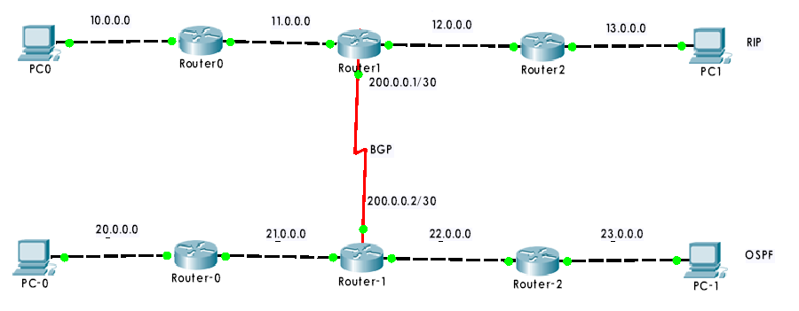

2. Añadir a Router1 una red exterior. Configurar la ruta BGP por defecto en Router1. Debes configurar además el equipo exterior 100.0.0.2 con soporte de BGP. Mostrar tablas de rutas de Router-1.

.. code-block:: none

	Router1(config-router)#  neighbor 100.0.0.2   default-originate

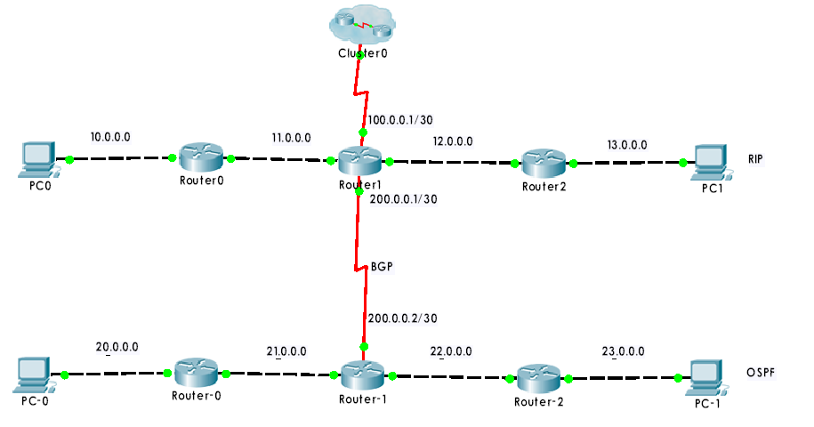

Actividad práctica (Opcional)
-------------------------------

1. Instalar en el ordenador de casa los servicios:

- XAMPP (servidor de páginas web)
- VNC (servidor de acceso remoto gráfico)

En el router hacer DNAT estático (es decir, abrir y redirigir puertos o port forwarding):
  
- 80 (a ordenador de casa)
- 5800-5810, 5900-5910 (a ordenador de casa)

Hacer DDNS (DNS dinámico), es decir, registrar un nombre de dominio en dyndns, no-ip, o similar.

