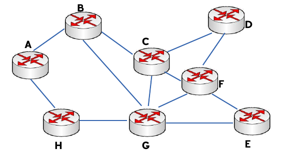
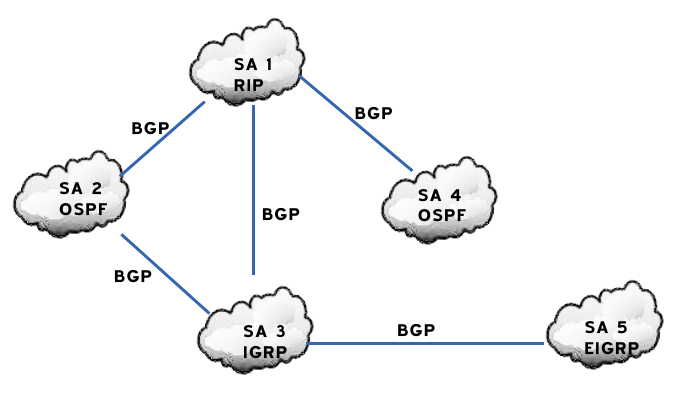
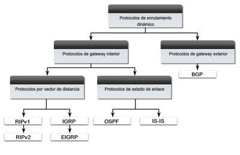
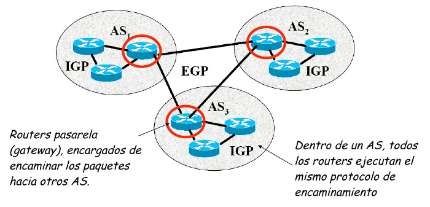
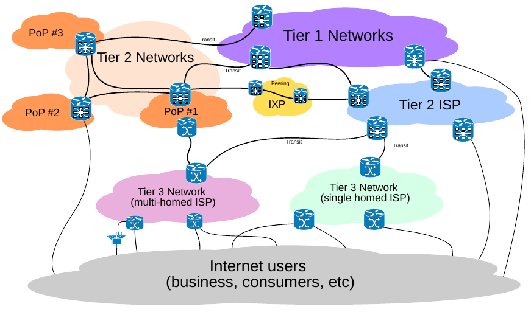

Introducción
=============

.. image:: images/tema10-000.png

**Encaminamiento (o enrutamiento, ruteo)** es la función de buscar un camino entre todos los posibles en una red de paquetes cuyas topologías poseen una gran conectividad. Dado que se trata de encontrar la mejor ruta posible, lo primero será definir qué se entiende por **mejor ruta** y en consecuencia cuál es la **métrica** que se debe utilizar para medirla.

La métrica de la red puede ser por ejemplo de saltos necesarios para ir de un nodo a otro. Aunque ésta no se trata de una métrica óptima ya que supone “1” para todos los enlaces, es sencilla y suele ofrecer buenos resultados.

Otro tipo es la medición del retardo de tránsito entre nodos vecinos, en la que la métrica se expresa en unidades de tiempo y sus valores no son constantes sino que dependen del tráfico de la red.

.. image:: images/tema10-001.png

Atendiendo al número de equipos a los que va destinado un datagrama, la comunicación se considera:

- Unicast
- Multicast
- Anycast
- Broadcast
- Geocast

.. image:: images/tema10-002.png
   :align: left

**Unicast** es el envío de información desde un único emisor a un único receptor. Se contrapone a multicast (envío a ciertos destinatarios específicos, más de uno), broadcast (radiado o difusión, donde los destinatarios son todas las estaciones en la red) y anycast (el destinatario es único, uno cualquiera no especificado).

**Broadcast, difusión** en español, es una forma de transmisión de información donde un nodo emisor envía información a una multitud de nodos receptores de manera simultánea, sin necesidad de reproducir la misma transmisión nodo por nodo.

**Multicast, multidifusión** en español, es el envío de la información en múltiples redes a múltiples destinos simultáneamente. Antes del envío de la información, deben establecerse una serie de parámetros. Para poder recibirla, es necesario establecer lo que se denomina "grupo multicast". Ese grupo multicast tiene asociado una dirección de internet. La versión actual del protocolo de internet, conocida como IPv4, reserva las direcciones de tipo D para la multidifusión.

**Anycast** es una forma de direccionamiento en la que la información es enrutada al mejor destino desde el punto de vista de la topología de la red. En la red internet, una dirección IP se puede anunciar desde varios puntos diferentes. Los routers intermedios encaminan el paquete hasta el destino más cercano. Un paquete enviado a una dirección anycast es entregado a la máquina más próxima desde el punto de vista del tiempo de latencia.

**Geocast** se refiere a la entrega de información a un grupo de destinos en una red identificada por su ubicación geográfica. Es una forma especializada de direccionamiento de multidifusión utilizado por algunos protocolos de enrutamiento para redes móviles ad hoc.

Clasificación
==============

Los métodos de encaminamiento los podemos clasificar en función de:

- El procedimiento de encaminamiento.
- Las tablas de encaminamiento empleadas.

En función del procedimiento.
-----------------------------

Los procedimientos de encaminamiento pueden ser:

Determinísticos o Estáticos
+++++++++++++++++++++++++++

En los encaminamientos estático y cuasi-estático **la información necesaria se recoge y envía mediante gestión (al crear la red y en operaciones de mantenimiento)**.

**Estático**
  Las tablas de encaminamiento de los nodos se configuran de forma manual y permanecen inalterables hasta que no se vuelve a actuar sobre ellas. La adaptación a cambios es nula. Tanto la recogida como la distribución de información se realiza por gestión (se realiza de manera externa a la red), sin ocupar capacidad de red. El calculo de ruta se realiza off-line (en una maquina especifica),y las rutas pueden ser las óptimas al no estar sometido al requisito de tiempo real.

  Este tipo de encaminamiento es el óptimo para topologías en los que solo hay una posibilidad de encaminamiento (topología en estrella).

**Cuasiestático**
  Este encaminamiento, es igual que el estático pero en vez de dar una sola ruta fija, se dan además varias alternativas en caso de que la principal no funcione, de ahí que tenga una adaptabilidad reducida.

  Este tipo de encaminamiento puede dar lugar a situaciones incoherentes, ya que no se enteran todos los nodos de los problemas de la red, sino sólo los adyacentes a los problemas.

Adaptativos o Dinámicos
++++++++++++++++++++++++

En este tipo de procedimientos de encaminamiento **la información se recoge y envía de forma periódica con el fin de detectar cambios en la red**.

**Centralizado**
  En este tipo de encaminamiento, todos los nodos son iguales salvo el nodo central, que recoge la información de control de todos los nodos y calcula la FIB (tabla de encaminamiento) para cada nodo, es decir, el nodo central decide la tabla de encaminamiento de cada nodo en función de la información de control que éstos le mandan. El inconveniente de este método es que consumimos recursos de la red, y se harían necesaria rutas alternativas para comunicarse con el nodo central. La adaptación a cambios es perfecta siempre y cuando las notificaciones de los cambios lleguen antes de iniciar los cálculos de las rutas.

**Aislado**
  Se basa en que cada vez que un nodo recibe un paquete que tiene que reenviar (porque no es para él) lo reenvía por todos los enlaces salvo por el que le llegó.

**Distribuido**
  En este tipo de encaminamiento todos los nodos son iguales, todos envían y reciben información de control y todos calculan, a partir de su RIB (base de información de encaminamiento) sus tablas de encaminamiento. La adaptación a cambios es optima siempre y cuando estos sean notificados.

Hay **dos familias de procedimientos distribuidos**:

1. **Vector de distancias**

Cada nodo informa a sus nodos vecinos de todas las distancias conocidas por él, mediante vectores de distancias (de longitud variable según los nodos conocidos). El vector de distancias es un vector de longitud variable que contiene un par (nodo:distancia al nodo) por cada nodo conocido por el nodo que lo envía, por ejemplo (A:0;B:1;D:1) que dice que el nodo que lo manda dista "0" de A,"1" de B y "1" de D, y de los demás no sabe nada (ésta es la forma en la que un nodo dice lo que sabe en cada momento). El nodo solo conoce la distancia a los distintos nodos de la red pero no conoce la topología.

Con todos los vectores recibidos, cada nodo monta su tabla de encaminamiento ya que al final conoce qué nodo vecino tiene la menor distancia al destino del paquete, pues se lo han dicho con el vector de distancias.

2. **Estado de enlaces**

Cada nodo difunde a todos los demás nodos de la red sus distancias con sus enlaces vecinos, es decir, cada nodo comunica su entorno local a todos los nodos. Así cada nodo es capaz de conocer la topología de la red. La clave y dificultad de este método es la difusión.

A continuación se muestra una tabla comparativa de todos los tipos de encaminamiento vistos.

Clasificación de los métodos de encaminamiento
++++++++++++++++++++++++++++++++++++++++++++++

======================== ==================================== ================================ =========================== ====================
Tipos de encaminamiento  Recepción de información de control  Envío de información de control  Decisión de encaminamiento  Adaptación a los cambios

======================== ==================================== ================================ =========================== ====================
Estático                 NO                                   NO                               OFF-LINE                    NO
Cuasi - estático	     NO                                   NO                               OFF-LINE                    Reducida
Centralizado	         Nodos-Nodo central                   Nodo central-Nodos               Nodo central                SI
Aislado	                 NO                                   NO                               Inundación, por ejemplo     SI
Distribuido	             Todos los nodos                      Todos los nodos                  Todos los nodos             SI
======================== ==================================== ================================ =========================== ====================

Comparación Vector de distancias – Estado del Enlaces
++++++++++++++++++++++++++++++++++++++++++++++++++++++

Haremos una comparación entre los algortitmos de vector de distancias y de estado de enlaces, ambos del tipo distribuido:

- Consumo de capacidad.

  Lo ideal es que el tráfico de control sea lo más pequeño posible. Con vectores de distancia se transmiten vectores cuyo tamaño es del orden del número de nodos de la red pues cada nodo comunica a su vecino todas las distancias que conoce; con procedimientos de estado de enlace, el tamaño del tráfico enviado es siempre el mismo independientemente del tamaño de la red. En consecuencia, **consume más capacidad un vector de distancias**.

- Consumo de memoria

  El encaminamiento basado en estado de enlace hace que cada nodo almacene toda la topología de la red, sin embargo con vectores de distancias sólo ha de almacenar distancias con el resto de los nodos. Luego **consume más memoria en los nodos un procedimiento basado en estado de enlace**.

- Adaptabilidad a los cambios

  El método de vector de distancia es más sencillo, pero se adapta peor a los cambios que el de estado de enlace. Esto es porque mientras que este último tiene información de toda la red, el primero sólo sabe a quién tiene que reenviar un paquete, pero no tiene información de la topología. Luego **se adapta mejor un encaminamiento de estado de enlaces**.

No obstante, el encaminamiento basado en vector de distancias es mucho menos complejo que el de estado de enlaces, cosa que en algunos casos prácticos puede llegar a ser muy importante.

En función de las tablas de encaminamiento empleadas.
-----------------------------------------------------

Los nodos manejan **tablas de encaminamiento**, en las que aparece la ruta que deben seguir los paquetes con destino a un nodo determinado de la red.

Podemos distinguir entre encaminamiento salto a salto y encaminamiento fijado en origen. Nosotros veremos con detalle sólo el primer tipo (salto a salto).

Encaminamiento salto a salto
++++++++++++++++++++++++++++

En la literatura inglesa, este tipo de encaminamiento se denomina como hop by hop. Se basa en que cada nodo no tiene que conocer la ruta completa hasta el destino, sino que sólo debe saber cuál es el siguiente nodo al que tiene que mandar el paquete: las tablas dan el nodo siguiente en función del destino. Como ejemplo, tomemos la siguiente red:

   Red de ejemplo

Las tablas de encaminamiento de los nodos A y B serán:

================ ================== ================ =================
Tabla de encaminamiento del nodo A  Tabla de encaminamiento del nodo B
----------------------------------- ----------------------------------
Destino          Siguiente nodo       Destino          Siguiente nodo
================ ================== ================ =================
B                B                  A                A
C                B                  C                C
D                B                  D                C
E                H                  E                C
F                H                  F                C
G                H                  G                G
H                H                  H                A
================ ================== ================ =================

En la tabla de encaminamiento de cada nodo deberá aparecer una entrada en el campo destino por cada nodo que se pueda alcanzar desde el citado nodo, y en el campo siguiente nodo aparecerá el nodo vecino al que se deberá enviar los datos para alcanzar el citado nodo destino. Las soluciones propuestas no son únicas, pudiendo elegir otros caminos que minimicen el tiempo de retardo, el número de saltos, etc. La única condición que se impone es que debe haber consistencia: si, por ejemplo, para ir de A a B pasamos por C, entonces para ir de B a C no podremos pasar por A, porque entonces se formaría un bucle y el paquete mandado estaría continuamente viajando entre los nodos B y A, como puede comprobarse fácilmente.

Encaminamiento fijado en origen
+++++++++++++++++++++++++++++++

En inglés este encaminamiento se llama source routing. En él, son los sistemas finales los que fijan la ruta que ha de seguir cada paquete. Para ello, cada paquete lleva un campo que especifica su ruta(campo RI: Routing Information), y los nodos sólo se dedican a reenviar los paquetes por esas rutas ya especificadas. Así pues, son los sistemas finales los que tienen las tablas de encaminamiento y no se hace necesaria la consulta o existencia de tablas de encaminamiento en los nodos intermedios. Este tipo de encaminamiento suele ser típico de las redes de IBM.

================ ================== ================ =================
Tabla de encaminamiento del nodo A  Tabla de encaminamiento del nodo B
----------------------------------- ----------------------------------
Destino          Ruta a seguir      Destino          Ruta a seguir
================ ================== ================ =================
B                B                  A                A
C                B-C                C                C
D                B-C-D              D                C-D
E                H-G-E              E                C-F-E
F                H-G-F              F                C-F
G                H-G                G                G
H                H                  H                A-H
================ ================== ================ =================

Comparación entre ambos tipos de encaminamiento
+++++++++++++++++++++++++++++++++++++++++++++++

Lo veremos por medio de la siguiente tabla:

=================== ===================================================================== =========================================
-                   Fijado en Origen                                                      Salto a Salto
=================== ===================================================================== =========================================
Conocimiento        Los sistemas finales han de tener un conocimiento completo de la red  SIMPLICIDAD: Los nodos han de tener un conocimiento parcial de la red (saber qué rutas son las mejores)
Complejidad         Recae toda en los sistemas finales                                    En los sistemas intermedios ya que son los que tienen que encaminar
Problemas de Bucles No hay bucles: el sistema final fija la ruta (ROBUSTEZ)               Sí pueden ocurrir: no se tiene una visión completa de la red (INCONSISTENCIA)
=================== ===================================================================== =========================================

Los **bucles** (situación que se da cuando los paquetes pasan más de una vez por un nodo) ocurren porque los criterios de los nodos no son coherentes, generalmente debido a que los criterios de encaminamiento o no han convergido después de un cambio en la ruta de un paquete; cuando por cualquier causa un paquete sufre un cambio de encaminamiento, la red tarda en adaptarse a ese cambio pues la noticia del cambio tiene que llegar a todos los nodos. Es en ese transitorio cuando se pueden dar los bucles, ya que unos nodos se han adaptado y otros no. El objetivo de los algoritmos de encaminamiento es detener el curso de los paquetes antes de que se produzcan bucles. Esto es importante sobre todo cuando se envían los paquete s por varias rutas simultáneamente (técnicas de inundación, etc...).

Aplicación práctica
===================

Una red de redes está formada por redes interconectadas mediante routers o encaminadores. Cuando enviamos un datagrama desde un ordenador hasta otro, éste tiene que ser capaz de encontrar la ruta más adecuada para llegar a su destino. Esto es lo que se conoce como encaminamiento.

Los routers (encaminadores) son los encargados de elegir las mejores rutas. Estas máquinas pueden ser ordenadores con varias direcciones IP o bien, aparatos específicos.

Los routers deben conocer, al menos parcialmente, la estructura de la red que les permita encaminar de forma correcta cada mensaje hacia su destino. Esta información se almacena en las llamadas tablas de encaminamiento.

Observemos que debido al sistema de direccionamiento IP esta misión no es tan complicada. Lo único que necesitamos almacenar en las tablas son los prefijos de las direcciones (que nos indican la red). Por ejemplo, si el destino es la máquina 149.33.19.4 con máscara 255.255.0.0, nos basta con conocer el encaminamiento de la red 149.33.0.0 ya que todas las que empiecen por 149.33 se enviarán hacia el mismo sitio.

La orden **route** muestra y modifica la tabla de encaminamiento de un host. Todos los hosts (y no sólo los routers) tienen tablas de encaminamientos. A continuación se muestra una tabla sencilla para un host con IP 192.168.0.2 / 255.255.255.0 y puerta de salida 192.168.0.1.

.. code-block:: none

	C:\> route print

	Rutas activas:

	Dirección de red Máscara de red    Puerta de enlace  Interfaz      Métrica
	0.0.0.0          0.0.0.0           192.168.0.1       192.168.0.2   1    (7)
	127.0.0.0        255.0.0.0         127.0.0.1         127.0.0.1     1    (6)
	192.168.0.0      255.255.255.0     192.168.0.2       192.168.0.2   1    (5)
	192.168.0.2      255.255.255.255   127.0.0.1         127.0.0.1     1    (4)
	192.168.0.255    255.255.255.255   192.168.0.2       192.168.0.2   1    (3)
	224.0.0.0        224.0.0.0         192.168.0.2       192.168.0.2   1    (2)
	255.255.255.255  255.255.255.255   192.168.0.2       0.0.0.0       1    (1)

Estas tabla se lee de abajo a arriba. La línea (1) indica que los datagramas con destino "255.255.255.255" (dirección de difusión a la red del host) deben ser aceptados. La línea (2) representa un grupo de multidifusión (multicasting). La dirección "224.0.0.0" es una dirección de clase D que se utiliza para enviar mensajes a una colección de hosts registrados previamente. Estas dos líneas se suelen pasar por alto: aparecen en todas las tablas de rutas.

La línea (3) indica que todos los mensajes cuyo destinatario sea "192.168.0.255" deben ser aceptados (es la dirección de difusión a la red del host). La línea (4) se encarga de aceptar todos los mensajes que vayan destinados a la dirección del host "192.168.0.2".

**La línea (5) indica que los mensajes cuyo destinatario sea una dirección de la red del host "192.168.0.0 / 255.255.255.0" deben salir del host por su tarjeta de red** para que se entreguen directamente en su subred. La línea (6) es la dirección de loopback: todos los paquetes con destino "127.0.0.0 / 255.0.0.0" serán aceptados por el propio host.

Finalmente, **la línea (7) representa a "todas las demás direcciones que no se hayan indicado anteriormente"**. En concreto son aquellas direcciones remotas que no pertenecen a la red del host. ¿A dónde se enviarán? Se enviarán a la **puerta de salida (gateway) de la red** "192.168.0.1".

Nótese que la tabla de rutas es la traducción de la configuración IP del host que habitualmente se escribe en las ventanas de Windows.

Gestión del encaminamiento IP
------------------------------

No existe un único protocolo para actualizar las tablas de encaminamiento IP, pudiendo elegirse el más adecuado dependiendo de los requisitos internos de las redes a interconectar y las preferencias de cada administrador.

A lo largo del tiempo, se han impuesto distintas soluciones, tanto abiertas como propietarias. Todas ellas operan con estrategias **Adaptativas Salto a Salto**.

¿Cómo pueden convivir todas ellas? Mediante los Dominios de Encaminamiento o **Sistemas Autónomos** (SA). **Un SA es un conjunto de redes gestionadas por una administración común y que comparten una estrategia de encaminamiento común**. En inglés sus siglas son AS.

Cada sistema autónomo:

- Elige su arquitectura y protocolos de encaminamiento internos.
- Es responsable de la consistencia de sus rutas internas.
- Debe recolectar información sobre todas sus redes y designar uno a más routers para pasar la información a otros sistemas autónomos.

Será por tanto necesario definir dos tipos de encaminamiento:

- Intradominio o IGP (Internal Gateway Protocol): Es el utilizado dentro del SA. Ejemplos: RIP, OSPF, IGRP, EIGRP, ...
- Interdominio o EGP (External Gateway Protocol): Encamina entre Sistemas Autónomos. Ejemplos: BGP, IDPR, ...

Los routers frontera ejecutan el encaminamiento EGP para cambiar información con routers de otros sistemas autónomos, y el IGP para cambiar información con otros routers de su SA:

   Interconexión de redes mediante BGP y distintos protocolos interiores

   Clasificación de los protocolos de enrutamiento

Sistemas participantes
-----------------------

La función de encaminamiento se realiza principalmente en los routers, aunque en algunas situaciones los hosts también deben participar en la toma de decisiones (para seleccionar el router de su red al que envía el datagrama):

Estrategia básica de envío:

- Si el host destino se encuentra en la misma red, se encapsula el datagrama IP en una trama de subred, se obtiene la dirección física (mediante ARP) y se envía (entrega directa)
- Si no está en la misma subred, se envía el datagrama a un router, éste lo reenvía al siguiente, y así sucesivamente, hasta alcanzar un router conectado a la misma subred que la máquina destino (entrega indirecta)

Para conocer si el host destino se encuentra en la misma subred que el origen, éste compara el prefijo de red de ambas direcciones. Si coinciden, se encuentran en la misma subred.

Para los envíos será necesario llevar a cabo la conversión entre direcciones IP y de subred (física) del destinatario (host o router). Esta función puede desempeñarla el protocolo ARP.

El encaminador sólo modifica los campos TTL y checksum del datagrama, no las direcciones IP origen o destino. Aunque debe obtener la dirección IP del siguiente salto y, a partir de ella, la de subred donde enviará el datagrama.

Tablas de encaminamiento
------------------------

El encaminamiento IP hace uso de tablas de encaminamiento que se encuentran en cada máquina (hosts y routers, puesto que ambos encaminan datagramas) y almacenan información sobre los posibles destinos y cómo alcanzarlos.

La estrategia es siempre salto a salto (next-hop routing): las tablas almacenan el siguiente salto para las direcciones IP destino. Las direcciones son siempre IP, no físicas, debido a que se facilita su gestión y se ocultan los detalles de las subredes.

Para acelerar el proceso y reducir el consumo de recursos, las tablas sólo necesitan los prefijos de subred de las direcciones IP y no la dirección IP completa.

En un entorno de interconexión total, como el de Internet, no es posible que las tablas contengan la información sobre todas las posibles direcciones destino; se utiliza el principio de información oculta, que permite tomar decisiones de encaminamiento con la información mínima necesaria:

- Se aísla la información de hosts dentro del entorno local (subred) donde se encuentran; un host remoto puede enviar datagramas sin conocer al detalle la subred. El esquema de direccionamiento IP está diseñado para ayudar a conseguir éste objetivo.
- Se agrupan múltiples entradas de la tabla en una sola, la ruta por defecto.

.. note::
  
   Todos los routers listados en la tabla de encaminamiento de un nodo deben de encontrarse en subredes a las que dicho nodo esté conectado directamente (estrategia salto a salto).

Métricas
--------

Una métrica es un valor utilizado por los protocolos de enrutamiento para asignar costos a fin de alcanzar las redes remotas.

La identificación de la mejor ruta de un router implica la evaluación de múltiples rutas hacia la misma red de destino y la selección de la ruta óptima o "la más corta" para llegar a esa red. Cuando existen múltiples rutas para llegar a la misma red, cada ruta usa una interfaz de salida diferente en el router para llegar a esa red. La mejor ruta es elegida por un protocolo de enrutamiento en función del valor o la métrica que usa para determinar la distancia para llegar a esa red.

Las métricas utilizadas en los protocolos de enrutamiento IP incluyen:

- Conteo de saltos: una métrica simple que cuenta la cantidad de routers que un paquete tiene que atravesar
- Ancho de banda: influye en la selección de rutas al preferir la ruta con el ancho de banda más alto
- Carga: considera la utilización de tráfico de un enlace determinado
- Retardo: considera el tiempo que tarda un paquete en atravesar una ruta
- Confiabilidad: evalúa la probabilidad de una falla de enlace calculada a partir del conteo de errores de la interfaz o las fallas de enlace previas
- Costo: un valor determinado ya sea por el IOS o por el administrador de red para indicar la preferencia hacia una ruta. El costo puede representar una métrica, una combinación de las mismas o una política.

Algunos protocolos de enrutamiento, como RIP, usan un conteo de saltos simple, que consiste en el número de routers entre un router y la red de destino. Otros protocolos de enrutamiento, como OSPF, determinan la ruta más corta al analizar el ancho de banda de los enlaces y al utilizar dichos enlaces con el ancho de banda más rápido desde un router hacia la red de destino. Los protocolos de enrutamiento dinámico generalmente usan sus propias reglas y métricas para construir y actualizar las tablas de enrutamiento. Una métrica es un valor cuantitativo que se usa para medir la distancia hacia una ruta determinada. La mejor ruta a una red es la ruta con la métrica más baja. Por ejemplo, un router preferirá una ruta que se encuentra a 5 saltos antes que una ruta que se encuentra a 10 saltos.

El objetivo principal del protocolo de enrutamiento es determinar las mejores trayectorias para cada ruta a fin de incluirlas en la tabla de enrutamiento. El algoritmo de enrutamiento genera un valor, o una métrica, para cada ruta a través de la red. Las métricas se pueden calcular sobre la base de una sola característica o de varias características de una ruta. Algunos protocolos de enrutamiento pueden basar la elección de la ruta en varias métricas, combinándolas en un único valor métrico. Cuanto menor es el valor de la métrica, mejor es la ruta.

Cuando un router tiene múltiples rutas hacia una red de destino y el valor de esa métrica (conteo de saltos, ancho de banda, etc.) es el mismo, esto se conoce como métrica de mismo costo, y el router realizará un balanceo de carga de mismo costo.

La métrica para cada protocolo de enrutamiento es:

- RIP: conteo de saltos: la mejor ruta se elige según la ruta con el menor conteo de saltos.
- IGRP e EIGRP: ancho de banda, retardo, confiabilidad y carga; la mejor ruta se elige según la ruta con el valor de métrica compuesto más bajo calculado a partir de estos múltiples parámetros. Por defecto, sólo se usan el ancho de banda y el retardo.
- IS-IS y OSPF: costo; la mejor ruta se elige según la ruta con el costo más bajo. . La implementación de OSPF de Cisco usa el ancho de banda

Distancia administrativa
------------------------

Aunque es menos común, puede implementarse más de un protocolo de enrutamiento dinámico en la misma red. **En algunas situaciones, posiblemente sea necesario enrutar la misma dirección de red utilizando múltiples protocolos de enrutamiento** como RIP y OSPF. Debido a que diferentes protocolos de enrutamiento usan diferentes métricas, RIP usa el conteo de saltos y OSPF usa el ancho de banda, no es posible comparar las métricas para determinar la mejor ruta.

**La distancia administrativa (AD) define la preferencia de un origen de enrutamiento**. A cada origen de enrutamiento, entre ellas protocolos de enrutamiento específicos, rutas estáticas e incluso redes conectadas directamente, se le asigna un orden de preferencia de la más preferible a la menos preferible utilizando el valor de distancia administrativa. Los routers Cisco usan la función de AD para seleccionar la mejor ruta cuando aprende sobre la misma red de destino desde dos o más orígenes de enrutamiento diferentes.

La distancia administrativa es un valor entero entre 0 y 255. Cuanto menor es el valor, mayor es la preferencia del origen de ruta. **Una distancia administrativa de 0 es la más preferida**. Solamente una red conectada directamente tiene una distancia administrativa igual a 0 que no puede cambiarse. Cada protocolo tiene AD predeterminada: OSPF 110, EIGRP 90, IGRP 100, RIP 120 que aparecen en las tablas de enrutamiento precediendo a la métrica. **La AD de 0 se reserva para las redes conectadas directamente y la de 1 para las redes estáticas**.

.. warning::

   Ojo, si agregamos una ruta estática que también haya sido aprendida por un protocolo dinámico, la ruta estática tendrá preferencia al tener una distancia administrativa de 1.

Protocolos de enrutamiento con clase y sin clase
------------------------------------------------

Los protocolos de enrutamiento con clase no envían información de la máscara de subred en las actualizaciones de enrutamiento. Los primeros protocolos de enrutamiento tales como el RIP, fueron con clase. En aquel momento, las direcciones de red se asignaban en función de las clases; clase A, B o C. No era necesario que un protocolo de enrutamiento incluyera una máscara de subred en la actualización de enrutamiento porque la máscara de red podía determinarse en función del primer octeto de la dirección de red. Los protocolos de enrutamiento con clase no pueden usarse cuando una red se divide en subredes utilizando más de una máscara de subred; en otras palabras, los protocolos de enrutamiento con clase no admiten máscaras de subred de longitud variable (VLSM).

**Los protocolos de enrutamiento sin clase incluyen la máscara de subred con la dirección de red en las actualizaciones de enrutamiento**. Las redes de la actualidad ya no se asignan en función de las clases y la máscara de subred no puede determinarse según el valor del primer octeto. La mayoría de las redes de la actualidad requieren protocolos de enrutamiento sin clase porque admiten VLSM, redes no contiguas y otras funciones. **Los protocolos de enrutamiento sin clase son RIPv2, EIGRP, OSPF, IS-IS y BGP**.

Resumen de rutas
----------------

La creación de tablas de enrutamiento más pequeñas hace que el proceso de búsqueda en la tabla de enrutamiento sea más eficiente ya que existen menos rutas para buscar. Si se puede utilizar una ruta estática en lugar de múltiples rutas estáticas, el tamaño de la tabla de enrutamiento se reducirá. En muchos casos, una sola ruta estática puede utilizarse para representar docenas, cientos o incluso miles de rutas.

Podemos utilizar una sola dirección de red para representar múltiples subredes. Por ejemplo, las redes 10.0.0.0/16, 10.1.0.0/16, 10.2.0.0/16, 10.3.0.0/16, 10.4.0.0/16, 10.5.0.0/16, hasta 10.255.0.0/16, pueden representarse con una sola dirección de red: 10.0.0.0/8.

Las múltiples rutas estáticas pueden resumirse en una sola ruta estática si:

- las redes de destino pueden resumirse en una sola dirección de red, y
- todas las múltiples rutas estáticas utilizan la misma interfaz de salida o dirección IP del siguiente salto.

Protocolos interiores y exteriores
==================================

.. image:: images/tema10-031.png

Protocolos interiores (IGP)
---------------------------

Routing Information Protocol (RIP)
++++++++++++++++++++++++++++++++++

Protocolo IGP. RFC 1095. Muy simple y extendido, gracias a que fue incluido en la distribución UNIX BSD (routed)

Características generales:

- Vector distancia.
- Métrica = número de saltos (de 1 a 15). 16 es infinito.
- Dos tipos de participantes: activos (sólo pueden ser routers) y pasivos.
- Cada 30 segundos los participantes activos difunden su vector de distancias: duplas de (prefijo IP, distancia).
- Utiliza UDP como protocolo de transporte (puerto 520).
- Todos los participantes (activos y pasivos) escuchan los mensajes RIP y actualizan sus tablas.
- Existe un proceso de borrado de rutas (cada 180 segundos), para mantener las tablas fiables y para recuperarse ante caídas de routers, por ejemplo.
- Dos tipos de paquetes. REQUEST: enviados por los routers o hosts que acaban de conectarse o su información ha caducado. RESPONSE: enviados periódicamente, en respuesta a un REQUEST o cuando cambia algún coste.
- Actualmente existen dos versiones del protocolo: RIPv1 y RIPv2 (aporta subnetting y autenticación).

Limitaciones:

- Existen diferencias entre implementaciones debido a que la RFC tardó un poco en aparecer.
- Convergencia lenta (inconsistencias transitorias provocan bucles de encaminamiento). Se han propuesto algunas soluciones, pero son parciales o no sirven para todas las topologías.
- Carga las redes innecesariamente. Todos los routers hacen broadcast periódicamente.
- Permite 15 saltos como máximo.
- Métrica de saltos. No contempla otras posibilidades (caudal, probabilidad de error, etc.)

Open Shortest Path First (OSPF)
++++++++++++++++++++++++++++++++

Primero el Camino Abierto más Corto. Protocolo IGP. RFC 1247. Presentado en 1990 como sustituto de RIP. Recomendado por la IETF para redes IP.

Características generales:

- Escalable: admite redes con miles de encaminadores
- Estado de Enlaces
- Soporta subnetting: prefijos + máscaras.
- Los mensajes OSPF se encapsulan directamente dentro de datagramas IP: no utilizan ningún protocolo de transporte.
- Encaminamiento multimétrica. Distinto camino dependiendo del campo TOS de la cabecera IP. También soporta balanceado de carga entre rutas de igual coste.
- Encaminamiento jerárquico. Divide el sistema autónomo en áreas. Cada área esconde su topología. El encaminador OSPF sólo necesita conocer la topología de su área.
- Tipos de encaminadores: Internal, Area Border, Backbone y AS Boundary.
- Tipos de Redes: Point to Point, Broadcast y Non-Broadcast
- Inyección de rutas externas: uno o varios encaminadores aprenden rutas externas y las propagan.
- Descubrimiento dinámico de encaminadores.
- Adaptación a redes locales: aprovecha las redes con difusión hardware para disminuir el número de mensajes OSPF.
- Soporte para autentificación, lo que proporciona mayor seguridad y evita ataques.

Protocolos exteriores (EGP)
---------------------------

BGP
++++

Border Gateway Protocol es un protocolo mediante el cual se **intercambia información de encaminamiento entre sistemas autónomos**.

Entre los sistemas autónomos de los ISP se intercambian sus tablas de rutas a través del protocolo BGP. Este intercambio de información de encaminamiento **se hace entre los routers externos de cada sistema autónomo**. Estos routers deben soportar BGP. Se trata del protocolo más utilizado para redes con intención de configurar un EGP (external gateway protocol)

Es el protocolo principal de publicación de rutas utilizado por las compañías más importantes de ISP en Internet. BGP4 es la primera versión que admite encaminamiento entre dominios sin clase (CIDR) y agregado de rutas. A diferencia de los protocolos de Gateway internos (IGP), como RIP, OSPF y EIGRP, no usa métricas como número de saltos, ancho de banda, o retardo. En cambio, **BGP toma decisiones de encaminamiento basándose en políticas de la red, o reglas que utilizan varios atributos de ruta BGP**.

Con BGP los encaminadores en la frontera de un sistema autónomo intercambian prefijos de redes hacia las que saben encaminar. Las rutas aprendidas son inyectadas en el IGP para distribuirlas entre los encaminadores interiores al AS.

**Relaciones entre Sistemas Autónomos**

Las relaciones que existen entre distintos sistemas autónomos son principalmente de **peering** y de **tránsito**. Básicamente **una relación de tránsito es la que existe entre un proveedor y un cliente**, de modo que **el cliente pague** por los recursos de Internet que le puede suministrar su proveedor. **Las relaciones de peering no suelen se pagadas y consisten en un enlace para comunicar dos sistemas autónomos** con el fin de reducir costes, latencia, pérdida de paquetes y obtener caminos redundantes. Se suele hacer peering con sistemas autónomos potencialmente similares, es decir, no se hace peering con un cliente potencial ya que saldría uno de los dos sistemas autónomos beneficiado.

.. image:: images/tema10-032.png

.. admonition:: Curiosidad

   Durante las protestas de Egipto de 2011 el gobierno de Hosni Mubarak ordenó a todos los proveedores de acceso que operan en el país árabe el corte de las conexiones internacionales. Como consecuencia de los cortes y bloqueos en la noche del 27 al 28 de enero los enrutadores egipcios dejaron de anunciar hasta 3.500 rutas de BGP, dejando al resto de enrutadores sin la información necesaria para intercambiar tráfico con los servidores egipcios.

   Fuente y más información: http://internacional.elpais.com/internacional/2011/01/28/actualidad/1296169207_850215.html

Estructura jerárquica de internet
==================================

.. note:: 

  Tier es una palabra inglesa que puede traducirse por nivel.

Una red **Tier 1** (Tier 1 ISPs o Internet backbone networks) es capaz de alcanzar cualquier red de Internet sin tener que pagar por tránsito (por enviar sus bits a través de otras redes.)

- Grandes proveedores internacionales (AT&T, Deutsche Telekom,
- AOL, Telefónica y algunos más)
- Conectados directamente a cada uno de los demás Tier 1 ISPs
- Conectados a un gran número de Tier 2 ISPs
- Cobertura internacional

Los **Tier 2** ISPs suelen ser regionales o nacionales y son los ISPs más comunes.

- Se conectan sólo a algunos Tier 1 ISPs (pagando por el uso de sus redes).
- También se conectan a muchos otros Tier 2 ISPs (mediante acuerdos de peering), de forma que el tráfico fluye entre ambas redes sin necesidad de usar una red Tier 1.
- Pero para alcanzar una gran cantidad de redes necesitan encaminar su tráfico a través de los ISP de nivel 1 a los que están conectados (ellos son los clientes y el Tier 1 el proveedor de tránsito).

Los **Tier 3** ISPs son ISPs locales de acceso

- Para alcanzar internet solamente contratan tránsito IP (normalmente a ISPs Tier2) ¿Cómo se conectan los ISPs?
- Point of Presence (PoP): es un interfaz entre dos ISPs. Pueden estar en las propias instalaciones de un ISP o en un IX.
- Internet eXchange point: infraestructura en la que los ISPs intercambian tráfico entre sus redes.
  
  - Reducen la cantidad de tráfico que deben enviar a los ISPs superiores → reducción de costes
  - Aprenden nuevas rutas → mayor eficiencia y tolerancia a fallos
  - Mantienen el tráfico local → mejor latencia
