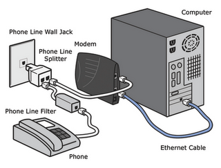
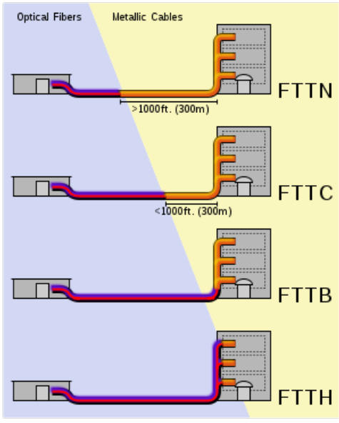

Introducción
=============

Los métodos de acceso a Internet más frecuentes son:

- Tecnologías de cable:

  - Módem telefónico
  - Módem de cable
  - PLC
  - RDSI
  - **ADSL / VDSL**
  - **FTTH**

- Tecnologías inalámbricas

  - LMDS
  - MMDS
  - Wi-Fi
  - WiMAX
  - **4G**

Módem telefónico
================

Módem (del inglés modem, acrónimo de modulator demodulator; pl. módems)1 es el dispositivo que convierte las señales digitales en analógicas (modulación) y viceversa (demodulación), permitiendo la comunicación entre computadoras a través de la línea telefónica.

Es cierto que se suelen oír expresiones como módem ADSL o incluso módem RDSI, aunque esto no es cierto en estos casos, ya que estas líneas de tipo digital no necesitan de ningún tipo de conversión de digital a analógico, y su función en este caso es más parecida a la de una tarjeta de red que a la de un módem.

Uno de los primeros parámetros que lo definen es su velocidad. El estándar más habitual y uno de los últimos está basado en la norma V.90 de la UIT-T cuya velocidad máxima está en los 56 Kbps (Kilobits por segundo). Esta norma se caracteriza por un funcionamiento asimétrico, puesto que la mayor velocidad sólo es alcanzable "en bajada", ya que en el envío de datos está limitada a 33,6 Kbps.

En el año 2000 la UIT-T aprobo la norma V.92 titulada "Mejoras a la Recomendación V.90" ("Enhancements to Recommendation V.90"). Esta norma establece un estándar para módems que permite transmisiones de hasta 56 Kbit/s en el canal de bajada y 48 Kbit/s en el canal de subida. Esta norma mejora la velocidad de conexión, además les permite aceptar llamadas mientras navegan, aumenta la velocidad de descarga y permite el manejo más fácil de las llamadas. No alcanzó demasiado éxito debido a la proliferación del acceso a internet de banda ancha.

Otra consideración importante es que para poder llegar a esta velocidad máxima se deben dar una serie de circunstancias que no siempre están presentes y que dependen totalmente de la compañía telefónica que nos presta sus servicios, pudiendo ser en algunos casos bastante inferiores.

Evidentemente, el módem que se encuentre al otro lado de la línea telefónica, sea nuestro proveedor de Internet o el de nuestra oficina debe ser capaz de trabajar a la misma velocidad y con la misma norma que el nuestro, ya que sino la velocidad que se establecerá será la máxima que aquel soporte.

Otras normas habitualmente utilizadas son:

===================== ============================
Norma                 Velocidad máxima
===================== ============================
V.90 y X2 [1]_        56.000 bps
V.34+                 33.600 bps
V.34                  28.800 bps
V.32bis	              14.400 bps
V.32                  9.600 bps
V.23                  4.800 bps
V.22bis               2.400 bps
V.22 y Bell 212A      1.200 bps
V.21 y Bell 103       300 bps
===================== ============================

.. [1] protocolo propietario de 3Com, es decir, no estándar.

Otra funcionalidad ya considerada como obligatoria en cualquier módem es el soporte de funciones de FAX. Lo estándares son los siguientes:

===================== ============================
Norma	              Velocidad máxima
===================== ============================
V.17                  14.400 bps
V.29                  9.600 bps
V.27ter               4.800 bps
V.21                  300 bps
===================== ============================

Otros estándares considerados como imprescindibles son los de control de errores y compresión de datos. Los más habituales son: V.42, V.42bis y MNP 2-5.

No podemos dejar de comentar otros aspectos igualmente importantes como el de contar con una memoria de tipo flash que nos permita la actualización del firmware al igual que ocurre con las BIOS de las placas base.

Este detalle ha sido extremadamente importante en los módem que utilizaban los distintos estándares de 56K anteriores a la norma V.90, ya que gracias a ello y mediante una simple actualización ha sido posible no quedarse con un modelo desfasado.Igualmente algunos modelos que funcionaban a 33,6 Kbps han podido ser actualizados y funcionar a 56 Kbps con el mismo método y sin necesidad de actualizar el hardware.

Tipos de modems
---------------

Internos
+++++++++

Consisten en una tarjeta de expansión sobre la cual están dispuestos los diferentes componentes que forman el módem. Existen para diversos tipos de conectores:

- ISA. Hoy en día en desuso.
- PCI.
- AMR. Baratos pero poco recomendables por su bajo rendimiento.

Externos
++++++++

Similares a los anteriores, pero externos al ordenador. La ventaja de estos módems reside en su fácil transportabilidad entre ordenadores diferentes.

- Puerto serie (RS-232). La conexión de los módems telefónicos con el ordenador se realiza generalmente mediante uno de los puertos serie tradicionales o COM, por lo que se usa la UART del ordenador, que deberá ser capaz de proporcionar la suficiente velocidad de comunicación. La UART debe ser de 16550 o superior para que el rendimiento de un módem de 28.800 bps o más sea el adecuado.

- Modems PC Card (PCMCIA). Son módems en forma de tarjeta, que se utilizaban en portátiles, antes de la llegada del USB, que puede ser utilizado tanto en los ordenadores de sobremesa como en los portátiles. Su tamaño es similar al de una tarjeta de crédito algo más gruesa.

- Puerto USB, de conexión y configuración aún más sencillas.

Modems software, HSP o Winmodems
++++++++++++++++++++++++++++++++

Son modems generalmente internos, en los cuales se han eliminado varias piezas electrónicas (por ejemplo, chips especializados), de manera que el microprocesador del ordenador debe suplir su función mediante un programa. Lo normal es que utilicen como conexión una ranura PCI (o una AMR), aunque no todos los módems PCI son de este tipo. El uso de la CPU entorpece el funcionamiento del resto de aplicaciones del usuario. A pesar de su bajo coste, resultan poco o nada recomendables.

Módem de cable (cablemódem)
===========================

Un cablemódem o cable módem es un tipo especial de módem diseñado para modular la señal de datos sobre una infraestructura de televisión por cable. El término Internet por cable (o simplemente cable) se refiere a la distribución de un servicio de conectividad a Internet sobre esta infraestructura de telecomunicaciones.

Los cablemodems no deben confundirse con antiguos sistemas LAN como 10base2 o 10base5 que utilizaban cables coaxiales -- y especialmente con 10base36, el cual realmente utiliza el mismo tipo de cable que los sistemas CATV.

Los cablemodems se utilizan principalmente para distribuir el acceso a Internet de banda ancha, aprovechando el ancho de banda que no se utiliza en la red de TV por cable.

La televisión por cable utiliza cables coaxiales en las residencias familiares que tienen un ancho de banda de hasta 862 MHz (750 MHz en América). El ancho de banda completo se reparte de la siguiente forma:

- 5 - 55 MHz para el canal de retorno
- 87,5 – 108 MHz para canales de radiodifusión sonora
- 118 – 606 MHz para canales de televisión analógica
- 606 – 862 MHz para canales de televisión digital

Las redes en sí hacen uso de HFC (Hibrido Fibra-Coaxial), fibra óptica en las trocales y coaxial en el tramo final hacia el abonado. Se suelen distribuir entre 20 y 100 canales utilizando FDM (Multiplexación por División de Frecuencias). Cada canal de TV analógica ocupa 8 MHz (6 MHz en el estándar americano). Se pueden dedicar 2 canales o bandas para permitir al usuario cargar y descargar información de Internet.

La velocidades de transmisión son:

**Descarga de datos**

  64-QAM --> 6 MHz * 6 = 36 Mbps (En la práctica de 3 a 10 Mbps)

**Carga de datos**

  4-PSK --> 6 MHz * 2 = 12 Mbps (En la practica de 0,5 a 1 Mbps)

PLC
===

**PLC** (**Power Line Comunications**) es una tecnología basada en la transmisión de datos utilizando como infraestructura la red eléctrica.

Hay dos tipos principales de Power Line Communications:

- PLOC ( Power Line Outdoors Telecoms o comunicaciones extrahogareñas utilizando la red eléctrica ). Esto es, la comunicación entre la subestación eléctrica y la red doméstica (electro-módem). El estándar es ETSI

- PLIC ( Power Line Indoors Telecoms o comunicaciones intrahogareñas utilizando la red eléctrica ). Esto es, utilizando la red eléctrica interior de la casa, para establecer comunicaciones internas. Un ejemplo: PLIC es una de las vías utilizadas en domótica ( otra que se suele utilizar también es la comunicación vía radio

El concepto técnico es sencillo, desde la estación de transformación hasta el usuario final se utiliza la red eléctrica y a partir de la estación de transformación se conecta con la red de telecomunicaciones convencional. Esto supone que se podrá tener acceso a Internet en cualquier punto de la geografía donde llegue la red eléctrica.

La señal utilizada para transmitir datos a través de la red eléctrica suele ser de 1,6 a 30 MHz.

Se consiguen velocidades de transmisión de hasta 200 Mbps en el tramo de la Media y Baja Tensión. Como desventaja, dependiendo de la frecuencia utilizada, se pueden producir interferencias en frecuencias correspondientes a las fuerzas de seguridad, frecuencias de emergencia de la aviación civil y bandas de radioaficionados.

RDSI
====

La interfaz del usuario
------------------------

El usuario tiene acceso a la RDSI mediante un interfaz local a un flujo digital con una cierta velocidad binaria y un ancho de banda determinado.Hay disponibles flujos de varios tamaños para satisfacer diferentes necesidades. Por ejemplo un cliente residencial puede requerir sólo capacidad para gestionar un teléfono o un terminal de videotexto. Una oficina querrá sin duda conectarse a la a RDSI a través de una centralita (PBX) digital local, y requerirá un flujo de mucha más capacidad.

Canales RDSI
-------------

El flujo digital entre la central y el usuario RDSI se usa para llevar varios canales de comunicación. La capacidad del flujo, y por tanto el número de canales de comunicación, puede variar de un usuario a otro. Para la transferencia de información y señalización se han definido los siguientes canales:

- **Canal B**: es el canal básico de usuario. Es un canal a 64 kbps para transporte de la información generada por el terminal de usuario. Se puede usar para transferir datos digitales, voz digital codificada PCM, o una mezcla de tráfico de baja velocidad, incluyendo datos digitales y voz digitalizada descodificada a la velocidad antes mencionada de 64 kbps. Puede subdividirse en subcanales, en cuyo caso todos ellos deben establecerse entre los mismos extremos subcriptores. Puede soportar las siguientes clases de conexiones:

- **Conmutación de circuitos**: es el equivalente al servicio digital conmutado disponible en la RDI. El usuario hace una llamada y se establece una conexión de circuito conmutado con otro usuario de la red, con unos recursos dedicados. Cabe destacar que el diálogo de establecimiento de la llamada no tiene lugar en el canal B, sino en el D, que se define a continuación.

- **Conmutación de paquetes**: el usuario se conecta a un nodo de conmutación de paquetes y los datos se intercambian con otros usuarios vía X.25. Los recursos no son dedicados.

- **Permanentes**: no requiere un protocolo de establecimiento de llamada. Es equivalente a una línea alquilada. Se contrata un canal fijo, permanente.

- **Canal D**: es un canal de señalización a 16 ó 64 kbps. Sirve para dos fines. Primero, lleva información de señalización para controlar las llamadas de circuitos conmutados asociadas con los canales B. Además el canal D puede usarse para conmutación de paquetes de baja velocidad mientras no haya esperando información de señalización.

- **Canales H**: son canales destinados al transporte de flujos de información de usuario a altas velocidades, superiores a 64 kbps.

Los canales tipos B y D se agrupan, a su vez, en diferentes tipos o grupos, según el siguiente esquema:

====== ======================== ===============
Tipo   Función                  Velocidad
====== ======================== ===============
B      Servicios básicos        64 Kbps.
D      Señalización	            16 Kbps. (BRI)
-      -                        64 Kbps. (PRI)
H0	   6 canales B              384 Kbps. (PRI)
H1     todos los canales H0     - 
-      H11 (24B)                1.536 Kbps.(PRI) 
-      H12 (30B)                1.920 Kbps. (PRI)
H2     RDSI de banda ancha      (propuesta actual)
-      H21                      32.768 Kbps.
-      H22                      43-45 Mbps.
H4     RDSI de banda ancha      132-138,240 Mbps.
====== ======================== ===============

Por tanto, las interfaces BRI y PRI tienen la siguiente estructura:

=========== =========== =============== ===========================
Interfaz    Estructura  Velocidad total	Velocidad disponible
=========== =========== =============== ===========================
BRI         2B + D16    192 Kbps.       144 Kbps.
PRI         23B + D64   1.544 Kbps.     1.536 Kbps. (EE.UU.)
PRI         30B + D64	2.048 Kbps.     1.984 Kbps. (Europa) 
=========== =========== =============== ===========================

Tipos de contratación
---------------------

Acceso Básico (BRI)
+++++++++++++++++++

El acceso básico consiste en dos canales B full-duplex de 64 kbps y un canal D full-duplex de 16 kbps. Luego, la división en tramas, la sincronización, y otros bits adicionales dan una velocidad total a un punto de acceso básico de 192 kbps x segundo

- **2B+D+señalización+sincronización+mantenimiento**

Acceso Primario (PRI)
+++++++++++++++++++++

El acceso primario está destinado a usuarios con requisitos de capacidad mayores, tales como oficinas con centralita (PBX) digital o red local (LAN). Debido a las diferencias en las jerarquías de transmisión digital usadas en distintos países, no es posible lograr un acuerdo en una única velocidad de los datos.

Estados Unidos, Japón y Canadá usan una estructura de transmisión basada en 1.544 Mbps, mientras que en Europa la velocidad estándar es 2.048 Mbps. Típicamente, la estructura para el canal de 1.544 Mbps es 23 canales B más un canal D de 64 kbps y, para velocidades de 2.048 Mbps, 30 canales B más un canal D de 64 kbps.

- 30B(64)+D(64)señalización+sincronización(64) **2048 Europa (E1)**
- 23B(64)+D(64)señalización+sincronización(8) **1544 Estados Unidos, Japón, Canadá (T1)**

ADSL-VDSL
==========

Tecnologías xDSL
-----------------

======= =========================== =============================== ========================== ==================================
Nombre  Significado                 Velocidad                       Modo                       Observaciones
======= =========================== =============================== ========================== ==================================
ADSL    DSL asimétrico              - Hasta 12 Mbps                 - Descendente              Utiliza un par de hilos. Hasta 5,5 km de distancia.
                                    - Hasta 1.8 Mbps                - Ascendente
                        
RADSL   DSL de velocidad adaptable  - De 1,5 a 8 Mbps               - Descendente              Utiliza un par de hilos. Adapta su velocidad de datos a la velocidad de la línea
                                    - De 16 a 640 kbps              - Ascendente

CDSL    DSL de consumidor           - Hasta 1 Mbps                  - Descendente              Utiliza un par de hilos. No necesita splitter en casa.
                                    - De 16 a 128 kbps              - Ascendente               

SDSL    DSL de par único            - 768 kbps                      - Simétrico                Utiliza un par de hilos.  

IDSL    DSL de RDSI                 - Igual a BRI de RDSI           - Simétrico                Utiliza un par de hilos que se denomina Bri sin conmutador.            

HDSL    DSL de alta velocidad       - 1,544 Mbps (EE.UU)            - Simétrico                Utiliza 2 o 3 pares de hilos.
                                    - 2,048 Mbps (Europa)           - Simétrico

VDSL	DSL de altísima velocidad   - Máximo 52 o 26 Mbps           - Descendente              Necesita una red de fibra y ATM. De 300 a 1.500 metros.
                                    - Máximo 12 o 26 Mbps           - Ascendente

======= =========================== =============================== ========================== ==================================

El siguiente esquema muestra los elementos necesarios y su forma de conexión.

El PTR es un cajetín que hace de punto de conexión entre la red telefónica y el cableado telefónico de la casa. Permite descubrir si un problema está provocado por el cableado telefónico de la casa o si es de la red telefónica. PTR significa Punto Terminación de Red.

Normalmente para que la conexión a Internet con ADSL funcione es necesario instalar o usar un filtro que separe la conexión a Internet del servicio de teléfono para que puedan funcionar ambas cosas sobre el mismo cable. En el pasado, la compañía telefónica cambiaba el PTR por otro cajetín llamado Splitter, actuando este como un filtro centralizado.

Según se fueron popularizando las conexiones ADSL se opto por sustituir la instalación del Splitter por el uso de microfiltros en cada uno de los aparatos telefónicos que tuviésemos en la casa (incluido fax y datafonos), salvo en el router.

ADSL, ADSL2 y ADSL2+
---------------------

ADSL es una tecnología de acceso a Internet de banda ancha. Esta tecnología permite el envio de voz y datos por una misma línea de forma simultánea. Esto se consigue mediante la utilización de una banda de frecuencias más alta que la utilizada en las conversaciones telefónicas convencionales (300-3.400 Hz). Para la transmisión de datos se emplean las frecuencias superiores a 25 KHz.

ADSL ha ido evolucionando con el paso del tiempo. La siguiente tabla muestra dicha evolución.

**Tabla comparativa de velocidades en ADSL**

============================= ================= =============== ===============
-                             ADSL              ADSL2           ADSL2+
============================= ================= =============== ===============
Ancho de banda de descarga    0.5 MHz           1.1 MHz         2.2 MHz
Velocidad máxima de subida    1 Mbps            1 Mbps          1.2 Mbps
Velocidad máxima de descarga  8 Mbps            12 Mbps         24 Mbps
Distancia                     2 Km              2.5 Km          2.5 Km
Tiempo de sincronización      10 a 30 segundos  3 segundos      3 segundos
Corrección de errores         No                Sí              Sí
============================= ================= =============== ===============

El rango de frecuencias utilizado (en este caso para ADSL2+) es:

- 0 - 4 KHz para el canal de voz
- 25 - 500 KHz para el canal de subida de datos.
- 550 KHz - 2,2 MHz para el canal de bajada de datos.

VDSL y VDSL2
-------------

**VDSL** (o VHDSL) son las siglas de Very high bit-rate Digital Subscriber Line (DSL de muy alta tasa de transferencia). Se trata de una tecnología de acceso a internet de Banda Ancha, perteneciente a la familia de tecnologías xDSL que transmiten los impulsos sobre pares de cobre.

Se trata de una evolución del ADSL, que puede suministrarse de manera asimétrica (**52 Mbit/s de descarga y 12 Mbit/s de subida**) o de manera simétrica (**26 Mbit/s tanto en subida como en bajada**), en condiciones ideales sin resistencia de los pares de cobre y con una distancia nula a la central.

**VDSL2** (Very-High-Bit-Rate Digital Subscriber Line 2) Línea digital de abonado de muy alta tasa de transferencia, que aprovecha la actual infraestructura telefónica de pares de cobre.

ITU-T G.993.2 VDSL2 es el estándar de comunicaciones DSL más reciente y avanzado. Está diseñado para soportar los servicios conocidos como "Triple Play", incluyendo voz, video, datos, televisión de alta definición (HDTV) y juegos interactivos.

ITU-T G.993.2 permite la transmisión simétrica o asimétrica de datos, llegando a anchos de bandas superiores a 200 Mbit/s (**100 Mbps para subida y 100 Mbps**, aunque pueden distribuirse de forma asimétrica). Este ancho de banda de transmisión depende de la distancia a la central. A medida que la longitud del bucle se acorta, sube la relación de simetría, llegando a más de 100 Mbit/s (tanto upstream como downstream), dadas las condiciones idóneas.

.. figure:: images/tema12-001.png

   Espectro_de_asignación_VDSL2

ADSL-VDSL Estándares
----------------------

.. image:: images/tema12-002.png

FTTH
=====

Tecnologías FTTx
-----------------

La tecnología de telecomunicaciones **FTTx** (del inglés **Fiber to the** x) es un término genérico para designar cualquier acceso de banda ancha sobre fibra óptica que sustituya total o parcialmente el cobre del bucle de acceso. El acrónimo FTTx se origina como generalización de las distintas configuraciones desplegadas (FTTN, FTTC, FTTB, FTTH...), diferenciándose por la última letra que denota los distintos destinos de la fibra (nodo, acera, edificio, hogar...).

La industria de las telecomunicaciones diferencia distintas arquitecturas dependiendo de la distancia entre la fibra óptica y el usuario final. Las más importantes en la actualidad son:

- **FTTN** (Fibra hasta el nodo - Fiber-to-the-node). La fibra óptica termina en una central del operador de telecomunicaciones que presta el servicio, suele estar más lejos de los abonados que en FTTH y FTTB, típicamente en las inmediaciones del barrio.

- **FTTC** (Fibra hasta la acera - Fiber-to-the-cabinet o fiber-to-the-curb). Similar a FTTN, pero la cabina o armario de telecomunicaciones está más cerca del usuario, normalmente a menos de 300 metros.

- **FTTB** (Fibra hasta el edificio - Fiber-to-the-building o Fiber-to-the-basement). La fibra óptica normalmente termina en un punto de distribución intermedio en el interior o inmediaciones del edificio de los abonados. Desde este punto de distribución intermedio, se accede a los abonados finales del edificio o de la casa mediante la tecnología VDSL2 (Very high bit-rate Digital Subscriber Line 2) sobre par de cobre o Gigabit Ethernet sobre par trenzado CAT5. De este modo, el tendido de fibra puede hacerse de forma progresiva, en menos tiempo y con menor coste, reutilizando la infraestructura del edificio del abonado.

- **FTTH** (Fibra hasta el hogar - Fiber-to-the-home). En FTTH o fibra hasta el hogar, la fibra óptica llega hasta el interior de la misma casa u oficina del abonado.

FTTH
-----

La tecnología de telecomunicaciones FTTH (del inglés Fiber To The Home), también conocida como **fibra hasta la casa o fibra hasta el hogar**, enmarcada dentro de las tecnologías FTTx, se basa en la utilización de cables de fibra óptica y sistemas de distribución ópticos adaptados a esta tecnología para la distribución de servicios avanzados, como el **Triple Play: telefonía, Internet de banda ancha y televisión**, a los hogares y negocios de los abonados.

Para la instalación y/o mantenimiento de redes FTTH se utilizan instrumentos electrónicos de precisión denominados Analizadores FTTH que efectúan medidas sobre diferentes parámetros de las señales utilizadas en la tecnología de telecomunicaciones FTTH.

.. figure:: images/tema12-005.png

   Terminal de Fibra Óptica para el usuario (ONT, en sus siglas en inglés)

LMDS
=====

**Sistema de Distribución Multipunto Local.**

LDMS es un sistema de comunicación punto-multipunto inalámbrico para transmisión de banda ancha en **frecuencias entre 24 y 42 GHz** dependiendo del pais. También se utiliza la gama baja **de 3,4 a 3,6 GHz**.

El uso de microondas hace que sea **necesario una línea directa de visión** entre la estación base y la antena del abonado.

Proporciona una velocidad de **hasta 8 Mbps** y una distancia del enlace que va **desde 100 m a 35 Km** dependiendo de la sensibilidad de las unidades de abonado y la calidad de servicio a ofrecer. Los sistemas de comunicación LMDS en la banda de 3,5GHz tienen la ventaja de no verse afectados por la niebla, la lluvia o la nieve.

MMDS
====

**Sistema de Distribución Multipunto Multicanal.**

MMDS es un acrónimo de **Multichannel Multipoint Distribution Service**, e identifica a una tecnología inalámbriaca de telecomunicaciones, usada para el establecimiento de una red de banda ancha de uso general o, más comúnmente, como método alternativo de recepción de programación de televisión por cable.

Se utiliza generalmente en áreas rurales poco pobladas, en donde instalar redes de cable no es económicamente viable.

La banda de MMDS utiliza frecuencias microondas con rangos **de 2 GHz a 3 GHz** en gama. La recepción de las señales entregadas vía MMDS requiere una antena especial de microondas y un decodificador que se conecta al receptor de televisión

Wi-Fi
=====

Wi-Fi (o Wi-fi, WiFi, Wifi, wifi) es un conjunto de estándares para redes inalámbricas basado en las especificaciones **IEEE 802.11**.

Los estándares IEEE 802.11b e IEEE 802.11g que disfrutan de una aceptación internacional debido a que la banda de 2.4 GHz está disponible casi universalmente, con una velocidad de hasta 11 Mbps y 54 Mbps, respectivamente. Existe también el estándar IEEE 802.11n que trabaja a 2.4 GHz a una velocidad de 108 Mbps. Aunque estas velocidades de 108 Mbps son capaces de alcanzarse ya con el estandar 802.11g gracias a técnicas de aceleramiento que consiguen duplicar la transferencia teórica.

Wi-Fi se creó para ser utilizada en redes locales inalámbricas, pero es frecuente que en la actualidad también se utilice para acceder a Internet.

RedLibre es la primera comunidad inalámbrica (de redes libres) de habla hispana del mundo (2001). Los miembros de la comunidad crean una red de acceso libre y gratuíto. Varios años más tarde, a finales del 2005, Jazztel, en España, es el primer proveedor de acceso a Internet que abre sus redes a FON, la comunidad de usuarios que comparten sus accesos a Internet inalámbricos (Wi-Fi). La utilización de esta tecnología todavía no es masiva, con lo que la cobertura de una red que entrelace los distintos puntos de acceso Wi-Fi aún es muy limitada.

Otra red es guifi.net. Es una red de telecomunicaciones libre, abierta y neutral, mayoritariamente inalámbrica, con más de 31.701 nodos, de los cuales más de 20.332 están operativos (marzo 2013). La mayoría de éstos nodos se encuentran ubicados en Cataluña y la Comunidad Valenciana, aunque se están expandiendo a nuevas zonas en el resto del Mundo. Actualmente, guifi.net es la red libre más extensa de todo el Mundo.

WiMax
=====

WiMAX (del inglés Worldwide Interoperability for Microwave Access, Interoperabilidad Mundial para Acceso por Microondas) es un estándar de transmisión inalámbrica de datos (802.MAN) proporcionando accesos concurrentes en áreas de hasta 48 kilómetros de radio y a velocidades de hasta 70 Mbps, utilizando tecnología que no requiere visión directa (NLOS).

El WiMAX Forum es un consorcio de empresas (inicialmente 67 y hoy en día más de 100) dedicadas a diseñar los parámetros y estándares de esta tecnología, y a estudiar, analizar y probar los desarrollos implementados. En principio se podría deducir que esta tecnología supone una grave amenaza para el negocio de tecnologías inalámbricas de acceso de corto alcance en que se basan muchas empresas, pero hay entidades muy importantes detrás del proyecto. Las principales firmas de telefonía móvil también están desarrollando terminales capaces de conectarse a estas nuevas redes. Después de la fase de pruebas y estudios cuya duración prevista es de unos dos años, se espera comenzar a ofrecer servicios de conexión a Internet a 4 Mbps a partir de 2007, incorporando WiMAX a los ordenadores portátiles y PDA.

El IEEE 802.16 el estándar con revisiones específicas se ocupa de dos modelos de uso:

- Fijo
- Móvil

El estándar inicial 802.16 era fijo y se encontraba en la banda de frecuencias de 10-66 GHz y requería torres LOS. La nueva versión 802.16a, ratificada en marzo de 2003, utiliza una banda del espectro más estrecha y baja, de 2-11 GHz, facilitando su regulación. Además, como ventaja añadida, no requiere de torres LOS sino únicamente del despliegue de estaciones base (BS) formadas por antenas emisoras/receptoras con capacidad de dar servicio a unas 200 estaciones suscriptoras (SS) que pueden dar cobertura y servicio a edificios completos

El pasado 7 de diciembre de 2005, el IEEE aprobó el estándar del WiMAX MÓVIL, el 802.16e, que permite utilizar este sistema de comunicaciones inalámbricas con terminales en movimiento. Muchos fabricantes de hardware y operadores estaban esperando a esta decisión para empezar a desplegar redes de wimax.

**Tabla resumen de características del estándar 802.16 (WiMAX)**

.. image:: images/tema12-007.png

4G
===

En telecomunicaciones, 4G son las siglas utilizadas para referirse a la cuarta generación de tecnologías de telefonía móvil. Es la sucesora de las tecnologías 2G y 3G, y que precede a la próxima generación la 5G.

La 4G está **basada completamente en el protocolo IP**, siendo un sistema y una red, que se alcanza gracias a la convergencia entre las redes de cables e inalámbricas. Esta tecnología podrá ser usada por módems inalámbricos, móviles inteligentes y otros dispositivos móviles. La principal diferencia con las generaciones predecesoras será la capacidad para proveer velocidades de acceso mayores de **100 Mbit/s en movimiento y 1 Gbit/s en reposo**, manteniendo una calidad de servicio (QoS) de punta a punta de alta seguridad que permitirá ofrecer servicios de cualquier clase en cualquier momento, en cualquier lugar, con el mínimo coste posible. Esta tecnología podrá ser usada por módems inalámbricos, móviles inteligentes y otros dispositivos móviles.

.. figure:: images/tema12-008.png

   Modem 4G

.. figure:: images/tema12-010.png

   TP-LINK MR3050, router WiFi 3G/4G con batería incorporada
